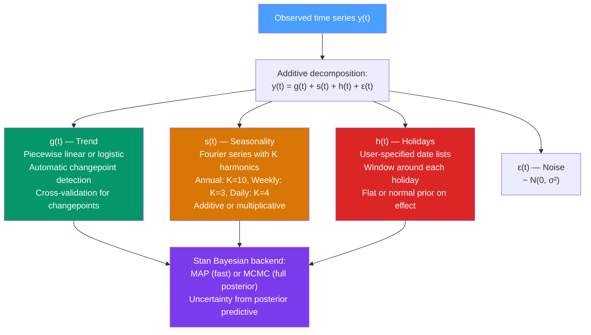

# 🔮 Prophet Forecasting

> [!abstract] TL;DR
> **Prophet** (Taylor & Letham, Facebook 2018) is an additive decomposition forecasting model: $y(t) = g(t) + s(t) + h(t) + \epsilon_t$ where $g(t)$ is a piecewise linear/logistic trend, $s(t)$ is Fourier-series seasonality, and $h(t)$ handles known holidays. Designed for analyst use with automatic changepoint detection, interpretable parameters, and uncertainty intervals via full Bayesian posterior (Stan-based MCMC or LBFGS MAP). Excels for business time series with strong seasonality, holiday effects, and historical trend changes.

## Intuition — analogy FIRST

Imagine you are forecasting website traffic for an e-commerce company. Traditional ARIMA treats the series as a black box governed by lags — it doesn't "know" that Black Friday always spikes traffic, or that the company ran a big ad campaign in March that shifted the trend permanently.

**Prophet** models these components explicitly:
- "This Black Friday will cause a spike of approximately 3× normal traffic" (holiday effect)
- "Since the product launch in March, traffic has been growing at 8% per week instead of 3%" (changepoint in trend)
- "Traffic is always higher on weekdays and lower in summer" (seasonality)

Prophet lets analysts *tell the model* about important events and structural changes, rather than hoping the model discovers them blindly. This makes it interpretable and robust for the typical business analyst's use case.

---

## How It Works



---

## Key Concepts / Details

### Model Structure

**Full additive model:**
$$y(t) = g(t) + s(t) + h(t) + \epsilon_t$$

For multiplicative seasonality: $y(t) = g(t)(1 + s(t) + h(t)) + \epsilon_t$

### Trend Component g(t)

**Piecewise linear trend** (default for non-saturating growth):
$$g(t) = (k + \mathbf{a}(t)^\prime \boldsymbol{\delta})t + (m + \mathbf{a}(t)^\prime\boldsymbol{\gamma})$$

- $k$: base growth rate
- $\boldsymbol{\delta}$: growth rate adjustments at each changepoint ($S$ changepoints)
- $\mathbf{a}(t)$: indicator vector for active changepoints at time $t$
- $\boldsymbol{\gamma}$: adjustments to intercept ensuring continuity

**Changepoint prior**: $\delta_j \sim \text{Laplace}(0, \lambda)$ — sparse prior on changes (most periods have zero change, a few have significant changes).

**Logistic growth trend** (for saturation/carrying capacity):
$$g(t) = \frac{L(t)}{1 + \exp(-(k + \mathbf{a}(t)^\prime\boldsymbol{\delta})(t - (m + \mathbf{a}(t)^\prime\boldsymbol{\gamma})))}$$

where $L(t)$ is the carrying capacity (can be time-varying, specified by user).

**Automatic changepoint detection**: Prophet places $S=25$ potential changepoints uniformly in the first 80% of the history. The Laplace prior automatically selects which ones are active.

### Seasonality Component s(t)

Uses a **Fourier series** to approximate arbitrary periodic functions:
$$s(t) = \sum_{n=1}^{N}\left[a_n\cos\left(\frac{2\pi n t}{P}\right) + b_n\sin\left(\frac{2\pi n t}{P}\right)\right]$$

- $P$: period (365.25 for annual, 7 for weekly)
- $N$: number of Fourier terms (controls smoothness vs flexibility)
  - Annual seasonality: $N=10$ (default)
  - Weekly seasonality: $N=3$ (default)
  - Daily seasonality: $N=4$ (default)
- Coefficients $\mathbf{\beta} = (a_1, b_1, \ldots, a_N, b_N)$ estimated from data

**Multiple seasonalities** are handled naturally: add separate Fourier series for each.

### Holiday Component h(t)

User provides a DataFrame of holiday dates with optional windows:
$$h(t) = \mathbf{Z}(t)\mathbf{\kappa}$$

where $\mathbf{Z}(t)$ is an indicator matrix (1 if date $t$ is within the holiday window) and $\boldsymbol{\kappa} \sim N(0, \nu^2)$ (holiday effects with prior variance $\nu^2$).

### Python: Prophet

```python
import pandas as pd
import numpy as np
from prophet import Prophet
from prophet.diagnostics import cross_validation, performance_metrics
from prophet.plot import plot_cross_validation_metric
import matplotlib.pyplot as plt
import warnings
warnings.filterwarnings('ignore')

# Generate sample data with trend + seasonality + holidays
np.random.seed(42)
dates = pd.date_range("2018-01-01", "2023-12-31", freq="D")
T = len(dates)
t = np.arange(T)

# True components
trend_true = 100 + 0.05 * t
seasonal_annual = 20 * np.sin(2 * np.pi * t / 365.25)
seasonal_weekly = 10 * np.sin(2 * np.pi * t / 7)
noise = np.random.normal(0, 5, T)
y = trend_true + seasonal_annual + seasonal_weekly + noise

df = pd.DataFrame({'ds': dates, 'y': y})

# Define US holidays (Prophet has built-in support)
from prophet.make_holidays import make_holidays_df
holidays = make_holidays_df(year_list=list(range(2018, 2024)), country='US')

# Split train/test
train = df[df['ds'] < '2023-01-01']
test  = df[df['ds'] >= '2023-01-01']

# Fit Prophet model
model = Prophet(
    changepoint_prior_scale=0.05,   # Laplace prior strength (larger = more flexible trend)
    seasonality_prior_scale=10,      # Prior on seasonality strength
    holidays_prior_scale=10,         # Prior on holiday effects
    seasonality_mode='additive',     # or 'multiplicative'
    weekly_seasonality=True,
    yearly_seasonality=True,
    daily_seasonality=False,
    holidays=holidays
)
# Add custom monthly seasonality
model.add_seasonality(name='monthly', period=30.5, fourier_order=5)

model.fit(train)

# Forecast
future = model.make_future_dataframe(periods=365)
forecast = model.predict(future)

# Plot components
model.plot(forecast)
plt.title("Prophet Forecast")
plt.show()

model.plot_components(forecast)
plt.suptitle("Prophet Components: Trend, Weekly, Yearly, Holidays")
plt.show()

# Evaluate on test set
fc_test = forecast[forecast['ds'] >= '2023-01-01']
from sklearn.metrics import mean_absolute_percentage_error
mape = mean_absolute_percentage_error(test['y'], fc_test['yhat'])
print(f"Test MAPE: {mape:.4f}")

# Cross-validation
cv_results = cross_validation(
    model,
    initial='730 days',   # 2 years training minimum
    period='180 days',    # New fold every 6 months
    horizon='365 days',   # 1-year forecast horizon
    parallel='processes'
)
metrics = performance_metrics(cv_results)
print("\nCross-validation metrics (at various horizons):")
print(metrics[['horizon', 'mape', 'rmse']].head(10))

# Plot MAPE by horizon
plot_cross_validation_metric(cv_results, metric='mape')
plt.show()

# Changepoints
print(f"\nNumber of changepoints: {len(model.changepoints)}")
print(f"Top 5 changepoints: {model.changepoints[:5]}")

# Components at test time
print(f"\nForecast columns: {forecast.columns.tolist()}")
print(f"Trend range: [{forecast['trend'].min():.1f}, {forecast['trend'].max():.1f}]")
```

### Prophet Parameters Guide

| Parameter | Default | Effect |
|-----------|---------|--------|
| `changepoint_prior_scale` | 0.05 | Flexibility of trend. Higher = more responsive to trend changes; lower = smoother trend |
| `seasonality_prior_scale` | 10 | Flexibility of seasonality. Higher = more flexible seasonality |
| `holidays_prior_scale` | 10 | Prior on magnitude of holiday effects |
| `changepoint_range` | 0.8 | Fraction of history to consider for changepoints |
| `n_changepoints` | 25 | Max number of potential changepoints |
| `seasonality_mode` | 'additive' | 'multiplicative' when seasonal amplitude grows with level |
| `interval_width` | 0.8 | Width of uncertainty intervals |
| `mcmc_samples` | 0 | 0 = MAP (fast); >0 = full MCMC (slow, better uncertainty) |

### Prophet vs SARIMA

| Feature | Prophet | SARIMA |
|---------|---------|--------|
| Seasonality | Multiple, non-integer periods | Single period only |
| Trend | Piecewise linear, changepoints | Differencing only |
| Holiday effects | Built-in | Manual dummy variables |
| Missing data | Handles natively | Problematic |
| Automatic tuning | Cross-validation API | auto_arima |
| Interpretability | High (components) | Medium |
| Statistical foundations | Penalised regression/Bayes | Likelihood-based |
| Best use case | Business KPIs, daily data | Classical economic series |

---

## Real-World Notes

- **Facebook internal use**: Prophet was developed to forecast ad revenue, user growth, and infrastructure metrics across thousands of time series with minimal manual intervention.
- **Retail demand forecasting**: well-suited for daily sales with multiple seasonalities (weekly, annual) and holiday effects (Thanksgiving, Super Bowl).
- **Energy consumption**: used for daily/hourly electricity demand forecasting; easy to add weekend/holiday adjustments.
- **Web analytics**: website traffic with weekly cycles, annual trends, and campaign events — Prophet's natural habitat.
- **Limitations**: does not model autocorrelation in residuals (uses MAP/MCMC for parameters, not for residuals). For financial time series with mean dynamics, ARIMA/SARIMA is better.

---

## Common Pitfalls

1. **Trusting uncertainty intervals uncritically**: Prophet's 80%/95% intervals come from posterior predictive sampling. They capture parameter uncertainty but not structural breaks not in the training data. They tend to be too narrow in practice.
2. **Using logistic trend without setting capacity**: forgetting to provide `cap` (and `floor` for lower bound) when using `growth='logistic'` causes Prophet to extrapolate without bound.
3. **Too many Fourier terms for weekly seasonality**: $N=10$ for weekly seasonality will overfit 7-day cycles. Use $N=3$ (default) for weekly.
4. **Ignoring multiplicative seasonality**: if seasonal swings grow with level (e.g., revenue), use `seasonality_mode='multiplicative'`.
5. **Not cross-validating changepoint_prior_scale**: the default 0.05 may be too rigid for rapidly changing businesses. Use `cross_validation` to tune this parameter.

---

## Related Concepts

- [[_MOC_Modern_Methods|↑ Section MOC]]
- [[STL_Decomposition]] — another additive decomposition approach; more statistically principled but less scalable
- [[Holt_Winters_Method]] — exponential smoothing competitor; better statistical foundations, less flexible for irregular seasonality
- [[SARIMA_Seasonal_ARIMA]] — the classical alternative; better for short economic series with single seasonal period
- [[LSTM_for_Time_Series]] — for learning complex nonlinear patterns that Prophet's additive structure misses

---

## Review Questions

1. Describe Prophet's three main components and the mathematical model for each. What is the role of the Laplace prior on the changepoint adjustments $\delta_j$?
2. You are forecasting monthly e-commerce revenue over 3 years. Revenue grows with the trend, and seasonality (holiday peaks) seems to grow proportionally with revenue. What `seasonality_mode` should you use, and why?
3. Prophet's cross-validation shows MAPE of 8% at 30-day horizon and 22% at 365-day horizon. Interpret this pattern. What does it tell you about the sources of forecast uncertainty?

---

## Sources

- Taylor & Letham (2018), *Forecasting at Scale*, The American Statistician
- Prophet documentation: https://facebook.github.io/prophet/
- Hyndman & Athanasopoulos, *Forecasting: Principles and Practice* (3rd ed.), Ch. 12

#time-series #modern-methods #prophet #forecasting #additive-decomposition
