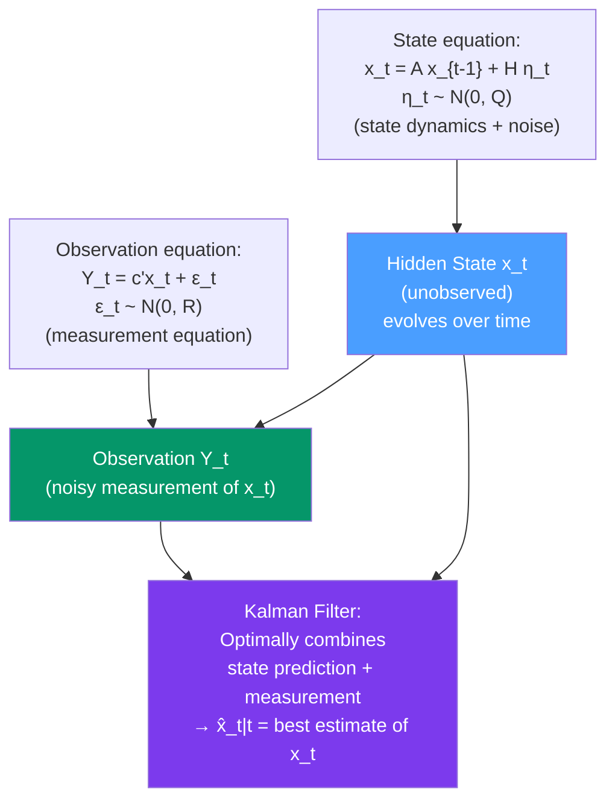

# 🔭 State Space Models

> [!abstract] TL;DR
> A **state-space model (SSM)** represents a time series in two equations: the **observation equation** links observed $Y_t$ to a latent state $\mathbf{x}_t$, and the **state equation** describes how $\mathbf{x}_t$ evolves over time. The general linear Gaussian SSM: $Y_t = \mathbf{c}^\prime\mathbf{x}_t + \epsilon_t$ and $\mathbf{x}_t = \mathbf{A}\mathbf{x}_{t-1} + \mathbf{H}\boldsymbol{\eta}_t$. SSMs unify ARIMA, exponential smoothing, and structural time series under one framework. Estimation is via the **Kalman filter** (filtering) and **EM algorithm** (parameter learning).

## Intuition — analogy FIRST

Think of tracking a submarine. You can't directly observe the submarine's position (the hidden **state**). Instead, you observe sonar pings — noisy, partial information about where it might be. The submarine moves according to its own dynamics (state equation): it was at position $x_{t-1}$ and moved by some amount. The sonar reading (observation equation) gives you a noisy measurement of where it is now.

The **Kalman filter** combines these two pieces of information optimally: your *prediction* of where the submarine is (from the state equation) is updated by the *measurement* (sonar ping). The result is the best estimate of the current state given all past information.

This framework applies to anything with a hidden, evolving state: economic trend (hidden), measured by noisy GDP estimates. Customer intent (hidden), measured by clickstream behaviour. Market volatility (hidden), measured by observed returns.

---

## How It Works



---

## Key Concepts / Details

### General Linear Gaussian SSM

**Observation (measurement) equation:**
$$Y_t = \mathbf{c}_t^\prime \mathbf{x}_t + \epsilon_t, \quad \epsilon_t \sim N(0, R_t)$$

**State (transition) equation:**
$$\mathbf{x}_t = \mathbf{A}_t \mathbf{x}_{t-1} + \mathbf{H}_t\boldsymbol{\eta}_t, \quad \boldsymbol{\eta}_t \sim N(\mathbf{0}, \mathbf{Q}_t)$$

**Assumptions:**
- Initial state: $\mathbf{x}_0 \sim N(\mathbf{m}_0, \mathbf{P}_0)$
- $\epsilon_t \perp \boldsymbol{\eta}_s$ for all $t, s$ (measurement and process noise independent)
- $\epsilon_t \perp \mathbf{x}_0$, $\boldsymbol{\eta}_t \perp \mathbf{x}_0$

**Model matrices:** $\mathbf{A}_t$ (state transition), $\mathbf{H}_t$ (noise input), $\mathbf{c}_t$ (observation loading), $R_t$ (measurement noise variance), $\mathbf{Q}_t$ (process noise covariance).

### Special Cases: Famous Models as SSMs

#### Local Level Model (= SES)

State = current level $\ell_t$; observation = noisy measurement of level.

$$Y_t = \ell_t + \epsilon_t, \quad R = \sigma_\epsilon^2$$
$$\ell_t = \ell_{t-1} + \eta_t, \quad Q = \sigma_\eta^2$$

**Signal-to-noise ratio**: $q = \sigma_\eta^2/\sigma_\epsilon^2$. The Kalman gain at steady state is $K = q/(q + \sqrt{q^2 + 4q})/2$ — this equals SES smoothing parameter $\alpha$. The local level model is the state-space representation of SES.

#### Local Linear Trend Model (= Holt's Method)

State = $(level, slope)$:

$$Y_t = \ell_t + \epsilon_t$$
$$\ell_t = \ell_{t-1} + b_{t-1} + \eta_{\ell t}, \quad b_t = b_{t-1} + \eta_{bt}$$

In matrix form with $\mathbf{x}_t = (\ell_t, b_t)^\prime$:
$$\mathbf{A} = \begin{pmatrix}1 & 1 \\ 0 & 1\end{pmatrix}, \quad \mathbf{c} = \begin{pmatrix}1 \\ 0\end{pmatrix}$$

#### ARIMA as SSM

Any ARIMA(p,d,q) can be written in companion form as an SSM. For ARIMA(1,1,1):

State: $\mathbf{x}_t = (Y_t, Y_{t-1})^\prime$. The transition matrix encodes the AR coefficients; the observation vector selects $Y_t$.

This SSM representation allows:
- Handling missing observations (just skip the update step)
- Irregular spacing (adjust $\mathbf{A}$ for the time gap)
- Combining with other SSM components (trend + seasonality + AR)

### Structural Time Series Models (Harvey 1989)

Decompose the series explicitly into trend, seasonal, and irregular components, each with its own SSM equation:

$$Y_t = \mu_t + \gamma_t + \epsilon_t$$

**Trend** (local linear):
$$\mu_t = \mu_{t-1} + \beta_{t-1} + \eta_t, \quad \beta_t = \beta_{t-1} + \zeta_t$$

**Seasonal** (stochastic):
$$\sum_{j=0}^{m-1} \gamma_{t-j} = \omega_t$$ (seasonal component sums to zero with noise)

**Advantages**: the noise variances $\sigma_\eta^2$, $\sigma_\zeta^2$, $\sigma_\omega^2$ control how much each component can change over time. Setting $\sigma_\zeta^2 = 0$ fixes the slope (linear trend); setting $\sigma_\omega^2 = 0$ fixes the seasonal pattern.

### Parameter Estimation: EM Algorithm

Unknown parameters $\theta = (\mathbf{A}, \mathbf{H}, \mathbf{c}, R, \mathbf{Q})$ are estimated by maximising the log-likelihood, which is computed as a by-product of the Kalman filter:

$$\log L(\theta) = -\frac{T}{2}\log(2\pi) - \frac{1}{2}\sum_{t=1}^{T}\left[\log|F_{t|t-1}| + v_t^2/F_{t|t-1}\right]$$

where $v_t = Y_t - \hat{Y}_{t|t-1}$ (prediction error) and $F_{t|t-1}$ (prediction error variance).

**EM algorithm** for SSM (Shumway & Stoffer 1982):
- **E-step**: run Kalman filter + smoother to compute $\mathbb{E}[\mathbf{x}_t|\mathbf{Y}_{1:T}]$
- **M-step**: update $\theta$ by closed-form maximisation of the expected complete data log-likelihood

### Python: State Space Models with statsmodels

```python
import pandas as pd
import numpy as np
from statsmodels.tsa.statespace.structural import UnobservedComponents
from statsmodels.tsa.statespace.sarimax import SARIMAX
import matplotlib.pyplot as plt
import statsmodels.api as sm
import warnings
warnings.filterwarnings('ignore')

# Load airline passengers
data = sm.datasets.get_rdataset("AirPassengers", "datasets").data
y_raw = pd.Series(data["value"].values,
                  index=pd.date_range("1949-01", periods=144, freq="MS"))
y = np.log(y_raw)

# --- Local Linear Trend (SSM form of Holt's) ---
llt_model = UnobservedComponents(y,
    level='local linear trend',
    seasonal=12,              # stochastic seasonal
    stochastic_seasonal=True
)
llt_result = llt_model.fit(disp=False)
print(llt_result.summary())

# Filtered states (smoothed trend and seasonal)
fig, axes = plt.subplots(3, 1, figsize=(12, 10))
axes[0].plot(y, label="Log passengers")
axes[0].plot(llt_result.smoother_results.smoothed_state[0],
             label="Smoothed trend", linewidth=2)
axes[0].set_title("Local Linear Trend SSM")
axes[0].legend()

# Seasonal component
axes[1].plot(llt_result.smoother_results.smoothed_state[1],
             label="Smoothed seasonal")
axes[1].set_title("Seasonal Component")
axes[1].legend()

# Residuals
axes[2].plot(llt_result.resid, label="Residuals (irregular)")
axes[2].axhline(0, linestyle='--', color='gray')
axes[2].set_title("Irregular Component")
axes[2].legend()
plt.tight_layout()
plt.show()

# Forecast with prediction intervals
fc_ssm = llt_result.get_forecast(steps=24)
fc_log = fc_ssm.predicted_mean
fc_ci  = fc_ssm.conf_int(alpha=0.05)

fig, ax = plt.subplots(figsize=(12, 5))
np.exp(y).plot(ax=ax, label="Historical")
np.exp(fc_log).plot(ax=ax, label="SSM Forecast", color='red')
ax.fill_between(fc_log.index,
                np.exp(fc_ci.iloc[:, 0]),
                np.exp(fc_ci.iloc[:, 1]),
                alpha=0.3, color='red', label="95% PI")
ax.set_title("Local Linear Trend SSM — 24-month Forecast")
ax.legend()
plt.show()

# --- ARIMA as SSM (SARIMAX state-space form) ---
arima_ssm = SARIMAX(y, order=(1,1,1), seasonal_order=(0,1,1,12))
arima_result = arima_ssm.fit(disp=False)
# Both ARIMA and SSM are state-space internally in statsmodels
print(f"\nARIMA SSM AIC: {arima_result.aic:.2f}")
print(f"LLT SSM AIC:   {llt_result.aic:.2f}")
```

---

## Real-World Notes

- **Macroeconomic monitoring**: the Federal Reserve's FRB/US model and many central bank nowcasting models use SSMs with Kalman filtering to track latent economic states (potential output, natural rate of interest).
- **GPS navigation**: Kalman filtering of position, velocity, acceleration is the backbone of all GPS and inertial navigation systems.
- **Algorithmic trading**: state-space models track the "fair value" of an asset as a latent state, updated by noisy price observations. Pair trading strategies use mean-reverting SSM spreads.
- **Epidemiology**: compartmental models (SIR/SEIR) are non-linear SSMs; extended Kalman filters track epidemic state from case counts.

---

## Common Pitfalls

1. **Forgetting that SSM is the *framework*, not the algorithm**: SSM defines the model structure; the Kalman filter is the inference algorithm. You need both.
2. **Misspecifying the model matrices**: the correspondence between model matrices ($\mathbf{A}$, $\mathbf{c}$, etc.) and economic quantities is model-specific. One wrong entry invalidates the filter.
3. **Diffuse initialisation issues**: for non-stationary models (local level, random walk), the initial state covariance $\mathbf{P}_0$ is set to a large diffuse value. Most software handles this automatically, but be aware of burn-in periods.
4. **Convergence of EM algorithm**: EM can converge to local optima. Try multiple starting values or use L-BFGS-B directly on the log-likelihood.
5. **Treating SSM and ARIMA as separate**: ARIMA is a special case of SSM. Use the SSM framework when you need missing data handling, time-varying parameters, or component decomposition.

---

## Related Concepts

- [[_MOC_Modern_Methods|↑ Section MOC]]
- [[Kalman_Filter]] — the filtering and smoothing algorithm for linear Gaussian SSM
- [[ARIMA_and_Differencing]] — ARIMA expressed in SSM companion form
- [[Exponential_Smoothing]] — SES/Holt/Holt-Winters are special cases of SSM
- [[Factor_Models]] — DFM is a high-dimensional SSM with latent factor state
- [[Stochastic_Volatility]] — SV model is a non-linear, non-Gaussian SSM

---

## Review Questions

1. Write the state-space representation of the local level model. Show that it is mathematically equivalent to Simple Exponential Smoothing by deriving the steady-state Kalman gain.
2. How does an ARIMA(2,1,1) model fit into the state-space framework? What would the state vector $\mathbf{x}_t$ contain?
3. You have monthly sales data with 10% missing observations scattered randomly. Describe how the state-space framework handles this more naturally than classical ARIMA.

---

## Sources

- Harvey (1989), *Forecasting, Structural Time Series Models and the Kalman Filter*, Cambridge University Press
- Durbin & Koopman (2012), *Time Series Analysis by State Space Methods* (2nd ed.)
- statsmodels documentation: `UnobservedComponents`

#time-series #modern-methods #state-space #SSM #structural-time-series
