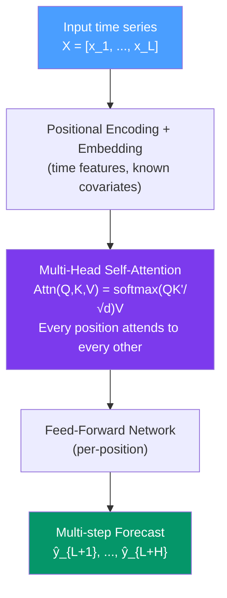

# ⚡ Transformer Models for Time Series

> [!abstract] TL;DR
> Transformer models apply **self-attention** to capture dependencies between any two points in a sequence regardless of their distance — solving the long-range dependency problem more scalably than LSTM. Key architectures: **Temporal Fusion Transformer (TFT)** for interpretable multi-horizon forecasting with static covariates; **PatchTST** (patching + channel independence) for efficient long-sequence forecasting; **N-BEATS/N-HiTS** (basis expansion models, no attention). Recent benchmarks show simple MLP-based models and linear models sometimes outperform Transformers — the "Are Transformers Effective?" debate continues.

## Intuition — analogy FIRST

LSTM reads a time series like reading a book word by word, left to right — it must remember earlier content until it becomes relevant. This works for short sequences but struggles for very long ones.

**Attention** is like having a searchable index for the whole book. At any position, the model can *directly query* "which past time steps are most relevant to predicting the next one?" without sequentially processing everything in between. July's electricity demand can directly attend to last July's demand (seasonal pattern) without the model having to "remember" it for 365 steps.

**Transformers** apply this attention mechanism in parallel to all positions simultaneously — enabling efficient training on very long sequences via GPU parallelism, unlike the inherently sequential LSTM.

---

## How It Works



---

## Key Concepts / Details

### Self-Attention Mechanism

For a sequence of $L$ embeddings $\mathbf{X} \in \mathbb{R}^{L \times d}$:

**Query, Key, Value projections:**
$$\mathbf{Q} = \mathbf{X}\mathbf{W}_Q, \quad \mathbf{K} = \mathbf{X}\mathbf{W}_K, \quad \mathbf{V} = \mathbf{X}\mathbf{W}_V$$

**Scaled dot-product attention:**
$$\text{Attn}(\mathbf{Q}, \mathbf{K}, \mathbf{V}) = \text{softmax}\left(\frac{\mathbf{Q}\mathbf{K}^\top}{\sqrt{d_k}}\right)\mathbf{V}$$

The attention weight $A_{ij}$ represents how much position $i$ should attend to position $j$ when computing its output representation.

**Multi-head attention**: $h$ parallel attention heads, each with different $\mathbf{W}_Q, \mathbf{W}_K, \mathbf{W}_V$ matrices, concatenated and projected — allows attending to different types of relationships simultaneously.

**Complexity**: $O(L^2 d)$ — quadratic in sequence length. For $L=1000$ (3 years of daily data), this is manageable; for $L=10000$ (hourly over 1 year), it becomes expensive.

### Key Architectures

#### Temporal Fusion Transformer (TFT)
*Lim et al. (2021), Google DeepMind*

Designed for **multi-horizon probabilistic forecasting** with covariates:
- **Static covariates**: entity metadata that doesn't change (store ID, product category)
- **Past known covariates**: historical values known for past only (realised promotions)
- **Future known covariates**: calendar features known in advance (holidays, day-of-week)
- **Variable selection networks**: learned gating of irrelevant inputs
- **Gated Residual Networks**: skip connections for stable training
- **Interpretable multi-head attention**: one attention head per time step for interpretability
- **Quantile regression outputs**: simultaneous prediction at multiple quantiles (e.g., 10%, 50%, 90%)

**Best use case**: large-scale demand forecasting where many known covariates are available.

#### PatchTST
*Nie et al. (2023), Princeton*

Applies the ViT (Vision Transformer) idea to time series:
- **Patch tokenisation**: divide the time series into non-overlapping patches of length $P$ (e.g., 16 time steps)
- Treat each patch as a "token" — reduces sequence length from $L$ to $L/P$
- **Channel independence**: each univariate series processed independently — no cross-series leakage in large multivariate panels
- **Linear probe**: minimal head (linear layer) on top of Transformer for forecasting

**Key finding**: channel independence + patching outperforms more complex cross-variable attention schemes on many benchmarks.

#### N-BEATS and N-HiTS
*Oreshkin et al. (2020); Challu et al. (2023)*

**Not Transformer-based** — pure MLP with residual connections:
- **N-BEATS**: "neural basis expansion" — stacks of blocks that forecast and subtract the explained component (like additive decomposition)
- **N-HiTS**: adds hierarchical interpolation — different blocks operate at different temporal scales
- **No attention, no recurrence** — extremely fast inference
- Consistently competitive with or superior to Transformers on standard benchmarks

#### Simple Baselines That Beat Transformers

Zeng et al. (2023) "Are Transformers Effective for Time Series Forecasting?":
- A simple **DLinear** (decomposition + linear mapping) outperformed all Transformer variants on 5/8 benchmark datasets
- **NLinear** (normalised linear) competitive on non-stationary series

**Key message**: Transformer's quadratic complexity and inductive bias toward ordering may be ill-suited for time series. Always benchmark against linear models.

### Python: Temporal Fusion Transformer with PyTorch Forecasting

```python
import pandas as pd
import numpy as np
import torch
import warnings
warnings.filterwarnings('ignore')

# Requires: pip install pytorch-forecasting pytorch-lightning

try:
    import pytorch_forecasting as pf
    from pytorch_forecasting import TemporalFusionTransformer, TimeSeriesDataSet
    from pytorch_forecasting.metrics import QuantileLoss
    import lightning.pytorch as pl

    # Generate synthetic multi-series data
    np.random.seed(42)
    n_series = 10
    T = 200

    records = []
    for s in range(n_series):
        for t in range(T):
            records.append({
                'series_id': str(s),
                'time_idx': t,
                'value': 50 + 0.1*t + 10*np.sin(2*np.pi*t/52) +
                         np.random.normal(0, 5) + s * 20,  # series-specific level
                'month': (t % 52) // 4,  # 0-12
                'is_weekend': int(t % 7 >= 5),
            })

    data = pd.DataFrame(records)

    max_encoder_length = 52   # 1 year lookback
    max_prediction_length = 13  # 1 quarter ahead

    training_cutoff = T - max_prediction_length

    training = TimeSeriesDataSet(
        data[data['time_idx'] <= training_cutoff],
        time_idx='time_idx',
        target='value',
        group_ids=['series_id'],
        max_encoder_length=max_encoder_length,
        max_prediction_length=max_prediction_length,
        static_categoricals=['series_id'],
        time_varying_known_reals=['time_idx', 'month', 'is_weekend'],
        time_varying_unknown_reals=['value'],
        target_normalizer=pf.data.encoders.GroupNormalizer(groups=['series_id']),
        add_relative_time_idx=True,
        add_target_scales=True,
    )

    validation = TimeSeriesDataSet.from_dataset(
        training,
        data,
        predict=True,
        stop_randomization=True
    )

    train_dl = training.to_dataloader(train=True, batch_size=32, num_workers=0)
    val_dl   = validation.to_dataloader(train=False, batch_size=32, num_workers=0)

    # Build TFT model
    tft = TemporalFusionTransformer.from_dataset(
        training,
        learning_rate=3e-3,
        hidden_size=32,
        attention_head_size=2,
        dropout=0.1,
        hidden_continuous_size=16,
        output_size=7,            # 7 quantiles
        loss=QuantileLoss(),
        log_interval=10,
        reduce_on_plateau_patience=4
    )
    print(f"TFT parameters: {tft.size()/1e3:.1f}K")

    # Train
    trainer = pl.Trainer(
        max_epochs=20,
        accelerator='cpu',
        enable_progress_bar=True,
        gradient_clip_val=0.1,
    )
    trainer.fit(tft, train_dataloaders=train_dl, val_dataloaders=val_dl)

    # Predict
    predictions = tft.predict(val_dl, return_y=True, trainer_kwargs={"accelerator": "cpu"})
    print(f"\nPrediction shape: {predictions.output.shape}")  # (n_series, prediction_length)

    # Interpretability: variable importance
    raw_predictions = tft.predict(val_dl, mode="raw", return_x=True)
    tft.plot_interpretation(raw_predictions.x)

except ImportError:
    print("Install: pip install pytorch-forecasting lightning pytorch")
    print("\nDemonstrating DLinear (simple linear baseline) instead:")

    # DLinear: the simple baseline that often beats Transformers
    import torch
    import torch.nn as nn

    class DLinear(nn.Module):
        """Decomposition Linear — from Zeng et al. 2023."""
        def __init__(self, seq_len, pred_len, individual=False, channels=1):
            super().__init__()
            self.seq_len = seq_len
            self.pred_len = pred_len
            # Trend and seasonal linear layers
            self.Linear_Trend  = nn.Linear(seq_len, pred_len)
            self.Linear_Season = nn.Linear(seq_len, pred_len)

        def forward(self, x):
            # Simple moving average for trend extraction
            trend = x.unfold(-1, 25, 1).mean(-1)  # 25-step MA
            trend = torch.nn.functional.pad(trend, (12, 12), mode='replicate')
            seasonal = x - trend

            trend_fc   = self.Linear_Trend(trend)
            season_fc  = self.Linear_Season(seasonal)
            return trend_fc + season_fc

    model = DLinear(seq_len=96, pred_len=24)
    print(f"DLinear parameters: {sum(p.numel() for p in model.parameters())}")
    print("DLinear: simple yet highly competitive with Transformers on many benchmarks.")
```

### Transformer Variants Comparison

| Model | Year | Key Innovation | Best Use Case |
|-------|------|---------------|---------------|
| **Vanilla Transformer** | 2017 | Self-attention | NLP baseline, rarely best for TS |
| **Informer** | 2021 | ProbSparse attention ($O(L\log L)$) | Long-sequence forecasting (ILI) |
| **Autoformer** | 2021 | Auto-correlation (season-trend decomp) | Series with strong seasonality |
| **TFT** | 2021 | Variable selection, quantile outputs | Multi-series with covariates |
| **PatchTST** | 2023 | Patch tokenisation, channel independence | Long-horizon, no covariates |
| **N-BEATS** | 2020 | MLP + basis expansion, no attention | Univariate, fast inference |
| **N-HiTS** | 2023 | Hierarchical interpolation | Multi-scale seasonal series |
| **DLinear** | 2023 | Decompose + linear | Competitive baseline everywhere |

### When Transformers Outperform Classical Models

- Long-sequence forecasting ($L > 300$ lookback, $H > 100$ horizon)
- Many covariates (TFT handles 50+ features naturally)
- Large training sets ($N > 10K$ time series in a global model)
- Irregular sampling or missing data handled by masking
- Complex multivariate interactions across many channels

### When Simpler Models Win

- Short series ($T < 500$) — Transformers overfit
- Strong linear autocorrelation — ARIMA is optimal
- Single-series with known seasonality — SARIMA/ETS/Prophet
- Need for uncertainty quantification — ETS prediction intervals are exact; Transformer intervals require conformal prediction
- Operational latency constraints — ARIMA inference is microseconds; TFT is milliseconds

---

## Real-World Notes

- **M4/M5 competitions (2018, 2020)**: the overall winner of M5 (Walmart demand forecasting) used an ensemble including LightGBM and LSTM — no pure Transformer. Transformers ranked well but didn't dominate.
- **Electricity Load Forecasting**: TFT developed on GEFCom and similar electricity datasets — strong performance with many known future covariates (temperature, holidays).
- **Google DeepMind's TFT**: deployed in Google's internal infrastructure for large-scale forecasting with heterogeneous covariates across thousands of series.
- **NeuralForecast library**: provides N-BEATS, N-HiTS, TFT, PatchTST in a unified API compatible with `statsforecast` — recommended for production use.

---

## Common Pitfalls

1. **Using Transformers for small datasets**: Transformers have many parameters and require large training sets. With $T < 1000$ and no related series for global training, ARIMA or ETS will win.
2. **Ignoring the "Transformers for TS" critique**: Zeng et al. (2023) showed that DLinear outperforms many TS Transformers. Always benchmark against linear models.
3. **Positional encoding as an afterthought**: time series have specific temporal structure (timestamps, seasonality) that sinusoidal positional encoding ignores. Use timestamp-aware embeddings.
4. **Not tuning the lookback window**: Transformer attention quality depends strongly on having the right context length. Cross-validate the lookback window.
5. **Confusing global and local models**: Transformer global models (trained on many series) can outperform local ARIMA (fit to one series). Ensure a fair comparison.

---

## Related Concepts

- [[_MOC_Modern_Methods|↑ Section MOC]]
- [[LSTM_for_Time_Series]] — the recurrent predecessor; Transformers address LSTM's sequential bottleneck
- [[Prophet_Forecasting]] — an interpretable alternative for business forecasting without neural networks
- [[Factor_Models]] — DFM shares the "latent representation" motivation with the Transformer encoder

---

## Review Questions

1. Explain the self-attention mechanism. How does it compute the attention weight between time step $i$ and time step $j$, and what does a high weight mean?
2. What is the "Are Transformers Effective for Time Series?" finding? What simple model did the authors show is competitive, and why is this surprising?
3. You need to forecast daily sales for 1,000 retail stores, 3 months ahead, incorporating promotional calendars and price information. Compare TFT, SARIMA, and Prophet for this use case. Which would you recommend and why?

---

## Sources

- Vaswani et al. (2017), *Attention Is All You Need*, NeurIPS
- Lim et al. (2021), *Temporal Fusion Transformers for Interpretable Multi-Horizon Time Series Forecasting*, International Journal of Forecasting
- Nie et al. (2023), *A Time Series is Worth 64 Words: Long-Term Forecasting with Transformers*, ICLR
- Zeng et al. (2023), *Are Transformers Effective for Time Series Forecasting?*, AAAI

#time-series #modern-methods #transformers #TFT #PatchTST #deep-learning
