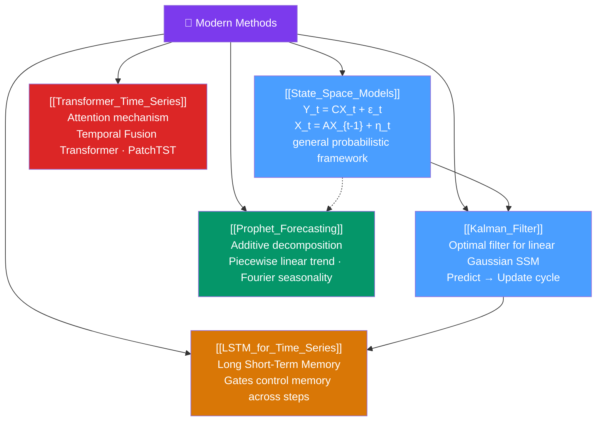

# 🗺️ Modern Methods — Map of Content

> [!abstract] What This Section Covers
> Modern time series methods span two traditions: the **statistical** tradition (state-space models, Kalman filter) and the **machine learning** tradition (LSTM, Transformers). **State-space models** provide a general probabilistic framework for any system where observations depend on a hidden state. The **Kalman filter** is the optimal estimator for linear Gaussian state-space models and the foundation of much modern filtering. **Prophet** is Facebook's scalable decomposition-based forecaster designed for analyst use. **LSTM** networks handle long-range dependencies in sequences; **Transformer** models apply attention mechanisms that scale to very long series and multivariate settings.

## Concept Map

## Learning Path

1. [[State_Space_Models]] — The general framework: any process with hidden state can be written in state-space form; SSM unifies ARIMA, ETS, Kalman filtering.
2. [[Kalman_Filter]] — The optimal linear filter for Gaussian SSM; predict-update recursion; Rauch-Tung-Striebel smoother.
3. [[Prophet_Forecasting]] — Facebook's analyst-friendly decomposition model; piecewise trend, Fourier seasonality, holiday effects.
4. [[LSTM_for_Time_Series]] — LSTM architecture for sequence learning; advantages over AR; feature engineering for supervised learning.
5. [[Transformer_Time_Series]] — Attention mechanisms for time series; TFT, PatchTST, N-BEATS; when Transformers outperform classical models.

## All Notes at a Glance

| Note | Difficulty | What You'll Learn |
|------|------------|-------------------|
| [[State_Space_Models]] | Intermediate → Advanced | SSM formulation, observability, local level/trend/seasonal models, EM estimation |
| [[Kalman_Filter]] | Advanced | Predict-update equations, Kalman gain, RTS smoother, numerical stability |
| [[Prophet_Forecasting]] | Intermediate | Piecewise trend, Fourier terms, holiday regressors, changepoint detection, Python API |
| [[LSTM_for_Time_Series]] | Intermediate | LSTM gates, window-based supervised learning, feature engineering, PyTorch implementation |
| [[Transformer_Time_Series]] | Intermediate → Advanced | Self-attention, temporal Fusion Transformer, PatchTST, NHiTS, benchmark comparisons |

## Key Questions This Section Covers

- What unifies ARIMA, ETS, and Kalman filter under the state-space framework?
- How does the Kalman filter provide optimal forecasts without knowing the future?
- When does Prophet outperform ARIMA, and what are its failure modes?
- How do LSTMs handle long-range dependencies that ARIMA cannot?
- Are Transformers actually better than simpler models for time series forecasting?

## Related Sections

- [[_MOC_TimeSeries_Master|↑ Master MOC]]
- [[_MOC_ARIMA|← ARIMA Models]]
- [[_MOC_Multivariate_TS|← Multivariate Time Series]]

#MOC #time-series #modern-methods #state-space #deep-learning
