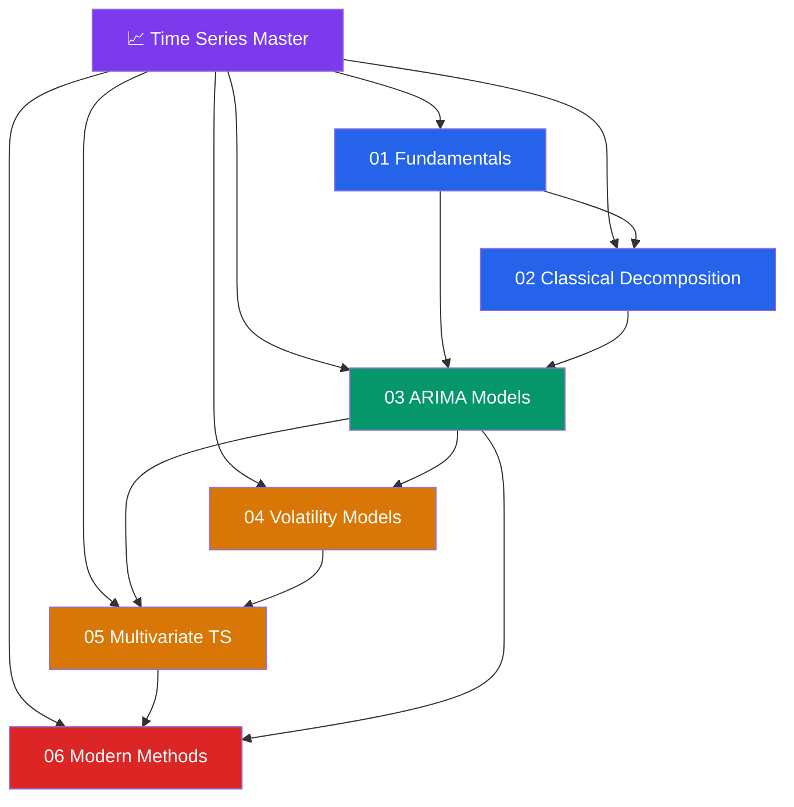

# 📈 Time Series Analysis — Master Map of Content

> [!abstract] About This Vault
> A complete time series analysis reference: **37 notes across 6 sections**, spanning the full stack from classical decomposition through modern deep learning. Every note pairs an intuition-first analogy with mathematical foundations ($LaTeX$ formulas), runnable Python code using `statsmodels`, `pandas`, `pmdarima`, and `prophet`, Mermaid diagrams, trade-off tables, common pitfalls, and review questions. Anchored in **statistics and econometrics** with bridges to **machine learning** and **financial engineering**. Start at the section that matches your goal below, or follow one of the four learning paths.

## Vault Architecture

## Sections at a Glance

| # | Section | Notes | Entry Point | Difficulty |
|---|---------|-------|-------------|------------|
| 01 | Fundamentals | 6 | [[_MOC_TS_Fundamentals]] | Beginner |
| 02 | Classical Decomposition | 6 | [[_MOC_Classical_Decomposition]] | Beginner → Intermediate |
| 03 | ARIMA Models | 6 | [[_MOC_ARIMA]] | Intermediate |
| 04 | Volatility Models | 6 | [[_MOC_Volatility_Models]] | Intermediate → Advanced |
| 05 | Multivariate Time Series | 6 | [[_MOC_Multivariate_TS]] | Advanced |
| 06 | Modern Methods | 6 | [[_MOC_Modern_Methods]] | Intermediate → Advanced |

---

## Learning Paths

### Path 1 — Data Analyst

> Best for: analysts who need to forecast demand, sales, or KPIs and communicate results to stakeholders.

**Fundamentals → Decomposition → ARIMA → Prophet**

[[_MOC_TS_Fundamentals]] → [[Time_Series_Components]] → [[Trend_and_Seasonality]] → [[Stationarity]] → [[_MOC_Classical_Decomposition]] → [[Moving_Averages]] → [[Exponential_Smoothing]] → [[Holt_Winters_Method]] → [[_MOC_ARIMA]] → [[ARIMA_and_Differencing]] → [[_MOC_Modern_Methods]] → [[Prophet_Forecasting]]

---

### Path 2 — Financial Quant

> Best for: quants and risk analysts working with asset prices, volatility, and financial time series.

**Fundamentals → ARIMA → Volatility → Multivariate**

[[_MOC_TS_Fundamentals]] → [[Stationarity]] → [[Autocorrelation_and_ACF_PACF]] → [[White_Noise_and_Random_Walk]] → [[_MOC_ARIMA]] → [[ARMA_Models]] → [[SARIMA_Seasonal_ARIMA]] → [[_MOC_Volatility_Models]] → [[ARCH_Models]] → [[GARCH_Models]] → [[EGARCH_and_GJR_GARCH]] → [[Realized_Volatility]] → [[_MOC_Multivariate_TS]] → [[VAR_Models]] → [[Cointegration_and_ECM]]

---

### Path 3 — Econometrician

> Best for: economists and researchers applying time series methods to macroeconomic data.

**Fundamentals → ARIMA → Multivariate → State Space**

[[_MOC_TS_Fundamentals]] → [[Stationarity]] → [[Autocorrelation_and_ACF_PACF]] → [[_MOC_ARIMA]] → [[AR_Models]] → [[MA_Models]] → [[ARMA_Models]] → [[ARIMA_and_Differencing]] → [[_MOC_Multivariate_TS]] → [[VAR_Models]] → [[Granger_Causality]] → [[Cointegration_and_ECM]] → [[Structural_VAR]] → [[Factor_Models]] → [[_MOC_Modern_Methods]] → [[State_Space_Models]] → [[Kalman_Filter]]

---

### Path 4 — ML Engineer

> Best for: ML engineers applying deep learning and modern probabilistic methods to sequence data.

**Fundamentals → ARIMA → Modern Methods**

[[_MOC_TS_Fundamentals]] → [[Time_Series_Components]] → [[Stationarity]] → [[Autocorrelation_and_ACF_PACF]] → [[_MOC_ARIMA]] → [[ARIMA_and_Differencing]] → [[_MOC_Modern_Methods]] → [[State_Space_Models]] → [[Kalman_Filter]] → [[Prophet_Forecasting]] → [[LSTM_for_Time_Series]] → [[Transformer_Time_Series]]

---

## Cross-Vault Links

This vault connects to related topics across the broader knowledge base:

- **[[Quantitative_Finance]]** — asset pricing, risk models, and portfolio construction; GARCH volatility feeds directly into VaR and option pricing
- **[[Econometrics]]** — regression, OLS, GMM, and panel data; time series is the dynamic extension of cross-sectional econometrics
- **[[R_Programming]]** — `tseries`, `forecast`, `vars`, `rugarch` packages for time series in R; companion to the Python-centric examples here

---

## Section MOC Index

- [[_MOC_TS_Fundamentals]] — The building blocks: components of a time series, stationarity, ACF/PACF, trend & seasonality, white noise, and random walks.
- [[_MOC_Classical_Decomposition]] — Separating signal from noise: additive vs multiplicative models, moving averages, exponential smoothing, Holt-Winters, and STL.
- [[_MOC_ARIMA]] — The Box-Jenkins family: AR, MA, ARMA, ARIMA with differencing, and seasonal SARIMA — model identification, estimation, and diagnostics.
- [[_MOC_Volatility_Models]] — Modelling time-varying variance: ARCH, GARCH, asymmetric extensions (EGARCH, GJR-GARCH), realized volatility, and stochastic volatility.
- [[_MOC_Multivariate_TS]] — Multiple series together: VAR models, Granger causality, cointegration, error correction, SVAR, and factor models.
- [[_MOC_Modern_Methods]] — State space, Kalman filtering, Prophet, LSTM, and Transformer-based forecasting.

#MOC #time-series #statistics #MasterMOC
