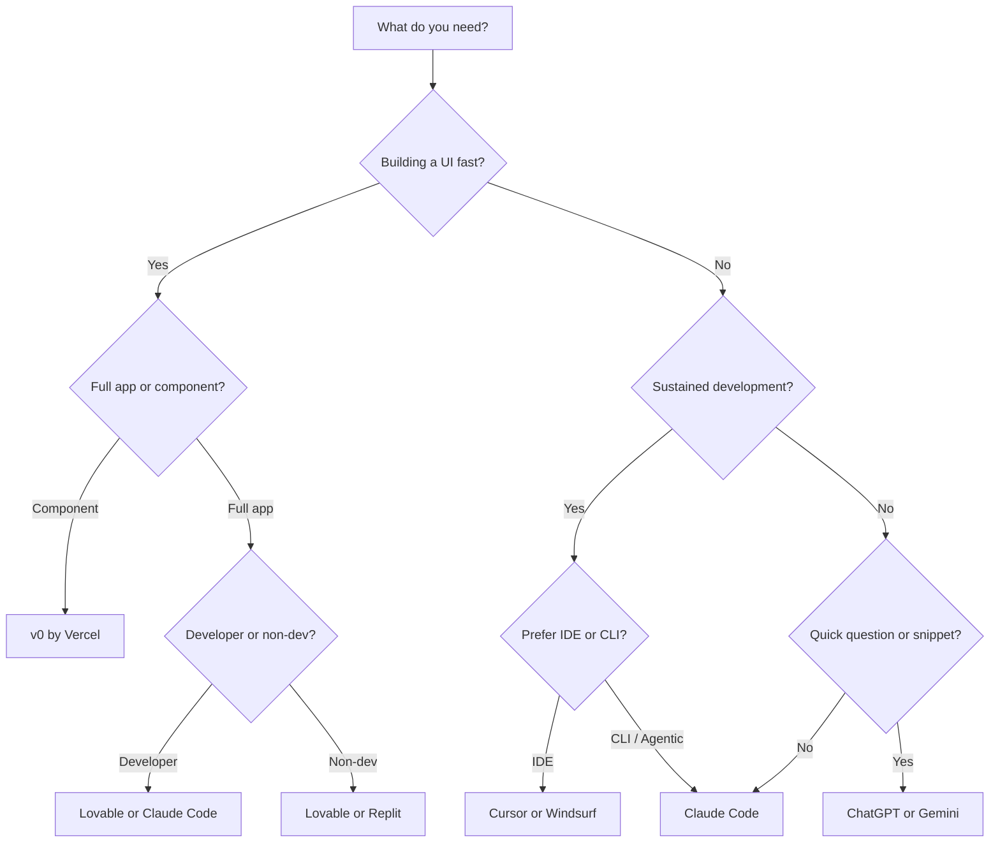

# AI Tools Comparison

> [!abstract] TL;DR
> No single AI coding tool wins in every scenario. Claude Code excels at complex, agentic tasks with deep context; Cursor at IDE-integrated editing; v0/Lovable at fast UI scaffolding. Matching the tool to the job and stack is more important than picking the "best" one.

## The Landscape

The AI coding tool market exploded in 2024-2026 and broadly divides into:
- **Agentic CLI tools** — run autonomously in your terminal, read/write files, run tests (Claude Code)
- **AI-augmented IDEs** — editors with AI baked in (Cursor, Windsurf)
- **Chat assistants with code** — conversational tools that write code in a chat interface (ChatGPT, Gemini)
- **Scaffolding / app builders** — generate full UIs or apps from prompts (v0, Lovable, Replit)

The right category depends on where you are in the project lifecycle: builders for greenfield prototypes, agentic CLI for sustained development, IDE tools for mixed workflows.

## Tool-by-Tool Breakdown

### Claude Code (Anthropic)
**Type:** Agentic CLI tool  
**Best at:** Multi-file refactors, long autonomous tasks, deep codebase understanding via [[CLAUDE_md_Guide|CLAUDE.md]], complex debugging sessions, git operations  
**Model:** Claude Sonnet/Opus — best-in-class reasoning for code  
**Differentiator:** Native [[Skills_Guide|skills system]], MCP tool integrations, permissions model, handles 200k+ token context  
**Weakness:** No visual IDE, steeper setup curve, not great for quick one-off questions

### Cursor
**Type:** AI-augmented IDE (VS Code fork)  
**Best at:** In-editor completions, Cmd+K inline edits, project-wide search + edit, developers who want AI without leaving VS Code  
**Model:** Configurable — Claude, GPT-4o, Gemini, etc.  
**Differentiator:** Tab autocomplete feels native; Cursor Rules file for project context  
**Weakness:** Context window limitations on large projects, "agent mode" less capable than Claude Code for complex tasks

### Windsurf (Codeium)
**Type:** AI-augmented IDE  
**Best at:** Similar to Cursor; free tier more generous, Cascade agent for autonomous flows  
**Differentiator:** Cascade model for multi-step tasks, better than Cursor for junior devs  
**Weakness:** Smaller community, less mature than Cursor

### Gemini (Google)
**Type:** Chat assistant + IDE integration  
**Best at:** Google ecosystem (Firebase, GCP, Android), very long context (1M+ tokens), integrated in Android Studio  
**Differentiator:** 1M token context window for entire codebase reads; Deep Research mode  
**Weakness:** Code quality lags Claude on complex reasoning tasks; inconsistent agent behaviour

### ChatGPT (OpenAI)
**Type:** Chat assistant with code interpreter  
**Best at:** Quick explanations, code snippets, general questions, Canvas for iterative editing  
**Differentiator:** Widest usage/familiarity, GPT-4o canvas for document-style editing  
**Weakness:** No native filesystem access, session context resets, less specialised for sustained development

### v0 (Vercel)
**Type:** UI scaffolding tool  
**Best at:** React/Next.js component generation from descriptions or screenshots, Tailwind-first UIs  
**Differentiator:** Output is production-quality React code using shadcn/ui; live preview; chat-based iteration  
**Weakness:** Frontend-only, limited to React/Next.js ecosystem; see [[Frontend_AI_Tools]]

### Lovable
**Type:** Full-stack app builder  
**Best at:** MVP generation (React + Supabase + Tailwind), non-developers building web apps, fast demos  
**Differentiator:** Full app from a single prompt; Supabase integration is first-class  
**Weakness:** Less control for experienced developers; harder to export and own the codebase long-term

### Replit
**Type:** Cloud IDE with AI  
**Best at:** Zero-setup coding environment, collaborative projects, deployments in one click, teaching  
**Differentiator:** Fully browser-based with hosting included; Replit Agent builds from scratch  
**Weakness:** Performance vs. local IDE; vendor lock-in risk; not for production-grade backends

## Decision Matrix

## Choosing Your Primary Tool

For **serious, sustained development**, the hierarchy is:
1. **Claude Code** for anything requiring multi-file reasoning, autonomous task completion, git operations
2. **Cursor** as your daily IDE if you want autocomplete + AI editing without leaving the editor
3. **v0** for bootstrapping React UIs to import into your project
4. **ChatGPT/Gemini** for quick reference questions

Many experienced vibe coders use a **Claude Code + v0 combination**: v0 generates UI components, Claude Code handles the logic, tests, and integration layer.

## Common Pitfalls
1. **Tool-hopping when frustrated** — the problem is usually the prompt, not the tool
2. **Using a scaffolding tool for sustained development** — Lovable/Replit are prototyping tools; export and migrate to a real stack for production
3. **Not reading tool-specific docs** — each tool has distinct context management patterns (Cursor Rules vs. CLAUDE.md vs. system prompts)
4. **Comparing performance on vague prompts** — AI tools differ most on complex, context-heavy tasks; simple snippets look identical

## Review Questions
1. **What distinguishes an agentic CLI tool from an AI-augmented IDE?** *Answer: Agentic CLI tools (Claude Code) run autonomously, can execute commands, manage files, and complete multi-step tasks; IDE tools provide AI assistance within the editor experience.*
2. **When would you choose v0 over Claude Code for UI work?** *Answer: When you need a fast React component scaffold from a description or screenshot; v0 excels at initial UI generation but Claude Code handles sustained multi-file development better.*
3. **What is the main risk of scaffolding tools like Lovable for production apps?** *Answer: Vendor lock-in, reduced code ownership, and difficulty migrating to a real stack once the app grows.*

## See Also
- [[Frontend_AI_Tools]] — deep dive on v0, Lovable, and Replit for UI building
- [[Vibe_Coding_Stack]] — choosing a stack AI tools handle well
- [[Prompting_Best_Practices]] — tool-agnostic prompting skills that transfer everywhere
- [[CLAUDE_md_Guide]] — how to set up project context for Claude Code
