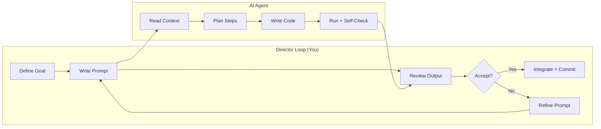

# Vibe Coding Overview

> [!abstract] TL;DR
> Vibe coding is AI-assisted development where you direct outcomes and review results rather than writing every line yourself. The mindset shift — from implementer to director — is the most important change, not the tools. Done well, it multiplies developer productivity; done carelessly, it produces brittle, insecure slop.

## What Is Vibe Coding?

Vibe coding is a development style in which an AI agent (Claude Code, Cursor, Copilot, etc.) writes the majority of the code while the human developer acts as a **product director and quality reviewer**. The term was popularised in early 2024 and captures the workflow shift: you describe *what* you want, verify the output, give feedback, and iterate — rather than manually authoring every line.

It is **not** "letting AI do everything while you watch." The human is responsible for:
- Defining the goal and success criteria clearly
- Reviewing every meaningful chunk of output for correctness
- Catching security, performance, and architectural problems the AI missed
- Making judgment calls when requirements are ambiguous
- Owning the final product end-to-end

Think of it as pair programming where your junior partner is incredibly fast, occasionally overconfident, and needs your architectural judgment to stay on course.

## How It Differs from Traditional Coding

| Dimension | Traditional | Vibe Coding |
|---|---|---|
| Primary bottleneck | Writing correct syntax | Formulating clear intentions |
| Debugging trigger | "I don't know the API" | "The AI's model of the codebase is wrong" |
| Speed profile | Linear — scales with typing | Bursty — fast drafts, careful reviews |
| Skill ceiling | Deep language expertise | Systems thinking + AI prompt craft |
| Risk profile | Bugs from misunderstanding | Bugs from over-trust + security gaps |
| Context management | IDE state in your head | Prompt context + CLAUDE.md documents |

## The Mindset Shift: Director vs. Implementer

The single hardest adjustment for experienced developers is **giving up line-by-line control** without losing quality control. Two failure modes exist on either side:

- **Micromanaging**: Rewriting every AI suggestion, not trusting anything, ending up slower than writing it yourself.
- **Rubber-stamping**: Accepting everything without review, accumulating hidden technical debt and security vulnerabilities.

The sweet spot is **thoughtful delegation**: let the AI draft freely, but review output at logical seams (per function, per feature, per PR), and push back hard on anything that smells wrong.

## Who Is Vibe Coding For?

- **Experienced developers** going AI-first to 10x output on familiar domains
- **Full-stack developers** working outside their main specialty (a backend dev needing a React UI)
- **Product engineers** who want to own entire features end-to-end without a team
- **Technical founders** building MVPs without a dedicated engineering team
- **Developers learning new frameworks** — let AI scaffold the pattern, then study it

It is *not* a replacement for understanding fundamentals. Vibe coding's quality ceiling is the developer's ability to evaluate and critique the output. A non-developer using AI to build production software without review is shipping untested, potentially insecure code.

## Risks and Misconceptions

**Misconception: "I don't need to understand the code."**
You do — enough to verify it solves the right problem, is maintainable, and is secure. Blind acceptance is how security vulnerabilities and architectural mistakes compound invisibly.

**Misconception: "AI will catch all its own bugs."**
AI self-consistency checks are weak. The AI will hallucinate a solution, fail to notice the edge case, and confidently present both the bug and the wrong fix. You need tests and code review.

**Real risk: Security gaps.** AI-generated auth code, input validation, and secret handling are common vulnerability sources. Always review these manually. See [[Security_for_Vibe_Coders]].

**Real risk: Architectural drift.** Without deliberate structure, AI naturally grows monolithic files and duplicates logic. See [[Maintaining_AI_Codebases]].

## Common Pitfalls
1. **Not committing frequently** — lose work when AI makes a wrong turn; see [[Version_Control_Workflow]]
2. **Skipping the planning phase** — jumping straight to code produces unfocused, incoherent features
3. **Letting context rot** — stale CLAUDE.md leads AI to make decisions inconsistent with your actual codebase
4. **Accepting the first answer** — iteration and critique are the core skill of vibe coding

## Review Questions
1. **What is the key mindset shift in vibe coding?** *Answer: From implementer (writing code) to director (defining outcomes and reviewing results).*
2. **Name two failure modes on either side of the micromanage/rubber-stamp spectrum.** *Answer: Micromanaging (rewriting everything, losing speed benefit) and rubber-stamping (accepting without review, accumulating hidden debt).*
3. **What makes vibe coding risky for non-developers?** *Answer: They can't evaluate the output quality, security, or correctness, so they ship unreviewed, potentially insecure code.*

## See Also
- [[AI_Coding_Mindset]] — the mental model for staying sharp as a director
- [[Vibe_Coding_Anti_Patterns]] — specific failure modes to avoid
- [[Planning_with_AI]] — the most important habit to establish early
- [[Security_for_Vibe_Coders]] — non-negotiable review areas
