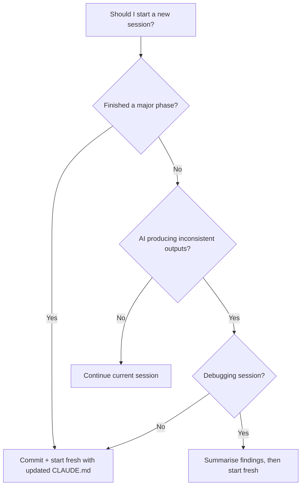

# Context Management

> [!abstract] TL;DR
> Context is the most perishable resource in vibe coding. Fresh sessions lose everything; stale sessions accumulate noise. The solution is a well-maintained CLAUDE.md that survives session resets, a discipline of when to start fresh, and a habit of asking AI to summarise learnings before context fills.

## What Is Context in AI Development?

When you interact with an AI coding tool, "context" is the sum of everything the AI currently knows:
- Your messages in this session
- Files it has read
- Outputs it has produced
- Your CLAUDE.md / Cursor Rules / system prompt

Context has a **finite window** (measured in tokens). When it fills, the model starts forgetting the oldest content, leading to increasingly incoherent responses — this is **context rot**.

Understanding and actively managing context is the difference between AI that stays coherent across a long feature and AI that starts contradicting itself.

## The CLAUDE.md as Persistent Context

A `CLAUDE.md` file in your project root is read by Claude Code at the start of every session. This is your **persistent context layer** — the only thing that survives a session reset. It should contain everything a new AI session needs to produce consistent output:

```markdown
# Project: TaskFlow

## Core Purpose
A task management web app for small teams. MVP only.

## Tech Stack
Next.js 14, TypeScript (strict), Tailwind, shadcn/ui, Prisma, PostgreSQL, Clerk auth

## Architecture Rules
- Server Components for all data-fetching routes
- Client Components only when using hooks or event handlers
- API routes always return { data: T | null, error: string | null }
- All DB access goes through /lib/db — no Prisma calls in components

## Current State (update as you go)
- Phase 2 in progress: task CRUD UI
- Phase 1 complete: Prisma schema + REST API endpoints
- Known issue: task reordering not yet implemented

## Constraints (AI must follow)
- Never use `any` types
- Never create files > 300 lines without asking
- Never modify schema without explicit approval
- Always use the existing Button/Input components from shadcn
```

**Update this file after every completed phase** — it's a living document, not a one-time setup. See [[CLAUDE_md_Guide]] for full structure guidance.

## When to Start Fresh Sessions

Long sessions accumulate noise: dead-end debugging attempts, rolled-back code ideas, and irrelevant file reads all clog the context. Recognise when to reset:

**Start a fresh session when:**
- You've just finished a major phase and are moving to the next
- You're switching from debugging to feature development
- The AI starts producing inconsistent outputs (symptoms of context overload)
- You're getting responses that reference old, now-incorrect states

**Do NOT start fresh when:**
- You're mid-debugging a tricky issue (you need the full debugging history)
- You're iterating on a single complex prompt
- The AI has context about a complex module that would take time to rebuild



## Leveraging Long Context Windows

Claude's 200k token context window is substantial, but using it well requires intentionality:

**Do:**
- Include the relevant files in context (let Claude Code read them)
- Paste the actual code rather than describing it abstractly
- Include error messages, test output, and logs directly

**Don't:**
- Include entire files when only one function matters
- Keep referencing files from 10 interactions ago (stale data)
- Paste the same boilerplate in every message (put it in CLAUDE.md instead)

**The "relevance cone":** Think of context as a cone — narrow at the current task, widening to include only what's directly relevant. Irrelevant context dilutes the AI's attention and degrades output quality.

## Asking AI to Summarise Learnings

Before a long session gets too crowded, ask the AI to produce a summary you can carry into the next session:

> "Before we end this session, write a summary of:
> 1. What we built/changed today
> 2. Key decisions made and why
> 3. What the next session should focus on
> 4. Any known issues or TODOs
> Format it as a CLAUDE.md update section."

Paste this into your CLAUDE.md. The next session starts with full context even though the conversation history is gone.

## Context Rot and How to Fight It

**Context rot** is the gradual degradation of AI output quality as a session accumulates noise. Symptoms:

- AI refers to code you deleted two hours ago
- Suggestions contradict constraints you stated early in the session
- AI "forgets" architecture decisions and proposes the wrong pattern
- Explanations become circular or reference earlier wrong attempts

**Countermeasures:**
1. **Explicit reminders:** "Remember, we're using server components for all data fetching"
2. **Fresh session after major debugging:** Debugging accumulates lots of wrong turns that pollute context
3. **Update CLAUDE.md mid-session:** Add decisions as they're made, not just at the end
4. **Context audit:** Occasionally ask "What do you currently understand about the project architecture?" to verify the AI's mental model is still correct

## Tool Context vs. Conversation Context

Claude Code has a distinct advantage over chat-based tools: it maintains **tool context** by reading files directly. When you tell it to read a file, it gets the current state. Chat-based tools rely on you pasting code — which means stale pastes produce stale analysis.

For sustained development:
- Use Claude Code's file-reading capability rather than pasting code
- Let it run tests and see the live output rather than pasting test results
- Use MCP tools (filesystem, browser) to give Claude live state rather than your description of state

## Common Pitfalls
1. **Set-it-and-forget-it CLAUDE.md** — a CLAUDE.md that doesn't reflect current phase misleads every session
2. **Recovering from context rot by adding more context** — more context into a flooded session makes it worse; reset instead
3. **Pasting entire files when you only need a function** — reduces effective context for the actual problem
4. **Not capturing decisions** — decisions made verbally in session are invisible in the next session

## Review Questions
1. **What is context rot and what is its primary symptom?** *Answer: The gradual degradation of AI output quality as a session accumulates irrelevant history; primary symptom is AI producing outputs that contradict constraints or reference deleted code.*
2. **What should a CLAUDE.md contain to act as persistent context?** *Answer: Project purpose, tech stack, architecture rules, current phase/state, and standing constraints the AI must follow.*
3. **When is the best time to ask AI to summarise the session's learnings?** *Answer: Near the end of a long or productive session, before context fills; paste the summary into CLAUDE.md for the next session.*

## See Also
- [[CLAUDE_md_Guide]] — full guide to structuring the persistent context file
- [[Planning_with_AI]] — building the CLAUDE.md as part of the planning phase
- [[Vibe_Coding_Anti_Patterns]] — context overload as a named anti-pattern
- [[Prompting_Best_Practices]] — how to structure individual prompts within context
