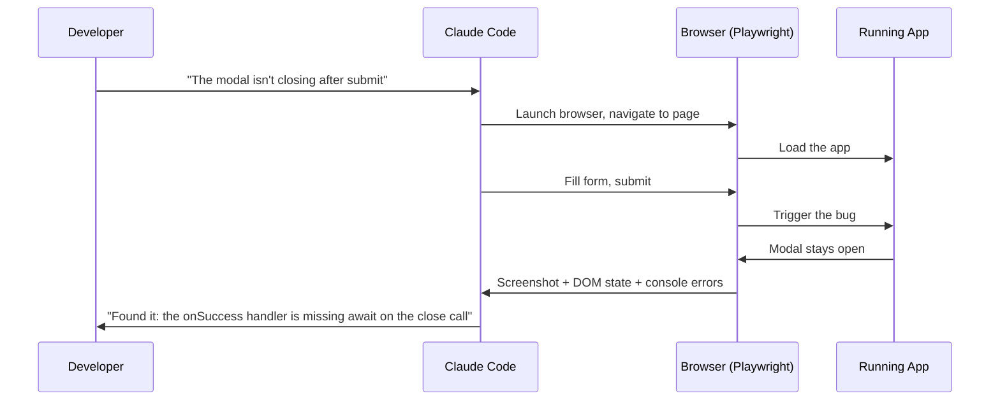
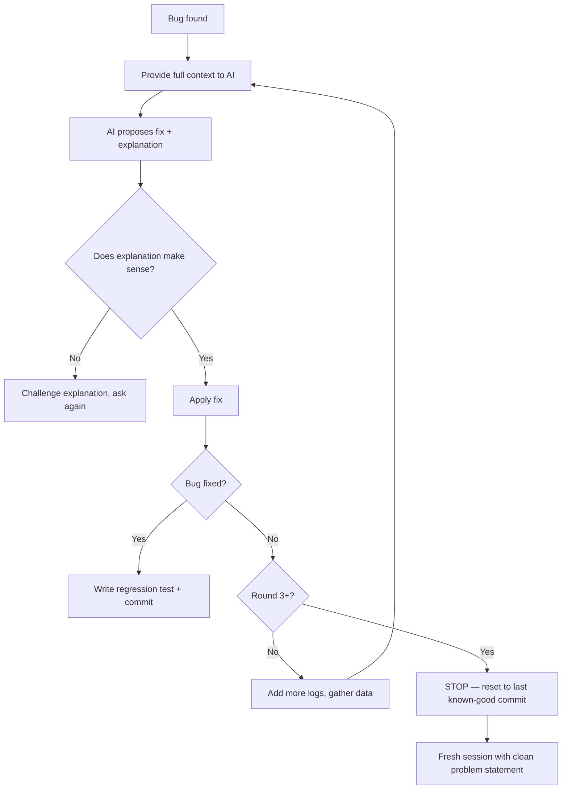

# Debugging with AI

> [!abstract] TL;DR
> Effective AI debugging means providing full context (error + code + expected/actual behaviour), asking for explanations not just fixes, and recognising when a debugging loop is not converging. Paste errors verbatim; never paraphrase. Know when to stop and reset.

## The Debugging Context Formula

The most common reason AI produces a wrong fix is **missing context**. Before asking AI to debug anything, assemble:

1. **The full error message** — copy verbatim from the terminal or browser console, including the stack trace
2. **The relevant code** — the function/component where the error occurs, plus any code it calls
3. **What you expected** — what should have happened
4. **What actually happened** — what did happen (describe or show screenshot)
5. **What you've already tried** — don't let AI suggest things you already ruled out

**Template prompt:**
```
Error:
[paste full error + stack trace]

Relevant code:
[paste the function/component]

Expected: [describe correct behaviour]
Actual: [describe what's happening]

Already tried: [list what you've tried so far]

Please explain the cause, then propose a fix.
```

Never paraphrase error messages. "Something about a null reference" loses the stack trace that identifies exactly which line failed.

## Ask for Explanation, Not Just Fix

"Just fix it" prompts produce fragile patches — the error disappears but you don't know why, and the same class of bug will appear elsewhere. Always ask for the explanation first:

> "Explain why this error is occurring, then propose a fix."

This serves two purposes:
1. **You can verify the diagnosis** — if the AI's explanation doesn't make sense to you, the fix probably doesn't either
2. **You learn the pattern** — understanding the root cause prevents recurrence

If the explanation doesn't match your mental model, push back before applying the fix:
> "You said the issue is X, but I thought Y was true because [reason]. Which is correct?"

## Listing Possible Causes

For non-obvious bugs, ask AI to brainstorm before committing to a solution:

> "Before proposing a fix, list the top 3-5 possible causes of this error in order of likelihood, given the codebase."

Then evaluate the list yourself. Often the AI's #1 cause is wrong but #3 is obviously correct once you read it. This prevents fixing the wrong thing.

## Adding Logs Strategically

When the error isn't reproducible from the code alone, use targeted logging to gather more data:

> "I can't reproduce this reliably. Add strategic console.log statements to trace the execution path and variable values around [the problematic area]. Keep the logs temporary — we'll remove them after."

After seeing the log output, share it with the AI for a second analysis pass. Real runtime values are far more informative than static code analysis.

## MCP Tools for Browser Debugging

Claude Code with the Playwright MCP tool can interact with a live browser, which is a significant debugging superpower for frontend issues:



This is dramatically faster than describing visual bugs in text. For complex frontend issues, Playwright-equipped debugging is a game-changer. See [[Skills_Guide]] for enabling MCP tools in Claude Code.

## Recognising a Debugging Loop

A debugging loop is a pattern where each AI-suggested fix either doesn't solve the problem or introduces a new one, cycling without convergence. Recognise it:

- Round 3+: each fix produces a different error
- The suggested fixes are getting larger and more speculative
- You've lost track of what the original codebase looked like
- AI's explanations are becoming less confident ("maybe...", "this might...")

**When you're in a loop, stop. Do not apply the next fix.**

Instead:
1. `git diff` to see all changes made during the debugging session
2. `git stash` or `git checkout` back to the last known-good commit
3. Start a **fresh session** with a clean problem statement
4. Often, the clean-slate prompt produces the correct answer immediately



## Knowing When to Debug Manually

Sometimes the right answer is not to ask AI — it's to open the debugger yourself. Reach for manual debugging when:

- The issue is in a critical path (auth, payments) and you need to be certain of the fix
- The AI's diagnosis contradicts your understanding and you need to verify empirically
- The bug involves timing/race conditions that are hard to describe in text
- You're in a debugging loop and fresh eyes (your own) are more valuable

Manual debugging is also one of the best ways to maintain your skills (see [[AI_Coding_Mindset]]).

## Common Pitfalls
1. **Paraphrasing error messages** — "something about undefined" loses the stack trace that identifies the exact line
2. **Not testing the fix** — applying AI's fix without running the code assumes the AI is always right; it isn't
3. **Adding more context to a stuck session** — more information into a looping session rarely helps; reset instead
4. **Accepting a fix that "seems right" without understanding it** — the same bug will reappear in a different form

## Review Questions
1. **What is the five-part debugging context formula?** *Answer: Full error + stack trace, relevant code, expected behaviour, actual behaviour, and what you've already tried.*
2. **What signals indicate you're in a debugging loop that won't converge?** *Answer: Three or more rounds producing different errors, increasingly speculative fixes, and AI giving less confident explanations.*
3. **Why ask for explanation before fix?** *Answer: To verify the diagnosis is correct before applying a potentially wrong patch, and to understand the root cause to prevent recurrence.*

## See Also
- [[Prompting_Best_Practices]] — structuring the debugging prompt correctly
- [[Testing_Strategy]] — writing a regression test after fixing a bug
- [[Vibe_Coding_Anti_Patterns]] — debugging loops as a named failure pattern
- [[Context_Management]] — when to start a fresh session mid-debug
