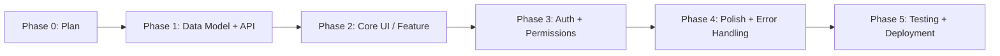

# Planning with AI

> [!abstract] TL;DR
> The single highest-leverage habit in vibe coding is planning before prompting. A well-defined plan (captured in a CLAUDE.md or PRD) gives AI the coherence it lacks on its own, prevents architectural drift, and makes every subsequent prompt faster and more accurate.

## Why Planning Matters More in AI-Assisted Development

In traditional development, a developer holds the full context of a feature in their head while coding. When they get stuck, they already know what they're building toward. AI agents have no such persistent mental model — each session starts fresh unless you explicitly provide context.

Without a plan, AI tends to:
- **Solve the stated task but miss the intent** ("add a search box" → works, but uses the wrong data structure for the rest of your app)
- **Make implicit architectural decisions** that conflict with later requirements
- **Optimize locally, not globally** — the component it builds doesn't fit the pattern of the rest

A 15-minute planning session prevents hours of AI-generated rework.

## The Planning Stack

```
PRD / Feature Brief   → What are we building and why?
CLAUDE.md             → What does the AI need to know about this project?
Task List / Tickets   → What are the discrete steps?
```

Think of the **PRD** (Product Requirements Document) as the "why and what" document. Think of **CLAUDE.md** as the "how we work" document. Together they give AI the context it needs to produce coherent output across sessions.

See [[CLAUDE_md_Guide]] for a deep dive on structuring that file.

## Defining the MVP

The most common planning mistake is attempting too much in the first iteration. An MVP should answer: *"What is the minimum functional slice that proves the core value proposition?"*

**Before writing a line of code, write one sentence:**
> "Users can [primary action] and see [core output]."

Everything not required for that sentence is out of scope for v1. Use AI to pressure-test this: *"I want to build [X]. Based on this description, what's the true MVP? What can I cut?"* AI is surprisingly good at this Socratic role when you frame it correctly.

## Phased Development

Break work into phases explicitly before engaging AI on code:



Phases should be completed and committed before starting the next. This prevents the common failure mode where you're simultaneously debugging unfinished auth, broken UI, and untested APIs.

**Prompt the AI with phases explicitly:**
> "We're in Phase 1. Don't touch the frontend yet. Focus only on the Prisma schema and the REST endpoints."

## Using AI to Refine Requirements

AI is excellent at finding gaps in your requirements before you write code. Use it as a requirements reviewer:

**Prompt pattern — gap analysis:**
> "Here are my requirements for [feature]. Before writing any code, identify:
> 1. Ambiguities I haven't addressed
> 2. Edge cases I haven't considered
> 3. Anything that will be hard to implement later if I don't decide now"

**Prompt pattern — constraint check:**
> "Given these requirements, what assumptions are you making about [auth model / data structure / user flow]? List them so I can confirm or correct."

Getting these decisions surfaced *before* code is written saves enormous rework.

## Documenting the Plan: CLAUDE.md as Living PRD

A well-maintained CLAUDE.md acts as a living PRD that all future AI sessions inherit. Minimum viable CLAUDE.md for a new project:

```markdown
# Project: [Name]

## What This Is
[1-2 sentences on the product and its primary user]

## Stack
- Frontend: Next.js 14 + TypeScript + Tailwind + shadcn/ui
- Backend: Next.js API routes
- Database: PostgreSQL via Prisma
- Auth: Clerk

## Current Phase
Phase 2: Core task management UI. Phase 1 (data model) is complete.

## Architecture Decisions
- All API calls go through /api/[route] — no direct DB calls from components
- Use server components for data fetching, client components only when interactive
- Error handling: all API routes return { data, error } shape

## What NOT to Do
- Do not use the `any` type
- Do not create new files > 300 lines without asking first
- Do not install new npm packages without listing them and waiting for approval
```

## Good vs. Bad Planning Prompts

| Bad | Good |
|---|---|
| "Build me a todo app" | "Build a task manager. Users create projects, add tasks to projects, mark tasks done. No user auth in v1. Use Next.js + Prisma + PostgreSQL. Start with the Prisma schema only." |
| "Add login" | "Add Clerk authentication. Protected routes: /dashboard, /projects/[id]. Public routes: /, /login, /signup. After login, redirect to /dashboard. Don't touch the existing Prisma schema." |
| "Fix the bug" | "The task list isn't refreshing after I mark a task done. Here's the component: [paste]. Here's the API route: [paste]. Expected: list updates immediately. Actual: stale until page refresh." |

## Common Pitfalls
1. **Starting to code before the data model is settled** — changing the schema mid-development forces AI to produce inconsistent migrations
2. **Not capturing decisions in CLAUDE.md** — decisions made in one session are invisible in the next
3. **Planning in your head, not in writing** — unwritten plans evaporate; the AI needs text
4. **Treating the plan as final** — plans evolve; update the CLAUDE.md after each phase, not just at the start

## Review Questions
1. **What does a phased development approach prevent?** *Answer: Simultaneously debugging multiple unfinished systems — auth, UI, and API — before any are complete, which produces cascading confusion.*
2. **What two documents form the planning stack in vibe coding?** *Answer: A PRD (what and why) and a CLAUDE.md (how we work — tech decisions, constraints, current phase).*
3. **How do you use AI for requirements refinement before coding?** *Answer: Prompt it to list ambiguities, unconsidered edge cases, and decisions that will be hard to change later — before asking it to write any code.*

## See Also
- [[CLAUDE_md_Guide]] — detailed guide to structuring the project context file
- [[Context_Management]] — keeping context fresh across long projects
- [[Prompting_Best_Practices]] — translating plans into effective prompts
- [[Version_Control_Workflow]] — committing after each phase completion
