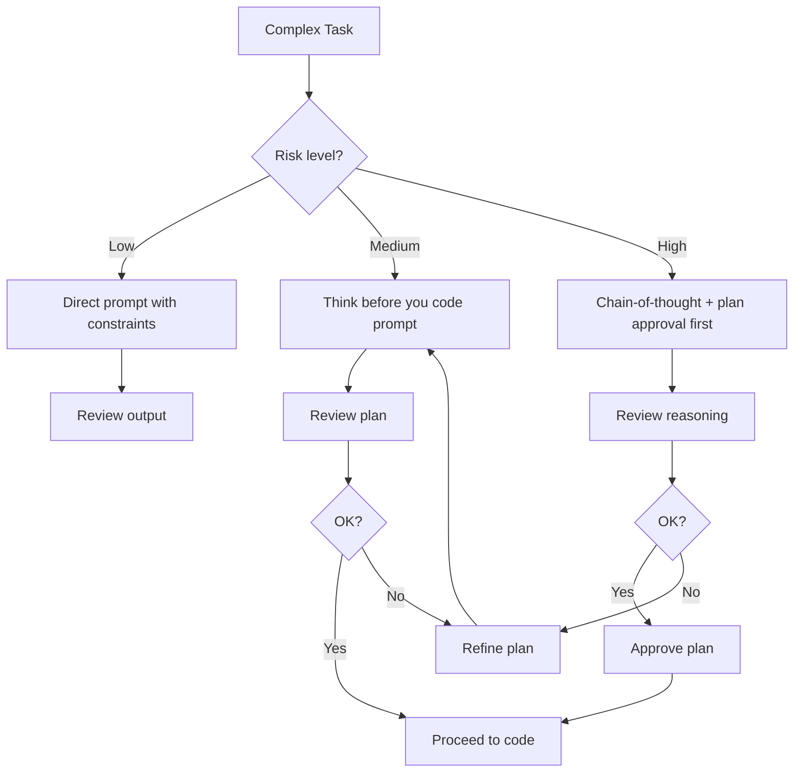

# Prompting Best Practices

> [!abstract] TL;DR
> Good prompts specify *outcome*, *constraints*, *scope*, and *context* in a single message. The most impactful habit is one task per prompt, combined with "think before you code" instructions that force the AI to plan before implementing. Iteration is expected — but vague prompts waste more rounds than specific ones.

## The Core Principle: Specificity Over Vagueness

Every word of ambiguity in a prompt becomes a decision the AI makes for you — often incorrectly. Specificity isn't about micromanaging implementation; it's about eliminating ambiguity in requirements.

**Anatomy of a good prompt:**
1. **Task:** What needs to be done
2. **Scope:** What files/systems to touch (and what NOT to touch)
3. **Constraints:** Requirements that must be satisfied
4. **Context:** Relevant existing code, errors, or decisions
5. **Output format:** What kind of response you want (code only, explanation first, etc.)

## One Task at a Time

The most common prompting mistake is **task bundling** — asking for multiple changes in one prompt. AI attempts all of them, some correctly, some incorrectly, and it's impossible to isolate which part caused a regression.

**Bad (bundled):**
> "Add a search box to the header, fix the mobile nav layout, and add the user profile dropdown"

**Good (sequential):**
> "Add a search box to the header. The input should filter the projects list in real time. Don't touch the nav or profile dropdown — those are separate tasks."

After each task: review, test, commit. Then start the next task. See [[Version_Control_Workflow]].

## Giving Mockups and Examples

AI performs dramatically better with concrete examples than with abstract descriptions. Whenever possible, provide:
- **Screenshots or wireframes** — describe what you see or paste a URL/image
- **Example input/output pairs** — "given this data, I want this rendered result"
- **Reference components** — "structure it like the existing `TaskCard` component in `/components/tasks`"
- **Before/after descriptions** — "currently it shows X, I want it to show Y"

> "Create a stats card component. See the existing `MetricTile` in `/components/dashboard/MetricTile.tsx` for the visual style and props pattern to follow. The new card needs a title, value, trend percentage, and trend direction icon."

## The "Think Before You Code" Pattern

For any task that isn't trivially simple, prefix your prompt with an instruction to plan first:

> "Before writing any code, outline:
> 1. Which files you'll modify and why
> 2. The approach you'll take
> 3. Any assumptions you're making
> 4. Potential edge cases
> 
> Then wait for my approval before proceeding."

This catches wrong directions before code is written, saving significant back-and-forth. It also surfaces hidden assumptions (see [[Planning_with_AI]]).

## "Act As" Framing

Priming the AI with a role improves output quality for specific tasks:

| Role | When to use |
|---|---|
| "Act as a senior React developer focused on performance" | Complex component optimization |
| "Act as a security engineer reviewing this code" | Auth flows, input handling |
| "Act as a code reviewer — don't write code, just find problems" | Code review pass |
| "Act as a TypeScript expert — focus on type safety" | Fixing type errors |
| "Act as a product manager" | Refining requirements, finding edge cases |

The framing works because it activates a specific slice of the model's training rather than averaging across all contexts.

## What NOT to Do Instructions

Explicitly forbidding anti-patterns is as important as specifying what to do. Common NOT instructions:

```
- Do not use 'any' types in TypeScript
- Do not install new packages without listing them first
- Do not modify files outside the /components/tasks directory
- Do not change the database schema
- Do not add console.log statements
- Do not create files longer than 300 lines
- Do not use inline styles
```

Maintain these in your CLAUDE.md so you don't have to repeat them. See [[CLAUDE_md_Guide]].

## Iterating on Prompts

Prompting is iterative by design. The first response is rarely the final output. Effective iteration techniques:

**Clarification iteration:** "This is close, but [specific issue]. Change only [X], leave [Y] as is."

**Scope reduction:** "That solution is overengineered. Give me the simplest version that passes the tests."

**Explanation request:** "Before I accept this, explain why you chose [approach] over [alternative]."

**Constraint addition:** "Good, but it needs to handle the case where [edge case]. Update the implementation."

When iterating, always specify what to keep and what to change. "Fix it" without context causes AI to guess and often introduces new problems.

## The Chain-of-Thought Pattern

For complex algorithmic or architectural tasks, explicitly request reasoning:

> "Think step-by-step through how you'd implement real-time collaborative editing in this app. Show your reasoning. Don't write code yet."

This produces an explicit reasoning trace you can review and correct before code is written. It's especially valuable for:
- Database query design
- Complex state management
- Security-sensitive features
- Performance-critical paths



## Anti-patterns to Avoid

| Anti-pattern | Why it fails | Better approach |
|---|---|---|
| "Fix this" with no context | AI guesses what "this" means | Paste the error + relevant code + expected behaviour |
| "Make it better" | Vague objective → unpredictable changes | Specify the dimension: "make it faster" / "make it more readable" |
| "Write the whole app" | No scope → sprawling, incoherent output | Phase it; do one slice at a time |
| Copy-paste the entire codebase | Context overload → worse output | Paste only relevant files + clear question |
| Asking multiple questions in one message | AI answers one well, skips others | One question per message |

## Common Pitfalls
1. **Vague scope** — not specifying which files to touch causes AI to modify things you didn't want changed
2. **No constraint list** — missing constraints surface as post-hoc bugs ("oh, it should have been TypeScript strict mode")
3. **Accepting first answer without testing** — prompting is collaborative, not vending machine-style
4. **Never reading the reasoning** — when AI explains what it did, reading that explanation is how you catch wrong approaches early

## Review Questions
1. **What are the five components of a well-formed prompt?** *Answer: Task, scope, constraints, context, and output format.*
2. **What does the "think before you code" pattern accomplish?** *Answer: It forces the AI to produce a reviewable plan before writing code, catching wrong directions before they're implemented.*
3. **Why is one task per prompt important?** *Answer: Multi-task prompts make it impossible to isolate which change caused a regression; sequential prompts with commits between them keep the history clean and reversible.*

## See Also
- [[Context_Management]] — keeping the right context in every prompt
- [[Planning_with_AI]] — planning the work before prompting for it
- [[Debugging_with_AI]] — prompting specifically for debugging sessions
- [[CLAUDE_md_Guide]] — maintaining standing constraints in project context
