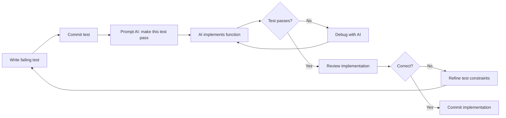

# Testing Strategy

> [!abstract] TL;DR
> Tests compound value in AI workflows more than in manual coding because they catch regressions introduced silently by later AI changes. Always ask AI to write tests by default. The most powerful pattern is writing a failing test first, then asking AI to make it pass — TDD works exceptionally well with AI implementers.

## Why Tests Are More Valuable in AI Workflows

In traditional development, a developer who writes a function also writes the logic mentally and tends to notice when a later change breaks it. In AI development:

- Later AI changes can silently break earlier features
- AI may "fix" one test while breaking another
- The developer doesn't always read every line of every change
- Context drift means AI can forget constraints it set up earlier

Tests act as **automated tripwires** — they catch regressions you would otherwise miss. Every passing test suite before a commit is a guarantee that known behaviours still work. Without tests, you're flying blind.

**The compound effect:** 5 tests early in a project become 50 tests by the end. That 50-test suite is running on every AI change, catching bugs before they compound. The test investment pays off exponentially.

## TDD with AI: Write the Test First

Test-Driven Development (TDD) is paradoxically *easier* with AI because you only have to write the test — the AI writes the implementation:

1. **You write the failing test** — describes exactly what the function should do
2. **AI makes it pass** — implements the function to satisfy the test
3. **Review both** — verify the test tests the right thing AND the implementation is correct



**Why this works:** Writing the test first forces you to articulate exactly what "correct" means. AI is then constrained by a precise specification, producing much more accurate implementations than free-form descriptions.

## E2E Tests for Stability

Unit tests test functions; E2E tests test user journeys. In AI codebases, E2E tests are especially valuable because they catch integration failures — the component works, the API works, but together they produce wrong output.

**Recommended E2E stack:** Playwright (best AI coverage; Claude Code can drive it via MCP)

Priority E2E tests to write early:
1. **Core user flow** — the main job the app does, end-to-end
2. **Auth flow** — login, logout, protected page access
3. **Data creation/deletion** — create a record, verify it exists, delete it
4. **Error states** — submit invalid data, verify error message appears

Ask AI to write these:
> "Write Playwright tests for the core task creation flow: user lands on dashboard, clicks 'New Task', fills the modal form, submits, and sees the task appear in the list."

## Writing Tests for Bugs (Regression Tests)

When a bug is found and fixed, always write a test that would have caught it:

> "We just fixed a bug where completed tasks were appearing in the active tasks list. Write a unit test that verifies completed tasks are excluded from the active list query."

This is a **regression test** — it ensures the bug never reappears silently. AI is good at this because you can describe the bug in plain English and it will write the appropriate assertion.

## Asking AI to Write Tests by Default

Make test generation the default, not the exception. Add this to your CLAUDE.md or include in your prompts:

```
# CLAUDE.md addition
When implementing any new function, component, or API endpoint, always write 
tests alongside the implementation. Don't ask — just write them.
```

Or add to individual prompts:
> "Implement the task filtering function AND write unit tests for it. Tests should cover: all tasks returned when no filter, only matching tasks when filter applied, empty array when no matches, edge case of null/undefined filter."

## The Refactor + Test Cycle

When refactoring AI-generated code (see [[Code_Quality_Standards]]), tests are your safety net:

1. Ensure tests pass before refactoring
2. Refactor the implementation
3. Run tests again — if they pass, the refactor is safe
4. If a test fails, the refactor changed behaviour (may or may not be intentional)

> "Refactor this function to be more readable. The existing tests must still pass — don't change the tests."

This constraint forces AI to preserve observable behaviour while improving internals.

## Test Coverage Strategy

Not all tests have equal value. In vibe coding, prioritise:

| Priority | What to Test | Why |
|---|---|---|
| 1 | Core business logic (pure functions) | High value, easy to test |
| 2 | API routes (input validation, responses) | Security + correctness |
| 3 | E2E core user journeys | Catch integration failures |
| 4 | Auth flows | Security-critical |
| 5 | Error handling paths | Common gap in AI-generated code |
| Lower | UI rendering details | High maintenance, low signal |

Don't aim for 100% coverage. Aim for **high coverage of critical paths**.

## Setting Up the Test Environment

Ask AI to set up the test infrastructure early:
> "Set up Vitest for this Next.js project with React Testing Library. Include a test utility for rendering with providers (Clerk auth mocked). Add a sample test for the TaskCard component."

Getting the test scaffold right at the start prevents painful retrofitting later. See [[Planning_with_AI]] for including test setup in Phase 1.

## Common Pitfalls
1. **Writing tests only after the feature is "done"** — at that point you're testing what was implemented, not what was specified
2. **Letting AI write tests that only test the happy path** — push AI explicitly: "Also test the error case and the empty state"
3. **Ignoring test failures** — the single most destructive habit; a failing test is a bug, not a warning to dismiss
4. **Over-mocking** — tests with too many mocks test nothing real; prefer integration tests over heavily-mocked unit tests

## Review Questions
1. **Why do tests compound value more in AI codebases than in manually-written codebases?** *Answer: AI can silently break earlier features while implementing new ones; tests are automated tripwires that catch regressions the developer might not notice.*
2. **What is the TDD with AI workflow?** *Answer: Write the failing test (defines exact requirements), commit it, then prompt AI to make it pass — AI is constrained by the precise specification.*
3. **What is a regression test and when should you write one?** *Answer: A test that would have caught a specific bug; write one immediately after fixing any bug to ensure it never reappears silently.*

## See Also
- [[Debugging_with_AI]] — when tests fail and you need to debug why
- [[Version_Control_Workflow]] — tests passing is the condition for committing
- [[Code_Quality_Standards]] — tests as part of the quality baseline
- [[Vibe_Coding_Anti_Patterns]] — ignoring test failures as a critical anti-pattern
