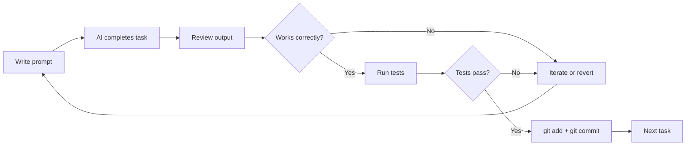

# Version Control Workflow

> [!abstract] TL;DR
> Git is your safety net in vibe coding — commit after every working task so you can always revert to a known-good state. AI can make bold wrong turns; frequent commits mean those wrong turns cost minutes, not hours. Never use "AI revert" as a strategy.

## Why Git Matters More in AI-Assisted Development

In traditional development, you change code deliberately, one function at a time. In vibe coding, AI can modify five files in two minutes. Without frequent commits:

- You can't identify which AI change introduced a regression
- You can't revert a bad AI direction without losing good work done alongside it
- A debugging loop can unknowingly accumulate hundreds of lines of wrong code
- You lose the ability to say with certainty "the app worked at this point"

**The rule: commit after every task that leaves the app in a working state.** A "task" is typically one AI prompt's worth of work — add a component, wire up an API route, fix a specific bug.

## The Commit Cadence



This cadence prevents the "I don't know when it broke" problem. Every commit message should describe the completed task: `feat: add task filtering by status` not `update` or `wip`.

## Using Git, Not AI, to Revert

When AI makes a wrong turn, the correct recovery mechanism is git, not prompting:

```bash
# See what changed
git diff

# Revert to last commit (discard all uncommitted changes)
git checkout .

# Revert to a specific earlier commit
git log --oneline   # find the commit hash
git reset --hard <commit-hash>
```

**Never ask AI to "undo what you just did."** AI reconstructs what it thinks it changed from memory, often imperfectly. Use `git stash` or `git checkout` for clean recovery.

## Asking AI to Handle Git CLI

Claude Code is comfortable with git operations. Let it:
- Write commit messages (it knows the diff and can write a precise description)
- Create branches before starting new features
- Stage specific files (avoiding accidental inclusion of `.env` or secrets)

> "Create a new branch `feat/task-filtering`, commit the current changes with an appropriate message, then push the branch."

Always verify before AI pushes: check `git status` and `git log` first.

## Clean Branch Per Feature

Keep branches focused:
- **One feature per branch** — mixing features makes PR reviews harder and cherry-picks impossible
- **Branch from main** at the start of each feature
- **Short-lived branches** — merge or close within days, not weeks
- **Never develop directly on main** — this eliminates the ability to revert a feature independently

```bash
# Start a feature
git checkout main && git pull
git checkout -b feat/user-profile

# Work + commit iteratively
# ...

# When done
git checkout main
git merge feat/user-profile
git branch -d feat/user-profile
```

Ask Claude Code to handle this sequence — it will set up the branch, manage commits, and handle the merge.

## Commit Message Generation

AI-generated commit messages are usually better than human-typed ones because they accurately describe the diff rather than summarizing the intent. Let Claude Code write commit messages:

> "Write a commit message for the current staged changes. Follow conventional commits format: `type(scope): description`."

Good commit message format:
```
feat(tasks): add real-time search filter to task list

- Implements client-side filtering by task name
- Case-insensitive match, no debounce
- Clears on Escape key press
```

This is valuable for your own history review and for AI sessions that read git history to understand what was built.

## The Stash Strategy for Exploration

When you want to explore an approach without committing:

```bash
# Save current state
git stash

# Try something experimental
# ... (AI makes changes)

# If it worked: restore and then commit properly
git stash pop

# If it didn't: discard and return to clean state
git stash drop
```

Use stash for "let me see if this direction works" explorations. Never go more than 15-20 minutes without either committing or stashing/discarding.

## Git for AI Error Recovery

The most practical recovery patterns:

| Scenario | Git Command |
|---|---|
| AI broke everything in this session | `git checkout .` |
| AI introduced a regression two commits ago | `git revert HEAD~2` |
| Need to compare AI's change to what it replaced | `git diff HEAD~1` |
| AI accidentally staged secrets | `git reset HEAD <file>` then add to .gitignore |
| Need to try AI's experimental approach without losing current work | `git stash` → try → `git stash pop` or `git stash drop` |

## The .gitignore Discipline

AI might suggest adding files that should never be committed. Maintain a rigorous `.gitignore`:

```
.env
.env.local
.env*.local
node_modules/
.next/
dist/
*.log
.DS_Store
```

Ask Claude Code to audit your `.gitignore` before the first commit, and again when adding new services. See [[Security_for_Vibe_Coders]] for secret management.

## Common Pitfalls
1. **Committing after AI "finishes" without testing** — if the tests don't pass, don't commit
2. **Giant commits that bundle multiple features** — makes bisecting regressions impossible
3. **Relying on AI to undo its own changes** — AI memory is unreliable; use git
4. **Committing .env or secrets** — rotate credentials immediately and add to .gitignore; see [[Security_for_Vibe_Coders]]

## Review Questions
1. **Why is "commit after every working task" the right cadence in vibe coding?** *Answer: AI can modify multiple files rapidly; frequent commits provide clean revert points so a wrong direction costs minutes not hours.*
2. **Why should you never ask AI to undo its own changes?** *Answer: AI reconstructs what it thinks it changed from memory, often imperfectly; git has an exact record.*
3. **What is the correct recovery pattern when AI makes a bad change?** *Answer: `git diff` to review what changed, then `git checkout .` to discard all uncommitted changes, or `git reset --hard <hash>` to return to a specific commit.*

## See Also
- [[Planning_with_AI]] — phase-based development that aligns with commit cadence
- [[Testing_Strategy]] — "tests pass" is the condition for committing
- [[Security_for_Vibe_Coders]] — preventing secrets in commits
- [[Debugging_with_AI]] — using git to escape debugging loops
