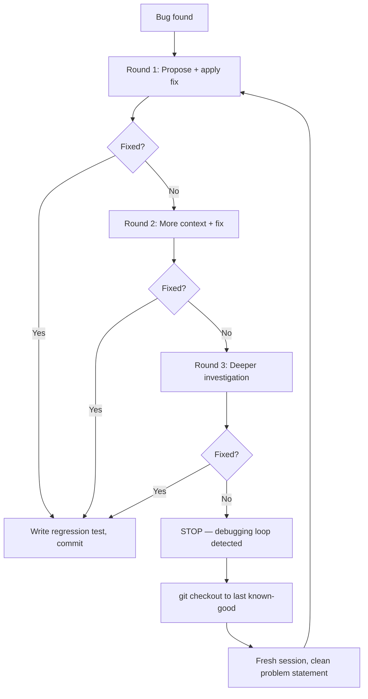

# Vibe Coding Anti-Patterns

> [!abstract] TL;DR
> The most damaging vibe coding failures are: accepting fixes without understanding them, growing monolithic files, ignoring test failures, skipping planning, context overload, and debugging loops that never resolve. Each is recognisable and preventable.

## Anti-Pattern 1: Accepting Fixes Without Understanding

**Description:** AI proposes a fix, it makes the test pass, you commit it. You have no idea why the change worked.

**Why it fails:**
- The same root cause will produce a different bug in a different place
- The fix may introduce a subtle regression you didn't test for
- Over time, the codebase fills with patches that nobody understands, making further AI assistance unreliable

**How it looks:**
> "Why was `await` added here?" → "I'm not sure, the AI added it and the tests passed."

**Fix:** Apply the [[AI_Coding_Mindset]] "ask for explanation before fix" principle. Require AI to explain its reasoning. If you don't understand the explanation, ask a follow-up. Don't commit code you can't explain at a high level.

## Anti-Pattern 2: Growing Monolithic Files

**Description:** Files grow to 500, 800, 1000+ lines because it's easier to have AI "just add to the existing file" than to restructure.

**Why it fails:**
- AI context quality degrades as file length increases
- Unrelated concerns become tangled, making changes risky
- Every AI interaction with that file takes longer and produces less accurate output
- Test surface expands to the point of being untestable

**How it looks:**
- `TaskManager.tsx` that contains the task list, task detail, task creation form, and business logic
- `utils.ts` with 30 unrelated helper functions

**Fix:** The 300-line rule from [[Code_Quality_Standards]]. Add this to CLAUDE.md: *"Never create or extend a file beyond 300 lines without first proposing a split."* See [[Maintaining_AI_Codebases]] for regular refactoring sessions.

## Anti-Pattern 3: Ignoring Test Failures

**Description:** A test fails. You assume it's a flaky test, or the test is "probably wrong," and you skip it or comment it out.

**Why it fails:**
- Tests fail because something broke — "probably wrong" is almost always incorrect
- Commented-out tests reset your quality baseline to include that class of bug
- Future AI changes compound on the broken foundation

**How it looks:**
```typescript
// TODO: this test was failing, not sure why
// test('task should be removed from active list when completed', ...)
```

**Fix:** Treat every test failure as a confirmed bug. Don't commit with failing tests. Investigate the failure before moving on. See [[Testing_Strategy]] for the right mindset.

## Anti-Pattern 4: Skipping Planning

**Description:** You have a rough idea of a feature, you start prompting immediately, AI builds something, it's not quite right, you iterate, the feature grows organically and inconsistently.

**Why it fails:**
- Organic growth produces incoherent features (component A handles state differently from component B in the same workflow)
- AI makes implicit architecture decisions that you discover are wrong three days later
- You end up rebuilding rather than building once

**How it looks:**
> "Add user profiles." → "OK now add profile editing." → "Also profiles need avatars." → "Wait, auth needs to connect to profiles too." → Three partial implementations, two different data models, one confused codebase.

**Fix:** See [[Planning_with_AI]]. Write the plan first, even for small features. Five minutes of planning prevents two hours of rework.

## Anti-Pattern 5: Context Overload

**Description:** A single session grows for hours. AI output degrades. You paste more context to "help." Output degrades further.

**Why it fails:**
- Context windows are finite; more noise doesn't add signal
- Pasting more into an overloaded session worsens the signal-to-noise ratio
- The session accumulates debris from wrong turns, rolled-back approaches, and misunderstandings

**How it looks:**
- Responses start contradicting earlier decisions
- AI refers to code you deleted an hour ago
- You've pasted the same component three times with different descriptions

**Fix:** See [[Context_Management]]. Recognise context rot early and reset. Update CLAUDE.md with session learnings before resetting.

## Anti-Pattern 6: The Debugging Loop That Never Resolves

**Description:** A bug is found. AI proposes a fix. New bug appears. AI proposes another fix. New bug. Repeat for 6+ iterations.

**Why it fails:**
- The fundamental problem is usually architectural, not fixable by patching
- Each patch layer makes the next patch harder
- After 3+ rounds you've lost track of what the original working code looked like
- Without a clean revert point (see [[Version_Control_Workflow]]) recovery is painful

**How it looks:**
> Round 1: "Fix null reference in task filter" → Round 2: "Now filter returns undefined" → Round 3: "Now filter applies twice" → Round 4: "Performance degraded" → Round 5: still broken

**Fix:** Apply the debugging reset from [[Debugging_with_AI]]. After round 3, stop, `git checkout` to last working commit, fresh session, clean problem statement. The right fix usually emerges immediately from a fresh context.



## Anti-Pattern 7: The Wrong Stack

**Description:** Using a niche framework or outdated library version, then spending sessions correcting AI's wrong assumptions about the API.

**Why it fails:**
- Every interaction requires explicitly correcting AI assumptions
- Output quality stays low regardless of prompt quality
- Debugging AI's framework misunderstandings takes longer than the feature itself

**Fix:** See [[Vibe_Coding_Stack]]. Use the default TypeScript/React/Node stack where possible, especially for new projects.

## Anti-Pattern 8: Shipping Scaffolding as Production

**Description:** Using Lovable/v0/Replit to build the MVP, then continuing to develop there indefinitely and shipping from the scaffolding environment.

**Why it fails:**
- Scaffolding tools don't do security reviews; generated auth is often insecure
- Code quality degrades as the scaffold's AI accumulates without structured review
- Vendor lock-in makes migration increasingly expensive

**Fix:** See [[Frontend_AI_Tools]]. Export to GitHub at the MVP stage. Move to local development with Claude Code for sustained development.

## Summary Table

| Anti-Pattern | Root Cause | Warning Sign | Fix |
|---|---|---|---|
| Accepting without understanding | Over-trust | "It works, dunno why" | Require explanations |
| Monolithic files | Local optimization | File > 400 lines | 300-line rule + refactoring sessions |
| Ignoring test failures | Convenience | Commented-out tests | Treat failures as bugs |
| Skipping planning | Impatience | Feature creep, inconsistency | Write plan before prompting |
| Context overload | Session accumulation | Contradictory AI output | Fresh sessions + CLAUDE.md |
| Debugging loops | Architectural problem | Round 3+ with new bugs each time | Reset to last working commit |
| Wrong stack | Familiarity bias | AI hallucinating APIs | Use popular, well-documented stacks |
| Shipping scaffolding | Time pressure | No security review | Export + migrate at MVP |

## Common Pitfalls
1. **Recognising the anti-pattern too late** — most are recoverable early, catastrophic late
2. **Fixing anti-patterns mid-feature** — address one at a time in dedicated sessions; don't mix refactoring with feature development
3. **Revisiting closed decisions** — once a plan is committed, AI should execute it; constant replanning is its own anti-pattern

## Review Questions
1. **What is the earliest warning sign of a debugging loop?** *Answer: Round 3+ of fix attempts each producing a different error — escalating complexity rather than converging on a solution.*
2. **Why does context overload get worse when you add more context?** *Answer: Adding more information into an already-flooded context increases noise rather than signal; the right response is to reset, not to add more.*
3. **What is the "wrong stack" anti-pattern's real cost in AI development?** *Answer: Every interaction requires correcting AI's wrong framework assumptions, making output quality persistently low regardless of prompt quality — time is spent correcting AI rather than building features.*

## See Also
- [[AI_Coding_Mindset]] — the mental model that prevents most anti-patterns
- [[Debugging_with_AI]] — the correct debugging protocol
- [[Maintaining_AI_Codebases]] — long-term quality maintenance
- [[Planning_with_AI]] — the habit that prevents planning-related anti-patterns
