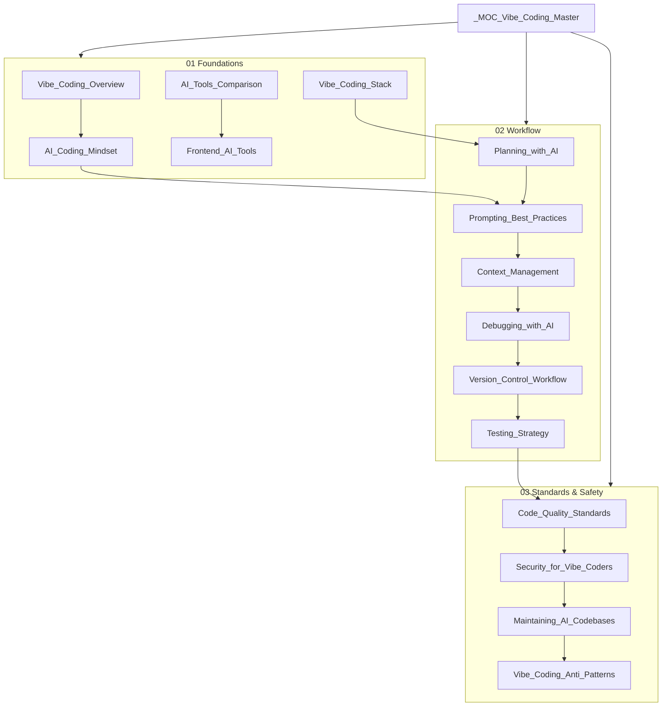
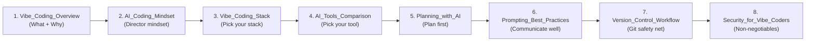
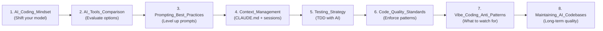

# Vibe Coding — Master Map of Content

> [!abstract] TL;DR
> Vibe coding is AI-assisted development where AI agents write most of the code and humans act as directors, reviewers, and architects. This vault covers the mindset, tools, workflow, and safety practices that separate effective vibe coders from those who ship brittle, insecure AI slop.

## Vault Architecture

## Sections at a Glance

| # | Section | Focus | Notes |
|---|---|---|---|
| 01 | [[01_Foundations/Vibe_Coding_Overview\|Foundations]] | Mindset, tools, stack | 5 notes |
| 02 | [[02_Workflow/Planning_with_AI\|Workflow]] | Day-to-day practices | 6 notes |
| 03 | [[03_Standards_and_Safety/Code_Quality_Standards\|Standards & Safety]] | Quality, security, maintenance | 4 notes |

---

## Section 01: Foundations

> Understanding what vibe coding is, the tools available, and how to set up for success.

| Note | What You'll Learn |
|---|---|
| [[Vibe_Coding_Overview]] | What vibe coding is, the director vs. implementer mindset, who it's for, risks |
| [[AI_Coding_Mindset]] | Thinking in outcomes, trust-but-verify, avoiding learned helplessness |
| [[AI_Tools_Comparison]] | Claude Code, Cursor, Windsurf, ChatGPT, Gemini, v0, Lovable, Replit — when to use each |
| [[Frontend_AI_Tools]] | v0, Lovable, Replit deep-dive — when to scaffold, when to move out |
| [[Vibe_Coding_Stack]] | Why TypeScript+React+Node is the AI-compatible default stack |

---

## Section 02: Workflow

> The day-to-day practices that keep AI output coherent, reversible, and correct.

| Note | What You'll Learn |
|---|---|
| [[Planning_with_AI]] | Plan before code, MVP definition, phased development, CLAUDE.md as PRD |
| [[Prompting_Best_Practices]] | Specificity, one task at a time, "think before you code", iteration techniques |
| [[Context_Management]] | When to reset sessions, maintaining CLAUDE.md, fighting context rot |
| [[Debugging_with_AI]] | The debugging context formula, asking for explanations, recognising loops |
| [[Version_Control_Workflow]] | Git-first vibe coding, commit cadence, using git (not AI) to revert |
| [[Testing_Strategy]] | TDD with AI, E2E stability tests, regression tests, testing by default |

---

## Section 03: Standards & Safety

> The practices that prevent AI-generated codebases from becoming unmaintainable.

| Note | What You'll Learn |
|---|---|
| [[Code_Quality_Standards]] | Establishing patterns early, 300-line rule, refactoring sessions |
| [[Security_for_Vibe_Coders]] | Secrets, auth review, input validation, supply chain, prompt injection |
| [[Maintaining_AI_Codebases]] | Preventing AI slop, architectural reviews, documentation, code ownership |
| [[Vibe_Coding_Anti_Patterns]] | Eight named failure modes: from debugging loops to context overload |

---

## Learning Path: Beginner

*No prior AI coding tool experience. Start here to build the right foundation before going hands-on.*

**Time investment:** ~2 hours of reading + setting up your first project

---

## Learning Path: Experienced Developer Going AI-First

*You write code well. You want to understand how to use AI to multiply output without sacrificing quality.*

**Time investment:** ~90 minutes of reading, then apply immediately to your current project

---

## Key Cross-Links

### Claude Code Deep Dives
- [[CLAUDE_md_Guide]] — structuring your project context file
- [[Skills_Guide]] — automating workflows with reusable skills
- [[MCP_Tools_Guide]] — adding filesystem, browser, and API tools to Claude Code

### Related Vaults
- [[_MOC_Claude_Code_Master]] — comprehensive Claude Code CLI reference
- [[_MOC_AI_Product_Builder_Master]] — building AI-native products
- [[_MOC_DevRel_Master]] — developer tooling and community

### DevOps Connections
- [[Git_Fundamentals]] — git fundamentals if Version Control Workflow is new
- [[CI_CD_Overview]] — automating test runs in CI with AI-generated test suites

---

## Quick Reference: The 10 Commandments of Vibe Coding

1. **Plan before you prompt** — even 5 minutes of planning prevents hours of rework ([[Planning_with_AI]])
2. **One task per prompt** — scope creep in prompts produces incoherent output ([[Prompting_Best_Practices]])
3. **Commit after every working task** — git is your only reliable revert mechanism ([[Version_Control_Workflow]])
4. **Read what AI writes** — not every line, but the structure and logic ([[AI_Coding_Mindset]])
5. **Ask for explanations, not just fixes** — understanding prevents recurrence ([[Debugging_with_AI]])
6. **Keep CLAUDE.md current** — stale context produces inconsistent code ([[Context_Management]])
7. **Tests are non-negotiable** — they catch what you didn't notice ([[Testing_Strategy]])
8. **Never hardcode secrets** — env variables, always ([[Security_for_Vibe_Coders]])
9. **Recognise and break debugging loops** — 3 failed fixes = reset and start fresh ([[Vibe_Coding_Anti_Patterns]])
10. **You own the code** — "AI wrote it" is an explanation, not an excuse ([[Maintaining_AI_Codebases]])

---

## Vault Stats
- **Total notes:** 15
- **Sections:** 3
- **Created:** 2026-07-29
- **Difficulty range:** Beginner → Advanced
- **Cross-links to Claude Code vault:** [[CLAUDE_md_Guide]], [[Skills_Guide]], [[MCP_Tools_Guide]]
