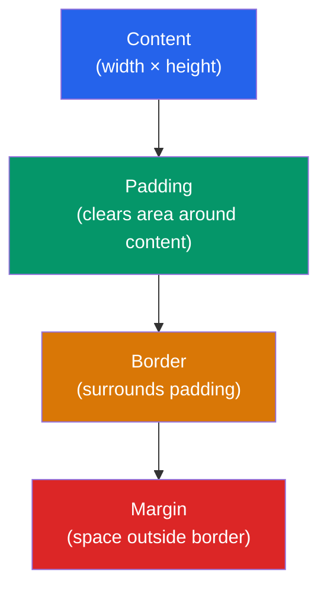
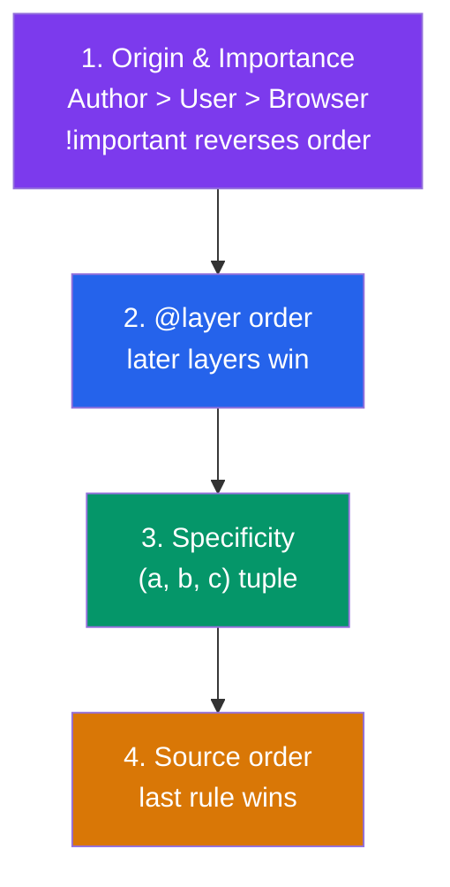

# 📦 CSS Box Model

> [!abstract] TL;DR
> Every HTML element is a rectangular box with four concentric layers: **content → padding → border → margin**. The critical `box-sizing: border-box` reset makes `width` include padding and border, not just content — apply it globally with the universal selector. The **cascade** resolves conflicting rules by three criteria in order: origin/importance → `@layer` → specificity → source order. **Specificity** is a three-component tuple (a,b,c) where IDs score (1,0,0) and classes score (0,1,0) — keep it low and flat.

## Intuition — analogy FIRST

Think of an exhibit display case in a museum.

The **content** is the artifact inside. **Padding** is the velvet lining protecting the artifact from the glass. The **border** is the glass frame itself. The **margin** is the empty floor space between this case and the adjacent one — other exhibits cannot enter that space.

Now imagine two museum policies written on different signs telling you the lighting should be "warm white" and "cool white". The **cascade** is the museum manager who reads both signs, checks which authority wrote them (a curator vs a cleaner), which is more specific (lamp #3 vs all lamps), and which was written last — then applies exactly one rule.

---

## How It Works



### `content-box` vs `border-box`

| Mode | `width` includes | Default? | Problem |
|------|-----------------|----------|---------|
| `content-box` | content only | Yes (browser default) | Adding padding/border makes element wider than `width` |
| `border-box` | content + padding + border | No | None — predictable sizing |

```css
/* The universal reset — apply this to every project */
*, *::before, *::after {
  box-sizing: border-box;
}

/* Now width: 200px means the whole box is 200px */
.card {
  width: 200px;
  padding: 16px;
  border: 2px solid #ccc;
  /* Total rendered width: 200px (not 200 + 32 + 4 = 236px) */
}
```

---

## Key Concepts / Details

### Vertical Margin Collapsing

Adjacent vertical margins collapse to the **larger** of the two (they don't add up):

```css
/* These two paragraphs — the gap between them is 24px, not 16+24=40px */
p { margin-bottom: 16px; }
p + p { margin-top: 24px; }
```

**Rules of margin collapsing:**
- Only **vertical** margins collapse (never horizontal)
- Never collapses in **flex** or **grid** containers
- A **Block Formatting Context** (BFC) blocks collapse — trigger via `display: flow-root`, `overflow: hidden`, or `display: flex`/`grid`

```css
/* Stop parent/first-child margin from leaking */
.parent {
  display: flow-root; /* Creates a BFC */
}
```

### The Cascade — three tiebreakers in order



### Specificity as an (a, b, c) Tuple

| Selector | a | b | c | Score |
|----------|---|---|---|-------|
| `#main` | 1 | 0 | 0 | (1,0,0) — beats any pile of classes |
| `.card.active` | 0 | 2 | 0 | (0,2,0) |
| `a:hover` | 0 | 1 | 1 | (0,1,1) |
| `h1` | 0 | 0 | 1 | (0,0,1) |
| `*` | 0 | 0 | 0 | (0,0,0) |
| Inline `style=""` | — | — | — | Always wins (except `!important`) |

```css
/* :where() contributes zero specificity — safe for base styles */
:where(h1, h2, h3) {
  margin-top: 0;
}

/* :is() and :not() take the specificity of their most specific argument */
:is(#main, .card) h2 { /* ID specificity: (1,0,1) */ }
```

### Common Selector Patterns

```css
/* Element */
h1 { color: navy; }

/* Class — prefer these for styling */
.card { padding: 1rem; }

/* Descendant */
.card p { margin-bottom: 0; }

/* Direct child */
.nav > li { display: flex; }

/* Adjacent sibling */
h2 + p { margin-top: 0; }

/* Attribute */
input[type="email"] { border-color: blue; }

/* Pseudo-class */
a:hover { text-decoration: underline; }
li:nth-child(odd) { background: #f5f5f5; }

/* Pseudo-element */
p::first-line { font-variant: small-caps; }
.card::before { content: "★"; } /* content is required */
```

### `@layer` for Low-Specificity Architecture

```css
/* Define layer order — later layers win in specificity ties */
@layer base, components, utilities;

@layer base {
  :where(h1) { font-size: 2rem; }
}

@layer components {
  .card { padding: 1rem; border-radius: 8px; }
}

@layer utilities {
  .mt-4 { margin-top: 1rem; }
}
```

---

## Real-World Notes

- **The `* { box-sizing: border-box }` reset is the first thing every CSS framework applies.** Bootstrap, Tailwind, and Bulma all include it because `content-box` is unusable in practice.
- **Keep specificity low and flat.** Use classes for styling, avoid IDs in CSS, and never use `!important` except to override inline styles from third-party libraries. High specificity creates override wars.
- **Margin collapsing surprises everyone once.** The classic symptom: adding `margin-top` to the first child of a container and watching the parent move instead. Fix with `display: flow-root` on the parent.
- **CSS Cascade Layers (`@layer`) are the modern alternative to specificity hacks.** They let you define a layer order so utility classes always win over component styles without resorting to `!important`.

---

## Common Pitfalls

- **Forgetting the `border-box` reset** and then being confused why `width: 100%` + padding causes overflow.
- **Using IDs in CSS selectors** — (1,0,0) specificity is almost impossible to override without `!important` or more IDs. Use IDs for JavaScript and anchor links only.
- **Overusing `!important`** to fix specificity problems — it creates an arms race. Fix the selector architecture instead.
- **Vertical margins collapsing unexpectedly** between a parent and its first/last child when the parent has no padding or border. The fix is to establish a BFC.
- **Confusing `:hover` with `::hover`** — single colon = pseudo-class (state), double colon = pseudo-element (sub-part of element).

---

## Related Concepts

- [[_MOC_HTML_CSS|↑ Section MOC]]
- [[HTML5_Semantics]] — The elements whose boxes we're styling
- [[Flexbox_and_Grid]] — Layout models that eliminate certain box model quirks (e.g., no margin collapse in flex/grid)
- [[CSS_Variables_Custom_Properties]] — Custom properties that power design tokens applied via the cascade

---

## Review Questions

1. What is the difference between `box-sizing: content-box` and `border-box`? Write the universal reset.
2. Explain why `margin-bottom: 16px` on a `<p>` and `margin-top: 24px` on the next `<p>` results in a 24px gap, not 40px.
3. Calculate the specificity of: `nav > ul li.active a:hover`. Which wins against `#main-nav a`?
4. How does `display: flow-root` prevent margin collapse, and what other values create a Block Formatting Context?

---

## Sources

- MDN Web Docs: The box model — https://developer.mozilla.org/en-US/docs/Learn/CSS/Building_blocks/The_box_model
- MDN Web Docs: Cascade and inheritance — https://developer.mozilla.org/en-US/docs/Learn/CSS/Building_blocks/Cascade_and_inheritance
- CSS-Tricks: The CSS Cascade — https://css-tricks.com/the-c-in-css-the-cascade/
- W3C: CSS Cascade 5 specification — https://www.w3.org/TR/css-cascade-5/

#web-development #html-css #box-model #cascade #specificity
