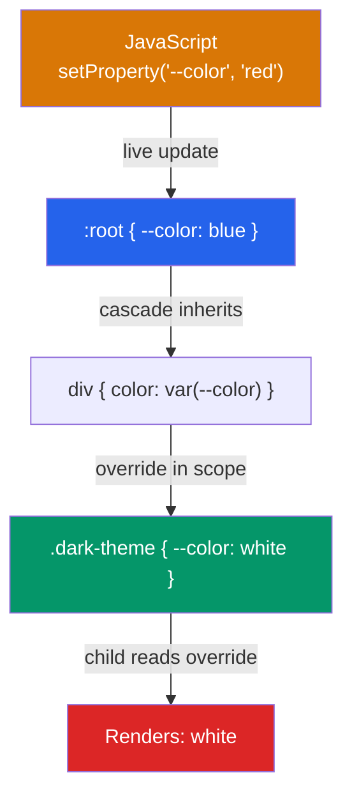

# 🎛️ CSS Variables and Custom Properties

> [!abstract] TL;DR
> CSS custom properties (declared as `--property-name: value`) are design tokens that live in the cascade — they inherit, they can be overridden per-scope, and they update reactively when changed via JavaScript. Unlike Sass variables (compiled away at build time), custom properties exist at runtime, enabling live theming, dark mode, component-scoped overrides, and design-system token layers. The `@property` rule adds type, inheritance control, and animatability.

## Intuition — analogy FIRST

Think of CSS custom properties as **named paint swatches on a wall** rather than hardcoded hex codes.

Without custom properties, you paste the same `#2563eb` blue in 47 different places across your stylesheet. Change the brand blue? Find-and-replace 47 times, and pray you didn't miss any.

With custom properties, you write `--color-primary: #2563eb` once at the top, and reference `var(--color-primary)` everywhere. Change the brand blue? One line. Dark mode? Override `--color-primary` inside `[data-theme="dark"]` and every component that uses it updates automatically — no JavaScript, no class toggling on individual elements.

---

## How It Works



Custom properties cascade and inherit just like regular CSS properties. Declaring at `:root` makes them globally available; declaring on a selector scopes them to that subtree.

---

## Key Concepts / Details

### Syntax

```css
/* Declaring a custom property */
:root {
  --color-primary: #2563eb;
  --color-background: #ffffff;
  --spacing-md: 1rem;
  --border-radius: 8px;
  --font-size-base: 1rem;
}

/* Using with var() */
.button {
  background-color: var(--color-primary);
  padding: var(--spacing-md);
  border-radius: var(--border-radius);
}

/* var() fallback — second argument is the default */
.card {
  color: var(--color-text, #333); /* uses #333 if --color-text is not defined */
}

/* Fallback can itself be another var() */
.heading {
  color: var(--color-heading, var(--color-primary, navy));
}
```

### Design Token System

Organize custom properties in layers — primitive → semantic → component:

```css
/* Layer 1: Primitive tokens (raw values) */
:root {
  /* Colors */
  --blue-500: #2563eb;
  --blue-600: #1d4ed8;
  --gray-900: #111827;
  --white: #ffffff;

  /* Spacing scale */
  --space-1: 0.25rem;  /* 4px */
  --space-2: 0.5rem;   /* 8px */
  --space-4: 1rem;     /* 16px */
  --space-8: 2rem;     /* 32px */

  /* Typography */
  --font-sans: system-ui, -apple-system, sans-serif;
  --text-sm: 0.875rem;
  --text-base: 1rem;
  --text-xl: 1.25rem;
}

/* Layer 2: Semantic tokens (meaning, not value) */
:root {
  --color-primary: var(--blue-500);
  --color-primary-hover: var(--blue-600);
  --color-text: var(--gray-900);
  --color-background: var(--white);
  --spacing-component: var(--space-4);
}

/* Layer 3: Component tokens (scoped to a component) */
.button {
  --button-bg: var(--color-primary);
  --button-radius: 6px;

  background: var(--button-bg);
  border-radius: var(--button-radius);
}

/* Component variant — override just the component token */
.button--danger {
  --button-bg: #dc2626;
}
```

### Dark Mode Theming

```css
/* Light mode (default) */
:root {
  --color-background: #ffffff;
  --color-text: #111827;
  --color-surface: #f9fafb;
  --color-border: #e5e7eb;
  --color-primary: #2563eb;
}

/* Dark mode — override semantic tokens only */
[data-theme="dark"] {
  --color-background: #111827;
  --color-text: #f9fafb;
  --color-surface: #1f2937;
  --color-border: #374151;
  --color-primary: #60a5fa; /* lighter blue on dark */
}

/* Prefer system dark mode automatically */
@media (prefers-color-scheme: dark) {
  :root {
    --color-background: #111827;
    --color-text: #f9fafb;
  }
}

/* All components using these tokens update automatically */
body {
  background: var(--color-background);
  color: var(--color-text);
}
```

### JavaScript Interop

```javascript
// Read a custom property
const root = document.documentElement;
const primaryColor = getComputedStyle(root)
  .getPropertyValue('--color-primary')
  .trim();

// Set a custom property
root.style.setProperty('--color-primary', '#10b981');

// Scoped to a single element
const card = document.querySelector('.card');
card.style.setProperty('--card-bg', 'linear-gradient(...)');

// Remove (reverts to cascade value)
root.style.removeProperty('--color-primary');
```

### The `@property` Rule — Typed Custom Properties

`@property` (Houdini) gives custom properties a type, which enables **animation** and prevents inheritance of invalid values:

```css
/* Without @property: can't animate (browser can't interpolate) */
/* With @property: fully animatable */

@property --progress {
  syntax: "<number>";
  inherits: false;
  initial-value: 0;
}

@property --highlight-color {
  syntax: "<color>";
  inherits: true;
  initial-value: transparent;
}

/* Now this transition works */
.progress-ring {
  --progress: 0;
  transition: --progress 0.5s ease;
}
.progress-ring.loaded {
  --progress: 75;
}
```

### Scoped Component Theming

```css
/* Default button */
.btn {
  --btn-color: var(--color-primary);
  --btn-text: white;
  --btn-radius: 6px;

  background: var(--btn-color);
  color: var(--btn-text);
  border-radius: var(--btn-radius);
}

/* Scoped override in a "danger zone" section */
.danger-zone .btn {
  --btn-color: #dc2626;
}

/* Per-element override with inline style */
/* <button style="--btn-radius: 999px">Pill button</button> */
```

---

## Real-World Notes

- **Every major design system uses custom properties as the token layer.** Material Design 3, Radix UI, Shadcn/ui all expose `--md-primary-color`, `--radius`, etc. for theming.
- **CSS custom properties are not the same as Sass/Less variables.** Sass variables are resolved at compile time to static values; CSS custom properties exist in the browser and can change at runtime.
- **`var()` returns an empty string if the property is undefined** — not `inherit` or `unset`. This can cause subtle layout issues if you forget to declare the variable.
- **Custom properties work with `calc()`:** `font-size: calc(var(--text-base) * 1.5);` — very powerful for scaling systems.

---

## Common Pitfalls

- **Using `var()` without a fallback in critical properties** — if the property is accidentally undefined, the element may be invisible or unstyled.
- **Overriding semantic tokens in components** instead of component-scoped tokens — breaks the token layering.
- **Expecting `@property` to work everywhere** — it has broad support (96%+) but always check for your baseline. Fallback gracefully.
- **Circular references** — `--a: var(--b); --b: var(--a);` causes both to resolve to their initial value (empty). The browser silently ignores cycles.
- **Whitespace matters in values** — `--spacing: 1rem;` has a trailing space that becomes part of the value in some contexts. Be consistent.

---

## Related Concepts

- [[_MOC_HTML_CSS|↑ Section MOC]]
- [[CSS_Box_Model]] — The cascade that custom properties participate in
- [[Responsive_Design]] — Using custom properties with `clamp()` for fluid spacing
- [[Flexbox_and_Grid]] — Gap and sizing values often come from custom properties

---

## Review Questions

1. What is the difference between a Sass variable and a CSS custom property? When would you choose each?
2. How do you implement dark mode using only CSS custom properties? Show the token structure.
3. Why can't you animate a CSS custom property by default, and what does `@property` add?
4. What does `var(--color-text, #333)` do when `--color-text` is not defined?

---

## Sources

- MDN Web Docs: Using CSS custom properties — https://developer.mozilla.org/en-US/docs/Web/CSS/Using_CSS_custom_properties
- MDN Web Docs: @property — https://developer.mozilla.org/en-US/docs/Web/CSS/@property
- CSS-Tricks: A Strategy Guide To CSS Custom Properties — https://css-tricks.com/a-strategy-guide-to-css-custom-properties/
- web.dev: CSS custom properties design systems — https://web.dev/articles/css-custom-properties

#web-development #html-css #custom-properties #design-tokens #theming
