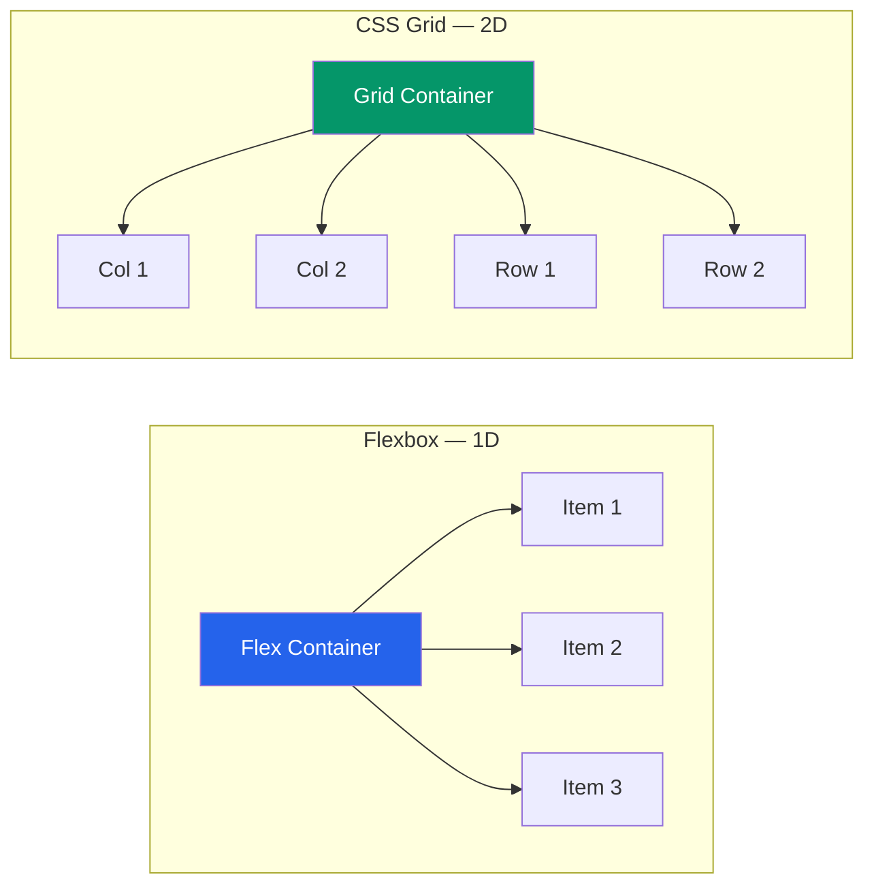

# 📐 Flexbox and Grid

> [!abstract] TL;DR
> **Flexbox** is a one-dimensional layout model — it arranges items along a single axis (row or column) and is ideal for nav bars, button groups, and centering. **CSS Grid** is two-dimensional — it controls rows and columns simultaneously and is ideal for page layouts, card grids, and complex overlapping designs. The rule of thumb: reach for Grid in two dimensions and Flexbox in one. They compose freely — a Grid item can itself be a Flex container.

## Intuition — analogy FIRST

**Flexbox** is like beads on a wire. All beads sit on one wire (the main axis). You control how the beads space out along the wire and how they line up perpendicular to it. If beads don't fit on one wire, you can add a second wire (wrapping).

**CSS Grid** is like a spreadsheet. You define the columns and rows first, then place content into cells. You can span cells, name regions, and put things anywhere in the grid — independent of source order.

---

## How It Works



---

## Key Concepts / Details

### Flexbox — Container Properties

```css
.flex-container {
  display: flex;

  /* Main axis direction */
  flex-direction: row | row-reverse | column | column-reverse;

  /* Wrapping */
  flex-wrap: nowrap | wrap | wrap-reverse;

  /* Main axis alignment */
  justify-content: flex-start | flex-end | center | space-between | space-around | space-evenly;

  /* Cross axis alignment (all items) */
  align-items: stretch | flex-start | flex-end | center | baseline;

  /* Multi-line cross axis alignment */
  align-content: flex-start | flex-end | center | space-between | space-around | stretch;

  gap: 1rem;         /* row-gap and column-gap combined */
}
```

### Flexbox — Item Properties

```css
.flex-item {
  /* The sizing algorithm: grow | shrink | basis */
  flex: 1 1 auto;   /* shorthand */

  flex-grow: 1;     /* how much to grow relative to siblings */
  flex-shrink: 1;   /* how much to shrink when space is tight */
  flex-basis: 200px; /* initial size before growing/shrinking */

  /* Override cross axis for this item only */
  align-self: flex-start | flex-end | center | stretch;

  /* Change order without changing HTML */
  order: 2;
}
```

### The `flex-grow` / `flex-shrink` / `flex-basis` Algorithm

```css
/* Three equal columns */
.item { flex: 1; }   /* shorthand for flex: 1 1 0 */

/* Fixed sidebar + flexible content */
.sidebar { flex: 0 0 260px; }   /* don't grow, don't shrink, exactly 260px */
.content  { flex: 1 1 auto; }  /* take all remaining space */
```

### Canonical Flexbox Patterns

```css
/* Perfect centering */
.center {
  display: flex;
  justify-content: center;
  align-items: center;
}

/* Nav bar: logo left, links right */
.navbar {
  display: flex;
  justify-content: space-between;
  align-items: center;
}

/* Sticky footer — push footer to bottom */
.page {
  display: flex;
  flex-direction: column;
  min-height: 100vh;
}
.page main { flex: 1; }
```

---

### CSS Grid — Container Properties

```css
.grid-container {
  display: grid;

  /* Define columns */
  grid-template-columns: 1fr 2fr 1fr;
  grid-template-columns: repeat(3, 1fr);
  grid-template-columns: 200px auto 200px;

  /* Define rows */
  grid-template-rows: auto 1fr auto;

  /* Named areas — ASCII art layout */
  grid-template-areas:
    "header header header"
    "sidebar main   main"
    "footer  footer footer";

  gap: 1rem;              /* row and column gap */
  column-gap: 2rem;
  row-gap: 1rem;
}
```

### Grid — Item Placement

```css
/* By line number */
.header  { grid-column: 1 / -1; }         /* span full width */
.sidebar { grid-column: 1 / 2; grid-row: 2 / 3; }
.main    { grid-column: 2 / 4; grid-row: 2 / 3; }

/* By named area */
.header  { grid-area: header; }
.sidebar { grid-area: sidebar; }
.main    { grid-area: main; }
.footer  { grid-area: footer; }
```

### The `fr` Unit and `repeat()`

```css
/* fr = fraction of remaining space (after fixed sizes and gaps) */
.grid { grid-template-columns: 200px 1fr 2fr; }
/* Column 1: 200px fixed, Column 2: 1/3 of rest, Column 3: 2/3 of rest */

/* repeat() shorthand */
grid-template-columns: repeat(4, 1fr);

/* NOTE: repeat() with % would overflow because % ignores gap.
   Use fr — it accounts for gap automatically. */
```

### `auto-fit` vs `auto-fill` — the responsive grid

```css
/* auto-fit: collapses empty tracks — items expand to fill */
.responsive-grid {
  display: grid;
  grid-template-columns: repeat(auto-fit, minmax(200px, 1fr));
  gap: 1rem;
}

/* auto-fill: keeps empty tracks — items don't expand */
.gallery {
  grid-template-columns: repeat(auto-fill, minmax(200px, 1fr));
}
```

This single declaration creates a responsive grid with no media queries. At a narrow viewport, items stack; at a wide viewport, they distribute across columns.

### Subgrid — aligning across nested grids

```css
/* Parent defines columns */
.card-grid {
  display: grid;
  grid-template-columns: repeat(3, 1fr);
}

/* Child participates in parent's column tracks */
.card {
  display: grid;
  grid-column: span 1;
  grid-template-rows: subgrid;  /* rows align across all cards */
  grid-row: span 3;             /* card spans 3 row tracks */
}
```

### Intrinsic Sizing Keywords

```css
/* min-content: smallest size without overflow */
/* max-content: content's natural size */
/* fit-content(value): min(max-content, max(min-content, value)) */
/* minmax(0, 1fr): allows item to shrink below min-content */

.grid {
  grid-template-columns: fit-content(200px) 1fr;
}
```

---

## Flexbox vs Grid Decision Guide

| Situation | Reach For |
|-----------|-----------|
| Center something vertically + horizontally | Flexbox |
| Nav bar with items on left and right | Flexbox |
| Button group, icon row, tag list | Flexbox |
| Card grid where cards must align in rows AND columns | Grid |
| Page-level layout (header/sidebar/main/footer) | Grid |
| Items with unknown count, wrapping naturally | Flexbox with `flex-wrap: wrap` |
| Items that must align across multiple rows | Grid |
| Overlapping elements | Grid (`grid-column` / `grid-row` overlap) |

---

## Real-World Notes

- **Flex containers eliminate margin collapse** — another reason to wrap with `display: flex` instead of adding padding.
- **`gap` in Flexbox** was once called `grid-gap`. Today `gap` works in both Flex and Grid.
- **Grid does not replace Flexbox.** Component-level layout (button groups, form rows) stays in Flexbox; page-level and grid-pattern layouts belong in Grid.
- **`minmax(0, 1fr)`** prevents grid items from overflowing their track when content is long. The default `1fr` has an implicit minimum of `min-content` which can cause blowout.

---

## Common Pitfalls

- **Forgetting `flex-wrap: wrap`** — by default Flexbox never wraps, so items shrink below their `flex-basis` rather than wrapping.
- **Using `width: 33%` in Grid** instead of `1fr` — percentages don't account for `gap`, causing overflow.
- **Confusing `justify-content` and `align-items`** — they swap meaning when `flex-direction: column`.
- **Placing grid items by source order and then trying to reorder with CSS** — use named areas to avoid this coupling.
- **Not setting `grid-row: span N`** on subgrid children — the child must declare how many row tracks it spans.

---

## Related Concepts

- [[_MOC_HTML_CSS|↑ Section MOC]]
- [[CSS_Box_Model]] — The box model that each Flex/Grid item obeys
- [[Responsive_Design]] — Using `auto-fit` + `minmax` and media queries together
- [[CSS_Variables_Custom_Properties]] — Using custom properties for gap and column sizes

---

## Review Questions

1. When do you reach for Flexbox vs CSS Grid? Give a concrete example for each.
2. Explain the `flex-grow` / `flex-shrink` / `flex-basis` algorithm. What does `flex: 1` expand to?
3. Write a one-line CSS Grid rule that creates a responsive card gallery with no media queries, where each card is at least 200px wide.
4. What is the difference between `auto-fit` and `auto-fill` in `repeat()`?
5. Why do you use `1fr` instead of `33%` in Grid column definitions?

---

## Sources

- MDN Web Docs: Flexbox — https://developer.mozilla.org/en-US/docs/Learn/CSS/CSS_layout/Flexbox
- MDN Web Docs: CSS Grid Layout — https://developer.mozilla.org/en-US/docs/Learn/CSS/CSS_layout/Grids
- CSS-Tricks: A Complete Guide to Flexbox — https://css-tricks.com/snippets/css/a-guide-to-flexbox/
- CSS-Tricks: A Complete Guide to CSS Grid — https://css-tricks.com/snippets/css/complete-guide-grid/

#web-development #html-css #flexbox #grid #layout
