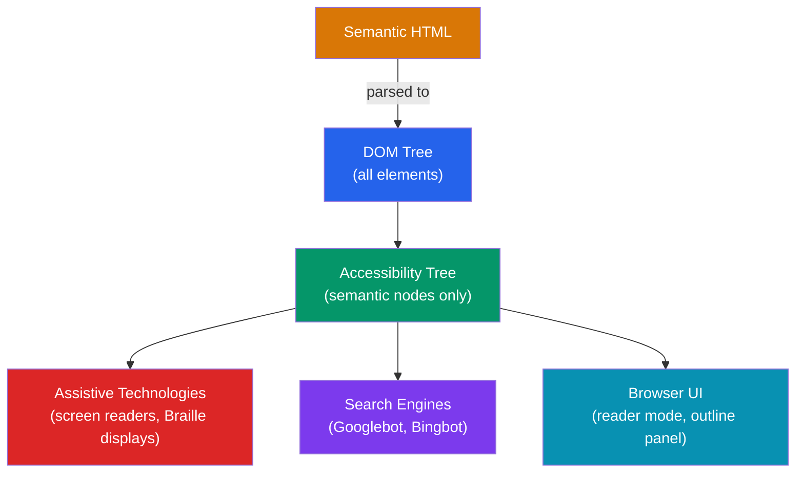

# 🏗️ HTML5 Semantics

> [!abstract] TL;DR
> Semantic HTML uses elements whose names describe their meaning — `<nav>`, `<main>`, `<article>` — rather than generic `<div>` containers. This gives browsers, search engines, and screen readers a meaningful document structure to parse, which simultaneously improves accessibility, SEO, and maintainability. The browser builds an **accessibility tree** from semantic markup that assistive technologies traverse instead of the visual layout.

## Intuition — analogy FIRST

Think of a newspaper versus a blank canvas.

A newspaper has named regions you recognize instantly — **masthead**, **headline**, **body text**, **caption**, **sidebar**, **footer**. A blind person listening to it via audio can skip to the sports section without reading every article. Search engines know the headline is more important than an ad.

A `<div>`-soup page is the blank canvas — every region looks identical. You might paint a "nav bar" but there's no label on the tin. Screen readers must read every element sequentially; search engines can't find the main content.

Semantic HTML is the newspaper. The element name **is** the label.

---

## How It Works



The browser builds two parallel trees from your HTML: the **DOM** (every element) and the **accessibility tree** (a filtered, role-annotated version). Screen readers traverse the accessibility tree. A `<div>` with no role adds a node to the DOM but contributes nothing meaningful to the accessibility tree. A `<nav>` adds a node with implicit role `navigation`.

---

## Key Concepts / Details

### HTML5 Sectioning Elements

| Element | Implicit ARIA Role | Meaning |
|---------|-------------------|---------|
| `<header>` | `banner` (if top-level) | Introductory content, logo, site nav |
| `<nav>` | `navigation` | Primary navigation links |
| `<main>` | `main` | The dominant content of the page (one per page) |
| `<article>` | `article` | Self-contained composition (blog post, tweet) |
| `<section>` | `region` (if named) | Thematic grouping within a page |
| `<aside>` | `complementary` | Tangentially related content (sidebars, pull quotes) |
| `<footer>` | `contentinfo` (if top-level) | Footer for its nearest sectioning ancestor |
| `<h1>`–`<h6>` | `heading` (level 1–6) | Document outline — one `<h1>` per page |
| `<figure>` | `figure` | Self-contained media with optional `<figcaption>` |
| `<time>` | — | Machine-readable date/time via `datetime` attribute |

### Landmark Regions

Landmark roles allow keyboard users and screen-reader users to jump between page regions:

```html
<header>
  <a href="/" aria-label="Go to homepage">
    
  </a>
  <nav aria-label="Primary navigation">
    <ul>
      <li><a href="/products">Products</a></li>
      <li><a href="/about">About</a></li>
    </ul>
  </nav>
</header>

<main id="main-content">
  <article>
    <h1>Getting Started with HTML5 Semantics</h1>
    <p>Published <time datetime="2026-07-26">July 26, 2026</time></p>
    <section aria-labelledby="intro-heading">
      <h2 id="intro-heading">Introduction</h2>
      <p>Semantic HTML is...</p>
    </section>
  </article>
  <aside aria-label="Related articles">
    <h2>You might also like</h2>
  </aside>
</main>

<footer>
  <p>&copy; 2026 Acme Corp</p>
</footer>
```

### ARIA — when semantics fall short

ARIA (Accessible Rich Internet Applications) attributes fill gaps when no native element covers a pattern:

```html
<!-- Native semantics — prefer this -->
<button type="button">Toggle menu</button>

<!-- Custom widget — ARIA fills the gap -->
<div role="tablist" aria-label="Product features">
  <div role="tab" aria-selected="true" aria-controls="panel-1" tabindex="0">Overview</div>
  <div role="tab" aria-selected="false" aria-controls="panel-2" tabindex="-1">Specs</div>
</div>
<div role="tabpanel" id="panel-1" aria-labelledby="tab-1">...</div>
```

**The five rules of ARIA:**
1. Use native HTML before ARIA (`<button>` > `role="button"`)
2. Never change native semantics unless you must
3. All interactive ARIA controls must be keyboard-focusable
4. Don't suppress focusable elements (`aria-hidden="true"` must exclude them from tab order)
5. All interactive elements must have an accessible name

### Image `alt` text patterns

```html
<!-- Informative image — describe the content -->


<!-- Decorative image — empty alt skips it -->


<!-- Functional image (inside a link) — describe the destination -->
<a href="/dashboard">
  
</a>
```

### Document outline and heading hierarchy

```html
<!-- Correct: one h1, then nested -->
<h1>The Page Title</h1>
  <h2>Section One</h2>
    <h3>Subsection</h3>
  <h2>Section Two</h2>

<!-- Wrong: skipping levels breaks screen reader navigation -->
<h1>Title</h1>
<h4>Skipped to h4 — creates confusing outline</h4>
```

---

## Real-World Notes

- **Reader Mode** in browsers (Safari, Firefox) uses sectioning elements to extract `<main>` and `<article>` content, stripping the rest.
- **Google's rich results** (breadcrumbs, FAQs, articles) are built on semantic markup + structured data (Schema.org via `<script type="application/ld+json">`).
- **Skip links** (`<a href="#main-content" class="sr-only">Skip to main content</a>`) rely on `<main id="main-content">` to work — another reason to use the right element.
- Angular and React generate custom elements (`<app-root>`, `<my-component>`). Add `role` attributes or use native HTML elements inside your component templates to preserve semantics.

---

## Common Pitfalls

- **Nesting `<main>` more than once per page.** There must be exactly one `<main>` visible at a time; multiple mains confuse landmark navigation.
- **Using `<section>` as a generic wrapper.** `<section>` should always have a heading; if it doesn't, it's probably a `<div>`.
- **Adding ARIA roles that duplicate native semantics.** `<button role="button">` is redundant; `<div role="button">` still needs `tabindex="0"` and keyboard handlers.
- **Forgetting `alt` on images.** An `` without `alt` is read as the `src` filename by screen readers — usually terrible UX.
- **Empty headings or placeholder text.** Screen readers announce "heading level 2: [empty]" which is confusing.

---

## Related Concepts

- [[_MOC_HTML_CSS|↑ Section MOC]]
- [[CSS_Box_Model]] — Styling the semantic elements with the box model
- [[Responsive_Design]] — Making semantic layouts adapt to any viewport
- [[Flexbox_and_Grid]] — Laying out semantic containers with modern CSS

---

## Review Questions

1. What is the accessibility tree, and how does it differ from the DOM?
2. A designer hands you a `<div class="nav-bar">`. What HTML element should you use instead, and what ARIA role does it carry implicitly?
3. When should you use `alt=""` (empty alt) on an image, and when must you provide descriptive text?
4. You have two navigation menus on a page — primary and footer. How do you differentiate them for screen readers?

---

## Sources

- MDN Web Docs: HTML elements reference — https://developer.mozilla.org/en-US/docs/Web/HTML/Element
- W3C WAI ARIA Authoring Practices — https://www.w3.org/WAI/ARIA/apg/
- WebAIM: Semantic Structure — https://webaim.org/techniques/semanticstructure/
- Google Web Fundamentals: Semantics Built-in — https://web.dev/learn/accessibility/

#web-development #html-css #semantics #accessibility #aria
