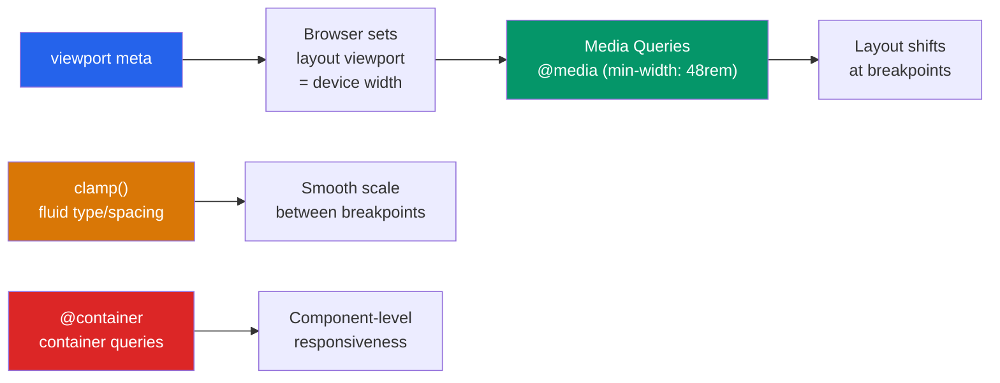

# 📱 Responsive Design

> [!abstract] TL;DR
> Responsive design makes a single codebase adapt to any viewport — from 320px phones to 4K monitors. The non-negotiable foundation is the viewport meta tag. The modern toolkit: mobile-first `min-width` media queries on `rem` breakpoints, fluid type via `clamp()`, container queries for component-level responsiveness, and `srcset`/`sizes` for responsive images. Always reserve image space with `width`/`height` attributes to prevent Cumulative Layout Shift (CLS), a Core Web Vital.

## Intuition — analogy FIRST

Imagine a newspaper that physically rearranges itself when you fold it.

At full broadsheet size: three columns, large photos, full navigation bar. Fold it in half: two columns, photos stay but stack. Fold to quarter: single column, navigation collapses to a menu icon, photos shrink. The **content** is the same — only the **layout** changes.

Responsive design is that folding newspaper. You write content once, and CSS rules rearrange it based on the current "fold" (viewport width). Mobile-first means you start with the smallest fold (fewest layout assumptions) and unfold outward.

---

## How It Works



---

## Key Concepts / Details

### The Viewport Meta Tag — Non-Negotiable

```html
<!-- Always include this in <head> -->
<meta name="viewport" content="width=device-width, initial-scale=1">

<!-- NEVER add user-scalable=no — it's an accessibility violation -->
<!-- user-scalable=no removes zoom, harming low-vision users -->
```

Without this tag, mobile browsers render at ~980px and then scale down — making everything tiny and unresponsive.

### Mobile-First Media Queries

Mobile-first means writing base styles for mobile, then overriding with `min-width` queries for larger viewports. This is the correct approach — it results in less CSS shipped to small screens.

```css
/* Standard rem breakpoints */
/* 36rem = 576px, 48rem = 768px, 64rem = 1024px, 80rem = 1280px */

/* Base styles: mobile (no query needed) */
.container {
  display: grid;
  grid-template-columns: 1fr;
  gap: 1rem;
  padding: 1rem;
}

/* Tablet+ */
@media (min-width: 48rem) {
  .container {
    grid-template-columns: 1fr 1fr;
    padding: 1.5rem;
  }
}

/* Desktop+ */
@media (min-width: 64rem) {
  .container {
    grid-template-columns: 1fr 2fr 1fr;
    padding: 2rem;
  }
}

/* Why rem, not px? */
/* rem breakpoints respect user's browser font-size preference.
   If user sets font-size to 20px, 48rem = 960px — 
   the layout adapts to their larger text size. */
```

### Why NOT `max-width` (Desktop-First)

```css
/* Desktop-first — AVOID for new projects */
/* Ships all desktop CSS to mobile, then overrides it */
.sidebar { display: block; }
@media (max-width: 768px) {
  .sidebar { display: none; }
}

/* Mobile-first — PREFER */
/* Ships minimal CSS to mobile */
.sidebar { display: none; }
@media (min-width: 48rem) {
  .sidebar { display: block; }
}
```

### Fluid Typography with `clamp()`

`clamp(MIN, PREFERRED, MAX)` — clamps a value between a minimum and maximum, with a fluid preferred value in between:

```css
/* Fluid heading: 1.75rem at narrow, up to 3rem at wide viewports */
h1 {
  font-size: clamp(1.75rem, 1rem + 5vw, 3rem);
}

/* Fluid body text */
body {
  font-size: clamp(1rem, 0.9rem + 0.5vw, 1.25rem);
}

/* Fluid spacing */
.section {
  padding: clamp(1rem, 5vw, 4rem);
}

/* Breaking it down:
   clamp(1.75rem, 1rem + 5vw, 3rem)
   - At 320px: 1rem + 5vw = 16 + 16 = 32px = 2rem → clamped to 1.75rem
   - At 768px: 1rem + 5vw = 16 + 38.4 = 54.4px = 3.4rem → clamped to 3rem
   - Between: smooth linear scale
*/
```

### Container Queries — Component-Level Responsiveness

Container queries respond to the **parent container's size**, not the viewport — enabling truly reusable components:

```css
/* 1. Define a containment context on the parent */
.card-wrapper {
  container-type: inline-size;
  container-name: card;   /* optional name */
}

/* 2. Query the container (not viewport) inside the component */
@container card (min-width: 400px) {
  .card {
    display: flex;
    flex-direction: row;
  }
  .card__image {
    width: 200px;
    flex-shrink: 0;
  }
}

/* Container query units: cqi/cqw (like vw/vh but for container) */
.card__title {
  font-size: clamp(1rem, 3cqi, 1.5rem);
}
```

| Feature | Media Queries | Container Queries |
|---------|--------------|-------------------|
| Responds to | Viewport width | Parent container width |
| Use for | Page-level layout | Reusable components |
| Support | Universal | 93%+ (2026) |

### Responsive Images

```html
<!-- srcset: provide multiple image sizes, browser picks best -->


<!-- art direction: different crops at different sizes -->
<picture>
  <source media="(max-width: 600px)" srcset="hero-mobile.jpg">
  <source media="(max-width: 1024px)" srcset="hero-tablet.jpg">
  
</picture>
```

**Always set `width` and `height` on images.** This lets the browser reserve the right amount of space before the image loads, preventing Cumulative Layout Shift (CLS).

### Preventing CLS — Cumulative Layout Shift

```css
/* Reserve space for images via aspect-ratio */
img {
  max-width: 100%;
  height: auto;           /* maintains aspect ratio */
  aspect-ratio: 16 / 9;  /* reserves space before load */
}

/* For dynamic content (ads, embeds) */
.ad-slot {
  min-height: 90px;       /* reserve space */
  aspect-ratio: 728 / 90;
}
```

### Common Breakpoint System

```css
:root {
  /* Tailwind-style breakpoints as custom properties */
  --breakpoint-sm:  36rem;  /* 576px  — large phones */
  --breakpoint-md:  48rem;  /* 768px  — tablets */
  --breakpoint-lg:  64rem;  /* 1024px — laptops */
  --breakpoint-xl:  80rem;  /* 1280px — desktops */
  --breakpoint-2xl: 96rem;  /* 1536px — large screens */
}
```

---

## Real-World Notes

- **`prefers-reduced-motion`** — always respect it for animations: `@media (prefers-reduced-motion: reduce) { * { animation-duration: 0.01ms !important; } }`
- **The no-media-query responsive grid** using `repeat(auto-fit, minmax(200px, 1fr))` (from [[Flexbox_and_Grid]]) handles many grid cases without any breakpoints.
- **Container queries** are now the right choice for design system components — a `<Card>` should respond to its slot in the layout, not the viewport.
- **`font-size` on `html`**: Don't set this to a fixed pixel value — it overrides user preferences. Use `font-size: 100%` (or omit it) so `1rem = user's preferred font size`.

---

## Common Pitfalls

- **Missing viewport meta tag** — the most common mobile rendering failure. Without it, the layout works on desktop and is tiny on mobile.
- **`user-scalable=no` in viewport meta** — accessibility violation; WCAG 2.1 requires zoom support. Never use it.
- **Hardcoding pixel breakpoints instead of rem** — `@media (max-width: 768px)` ignores user font-size settings; `@media (max-width: 48rem)` adapts to them.
- **No `width`/`height` on images** — causes CLS, harming Core Web Vitals scores.
- **`overflow: hidden` on body to prevent horizontal scroll** — this hides the symptom (content wider than viewport) instead of fixing the actual overflow cause.

---

## Related Concepts

- [[_MOC_HTML_CSS|↑ Section MOC]]
- [[Flexbox_and_Grid]] — `auto-fit`/`minmax` for responsive layouts without media queries
- [[CSS_Variables_Custom_Properties]] — Custom properties for responsive spacing and typography scales
- [[CSS_Box_Model]] — `box-sizing: border-box` prevents overflow at any viewport size

---

## Review Questions

1. What does the viewport meta tag do, and what happens if you omit it on a mobile device?
2. Explain mobile-first vs desktop-first media queries. Which do you prefer for new projects, and why?
3. How does `clamp(1rem, 0.5rem + 3vw, 2rem)` behave at 320px, 768px, and 1440px viewport widths?
4. What is a container query, and when would you use it instead of a media query?
5. Why should you always set `width` and `height` attributes on `` elements?

---

## Sources

- MDN Web Docs: Responsive design — https://developer.mozilla.org/en-US/docs/Learn/CSS/CSS_layout/Responsive_Design
- web.dev: Responsive design patterns — https://web.dev/patterns/layout/
- MDN Web Docs: Container queries — https://developer.mozilla.org/en-US/docs/Web/CSS/CSS_containment/Container_queries
- web.dev: Optimize CLS — https://web.dev/articles/cls

#web-development #html-css #responsive #media-queries #container-queries
