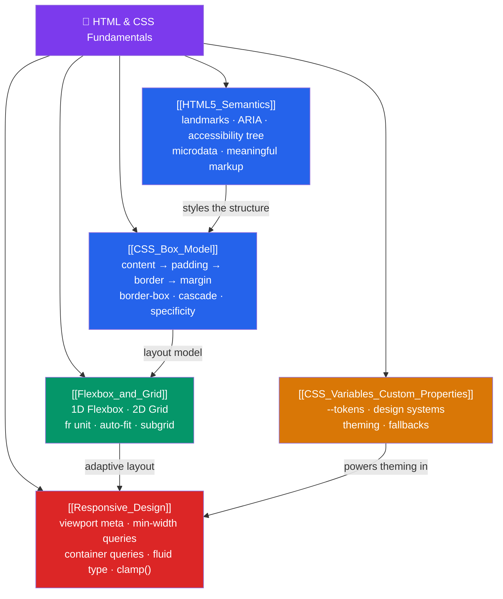

# 🎨 HTML & CSS Fundamentals — Map of Content

> [!abstract] What This Section Covers
> The declarative foundation under every rendered pixel. HTML supplies the semantic document structure that browsers, search engines, and assistive tech all parse, while CSS controls layout, motion, and adaptability across every viewport. This section covers: semantic HTML5 elements and the accessibility tree, the CSS box model and cascade, one-dimensional Flexbox and two-dimensional Grid, CSS custom properties and design tokens, and the full responsive design toolkit from viewport meta to container queries.

## Concept Map

## Learning Path

1. [[HTML5_Semantics]] — Landmark elements, ARIA roles, the accessibility tree, and why semantic markup beats `
` soup.
2. [[CSS_Box_Model]] — The four box layers, `border-box`, vertical margin collapse, the cascade, and specificity as an (a,b,c) tuple.
3. [[Flexbox_and_Grid]] — One-dimensional Flexbox and two-dimensional Grid, the `fr` unit, `auto-fit` vs `auto-fill`, and subgrid.
4. [[CSS_Variables_Custom_Properties]] — Custom properties, design tokens, dynamic theming, and the `@property` rule for typed variables.
5. [[Responsive_Design]] — Viewport meta, mobile-first `min-width` queries, fluid type with `clamp()`, container queries, and responsive images.

## All Notes at a Glance

| Note | Difficulty | What You'll Learn |
|------|------------|-------------------|
| [[HTML5_Semantics]] | Beginner | Sectioning elements, ARIA, accessibility tree, microdata, landmark regions |
| [[CSS_Box_Model]] | Beginner | Four box layers, border-box reset, margin collapse, cascade, specificity (a,b,c) |
| [[Flexbox_and_Grid]] | Intermediate | Flex container/item, grow/shrink/basis, Grid tracks/areas, fr unit, auto-fit |
| [[CSS_Variables_Custom_Properties]] | Intermediate | Custom property syntax, design tokens, theming, @property, JavaScript interop |
| [[Responsive_Design]] | Intermediate | Viewport meta, min-width queries, clamp(), container queries, srcset, CLS |

## Key Questions This Section Answers

- Why use `<nav>`, `<main>`, and `<article>` instead of `
` — and what does it change in the accessibility tree?
- What is the universal `box-sizing: border-box` reset and why does every project need it?
- When do you reach for Flexbox vs Grid?
- How does CSS specificity work and why should you keep it low and flat?
- How do you write a responsive layout without a single media query using `auto-fit` + `minmax`?
- What is a CSS custom property, and how do you build a dark-mode theme with one?
- What is the `clamp()` trick for fluid typography, and how does it differ from media queries?

## Related Sections

- [[_MOC_WebDev_Master|↑ Web Dev Master MOC]]
- [[_MOC_JavaScript_Core|→ JavaScript Core]]
- [[_MOC_TypeScript|→ TypeScript]]

#MOC #WebDevelopment #HTML #CSS
