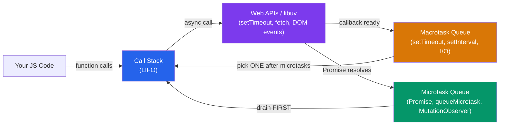

# 🔄 Async JS and Promises

> [!abstract] TL;DR
> JavaScript is single-threaded with a **run-to-completion** model. Async work happens through the event loop: the engine runs a **call stack** to empty, then processes **microtasks** (Promise reactions, `queueMicrotask`) exhaustively before picking the next **macrotask** (setTimeout, I/O, UI events). Promises represent eventual values with a three-state lifecycle. `async/await` is syntactic sugar over Promises. Anything >50ms on the main thread is a "long task" that freezes UI — slice work, yield, or offload to a Web Worker.

## Intuition — analogy FIRST

Imagine a single chef (the main thread) in a restaurant kitchen. The chef can only do one thing at a time — they don't split into multiple people. When an order comes in requiring 30 minutes of oven time, the chef doesn't stand and watch the oven. They set a timer (Web API), work on other orders, and when the timer fires, they put a note in their "finish this" queue.

The **call stack** is the chef's current task. **Web APIs** are the restaurant's equipment running in the background (oven, dishwasher). **Microtasks** are urgent notes the chef handles immediately after finishing their current task (like plating a dish as soon as it comes out). **Macrotasks** are the next orders they pick up after clearing all urgent notes.

---

## How It Works



**Critical rule:** After each macrotask completes, the engine drains the **entire** microtask queue before picking the next macrotask (or rendering).

---

## Key Concepts / Details

### Execution Order Example

```javascript
console.log('1 - synchronous');

setTimeout(() => console.log('2 - setTimeout'), 0);

Promise.resolve()
  .then(() => console.log('3 - Promise microtask'));

queueMicrotask(() => console.log('4 - queueMicrotask'));

console.log('5 - synchronous');

// Output order:
// 1 - synchronous
// 5 - synchronous
// 3 - Promise microtask    ← microtask queue drains before any macrotask
// 4 - queueMicrotask       ← still microtasks
// 2 - setTimeout            ← macrotask — runs last
```

### Promises — Three-State Lifecycle

```javascript
// States: pending → fulfilled | rejected
const p = new Promise((resolve, reject) => {
  // Async work here
  fetch('/api/user')
    .then(res => resolve(res.json()))
    .catch(err => reject(err));
});

// Consuming
p
  .then(user => console.log(user))     // fulfillment handler
  .catch(err => console.error(err))    // rejection handler
  .finally(() => setLoading(false));   // always runs

// Promise static methods
Promise.resolve(42);    // already fulfilled
Promise.reject('oops'); // already rejected

// Combinators
Promise.all([p1, p2, p3])        // wait for ALL; rejects if ANY rejects
  .then(([r1, r2, r3]) => ...);

Promise.allSettled([p1, p2, p3]) // wait for ALL; never rejects
  .then(results => results.forEach(r => {
    if (r.status === 'fulfilled') use(r.value);
    else log(r.reason);
  }));

Promise.race([p1, p2])    // first to settle (fulfill OR reject) wins
Promise.any([p1, p2, p3]) // first to FULFILL wins; rejects only if ALL reject
```

### `async`/`await` — Syntactic Sugar

`async` functions always return a Promise. `await` suspends the function until the Promise settles:

```javascript
// async/await equivalent of .then() chaining
async function loadUser(id) {
  try {
    const response = await fetch(`/api/users/${id}`);
    if (!response.ok) throw new Error(`HTTP ${response.status}`);
    const user = await response.json();
    return user;
  } catch (err) {
    console.error('Failed to load user:', err);
    throw err; // re-throw so caller can handle
  }
}

// Calling an async function always returns a Promise
loadUser(42).then(user => render(user));

// Parallel async operations — don't await sequentially if independent
// SLOW: awaits sequentially (total time = A + B)
const userA = await fetchUser(1);
const userB = await fetchUser(2);

// FAST: start both, then await both (total time = max(A, B))
const [userA, userB] = await Promise.all([fetchUser(1), fetchUser(2)]);
```

### Async Iteration

```javascript
// for await...of with async iterables
async function processStream(stream) {
  for await (const chunk of stream) {
    process(chunk);
  }
}

// Top-level await in ES modules (not in scripts)
// file: main.js (type="module")
const data = await fetchConfig(); // top-level await
startApp(data);
```

### Long Tasks and Main Thread Performance

The browser considers any task >50ms a "long task" that blocks input/animation:

```javascript
// BAD: blocking the main thread with a heavy loop
function processLargeArray(arr) {
  return arr.map(item => heavyCompute(item)); // blocks for 500ms
}

// GOOD: yield between chunks with scheduler.yield (Chrome) or setTimeout
async function processLargeArray(arr) {
  const results = [];
  for (let i = 0; i < arr.length; i++) {
    results.push(heavyCompute(arr[i]));
    if (i % 100 === 0) {
      await new Promise(resolve => setTimeout(resolve, 0)); // yield to event loop
    }
  }
  return results;
}

// BEST: offload to Web Worker (runs in parallel thread)
const worker = new Worker('worker.js');
worker.postMessage({ items: arr });
worker.onmessage = e => render(e.data.results);
```

### Node.js libuv Event Loop Phases

Node.js has a different event loop model with explicit phases:

```
timers       → executes setTimeout/setInterval callbacks
pending      → I/O callbacks from previous loop iteration
idle/prepare → internal use
poll         → retrieve new I/O events, execute callbacks
check        → setImmediate callbacks
close        → close event callbacks (e.g., socket.on('close'))
```

```javascript
// Priority hierarchy in Node.js:
// process.nextTick > Promise microtasks > setImmediate > setTimeout(0)

process.nextTick(() => console.log('nextTick'));        // runs before ANY I/O
Promise.resolve().then(() => console.log('Promise'));   // microtask queue
setImmediate(() => console.log('setImmediate'));        // check phase
setTimeout(() => console.log('setTimeout'), 0);        // timers phase
```

### Async Error Handling Patterns

```javascript
// Always handle Promise rejections
fetchData()
  .then(data => process(data))
  .catch(err => handleError(err));

// Unhandled rejections crash Node.js 15+ and warn in browsers
process.on('unhandledRejection', (reason, promise) => {
  console.error('Unhandled Rejection at:', promise, 'reason:', reason);
});

// async/await with error handling wrapper
const wrap = fn => (...args) => fn(...args).catch(handleError);
const safeLoad = wrap(loadUser);

// Multiple independent async operations with error isolation
const [userResult, postsResult] = await Promise.allSettled([
  fetchUser(id),
  fetchPosts(id)
]);
const user = userResult.status === 'fulfilled' ? userResult.value : null;
```

---

## Real-World Notes

- **`Promise.allSettled` is underused** — in most real apps you want to show partial results even if some requests fail. `allSettled` handles this; `all` rejects the entire batch on any failure.
- **Async/await makes sequential dependencies clear** — use it when step B depends on step A. Use `Promise.all` for independent parallel work.
- **Never `await` in a loop without intent** — `for (const item of items) { await process(item); }` is sequential. If order doesn't matter, collect Promises and await them all.
- **`setTimeout(fn, 0)` is a macrotask, not instant** — it will run after all microtasks, after the current task, after a possible render. It's not a yield; it's a reschedule.

---

## Common Pitfalls

- **Forgetting to `await`** — `async function load() { return fetchData(); }` — if you forget `await`, the function returns a Promise of a Promise.
- **`await` inside `forEach`** doesn't work as expected — `forEach` is not async-aware. Use `for...of` or `Promise.all` with `.map`.
- **Catching errors in the wrong place** — an async function that throws before the first `await` still returns a rejected Promise; you must `.catch` or try/catch at the call site.
- **Blocking the main thread with synchronous compute** — even with `async/await`, CPU-heavy synchronous work still blocks. Offload to a Worker.
- **Not cleaning up pending Promises** — in React, a component that unmounts while a fetch is pending may try to `setState` on an unmounted component. Use AbortController.

---

## Related Concepts

- [[_MOC_JavaScript_Core|↑ Section MOC]]
- [[JS_Fundamentals]] — Closures and scoping apply inside async functions
- [[DOM_Manipulation]] — DOM events are macrotasks in the event loop
- [[JS_Modules_Bundling]] — Dynamic `import()` returns a Promise

---

## Review Questions

1. In what order does this code execute: a `setTimeout(fn, 0)`, a `Promise.resolve().then(fn)`, and a `console.log`?
2. Explain the difference between `Promise.all`, `Promise.allSettled`, `Promise.race`, and `Promise.any`. When do you use each?
3. Why does `await` inside `forEach` not work for sequential async operations? What's the fix?
4. What is a "long task" in the browser? How do you break one up?
5. How does `async/await` desugar to Promise chains? Write both forms for a two-step fetch.

---

## Sources

- MDN Web Docs: Event loop — https://developer.mozilla.org/en-US/docs/Web/JavaScript/Event_loop
- MDN Web Docs: Promise — https://developer.mozilla.org/en-US/docs/Web/JavaScript/Reference/Global_Objects/Promise
- Jake Archibald: Tasks, microtasks, queues and schedules — https://jakearchibald.com/2015/tasks-microtasks-queues-and-schedules/
- Node.js docs: The Node.js Event Loop — https://nodejs.org/en/docs/guides/event-loop-timers-and-nexttick

#web-development #javascript-core #promises #async-await #event-loop
