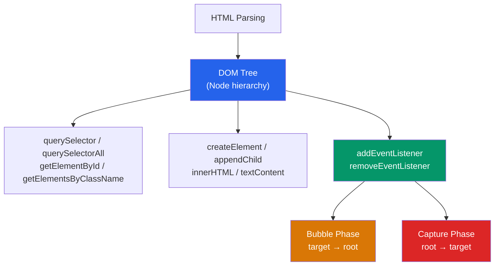

# 🌳 DOM Manipulation

> [!abstract] TL;DR
> The DOM (Document Object Model) is the browser's in-memory tree representation of an HTML page. JavaScript reads and mutates it via APIs like `querySelector`, `addEventListener`, and `createElement`. Event propagation has two phases: **capture** (top-down) and **bubble** (bottom-up). **Event delegation** — attaching one listener to a parent instead of many to children — is more performant and handles dynamically added elements. Batch DOM reads and writes to avoid layout thrashing; use `requestAnimationFrame` for visual updates.

## Intuition — analogy FIRST

The DOM is like a corporate org chart. Every HTML element is an employee box connected to its parent, siblings, and children. The browser builds this chart when it parses your HTML.

JavaScript is the HR department — it can query the chart ("find all employees in the engineering department"), modify it ("promote Alice"), add new boxes ("hire a contractor"), and listen for events ("notify me when anyone in Sales sends an email").

Event bubbling is like a complaint traveling up the hierarchy: the intern complains to their manager, who escalates to the director, who escalates to the CEO. Any manager in the chain can intercept the complaint (`stopPropagation`).

---

## How It Works



---

## Key Concepts / Details

### Querying the DOM

```javascript
// Preferred: CSS selector-based (returns first match or null)
const nav = document.querySelector('nav');
const activeItem = document.querySelector('.nav-item.active');
const emailInput = document.querySelector('#signup input[type="email"]');

// All matches (returns live NodeList — updates as DOM changes)
const allItems = document.querySelectorAll('.card');

// Iterate NodeList
allItems.forEach(item => item.classList.add('loaded'));

// Legacy APIs (still useful)
const byId = document.getElementById('main-content');     // fastest lookup
const byClass = document.getElementsByClassName('card');   // live HTMLCollection
const byTag = document.getElementsByTagName('article');    // live HTMLCollection
```

### Traversal

```javascript
const el = document.querySelector('.card');

// Parent
el.parentElement;
el.closest('.container'); // nearest ancestor matching selector (includes self)

// Children
el.children;         // HTMLCollection of element children (no text nodes)
el.childNodes;       // NodeList of all children including text/comment nodes
el.firstElementChild;
el.lastElementChild;

// Siblings
el.nextElementSibling;
el.previousElementSibling;
```

### Modifying the DOM

```javascript
// Create and append
const p = document.createElement('p');
p.textContent = 'Hello, DOM!';           // safe — no XSS risk
p.className = 'intro';
p.setAttribute('data-id', '42');

document.querySelector('.container').appendChild(p);

// Insert relative to another element
const ref = document.querySelector('.card');
ref.before(p);   // insert before ref
ref.after(p);    // insert after ref
ref.prepend(p);  // first child of ref
ref.append(p);   // last child of ref

// innerHTML — convenient but XSS risk if user data included
el.innerHTML = `<strong>Bold</strong>`;

// NEVER do this with user input:
// el.innerHTML = userInput; // XSS vulnerability

// Use textContent for plain text (automatically escapes)
el.textContent = userInput; // safe
```

### Classes and Styles

```javascript
el.classList.add('active', 'visible');
el.classList.remove('loading');
el.classList.toggle('open');
el.classList.contains('active'); // true/false
el.classList.replace('old', 'new');

// Inline styles — avoid, prefer adding/removing classes
el.style.color = 'red';
el.style.setProperty('--custom-prop', '1rem');

// Read computed style (after CSS applied)
const computed = getComputedStyle(el);
computed.fontSize; // "16px"
computed.getPropertyValue('--custom-prop'); // "1rem"
```

### `data-*` Attributes

```javascript
// HTML: <button data-product-id="42" data-action="add-to-cart">
const btn = document.querySelector('button');

// dataset converts kebab-case to camelCase
btn.dataset.productId; // "42" — always a string
btn.dataset.action;    // "add-to-cart"

// Set
btn.dataset.quantity = 3; // converts to string
btn.setAttribute('data-quantity', 3);
```

### Event Handling

```javascript
const btn = document.querySelector('button');

// Adding a listener
function handleClick(event) {
  console.log('Clicked!', event.target);
}
btn.addEventListener('click', handleClick);

// Removing — must pass same function reference
btn.removeEventListener('click', handleClick);

// Options
btn.addEventListener('click', handleClick, {
  once: true,      // auto-removes after one call
  passive: true,   // can't call preventDefault() — scroll optimization
  capture: true    // listen on capture phase instead of bubble
});

// The Event object
function onClick(e) {
  e.preventDefault();        // stop default behavior (link navigation, form submit)
  e.stopPropagation();       // stop bubble/capture to parent
  e.stopImmediatePropagation(); // stop other listeners on same element too
  e.target;    // element that fired the event
  e.currentTarget; // element the listener is attached to
  e.type;      // "click"
  e.key;       // keyboard key (for keydown/keyup)
  e.clientX;   // mouse coordinates
}
```

### Event Propagation: Bubble and Capture

```
Capture (top-down):  document → html → body → section → button
                                                         ↑ TARGET
Bubble (bottom-up):  document ← html ← body ← section ← button
```

```javascript
// Listen on capture phase
document.addEventListener('click', fn, { capture: true }); // fires first

// Listen on bubble phase (default)
document.addEventListener('click', fn); // fires after capture
```

### Event Delegation — One Listener for Many Elements

Instead of adding listeners to every list item, add one to the parent:

```javascript
const list = document.querySelector('#product-list');

// Works for current AND future items (dynamically added)
list.addEventListener('click', (e) => {
  const item = e.target.closest('.product-item');
  if (!item) return; // click was not on a product item

  const id = item.dataset.productId;
  addToCart(id);
});
```

### Performance — Avoid Layout Thrashing

Layout thrashing occurs when you interleave DOM reads (which trigger reflow) and DOM writes:

```javascript
// BAD — read → write → read → write causes multiple reflows
elements.forEach(el => {
  const height = el.offsetHeight; // READ — forces reflow
  el.style.height = height + 10 + 'px'; // WRITE
});

// GOOD — batch reads, then batch writes
const heights = elements.map(el => el.offsetHeight); // all reads
elements.forEach((el, i) => {
  el.style.height = heights[i] + 10 + 'px';          // all writes
});

// For animations — use requestAnimationFrame
function animate() {
  el.style.transform = `translateX(${position}px)`;
  position++;
  requestAnimationFrame(animate);
}
requestAnimationFrame(animate);
```

### `MutationObserver` — React to DOM Changes

```javascript
const observer = new MutationObserver((mutations) => {
  mutations.forEach(mutation => {
    if (mutation.type === 'childList') {
      mutation.addedNodes.forEach(node => {
        console.log('Added:', node);
      });
    }
    if (mutation.type === 'attributes') {
      console.log('Attribute changed:', mutation.attributeName);
    }
  });
});

observer.observe(document.querySelector('#container'), {
  childList: true,   // watch for add/remove children
  subtree: true,     // watch descendants too
  attributes: true,  // watch attribute changes
  attributeFilter: ['class', 'data-state'] // only these attributes
});

observer.disconnect(); // stop observing
```

---

## Real-World Notes

- **React, Angular, and Vue abstract away direct DOM manipulation.** In component-based frameworks, you manipulate state and let the framework sync the DOM. Direct DOM manipulation is for vanilla JS, custom elements, or imperative animations.
- **`innerHTML` vs `textContent`** — use `textContent` for plain text (automatically HTML-escapes), use `innerHTML` only for trusted HTML content.
- **`closest()`** is essential for event delegation — it walks up from the event target to find the nearest ancestor matching your selector.
- **`passive: true`** for scroll listeners tells the browser it can begin scrolling immediately without waiting to see if `preventDefault()` is called — critical for 60fps scrolling.

---

## Common Pitfalls

- **`innerHTML` with user input** — the most common XSS vector. Never inject user-controlled strings via `innerHTML`.
- **Attaching event listeners in a loop** — creates N listeners; use event delegation on the parent instead.
- **Not removing event listeners** — causes memory leaks, especially in single-page apps where components mount and unmount.
- **Reading layout properties (offsetWidth, getBoundingClientRect) in a loop** — forces synchronous reflow. Batch reads before writes.
- **`nodeList.forEach` may not exist in older browsers** — use `Array.from(nodeList).forEach()` for safety.

---

## Related Concepts

- [[_MOC_JavaScript_Core|↑ Section MOC]]
- [[JS_Fundamentals]] — Closures and `this` are central to event handlers
- [[Async_JS_Promises]] — DOM events are macrotasks in the event loop
- [[ES6_Modern_Features]] — Arrow functions and destructuring clean up event handler code

---

## Review Questions

1. What is the difference between `e.target` and `e.currentTarget`?
2. Explain event delegation. Why is it better than attaching listeners to each child?
3. What is layout thrashing and how do you avoid it?
4. When would you use `MutationObserver`? Give a real-world use case.
5. Why is `element.innerHTML = userInput` dangerous, and what should you use instead?

---

## Sources

- MDN Web Docs: Introduction to the DOM — https://developer.mozilla.org/en-US/docs/Web/API/Document_Object_Model/Introduction
- MDN Web Docs: EventTarget.addEventListener — https://developer.mozilla.org/en-US/docs/Web/API/EventTarget/addEventListener
- web.dev: Avoid large, complex layouts — https://web.dev/articles/avoid-large-complex-layouts-and-layout-thrashing

#web-development #javascript-core #dom #events #performance
