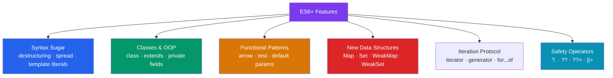

# 🚀 ES6 Modern Features

> [!abstract] TL;DR
> ES6 (ES2015) and its successors through ES2024 transformed JavaScript from a scripting language into a full application platform. Key features: destructuring, spread/rest operators, template literals, arrow functions, `class` syntax, `Map`/`Set`, iterators/generators, optional chaining (`?.`), nullish coalescing (`??`), and `Symbol`. Each feature solves a specific verbosity or expressiveness problem — knowing when to reach for each is the mark of fluent modern JS.

## Intuition — analogy FIRST

ES6 is like going from a hand-powered drill to a power drill with attachments. The fundamental job (making holes) didn't change — JavaScript was always Turing-complete. But the **ergonomics** transformed: operations that took 10 lines now take 1, patterns that were error-prone are now safe by default, and APIs that needed workarounds now have first-class syntax.

Each feature is a focused ergonomic improvement. Destructuring eliminates property access verbosity. Arrow functions eliminate `this` binding surprises in callbacks. `class` syntax eliminates prototype wiring ceremony. Optional chaining eliminates null-check boilerplate.

---

## How It Works



---

## Key Concepts / Details

### Destructuring

```javascript
// Array destructuring
const [first, second, ...rest] = [1, 2, 3, 4, 5];
// first=1, second=2, rest=[3,4,5]

// Skip elements
const [,, third] = [1, 2, 3]; // third=3

// Default values
const [a = 0, b = 0] = [10]; // a=10, b=0

// Object destructuring
const { name, age, address: { city } } = user;

// Renaming
const { name: userName, age: userAge } = user;

// Default + rename
const { theme: colorTheme = 'light' } = preferences;

// Function parameter destructuring
function render({ title, body, author = 'Anonymous' }) {
  return `<h1>${title}</h1><p>${body}</p><em>${author}</em>`;
}

// Swap variables
let x = 1, y = 2;
[x, y] = [y, x];
```

### Spread and Rest

```javascript
// Spread: expand iterable into individual elements
const arr1 = [1, 2, 3];
const arr2 = [...arr1, 4, 5];         // [1,2,3,4,5]
const arrCopy = [...arr1];            // shallow copy

// Object spread (ES2018)
const obj1 = { a: 1, b: 2 };
const obj2 = { ...obj1, c: 3 };      // { a:1, b:2, c:3 }
const merged = { ...defaults, ...overrides }; // later keys win

// Rest: collect remaining into array
function sum(first, ...others) {
  return others.reduce((acc, n) => acc + n, first);
}
sum(1, 2, 3, 4); // 10

// Rest in destructuring
const { id, ...rest } = user; // omit id, keep rest
```

### Template Literals

```javascript
// Multi-line strings and interpolation
const greeting = `Hello, ${user.name}!
You have ${messages.length} new messages.`;

// Tagged template literals — custom string processing
function highlight(strings, ...values) {
  return strings.reduce((result, str, i) => {
    return result + str + (values[i] !== undefined
      ? `<mark>${values[i]}</mark>`
      : '');
  }, '');
}

const html = highlight`Name: ${user.name}, Age: ${user.age}`;
// "Name: <mark>Alice</mark>, Age: <mark>30</mark>"
```

### Arrow Functions

```javascript
// No own `this` — inherits from enclosing scope
const nums = [1, 2, 3];
const doubled = nums.map(n => n * 2);     // [2, 4, 6]
const evens = nums.filter(n => n % 2 === 0);

// Multi-line
const process = (item) => {
  const result = transform(item);
  return validate(result);
};

// Returning an object literal — wrap in parens
const toObj = key => ({ [key]: true });

// Arrow functions should NOT be used for:
// - Object methods (no own this)
// - Constructors (can't use new)
// - Dynamic this contexts (event handlers that use this)
```

### Default Parameters

```javascript
function createUser(name, role = 'user', permissions = []) {
  return { name, role, permissions };
}

// Default can reference earlier parameters
function multiply(a, b = a) {
  return a * b;
}
multiply(5); // 25

// Default can be a function call
function log(msg, timestamp = Date.now()) {
  console.log(`[${timestamp}] ${msg}`);
}
```

### `Map` and `Set`

```javascript
// Map — keys of any type (unlike Object which coerces keys to strings)
const map = new Map();
map.set('string-key', 1);
map.set({ id: 1 }, 'object key');
map.set(42, 'number key');

map.get('string-key'); // 1
map.has('string-key'); // true
map.size;              // 3
map.delete('string-key');

// Iterate
for (const [key, value] of map) { ... }
map.forEach((value, key) => ...);

// Set — unique values of any type
const set = new Set([1, 2, 2, 3, 3]); // {1, 2, 3}
set.add(4);
set.has(2);   // true
set.size;     // 4

// Deduplication pattern
const unique = [...new Set(array)];

// WeakMap / WeakSet — weak references, keys must be objects, non-iterable
// Use for: associating private data with objects without preventing GC
const _private = new WeakMap();
class Foo {
  constructor() { _private.set(this, { secret: 42 }); }
  getSecret() { return _private.get(this).secret; }
}
```

### Iterators and Generators

```javascript
// Custom iterator — must have a .next() method returning { value, done }
function range(start, end) {
  return {
    [Symbol.iterator]() {
      let current = start;
      return {
        next() {
          if (current <= end) return { value: current++, done: false };
          return { value: undefined, done: true };
        }
      };
    }
  };
}

for (const n of range(1, 5)) console.log(n); // 1 2 3 4 5
const arr = [...range(1, 5)]; // [1, 2, 3, 4, 5]

// Generator function — pauses with yield
function* fibonacci() {
  let [a, b] = [0, 1];
  while (true) {
    yield a;
    [a, b] = [b, a + b];
  }
}

const fib = fibonacci();
fib.next().value; // 0
fib.next().value; // 1
fib.next().value; // 1
```

### Optional Chaining and Nullish Coalescing

```javascript
// ?. — safely access nested properties (returns undefined if any link is null/undefined)
const city = user?.address?.city;        // undefined if any is null/undefined
const firstTag = post?.tags?.[0];        // array element
const result = obj?.method?.();         // method call

// ?? — nullish coalescing (only null/undefined, NOT 0 or "")
const port = config.port ?? 3000;       // 3000 if port is null/undefined
const name = input ?? 'Anonymous';

// Compare to || which triggers on ANY falsy value
const port2 = config.port || 3000;      // 3000 if port is 0 — probably wrong!

// Assignment operators
config.port ??= 3000;  // assign only if null/undefined
arr ||= [];             // assign if falsy
count &&= count + 1;   // assign only if truthy
```

### `Symbol`

```javascript
// Unique, non-string property keys — never collide
const id = Symbol('id');
const obj = { [id]: 42 };
obj[id]; // 42 — not accessible via string key

// Well-known Symbols customize built-in behavior
class Range {
  constructor(start, end) { this.start = start; this.end = end; }

  [Symbol.iterator]() { // makes Range iterable
    let current = this.start;
    const end = this.end;
    return { next() {
      if (current <= end) return { value: current++, done: false };
      return { done: true };
    }};
  }

  [Symbol.toPrimitive](hint) { // controls type coercion
    if (hint === 'number') return this.end - this.start;
    return `Range(${this.start}, ${this.end})`;
  }
}
```

---

## Real-World Notes

- **Destructuring in function parameters** is idiomatic React — `function Button({ onClick, children, variant = 'primary' }) {...}`.
- **Optional chaining (`?.`)** eliminated an entire class of "Cannot read property of undefined" runtime errors. Use it freely for deeply nested API responses.
- **`Map` over `Object`** when keys are non-strings or iteration order matters. `Object` is fine for string-keyed records.
- **Generators** are used behind the scenes in `async/await` (before native async syntax) and in Redux-Saga for async workflows.

---

## Common Pitfalls

- **Object destructuring with default for a nested key** — `const { config: { timeout = 5000 } = {} } = opts;` — the `= {}` default prevents a crash when `config` is missing.
- **Spread creates shallow copies** — `const copy = { ...obj }` — nested objects are still shared references.
- **`??` vs `||`** — `||` triggers on `0`, `""`, `false`; `??` only triggers on `null`/`undefined`. Port `0` is valid — use `??`.
- **Arrow functions in class field syntax** — each instance gets its own copy; prototype methods are shared. Use prototype methods unless you need bound `this`.
- **Generator iteration is lazy** — calling a generator function doesn't execute any code; you must call `.next()` to advance.

---

## Related Concepts

- [[_MOC_JavaScript_Core|↑ Section MOC]]
- [[JS_Fundamentals]] — These features build on top of closures, `this`, and prototypes
- [[Async_JS_Promises]] — `async/await` and `for await...of` extend the iterator/generator model
- [[JS_Modules_Bundling]] — ESM modules (static imports) are part of the ES6 specification

---

## Review Questions

1. What is the difference between `??` and `||`? Give an example where `||` produces a wrong result that `??` fixes.
2. What does `const { name: username = 'guest' } = {}` evaluate to?
3. Write a generator function that yields Fibonacci numbers indefinitely.
4. When should you use `Map` instead of a plain object? Give two reasons.
5. What does `?.` (optional chaining) return when any link in the chain is `null`?

---

## Sources

- MDN Web Docs: JavaScript reference — https://developer.mozilla.org/en-US/docs/Web/JavaScript/Reference
- TC39 proposals — https://github.com/tc39/proposals
- Exploring JS: ES2015 — https://exploringjs.com/es6/

#web-development #javascript-core #es6 #modern-js #destructuring
