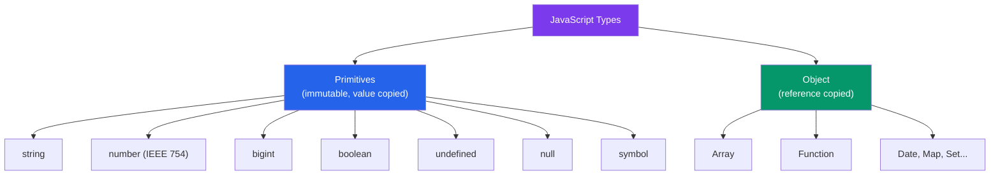

# ⚡ JS Fundamentals

> [!abstract] TL;DR
> JavaScript has 7 primitive types plus Object. Every Number is an IEEE 754 double, making `0.1 + 0.2 !== 0.3`. There are exactly 8 falsy values: `false`, `0`, `-0`, `0n`, `""`, `null`, `undefined`, `NaN`. Closures capture variables by reference from their enclosing scope. The `this` keyword is determined by 4 binding rules at call time, not definition time. Always use `===` (strict equality) except for the `x == null` guard.

## Intuition — analogy FIRST

JavaScript's type system is like a loosely-managed warehouse. There are labeled shelves (types), but the forklift driver (`==`) is famous for moving boxes between shelves without telling you — placing a number next to a string and calling them equivalent. The strict supervisor (`===`) refuses any cross-shelf comparisons.

Closures are like a worker taking the warehouse's master keycard when they leave for a different building. They can still access the original warehouse long after they've moved on, and any changes they make affect what the original workers see.

---

## How It Works



---

## Key Concepts / Details

### Types and `typeof`

```javascript
typeof "hello"      // "string"
typeof 42           // "number"
typeof true         // "boolean"
typeof undefined    // "undefined"
typeof Symbol()     // "symbol"
typeof 42n          // "bigint"
typeof function(){} // "function"
typeof {}           // "object"
typeof []           // "object" (arrays are objects)
typeof null         // "object" ← famous bug, never fixed for backward compat
```

### IEEE 754 Double and Floating-Point Arithmetic

Every JavaScript number is a 64-bit IEEE 754 double-precision float:

```javascript
// Floating-point is not exact
0.1 + 0.2           // 0.30000000000000004
0.1 + 0.2 === 0.3   // false

// Safe integer range
Number.MAX_SAFE_INTEGER // 9007199254740991 (2^53 - 1)
Number.MIN_SAFE_INTEGER // -9007199254740991

// Fix: use epsilon comparison or integer units (cents, not dollars)
const EPSILON = Number.EPSILON;
Math.abs((0.1 + 0.2) - 0.3) < EPSILON // true

// Or use BigInt for integers beyond 2^53
const big = 9007199254740993n; // BigInt literal

// Special values
Infinity
-Infinity
NaN // Not a Number
NaN === NaN // false — NaN is the only value not equal to itself
Number.isNaN(NaN) // true (use this, not global isNaN which coerces)
```

### The 8 Falsy Values

```javascript
// These 8 values are falsy — everything else is truthy
false
0
-0
0n        // BigInt zero
""        // empty string
null
undefined
NaN

// Common gotcha: empty array and object ARE truthy
Boolean([])  // true
Boolean({})  // true

// The x == null guard (the only good use of ==)
// Matches both null and undefined
if (x == null) { /* x is null or undefined */ }
// Equivalent to: x === null || x === undefined
```

### Equality: `==` vs `===`

```javascript
// === strict equality — never coerces type
1 === 1     // true
1 === "1"   // false — different types
null === undefined // false

// == abstract equality — coerces types (avoid except for null guard)
1 == "1"    // true (coerces string to number)
0 == false  // true
null == undefined // true ← the one useful case for ==
null == 0        // false
```

### Closures and Lexical Scope

A closure is a function that **captures** variables from its enclosing scope — even after the enclosing function has returned:

```javascript
function makeCounter(start = 0) {
  let count = start; // captured by closure

  return {
    increment() { count++; },
    decrement() { count--; },
    value()     { return count; }
  };
}

const counter = makeCounter(10);
counter.increment();
counter.increment();
counter.value(); // 12 — count lives in the closure

// Classic closure bug with var in loops
for (var i = 0; i < 3; i++) {
  setTimeout(() => console.log(i), 0); // prints 3, 3, 3 — var is function-scoped
}

// Fix 1: use let (block-scoped, new binding per iteration)
for (let i = 0; i < 3; i++) {
  setTimeout(() => console.log(i), 0); // prints 0, 1, 2
}

// Fix 2: IIFE to capture per-iteration value
for (var i = 0; i < 3; i++) {
  ((j) => setTimeout(() => console.log(j), 0))(i);
}
```

### The Temporal Dead Zone (TDZ)

`let` and `const` are hoisted but not initialized — accessing them before declaration throws `ReferenceError`:

```javascript
console.log(x); // ReferenceError: Cannot access 'x' before initialization
let x = 5;

console.log(y); // undefined — var is hoisted AND initialized to undefined
var y = 5;
```

### The Four `this` Binding Rules

`this` is determined at **call time**, not definition time, by the following priority (highest to lowest):

```javascript
// 1. new binding — new sets this to the new object
function Person(name) { this.name = name; }
const p = new Person("Alice"); // this = new Person object

// 2. Explicit binding — call/apply/bind override this
function greet() { return `Hello, ${this.name}`; }
greet.call({ name: "Bob" });    // "Hello, Bob"
greet.apply({ name: "Carol" }); // "Hello, Carol"
const boundGreet = greet.bind({ name: "Dan" });
boundGreet(); // "Hello, Dan"

// 3. Implicit binding — object before the dot
const obj = {
  name: "Eve",
  greet() { return `Hello, ${this.name}`; }
};
obj.greet(); // "Hello, Eve" — obj is the implicit receiver

// 4. Default binding — strict mode: undefined; non-strict: global
function logThis() { console.log(this); }
logThis(); // window (browser) or global (Node) in non-strict; undefined in strict

// Arrow functions — no own this, inherit from enclosing lexical scope
const obj2 = {
  name: "Frank",
  // Regular method — this is obj2 when called as obj2.greet()
  greet()  { return `Hello, ${this.name}`; },
  // Arrow — lexical this captured at definition (module scope, not obj2)
  greetArrow: () => `Hello, ${this?.name}` // this !== obj2
};
```

### Prototypes and the `[[Prototype]]` Chain

```javascript
// All objects have a hidden [[Prototype]] link
const arr = [1, 2, 3];
// arr.__proto__ === Array.prototype
// Array.prototype.__proto__ === Object.prototype
// Object.prototype.__proto__ === null

// Property lookup walks the chain
arr.push(4);   // found on Array.prototype
arr.hasOwnProperty('0'); // found on Object.prototype

// class is syntactic sugar over prototype-based inheritance
class Animal {
  constructor(name) { this.name = name; }
  speak() { return `${this.name} makes a sound.`; }
}

class Dog extends Animal {
  speak() { return `${this.name} barks.`; }
}

// Private fields (not on prototype — truly private)
class BankAccount {
  #balance = 0;
  deposit(amount) { this.#balance += amount; }
  get balance() { return this.#balance; }
}
```

---

## Real-World Notes

- **Never use `var`** in modern code — `let` and `const` have block scoping and TDZ protection. Prefer `const` by default; use `let` when reassignment is needed.
- **Use `Number.isNaN`, not `isNaN`** — the global `isNaN` coerces its argument first: `isNaN("hello")` is `true` (coerces to NaN), `Number.isNaN("hello")` is `false`.
- **The `x == null` guard is the one legitimate use of `==`** — it's idiomatic JavaScript to check for both `null` and `undefined` with a single comparison.
- **Arrow functions are not suitable for object methods** because they don't have their own `this`. Use method shorthand (`greet() {}`) for object methods.

---

## Common Pitfalls

- **`typeof null === "object"`** — this is a bug from 1995 that was never fixed. Use `value === null` for null checks.
- **Float comparison with `===`** — `0.1 + 0.2 === 0.3` is always `false`. Use epsilon comparisons or integer arithmetic.
- **`var` in loops captures the final value** — a classic interview question. Use `let` or capture with an IIFE.
- **Losing `this` when passing methods as callbacks** — `setTimeout(obj.method, 0)` detaches `this`. Fix with `.bind(obj)` or an arrow wrapper `() => obj.method()`.

---

## Related Concepts

- [[_MOC_JavaScript_Core|↑ Section MOC]]
- [[DOM_Manipulation]] — Applying closures and `this` in browser event handlers
- [[Async_JS_Promises]] — Closures and `this` in Promise chains and async functions
- [[ES6_Modern_Features]] — Modern syntax that builds on these fundamentals

---

## Review Questions

1. List the 8 falsy values. Why are `[]` and `{}` truthy?
2. Why does `0.1 + 0.2 !== 0.3`? How do you compare floating-point numbers safely?
3. Explain the closure bug in the `for (var i...)` loop. Give two fixes.
4. Describe the four `this` binding rules in priority order. What does `this` refer to inside an arrow function?
5. What is `typeof null`? Why is this a bug?

---

## Sources

- MDN Web Docs: JavaScript data types — https://developer.mozilla.org/en-US/docs/Web/JavaScript/Data_structures
- Kyle Simpson, *You Don't Know JS* (YDKJS) — Types & Grammar, *this* & Object Prototypes
- MDN Web Docs: Closures — https://developer.mozilla.org/en-US/docs/Web/JavaScript/Closures
- ECMAScript spec: Abstract Equality Comparison — https://tc39.es/ecma262/

#web-development #javascript-core #types #closures #prototypes
