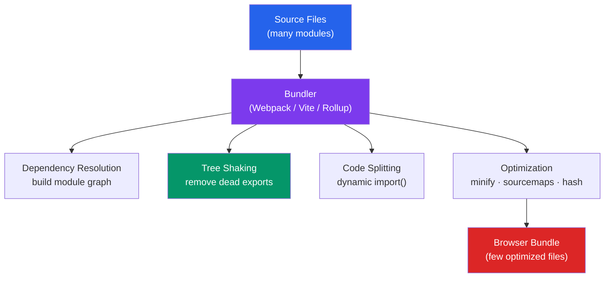

# 📦 JS Modules and Bundling

> [!abstract] TL;DR
> JavaScript has two module systems: **ESM** (ES Modules, static `import`/`export`, live read-only bindings, tree-shakeable) and **CommonJS** (dynamic `require()`, value-snapshot exports, synchronous). Tree shaking requires ESM + `"sideEffects": false` in `package.json` + named exports. **Webpack** is the configurable bundler with rich plugin ecosystem; **Vite** serves native ESM in dev (instant HMR) and ships Rollup builds for prod. Code split at route boundaries first using dynamic `import()`.

## Intuition — analogy FIRST

Modules are like shipping containers. Without a standard container system, every ship loaded cargo differently — incompatible, slow, chaotic. ES Modules are the ISO standard: everyone uses the same locking mechanism (`import`/`export`), so cranes (bundlers) can load them predictably and efficiently.

**Tree shaking** is the cargo dock inspector: before the ship sails (before your app loads), they check every container. Any container (export) that nobody ordered (no import references it) gets pulled off the ship. You only ship what's consumed.

**Bundlers** (Webpack, Vite) are the logistics companies: they take your source modules, resolve dependencies, optimize the containers, and pack them into one efficient shipment (your bundle) for the browser.

---

## How It Works



---

## Key Concepts / Details

### ESM — ES Modules

ESM is the native browser module system, standardized in ES2015:

```javascript
// Named exports (preferred for tree shaking)
export function add(a, b) { return a + b; }
export const PI = 3.14159;
export class Vector { ... }

// Default export (one per module)
export default function main() { ... }

// Re-export from another module
export { add, subtract } from './math.js';
export { default as MyComponent } from './Component.js';
export * from './utils.js'; // re-export all named exports
```

```javascript
// Named imports
import { add, PI } from './math.js';

// Default import
import main from './main.js';

// Namespace import
import * as math from './math.js';
math.add(1, 2);

// Side-effect only import (runs module, imports nothing)
import './polyfills.js';
```

**ESM characteristics:**
- **Static structure** — `import`/`export` must be at the top level (not inside ifs, functions)
- **Live bindings** — imported values reflect the current exported value (not a snapshot)
- **Strict mode** — modules always run in strict mode
- **Top-level `await`** — supported in ESM (but not CommonJS)
- **Tree-shakeable** — bundlers can analyze statically which exports are used

### CommonJS (CJS)

Node.js's original module system — still widely used in npm packages:

```javascript
// Exporting
module.exports = { add, subtract };
module.exports = function() { ... }; // default-style export
exports.add = function() { ... };    // named-style

// Importing
const math = require('./math');
const { add } = require('./math');
const fs = require('fs'); // Node.js built-ins

// Dynamic (runtime) require
if (condition) {
  const plugin = require(`./plugins/${name}`);
}
```

**CJS characteristics:**
- **Dynamic** — `require()` can be called anywhere (inside ifs, functions, loops)
- **Synchronous** — blocks while loading (works in Node, not suitable for browsers)
- **Value snapshot** — exports a copy of the value at require-time, not a live binding
- **NOT tree-shakeable** — bundlers can't statically determine what's used from a `require()` call

### ESM vs CommonJS Comparison

| Feature | ESM | CommonJS |
|---------|-----|----------|
| Syntax | `import`/`export` | `require()`/`module.exports` |
| Loading | Async, parallel | Sync, sequential |
| Analysis | Static (compile time) | Dynamic (runtime) |
| Tree shaking | Yes | No (generally) |
| Top-level `await` | Yes | No |
| Browser native | Yes | No (needs bundler) |
| Node.js | Yes (`.mjs` or `"type":"module"`) | Yes (`.cjs` or default) |
| Circular deps | Live bindings (safer) | Value snapshots (risky) |

### Tree Shaking — Requirements

For a bundler to eliminate dead code, ALL three must be true:

```json
// package.json — tell bundler there are no side effects
{
  "sideEffects": false
}
// Or list files WITH side effects:
// "sideEffects": ["*.css", "./src/polyfills.js"]
```

```javascript
// 1. Use ESM (not CJS) imports
import { specific } from 'library'; // tree-shakeable
const { specific } = require('library'); // NOT tree-shakeable

// 2. Use named exports (not default object exports)
export function add() {} // tree-shakeable — bundler knows what's used
export default { add, subtract }; // NOT tree-shakeable — bundler imports the whole object

// 3. Avoid side effects at module level
// Side effect: code that runs when module is imported
// If a module has side effects, it can't be tree-shaken
import './analytics'; // runs code on import — cannot be eliminated
```

### Webpack — Configurable Bundler

```javascript
// webpack.config.js
const path = require('path');
const HtmlWebpackPlugin = require('html-webpack-plugin');

module.exports = {
  entry: './src/index.js',

  output: {
    path: path.resolve(__dirname, 'dist'),
    filename: '[name].[contenthash].js', // contenthash = cache busting
    clean: true
  },

  optimization: {
    splitChunks: {
      chunks: 'all',
      cacheGroups: {
        vendor: {
          test: /[\\/]node_modules[\\/]/,
          name: 'vendors',
          chunks: 'all'
        }
      }
    }
  },

  plugins: [
    new HtmlWebpackPlugin({ template: './src/index.html' })
  ],

  module: {
    rules: [
      { test: /\.tsx?$/, use: 'ts-loader', exclude: /node_modules/ },
      { test: /\.css$/, use: ['style-loader', 'css-loader'] }
    ]
  }
};
```

**Webpack chunk types:**
- **Entry chunk** — your app's main entry point
- **Vendor chunk** — node_modules (split to cache separately from app code)
- **Dynamic chunk** — code behind a dynamic `import()`
- **Runtime chunk** — Webpack's module loading runtime

### Vite — Dev-Optimized Bundler

Vite's key differentiator: native ESM in development (no bundling) + Rollup for production:

```
Dev mode:  Browser requests → Vite serves single files on demand (instant HMR)
           esbuild pre-bundles node_modules (10-100x faster than webpack)
Prod mode: Rollup bundles, tree-shakes, and splits → optimized build
```

```javascript
// vite.config.ts
import { defineConfig } from 'vite';
import react from '@vitejs/plugin-react';

export default defineConfig({
  plugins: [react()],
  build: {
    rollupOptions: {
      output: {
        manualChunks: {
          vendor: ['react', 'react-dom'],
          router: ['react-router-dom']
        }
      }
    }
  }
});
```

### Code Splitting with Dynamic `import()`

```javascript
// Static import — always loaded (included in entry bundle)
import HeavyComponent from './HeavyComponent';

// Dynamic import — lazy loaded when called
const HeavyComponent = React.lazy(() => import('./HeavyComponent'));

// Route-based splitting (most impactful — split at boundaries)
const Dashboard = React.lazy(() => import('./pages/Dashboard'));
const Profile   = React.lazy(() => import('./pages/Profile'));

// With Suspense
function App() {
  return (
    <Suspense fallback={<Spinner />}>
      <Routes>
        <Route path="/dashboard" element={<Dashboard />} />
        <Route path="/profile"   element={<Profile />} />
      </Routes>
    </Suspense>
  );
}

// Manual dynamic import (non-React)
button.addEventListener('click', async () => {
  const { default: Modal } = await import('./Modal.js');
  new Modal().show();
});
```

---

## Real-World Notes

- **Always split at route boundaries first.** A single route bundle of 200KB loading only when needed is better than a 1MB initial bundle.
- **`[contenthash]` in filenames** enables long-term caching. The hash changes only when file content changes, so browsers cache unchanged chunks forever.
- **Vite is the new default** for greenfield projects. Its dev experience (sub-100ms HMR) vs Webpack's (seconds) is the main reason.
- **Dual-publishing npm packages** — ship both `dist/index.esm.js` (for bundlers that tree-shake) and `dist/index.cjs.js` (for Node.js CJS `require`).

---

## Common Pitfalls

- **Importing from `lodash` without tree shaking** — `import { debounce } from 'lodash'` imports all of lodash (70KB). Use `lodash-es` (ESM version) or `import debounce from 'lodash/debounce'` for individual functions.
- **Side effects in utility modules** — a module that calls `console.log` or mutates globals at the top level has side effects; it won't be tree-shaken. Keep utilities pure.
- **Circular dependencies in CJS** — two modules that `require` each other can get an empty object as the result; ESM handles this better with live bindings.
- **Not using `contenthash`** — without it, any change to any file busts the entire bundle cache.
- **Forgetting `"type": "module"` in `package.json`** — without it, Node.js treats `.js` files as CJS; you need explicit `.mjs` extension or the package field to use ESM.

---

## Related Concepts

- [[_MOC_JavaScript_Core|↑ Section MOC]]
- [[ES6_Modern_Features]] — ESM syntax (`import`/`export`) is an ES6 feature
- [[Async_JS_Promises]] — Dynamic `import()` returns a Promise
- [[TypeScript_Tooling]] — TypeScript compilation interacts with module formats

---

## Review Questions

1. What three conditions must be met for tree shaking to work?
2. Explain the difference between ESM's live bindings and CJS's value snapshot exports. Give an example where it matters.
3. Why does `import { debounce } from 'lodash'` bundle more code than intended? How do you fix it?
4. What is the difference between Vite's dev mode and production mode?
5. When would you use a dynamic `import()` instead of a static `import`?

---

## Sources

- MDN Web Docs: JavaScript modules — https://developer.mozilla.org/en-US/docs/Web/JavaScript/Guide/Modules
- Webpack docs: Code Splitting — https://webpack.js.org/guides/code-splitting/
- Vite docs: Why Vite — https://vitejs.dev/guide/why.html
- web.dev: Reduce JavaScript payloads with code-splitting — https://web.dev/articles/reduce-javascript-payloads-with-code-splitting

#web-development #javascript-core #esm #webpack #vite #tree-shaking
