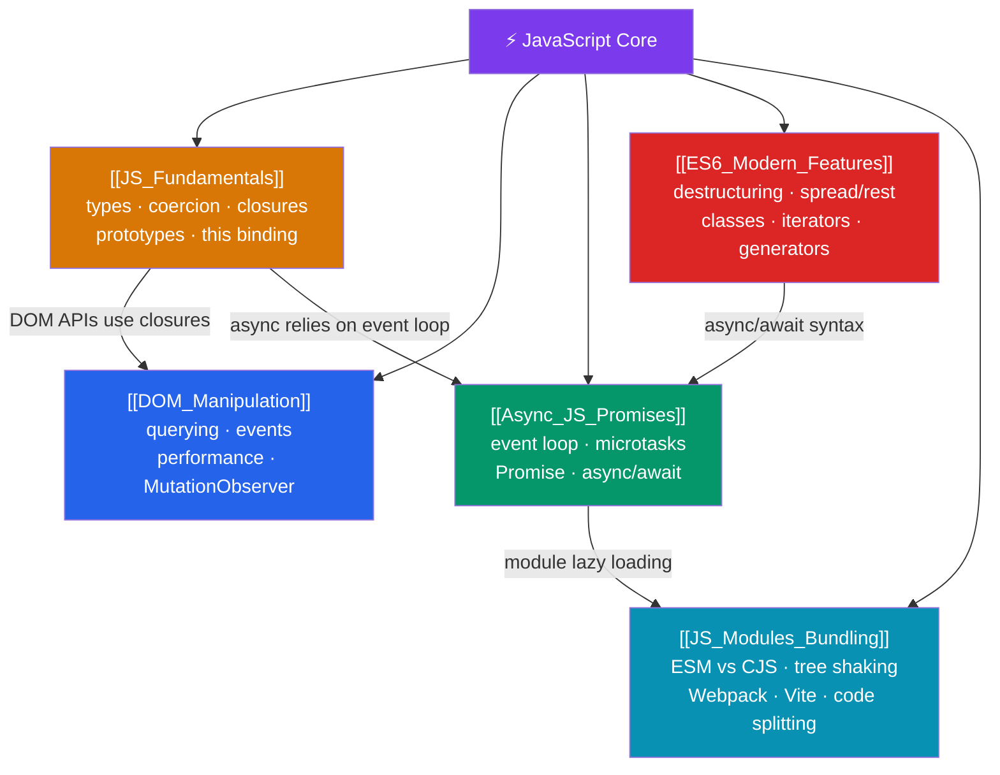

# ⚡ JavaScript Core — Map of Content

> [!abstract] What This Section Covers
> The universal runtime of the web — deceptively simple syntax over a rich model of prototype chains, a single-threaded event loop, and well-defined but treacherous coercion rules. This section covers: types and coercion, closures and scope, the event loop model, async/Promises, and modules/bundling. These are the mechanics every frontend and Node.js developer must internalize to reason about performance, bugs, and architecture.

## Concept Map

## Learning Path

1. [[JS_Fundamentals]] — Types, coercion, the 8 falsy values, closures, the 4 `this` binding rules, and prototypes.
2. [[DOM_Manipulation]] — Querying the DOM, event handling, bubbling/capturing, event delegation, and `MutationObserver`.
3. [[Async_JS_Promises]] — The single-threaded event loop, microtasks vs macrotasks, Promises, and `async`/`await`.
4. [[ES6_Modern_Features]] — Destructuring, spread/rest, template literals, classes, iterators, generators, and `Symbol`.
5. [[JS_Modules_Bundling]] — ESM vs CommonJS, tree shaking, dynamic imports, Webpack, and Vite.

## All Notes at a Glance

| Note | Difficulty | What You'll Learn |
|------|------------|-------------------|
| [[JS_Fundamentals]] | Beginner | 7 primitives, coercion, 8 falsy values, closures, TDZ, 4 `this` rules, prototypes |
| [[DOM_Manipulation]] | Beginner | querySelector, event listeners, bubbling, delegation, `data-*`, performance |
| [[Async_JS_Promises]] | Intermediate | Call stack, Web APIs, microtasks, macrotasks, Promise lifecycle, async/await |
| [[ES6_Modern_Features]] | Intermediate | Destructuring, spread, classes, iterators, generators, optional chaining |
| [[JS_Modules_Bundling]] | Intermediate | ESM static bindings, CJS dynamic require, Webpack, Vite, tree shaking |

## Key Questions This Section Answers

- Why does `0.1 + 0.2 !== 0.3`, and how do you compare floating-point numbers safely?
- What are the exactly 8 falsy values in JavaScript?
- How does `this` binding work, and what are the four rules that determine it?
- What is the difference between a microtask and a macrotask, and which runs first?
- How does `async/await` desugar to Promise chains?
- Why does tree shaking require ESM rather than CommonJS?
- What is the difference between `switchMap`, `mergeMap`, `concatMap`, and `exhaustMap`?

## Related Sections

- [[_MOC_WebDev_Master|↑ Web Dev Master MOC]]
- [[_MOC_HTML_CSS|← HTML & CSS Fundamentals]]
- [[_MOC_TypeScript|→ TypeScript]]
- [[_MOC_React|→ React]]

#MOC #WebDevelopment #JavaScript
