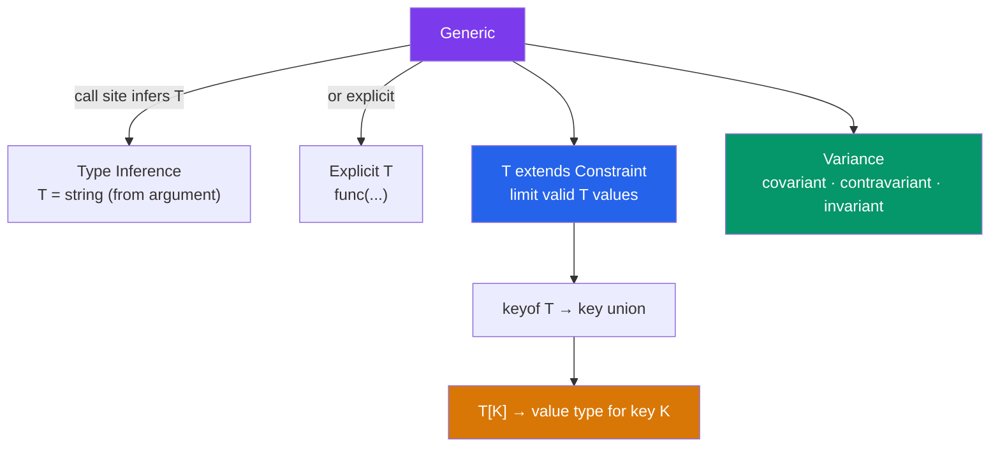

# 🔬 Generics in TypeScript

> [!abstract] TL;DR
> Generics let you write reusable code that works over a range of types while preserving type safety. A generic function infers its type parameter from call-site arguments. Constraints (`T extends U`) restrict what types are allowed. `keyof` extracts a type's key union; indexed access `T[K]` extracts the value type for a key. Variance describes how generic types relate (covariant for outputs, contravariant for inputs). `infer` inside conditional types is pattern matching — the foundation of utility types like `ReturnType` and `Awaited`.

## Intuition — analogy FIRST

Generics are like a reusable shipping box with a label slot. The box is manufactured once (the generic type/function) and works for any product — books, electronics, clothing. You stamp a label (the type argument `<T>`) when you use the box, and everything inside is tracked as that specific product. You can't accidentally put a book in a box labeled "electronics" and ship it to the wrong department.

Without generics, you'd have a separate box factory for each product type (duplicated code) or a single untyped box where you can't tell what's inside (`any`).

---

## How It Works



---

## Key Concepts / Details

### Generic Functions

```typescript
// Identity function — T is inferred from argument
function identity<T>(value: T): T {
  return value;
}

identity(42);      // T = number, returns number
identity('hello'); // T = string, returns string

// Multiple type parameters
function pair<A, B>(a: A, b: B): [A, B] {
  return [a, b];
}

pair(1, 'two'); // [number, string]

// Generic with transformation
function map<T, U>(arr: T[], transform: (item: T) => U): U[] {
  return arr.map(transform);
}

map([1, 2, 3], n => n * 2);         // number[]
map(['a', 'b'], s => s.toUpperCase()); // string[]
```

### Constraints with `extends`

```typescript
// Constrain T to types with a length property
function longest<T extends { length: number }>(a: T, b: T): T {
  return a.length >= b.length ? a : b;
}

longest('hello', 'hi');    // string — OK
longest([1, 2], [1]);      // number[] — OK
longest(10, 20);           // Error — number has no .length

// Constrain T to an object type
function getProperty<T, K extends keyof T>(obj: T, key: K): T[K] {
  return obj[key];
}

const user = { name: 'Alice', age: 30 };
getProperty(user, 'name');  // string
getProperty(user, 'age');   // number
getProperty(user, 'email'); // Error — 'email' is not a key of user
```

### `keyof` and Indexed Access Types

```typescript
// keyof — produces a union of an object's keys
interface Config {
  host: string;
  port: number;
  debug: boolean;
}

type ConfigKey = keyof Config; // "host" | "port" | "debug"

// Indexed access — get the type of a property
type HostType = Config['host'];    // string
type PortType = Config['port'];    // number
type AnyValue = Config[keyof Config]; // string | number | boolean

// With arrays
type Arr = string[];
type ArrElement = Arr[number]; // string — index with number to get element type

// Combining — pick value types of specific keys
type PickValues<T, K extends keyof T> = T[K];
type StringValues = PickValues<Config, 'host' | 'debug'>; // string | boolean
```

### Generic Classes and Interfaces

```typescript
// Generic class
class Stack<T> {
  private items: T[] = [];

  push(item: T): void { this.items.push(item); }
  pop(): T | undefined { return this.items.pop(); }
  peek(): T | undefined { return this.items[this.items.length - 1]; }
  get size(): number { return this.items.length; }
}

const numberStack = new Stack<number>();
numberStack.push(1);
numberStack.push('hello'); // Error — string not assignable to number

// Generic interface
interface Repository<T, ID = number> {
  findById(id: ID): Promise<T | null>;
  findAll(): Promise<T[]>;
  save(entity: T): Promise<T>;
  delete(id: ID): Promise<void>;
}

class UserRepository implements Repository<User> {
  async findById(id: number): Promise<User | null> { ... }
  // ...
}
```

### Default Type Parameters

```typescript
// Default makes T optional at call site
function createArray<T = string>(length: number, fill: T): T[] {
  return Array(length).fill(fill);
}

createArray(3, 'x');    // string[] — T inferred as string
createArray(3, 0);      // number[] — T inferred as number
createArray<boolean>(3, true); // boolean[] — explicit

// Default in generic class
class EventEmitter<Events extends Record<string, any> = Record<string, any>> {
  private handlers: Partial<{ [K in keyof Events]: (data: Events[K]) => void }> = {};

  on<K extends keyof Events>(event: K, handler: (data: Events[K]) => void) {
    this.handlers[event] = handler;
  }

  emit<K extends keyof Events>(event: K, data: Events[K]) {
    this.handlers[event]?.(data);
  }
}

type AppEvents = { login: { userId: number }; logout: void };
const emitter = new EventEmitter<AppEvents>();
emitter.on('login', ({ userId }) => console.log(userId));
emitter.emit('login', { userId: 42 });
emitter.emit('login', 'wrong'); // Error
```

### Variance

Variance describes how type relationships propagate through generic types:

```typescript
// Covariant (output position) — preserves type relationship
// If Cat extends Animal, then Producer<Cat> extends Producer<Animal>
type Producer<T> = () => T;

// Contravariant (input position) — reverses type relationship
// If Cat extends Animal, then Consumer<Animal> extends Consumer<Cat>
type Consumer<T> = (value: T) => void;

// Invariant (read + write) — no subtyping
type ReadWrite<T> = { get(): T; set(v: T): void };

// TypeScript explicit variance annotations (TS 4.7+)
type Box<out T> = { get(): T };      // covariant — only appears in output
type Sink<in T> = { set(v: T): void }; // contravariant — only appears in input

// Method shorthand is bivariant (unsound but pragmatic)
// — it must accept both Cat and Animal for method override compatibility
interface Animal { makeSound(): void; }
class Cat implements Animal { makeSound() {} purr() {} }
```

### `infer` — Building Utility Types

```typescript
// Extract the resolved type of a Promise (built-in Awaited)
type UnwrapPromise<T> = T extends Promise<infer R> ? UnwrapPromise<R> : T;

// Extract parameter types of a function (built-in Parameters)
type Parameters<T extends (...args: any) => any> =
  T extends (...args: infer P) => any ? P : never;

// Extract element type from array or tuple
type ElementOf<T extends any[]> = T extends (infer E)[] ? E : never;

// Extract constructor parameter types
type ConstructorParameters<T extends new (...args: any) => any> =
  T extends new (...args: infer P) => any ? P : never;

// Conditional branching with multiple infer points
type SplitString<S extends string, Sep extends string> =
  S extends `${infer Before}${Sep}${infer After}`
    ? [Before, ...SplitString<After, Sep>]
    : [S];

type Parts = SplitString<'a-b-c', '-'>; // ["a", "b", "c"]
```

---

## Real-World Notes

- **Inference usually works without explicit type arguments.** `map([1,2,3], n => n * 2)` — TypeScript infers `T = number` and `U = number`. Only provide explicit `<T>` when inference fails.
- **`keyof T` and indexed access `T[K]` are the foundation of object manipulation types.** They let you write type-safe `pick`, `omit`, `pluck`, and `merge` utilities.
- **Method shorthand `({ method() {} })` vs property shorthand `({ method: () => {} })`** differ in variance under `strictFunctionTypes`. Method shorthands are bivariant; function properties are strictly checked.
- **`NoInfer<T>` (TS 5.4)** prevents a type parameter from being inferred from a particular argument position — useful when you want inference from only some arguments.

---

## Common Pitfalls

- **Over-constraining** with `<T extends object>` when you mean `<T extends Record<string, unknown>>` — `object` includes functions and arrays.
- **Forgetting that `keyof any`** is `string | number | symbol` — used as the constraint for Record keys.
- **Using `as` to force a type inside a generic** — indicates the constraint is wrong. Fix the constraint.
- **Infinite recursion in recursive generics** — TypeScript caps depth, returning `any`. Add a base case and a depth counter if needed.
- **Type parameter shadowing** — a nested generic `<T>` inside a class generic `<T>` shadows the outer one. Use distinct names (`<TItem>`, `<TResult>`).

---

## Related Concepts

- [[_MOC_TypeScript|↑ Section MOC]]
- [[TypeScript_Fundamentals]] — Structural typing and inference prerequisite
- [[Type_System_Advanced]] — Conditional types, mapped types, and `infer` extensions
- [[TypeScript_with_React]] — Generic React components and hook types

---

## Review Questions

1. Write a generic `pick<T, K extends keyof T>(obj: T, keys: K[]): Pick<T, K>` function.
2. Explain the difference between covariant, contravariant, and invariant generic positions. Give an example of each.
3. Implement `ReturnType<T>` from scratch using conditional types and `infer`.
4. Why does TypeScript infer the type of `identity('hello')` as `string` rather than `"hello"`?
5. What is the `NoInfer<T>` utility and when do you need it?

---

## Sources

- TypeScript docs: Generics — https://www.typescriptlang.org/docs/handbook/2/generics.html
- TypeScript docs: Variance Annotations — https://www.typescriptlang.org/docs/handbook/2/generics.html#variance-annotations
- TypeScript 4.7 Release: Variance Annotations — https://devblogs.microsoft.com/typescript/announcing-typescript-4-7/

#web-development #typescript #generics #constraints #variance #infer
