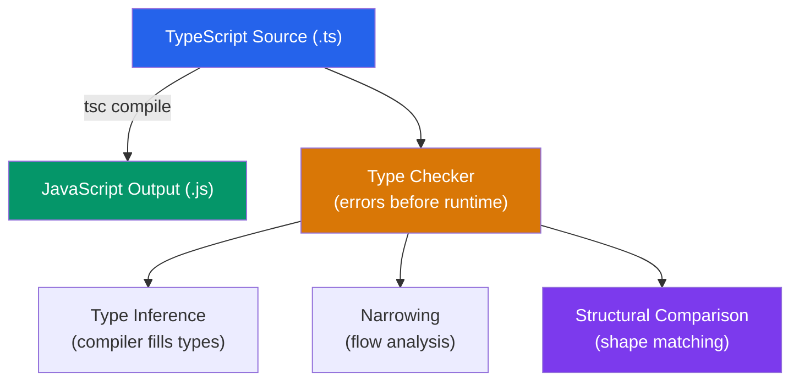

# 🔷 TypeScript Fundamentals

> [!abstract] TL;DR
> TypeScript is a **structurally-typed** superset of JavaScript — types are compared by their shape (properties and methods), not by name. The compiler infers types where possible and annotates where it can't. The `any`/`unknown`/`never` trio forms the top/top-safe/bottom of the type hierarchy. Use `interface` for object shapes (supports declaration merging), `type` for unions/intersections/aliases. The `satisfies` operator validates a value against a type without widening it.

## Intuition — analogy FIRST

TypeScript's structural typing is like a job interview based on demonstrated skills rather than degrees.

A company needs someone who can "code in TypeScript and give talks." If you walk in and prove you can write TypeScript and give talks, you're hired — it doesn't matter whether your degree says "Computer Science" or you're self-taught. Your **shape** (skills) matches the **requirement** (type), so TypeScript accepts you.

Contrast this with nominal typing (Java, C#): you need a degree from an approved institution (a class with the exact name). Even if you have identical skills, the certificate name matters.

---

## How It Works



---

## Key Concepts / Details

### Structural Typing — Duck Typing by the Compiler

```typescript
interface Printable {
  print(): void;
}

class Invoice {
  constructor(public amount: number) {}
  print() { console.log(`Invoice: $${this.amount}`); }
}

class Report {
  print() { console.log('Report'); }
}

function render(p: Printable) {
  p.print();
}

render(new Invoice(100)); // OK — Invoice has print()
render(new Report());     // OK — Report has print()
render({ print: () => console.log('ad hoc') }); // OK — structural match
```

### Type Inference

TypeScript infers types from usage — you don't always need to annotate:

```typescript
// Inferred as number
const count = 0;

// Inferred as string[]
const names = ['Alice', 'Bob'];

// Inferred return type as number
function add(a: number, b: number) { return a + b; }

// Inferred as { id: number; name: string }
const user = { id: 1, name: 'Alice' };

// When inference needs help — annotate the variable, not the value
const config: Config = { host: 'localhost', port: 3000 };
```

### The `any` / `unknown` / `never` Trio

| Type | Position in hierarchy | Behavior |
|------|-----------------------|----------|
| `any` | Top (unsafe) | Assignable to/from everything; disables type checking |
| `unknown` | Top (safe) | Assignable to/from `any` only; must narrow before use |
| `never` | Bottom | Assignable to everything; nothing is assignable to it |

```typescript
// any — type checking opt-out (avoid)
let x: any = 42;
x.toUpperCase(); // no error, but runtime crash!

// unknown — safe top type
let input: unknown = getInput();
input.toUpperCase(); // Error — must narrow first
if (typeof input === 'string') {
  input.toUpperCase(); // OK — narrowed to string
}

// never — impossible type (exhaustiveness checking)
function assertNever(x: never): never {
  throw new Error(`Unhandled case: ${JSON.stringify(x)}`);
}

type Shape = 'circle' | 'square' | 'triangle';
function area(shape: Shape) {
  switch (shape) {
    case 'circle': return '...';
    case 'square': return '...';
    case 'triangle': return '...';
    default: return assertNever(shape); // Error if new case added without handling
  }
}
```

### Union and Intersection Types

```typescript
// Union — one of several types
type StringOrNumber = string | number;
type Status = 'pending' | 'success' | 'error';

function format(value: string | number): string {
  if (typeof value === 'string') return value.toUpperCase();
  return value.toFixed(2);
}

// Intersection — all of several types combined
type Admin = User & { role: 'admin'; permissions: string[] };

// Discriminated union — union where a literal field acts as a discriminant
type ApiResponse =
  | { status: 'success'; data: User }
  | { status: 'error'; message: string }
  | { status: 'loading' };

function handle(res: ApiResponse) {
  switch (res.status) {
    case 'success': render(res.data); break;     // res.data available
    case 'error': alert(res.message); break;     // res.message available
    case 'loading': showSpinner(); break;
  }
}
```

### `interface` vs `type`

```typescript
// interface — preferred for object shapes; supports declaration merging
interface User {
  id: number;
  name: string;
}

interface User {
  email: string; // declaration merging — adds to User
}
// User now has: id, name, email

// interface extends
interface Admin extends User {
  role: 'admin';
}

// type — required for unions, intersections, tuples, aliases
type ID = string | number;
type Pair<T> = [T, T];
type Callback = (err: Error | null, result?: string) => void;
type StringRecord = Record<string, string>;

// type alias for objects (no declaration merging)
type Point = { x: number; y: number };
```

### `as const` and Literal Narrowing

```typescript
// Without as const: inferred as string[]
const colors = ['red', 'green', 'blue'];
// With as const: inferred as readonly ["red", "green", "blue"]
const colors = ['red', 'green', 'blue'] as const;
type Color = typeof colors[number]; // "red" | "green" | "blue"

// As const on objects
const config = {
  host: 'localhost',
  port: 3000
} as const;
// config.port: 3000 (literal), not number
```

### The `satisfies` Operator (TS 4.9+)

`satisfies` validates a value against a type without widening the inferred type:

```typescript
type ColorMap = Record<string, [number, number, number] | string>;

// Type annotation — widened to ColorMap, loses specific types
const palette1: ColorMap = {
  red: [255, 0, 0],
  green: '#00ff00',
};
palette1.red.map(x => x * 2); // Error — palette1.red is [number,number,number] | string

// satisfies — validates against ColorMap but preserves specific types
const palette2 = {
  red: [255, 0, 0],
  green: '#00ff00',
} satisfies ColorMap;
palette2.red.map(x => x * 2); // OK — palette2.red is [number,number,number]
```

### Type Narrowing

TypeScript narrows types based on control flow:

```typescript
function processValue(value: string | number | null) {
  if (value === null) {
    return; // value: null
  }
  if (typeof value === 'string') {
    value.toUpperCase(); // value: string
  } else {
    value.toFixed(2); // value: number
  }
}

// instanceof narrowing
function formatError(err: unknown) {
  if (err instanceof Error) {
    return err.message; // err: Error
  }
  return String(err);
}

// User-defined type guard
function isUser(value: unknown): value is User {
  return typeof value === 'object' && value !== null && 'id' in value;
}

// Assertion function (throws if wrong type)
function assertIsString(value: unknown): asserts value is string {
  if (typeof value !== 'string') throw new TypeError('Expected string');
}
```

---

## Real-World Notes

- **Prefer `unknown` over `any`** for values of uncertain type (API responses, parsed JSON, caught errors). `unknown` forces you to narrow before use; `any` silently bypasses the type system.
- **`interface` for data shapes, `type` for everything else.** Interfaces are preferred in large codebases because declaration merging allows library augmentation. Use `type` for unions, mapped types, and conditional types.
- **TypeScript erases all types at compile time.** No runtime type information survives unless you use decorators + `reflect-metadata` or run-time validators (Zod, io-ts).
- **`strict: true` is mandatory for new projects.** It enables `strictNullChecks`, `noImplicitAny`, `strictFunctionTypes`, and more — all of which prevent entire classes of bugs.

---

## Common Pitfalls

- **Type assertions (`as T`) bypass the type checker** — `value as User` tells TS "trust me," suppressing errors. Use type guards instead.
- **Not handling `null` and `undefined` with `strictNullChecks`** — without strict mode, TypeScript allows `null` to be assigned to any type, defeating null safety.
- **Using `any` as a workaround** instead of modeling the actual type. Every `any` is a hole in your type system.
- **Widening vs narrowing** — assigning to a wider type loses precision: `const x: string = 'hello' as const` makes `x` a `string`, not `'hello'`.
- **Declaration merging surprises** — merging an interface in a module augmentation can add unexpected properties to third-party types.

---

## Related Concepts

- [[_MOC_TypeScript|↑ Section MOC]]
- [[Type_System_Advanced]] — Building on these fundamentals with conditional/mapped types
- [[Generics_in_TypeScript]] — Parameterizing types for reuse
- [[TypeScript_with_React]] — Applying these concepts in React components

---

## Review Questions

1. What is structural typing? Give an example where an object literal satisfies an interface without `implements`.
2. What is the difference between `any` and `unknown`? When do you prefer `unknown`?
3. What is a discriminated union? Give an example using an API response type.
4. Explain the `satisfies` operator — when does it behave differently from a type annotation?
5. What does `typeof colors[number]` produce when `colors` is `as const`?

---

## Sources

- TypeScript docs: Handbook — https://www.typescriptlang.org/docs/handbook/
- TypeScript docs: Type Compatibility — https://www.typescriptlang.org/docs/handbook/type-compatibility.html
- Matt Pocock: Total TypeScript — https://www.totaltypescript.com/

#web-development #typescript #structural-typing #inference #narrowing
