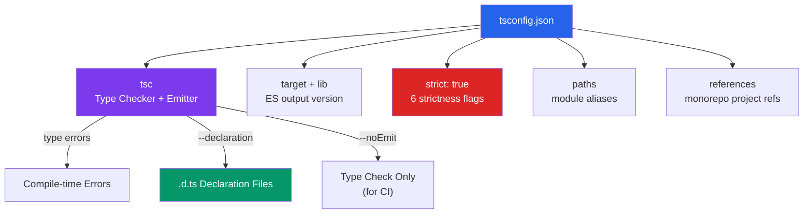

# 🛠️ TypeScript Tooling

> [!abstract] TL;DR
> TypeScript's power depends on its configuration. `tsconfig.json` controls compiler behavior: `strict: true` enables all safety flags and is mandatory for new projects. `paths` configures module aliases. `target` + `lib` control output JS version. `declaration: true` generates `.d.ts` files for library publishing. `project references` support monorepos. Beyond `tsc`, the ecosystem uses `ts-node`/`tsx` for runtime, `esbuild`/`swc` for fast transpilation, and `tsc --noEmit` for type-only CI checks.

## Intuition — analogy FIRST

`tsconfig.json` is like the settings panel for a code quality scanner at a factory. You can dial up how strict the scanner is — at the lowest setting, it passes almost everything and only catches obvious defects. At the highest setting (`strict: true`), it catches subtle issues like potential null dereferences, missing return types, and implicit `any` — but requires you to fix everything it flags.

Most factories (projects) start lenient and gradually tighten. The smart ones start strict from day one and never have the painful legacy migration.

---

## How It Works



---

## Key Concepts / Details

### The `tsconfig.json` File

```json
{
  "compilerOptions": {
    // --- Output target ---
    "target": "ES2022",      // Output JS version (ES5, ES2015–ES2024, ESNext)
    "lib": ["ES2022", "DOM", "DOM.Iterable"], // Type definitions to include
    "module": "ESNext",      // Module system (CommonJS, ESNext, Node16, NodeNext)
    "moduleResolution": "Bundler", // How modules are resolved (Bundler for Vite/webpack)

    // --- Strictness (all enabled by strict: true) ---
    "strict": true,          // Enable ALL strict flags below (use this)
    // "strictNullChecks": true,     // null/undefined are distinct types
    // "noImplicitAny": true,        // Error on implied any
    // "strictFunctionTypes": true,  // Check function parameter types strictly
    // "strictBindCallApply": true,  // Check bind/call/apply args
    // "strictPropertyInitialization": true, // Class props must be initialized
    // "noImplicitThis": true,       // Error on implicit any this

    // --- Additional checks (highly recommended) ---
    "noUncheckedIndexedAccess": true, // arr[i] is T | undefined (not just T)
    "noImplicitReturns": true,        // All code paths must return a value
    "noFallthroughCasesInSwitch": true, // Switch cases must break/return
    "exactOptionalPropertyTypes": true, // {a?: string} means string, not string|undefined
    "noUnusedLocals": true,           // Error on unused variables
    "noUnusedParameters": true,       // Error on unused parameters

    // --- Output ---
    "outDir": "./dist",
    "rootDir": "./src",
    "declaration": true,       // Generate .d.ts files
    "declarationMap": true,    // Source maps for declarations
    "sourceMap": true,         // Source maps for debugging
    "noEmit": false,           // Set true for type-check-only (use with esbuild/swc for build)

    // --- Path aliases ---
    "baseUrl": ".",
    "paths": {
      "@/*": ["./src/*"],
      "@components/*": ["./src/components/*"],
      "@utils/*": ["./src/utils/*"]
    },

    // --- JSX (React) ---
    "jsx": "react-jsx",     // react-jsx (React 17+), react (React <17), preserve (for bundler)

    // --- Module interop ---
    "esModuleInterop": true,   // Allow default import from CJS modules
    "allowSyntheticDefaultImports": true,
    "isolatedModules": true,   // Each file is treated as an isolated module (needed for esbuild/swc)

    // --- Misc ---
    "skipLibCheck": true,      // Skip type-checking of .d.ts files (for speed)
    "forceConsistentCasingInFileNames": true
  },
  "include": ["src/**/*"],
  "exclude": ["node_modules", "dist", "**/*.spec.ts"]
}
```

### `strict: true` — What It Enables

| Flag | What It Prevents |
|------|-----------------|
| `strictNullChecks` | Treating `null`/`undefined` as valid values of any type |
| `noImplicitAny` | Variables inferred as `any` without an annotation |
| `strictFunctionTypes` | Unsound function type assignments (bivariant → contravariant) |
| `strictBindCallApply` | Wrong argument types to `.bind()`, `.call()`, `.apply()` |
| `strictPropertyInitialization` | Class properties not initialized in constructor |
| `noImplicitThis` | `this` typed as `any` in functions |
| `useUnknownInCatchVariables` | Caught errors typed as `any` instead of `unknown` |

### `noUncheckedIndexedAccess` — Index Signatures

A common source of bugs: TypeScript infers `arr[0]` as `T`, but the array might be empty:

```typescript
// Without noUncheckedIndexedAccess
const arr: string[] = [];
const first: string = arr[0]; // OK in TS — but undefined at runtime!

// With noUncheckedIndexedAccess
const first: string | undefined = arr[0]; // forced to handle undefined
if (first !== undefined) {
  first.toUpperCase(); // safe
}

// Same for Record types
const map: Record<string, number> = {};
const val: number | undefined = map['key']; // must handle undefined
```

### Declaration Files (`.d.ts`)

Declaration files describe the types of a module without implementation:

```typescript
// math.d.ts — declares types for a JS library
export declare function add(a: number, b: number): number;
export declare const PI: number;
export declare class Calculator {
  add(a: number, b: number): number;
}

// ambient declarations for global variables
declare const __ENV__: 'development' | 'production';
declare module '*.svg' {
  const content: string;
  export default content;
}

// Module augmentation — extend existing module's types
declare module 'express' {
  interface Request {
    user?: User;
  }
}
```

### Publishing a Library with Type Declarations

```json
// package.json for a TypeScript library
{
  "name": "my-lib",
  "main": "./dist/index.js",
  "module": "./dist/index.esm.js",
  "types": "./dist/index.d.ts",
  "exports": {
    ".": {
      "import": "./dist/index.esm.js",
      "require": "./dist/index.js",
      "types": "./dist/index.d.ts"
    }
  }
}
```

### Project References (Monorepos)

```json
// packages/ui/tsconfig.json
{
  "compilerOptions": {
    "composite": true,
    "outDir": "./dist",
    "rootDir": "./src"
  }
}

// packages/app/tsconfig.json
{
  "references": [
    { "path": "../ui" },
    { "path": "../utils" }
  ]
}
```

```bash
# Build only changed projects
tsc --build

# Clean build outputs
tsc --build --clean
```

### The TypeScript Toolchain

| Tool | Purpose | When to Use |
|------|---------|-------------|
| `tsc` | Official type checker + emitter | Library publishing, CI type checks |
| `ts-node` | Run TS directly in Node | Scripts, dev tools |
| `tsx` | Fast `ts-node` alternative (esbuild) | Scripts where startup time matters |
| `esbuild` | Ultra-fast transpiler (strips types, no type checking) | Dev builds, production bundles with separate `tsc --noEmit` |
| `swc` | Rust-based transpiler (strips types) | Same as esbuild — used in Jest (via `@swc/jest`) |
| `vite` | Dev server + build tool (uses esbuild for TS) | Frontend apps |
| `tsup` | Library bundler (wraps esbuild) | Publishing npm packages |

```bash
# Type-check without emitting (for CI)
tsc --noEmit

# Watch mode
tsc --watch

# Check and build
tsc --build

# Run TypeScript file directly
npx tsx src/script.ts
```

### Common `tsconfig` Presets

```json
// React + Vite project
{
  "extends": "@tsconfig/strictest/tsconfig.json",
  "compilerOptions": {
    "target": "ES2022",
    "lib": ["ES2022", "DOM", "DOM.Iterable"],
    "module": "ESNext",
    "moduleResolution": "Bundler",
    "jsx": "react-jsx",
    "noEmit": true
  }
}

// Node.js project
{
  "extends": "@tsconfig/node20/tsconfig.json",
  "compilerOptions": {
    "outDir": "./dist",
    "rootDir": "./src"
  }
}
```

---

## Real-World Notes

- **Never start without `strict: true`.** Migrating a large codebase to strict mode later is extremely painful — thousands of errors to fix. Start strict, stay strict.
- **Use `tsc --noEmit` in CI alongside your bundler.** Bundlers (Vite, esbuild) don't type-check — they just strip types. A separate `tsc --noEmit` catches type errors in CI.
- **`skipLibCheck: true` is pragmatic.** Many packages have slightly inconsistent `.d.ts` files. Skipping library type checks avoids false positives in your CI.
- **`isolatedModules: true` is required when using esbuild/swc** — they process files independently without type information, so they can't handle `const enum` and re-exported types without `import type`.

---

## Common Pitfalls

- **Not enabling `strictNullChecks`** — TypeScript without it is much less useful (null and undefined are everywhere).
- **Using `@ts-ignore` or `@ts-expect-error` liberally** — these suppress errors without fixing them. Use them only with a comment explaining why.
- **Forgetting `import type` for type-only imports** — with `isolatedModules`, you must use `import type { Foo }` for types (they're erased at runtime).
- **Checking in compiled `.js` files** — ignore `dist/` and `build/` in `.gitignore`. Compile fresh on deploy.
- **Over-broad `include`** — including test files in the main tsconfig or vice versa can cause unexpected dependencies.

---

## Related Concepts

- [[_MOC_TypeScript|↑ Section MOC]]
- [[TypeScript_Fundamentals]] — The features this configuration enables
- [[JS_Modules_Bundling]] — Bundlers that consume TypeScript output
- [[TypeScript_with_React]] — JSX-specific tsconfig options

---

## Review Questions

1. What is the difference between `strict: true` and enabling individual strict flags? Which strict flags are most important?
2. What does `noUncheckedIndexedAccess` change about array indexing?
3. Why do you use `tsc --noEmit` in CI even if you use Vite/esbuild to build?
4. What is a `.d.ts` file and when do you create one?
5. Why is `isolatedModules: true` required when using esbuild or swc?

---

## Sources

- TypeScript docs: tsconfig reference — https://www.typescriptlang.org/tsconfig
- TypeScript docs: Project References — https://www.typescriptlang.org/docs/handbook/project-references.html
- @tsconfig packages — https://github.com/tsconfig/bases
- Matt Pocock: tsconfig cheat sheet — https://www.totaltypescript.com/tsconfig-cheat-sheet

#web-development #typescript #tsconfig #tooling #declaration-files
