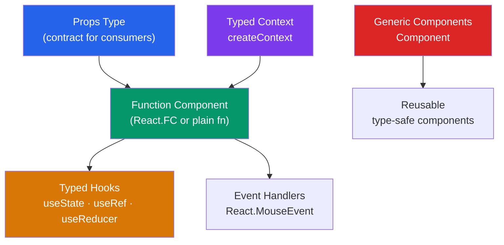

# ⚛️ TypeScript with React

> [!abstract] TL;DR
> TypeScript transforms React development by catching prop/hook mismatches at compile time and serving as inline documentation for component APIs. Key patterns: type function components with `React.FC` or plain function signatures, type `useState`/`useRef`/`useReducer` with explicit generics, type event handlers with `React.MouseEvent<HTMLButtonElement>`, type context with `createContext<T>`, and use discriminated unions for component variant props. Prefer explicit generics over `any` for ref types and reducer states.

## Intuition — analogy FIRST

TypeScript in React is like a strongly-typed contract between component author and component user. Without TypeScript, you document props in a comment and hope users comply. With TypeScript, the component's interface (`Props` type) is enforced by the compiler — missing props cause errors, wrong types cause errors, and IDEs autocomplete available props.

It's also the difference between a vending machine with labeled buttons (TypeScript: you know what you get) vs an unlabeled machine where you insert money and hope for the best (JavaScript).

---

## How It Works



---

## Key Concepts / Details

### Typing Function Components

```tsx
// Option 1: Plain function (preferred — more flexible)
interface ButtonProps {
  label: string;
  onClick: () => void;
  variant?: 'primary' | 'secondary' | 'danger';
  disabled?: boolean;
  children?: React.ReactNode;
}

function Button({ label, onClick, variant = 'primary', disabled, children }: ButtonProps) {
  return (
    <button
      className={`btn btn--${variant}`}
      onClick={onClick}
      disabled={disabled}
    >
      {children ?? label}
    </button>
  );
}

// Option 2: React.FC (adds implicit children — avoid in TS 5.1+)
// React.FC is now discouraged; use plain function
const Button: React.FC<ButtonProps> = ({ label, onClick }) => (
  <button onClick={onClick}>{label}</button>
);
```

### Common React Types

```tsx
// ReactNode — anything React can render (JSX, string, number, null, undefined, array)
type ReactNode = ReactElement | string | number | boolean | null | undefined;

// ReactElement — specifically a JSX element (return type of createElement)
type ReactElement = { type: any; props: any; key: any };

// PropsWithChildren — adds optional children to any props
type CardProps = React.PropsWithChildren<{ title: string }>;

// CSSProperties — typed inline styles
const style: React.CSSProperties = {
  color: 'red',
  marginTop: 16,
  textDecoration: 'underline'
};

// Ref types
React.RefObject<T>    // createRef() — current is T | null
React.MutableRefObject<T> // useRef(value) — current is T
```

### Typing `useState`

```tsx
// TypeScript infers the type from the initial value
const [count, setCount] = useState(0);       // [number, Dispatch<SetStateAction<number>>]
const [name, setName]   = useState('');      // [string, ...]

// Explicit generic when initial value is null/undefined or complex
const [user, setUser] = useState<User | null>(null);
const [items, setItems] = useState<Item[]>([]);

// Functional update
setCount(prev => prev + 1); // prev: number

// Lazy initialization (expensive computation)
const [data, setData] = useState<ProcessedData>(() => processData(rawData));
```

### Typing `useRef`

```tsx
// DOM ref — T | null because element might not be mounted
const inputRef = useRef<HTMLInputElement>(null);
// Access: inputRef.current?.focus()

// Mutable value ref — no null (initialized with value)
const timerRef = useRef<number | null>(null);
// timerRef.current = setTimeout(() => {}, 1000);

// Usage in component
function SearchInput() {
  const inputRef = useRef<HTMLInputElement>(null);

  useEffect(() => {
    inputRef.current?.focus();
  }, []);

  return <input ref={inputRef} type="search" />;
}
```

### Typing `useReducer`

```tsx
// Define action types as a discriminated union
type Action =
  | { type: 'INCREMENT' }
  | { type: 'DECREMENT' }
  | { type: 'RESET'; payload: number }
  | { type: 'SET_NAME'; payload: string };

interface State {
  count: number;
  name: string;
}

const initialState: State = { count: 0, name: '' };

function reducer(state: State, action: Action): State {
  switch (action.type) {
    case 'INCREMENT': return { ...state, count: state.count + 1 };
    case 'DECREMENT': return { ...state, count: state.count - 1 };
    case 'RESET':     return { ...state, count: action.payload }; // payload: number
    case 'SET_NAME':  return { ...state, name: action.payload };  // payload: string
    default:          return state;
  }
}

function Counter() {
  const [state, dispatch] = useReducer(reducer, initialState);

  return (
    <div>
      <p>Count: {state.count}</p>
      <button onClick={() => dispatch({ type: 'INCREMENT' })}>+</button>
      <button onClick={() => dispatch({ type: 'RESET', payload: 0 })}>Reset</button>
    </div>
  );
}
```

### Typing Event Handlers

```tsx
// Mouse events
function handleClick(e: React.MouseEvent<HTMLButtonElement>) {
  e.preventDefault();
  console.log(e.currentTarget.dataset.id);
}

// Change events
function handleInput(e: React.ChangeEvent<HTMLInputElement>) {
  const value = e.target.value; // string
}

function handleSelect(e: React.ChangeEvent<HTMLSelectElement>) {
  const selected = e.target.value;
}

// Form submit
function handleSubmit(e: React.FormEvent<HTMLFormElement>) {
  e.preventDefault();
  const formData = new FormData(e.currentTarget);
}

// Keyboard events
function handleKeyDown(e: React.KeyboardEvent<HTMLInputElement>) {
  if (e.key === 'Enter') submit();
}

// Inline — TypeScript infers from JSX context
<button onClick={(e) => console.log(e.target)} /> // e: React.MouseEvent<HTMLButtonElement>
```

### Typed Context

```tsx
// Always provide a meaningful default with the correct type
interface ThemeContext {
  theme: 'light' | 'dark';
  toggleTheme: () => void;
}

// Option 1: null default (requires null checks at usage)
const ThemeCtx = React.createContext<ThemeContext | null>(null);

// Helper hook that asserts non-null
function useTheme(): ThemeContext {
  const ctx = useContext(ThemeCtx);
  if (!ctx) throw new Error('useTheme must be inside ThemeProvider');
  return ctx;
}

// Option 2: non-null default (provide a placeholder)
const ThemeCtx2 = React.createContext<ThemeContext>({
  theme: 'light',
  toggleTheme: () => {}
});

// Provider
function ThemeProvider({ children }: { children: React.ReactNode }) {
  const [theme, setTheme] = useState<'light' | 'dark'>('light');
  const toggleTheme = () => setTheme(t => t === 'light' ? 'dark' : 'light');

  return (
    <ThemeCtx.Provider value={{ theme, toggleTheme }}>
      {children}
    </ThemeCtx.Provider>
  );
}
```

### Generic Components

```tsx
// Generic list component
interface ListProps<T> {
  items: T[];
  renderItem: (item: T, index: number) => React.ReactNode;
  keyExtractor: (item: T) => string | number;
  emptyMessage?: string;
}

function List<T>({ items, renderItem, keyExtractor, emptyMessage = 'No items' }: ListProps<T>) {
  if (items.length === 0) return <p>{emptyMessage}</p>;
  return (
    <ul>
      {items.map((item, i) => (
        <li key={keyExtractor(item)}>{renderItem(item, i)}</li>
      ))}
    </ul>
  );
}

// Usage — T is inferred as User from items
<List
  items={users}
  keyExtractor={u => u.id}
  renderItem={u => <span>{u.name}</span>}
/>
```

### Discriminated Union Props for Variants

```tsx
// BAD: boolean props with incompatible combinations
interface BadButtonProps {
  label: string;
  icon?: string;
  iconOnly?: boolean; // but iconOnly without icon makes no sense
}

// GOOD: discriminated union prevents impossible states
type GoodButtonProps =
  | { variant: 'text'; label: string }
  | { variant: 'icon'; icon: string; ariaLabel: string }
  | { variant: 'icon-text'; label: string; icon: string };

function Button(props: GoodButtonProps) {
  if (props.variant === 'icon') {
    return <button aria-label={props.ariaLabel}>{props.icon}</button>;
  }
  if (props.variant === 'icon-text') {
    return <button>{props.icon} {props.label}</button>;
  }
  return <button>{props.label}</button>;
}
```

---

## Real-World Notes

- **`React.FC` is largely deprecated** in the React TypeScript community. Plain function components with an explicit Props interface are preferred.
- **`useRef<T>(null)` vs `useRef<T | null>(null)`** — the first creates a `RefObject<T>` (read-only `current`, meant for DOM refs); the second creates a `MutableRefObject<T | null>`.
- **Inline event handlers in JSX** get their type inferred automatically from the element type — you don't need to annotate them.
- **`forwardRef` with TypeScript** requires an explicit generic: `React.forwardRef<HTMLInputElement, InputProps>((props, ref) => ...)`.

---

## Common Pitfalls

- **Using `any` for event types** (`e: any`) instead of the specific React event type — defeats the purpose of TypeScript.
- **Not typing the generic for `useState` when initial value is `null`** — inferred as `null`, not `T | null`.
- **Creating context with `createContext<T>({} as T)`** (double assertion) — creates a false default that passes type checking but might crash at runtime. Use the null + throwing hook pattern.
- **Forgetting `React.ReactNode` vs `React.ReactElement`** — `ReactNode` is more permissive (includes primitives); `ReactElement` is only JSX elements.

---

## Related Concepts

- [[_MOC_TypeScript|↑ Section MOC]]
- [[TypeScript_Fundamentals]] — Structural typing and inference applied to React
- [[Generics_in_TypeScript]] — Generic components are advanced generics
- [[React_Fundamentals]] — React component model this typing builds on
- [[Hooks_in_React]] — The hooks being typed here

---

## Review Questions

1. What is the difference between `React.FC<Props>` and a plain function component `function Comp(props: Props)`?
2. Write the correct `useRef` call for a DOM `<input>` element. What type is `inputRef.current`?
3. How do you type a `useReducer` where actions have different `payload` types?
4. What is a discriminated union of props and why is it better than boolean flags?
5. Why do you create a context with `createContext<T | null>(null)` rather than `createContext<T>({} as T)`?

---

## Sources

- React TypeScript Cheatsheet — https://react-typescript-cheatsheet.netlify.app/
- TypeScript docs: JSX — https://www.typescriptlang.org/docs/handbook/jsx.html
- @types/react source — https://github.com/DefinitelyTyped/DefinitelyTyped/tree/master/types/react

#web-development #typescript #react #hooks #event-types
