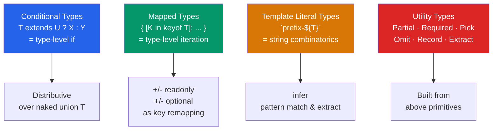

# 🧮 Type System Advanced

> [!abstract] TL;DR
> TypeScript's advanced type system is a small functional language that computes over types at compile time. **Conditional types** (`T extends U ? X : Y`) are the type-level `if`. **Mapped types** (`{ [K in keyof T]: ... }`) iterate over properties. **Template literal types** manipulate string types combinatorially. Together with `infer` for pattern matching and utility types for common transformations, these tools let you express precise type relationships that eliminate entire classes of runtime bugs.

## Intuition — analogy FIRST

Advanced TypeScript types are like a macro language that runs inside the compiler. Just as a spreadsheet's `IF()` formula computes different values based on a condition, conditional types compute different types based on a type condition. Just as a spreadsheet's autofill iterates over a column and applies a formula to each cell, mapped types iterate over the keys of a type and transform each property.

The compiler runs this "type program" at compile time and uses the result to check your JavaScript — without any runtime overhead. The types are erased; only the validation remains.

---

## How It Works



---

## Key Concepts / Details

### Conditional Types

```typescript
// Syntax: T extends U ? TrueType : FalseType
type IsString<T> = T extends string ? true : false;

type A = IsString<string>;   // true
type B = IsString<number>;   // false

// Practical: extract the non-nullable type
type NonNullable<T> = T extends null | undefined ? never : T;
type C = NonNullable<string | null | undefined>; // string

// Unwrap Promise
type Awaited<T> = T extends Promise<infer R> ? Awaited<R> : T;
type D = Awaited<Promise<string>>; // string
```

### Distributive Conditional Types

When `T` is a **naked type parameter** (not wrapped), the conditional type distributes over unions:

```typescript
type ToArray<T> = T extends any ? T[] : never;

// With union: distributes over each member
type E = ToArray<string | number>; // string[] | number[]
// NOT: (string | number)[]

// Disable distribution by wrapping in a tuple
type ToArrayNonDist<T> = [T] extends [any] ? T[] : never;
type F = ToArrayNonDist<string | number>; // (string | number)[]

// Important: never distributes as the EMPTY union
// ToArray<never> = never (never distributed over → never returned)
```

### `infer` — Pattern Matching on Types

`infer` extracts a type from within a conditional type match:

```typescript
// Extract return type of a function
type ReturnType<T> = T extends (...args: any[]) => infer R ? R : never;
type G = ReturnType<() => string>;      // string
type H = ReturnType<(n: number) => boolean>; // boolean

// Extract first argument
type FirstParam<T> = T extends (first: infer F, ...rest: any[]) => any ? F : never;
type I = FirstParam<(x: number, y: string) => void>; // number

// Unwrap array element type
type UnpackArray<T> = T extends (infer U)[] ? U : T;
type J = UnpackArray<string[]>; // string
type K = UnpackArray<string>;   // string (not an array — returns T)

// Extract promise resolution type
type UnpackPromise<T> = T extends Promise<infer V> ? V : T;
```

### Mapped Types

```typescript
// Basic: transform all properties
type ReadonlyUser = {
  readonly [K in keyof User]: User[K];
};

// Equivalent to built-in Readonly<T>
type Readonly<T> = { readonly [K in keyof T]: T[K] };

// Making all optional
type Partial<T> = { [K in keyof T]?: T[K] };

// Making all required
type Required<T> = { [K in keyof T]-?: T[K] }; // -? removes optionality

// Adding/removing modifiers with +/-
type Mutable<T>   = { -readonly [K in keyof T]: T[K] };  // remove readonly
type DeepReadonly<T> = { readonly [K in keyof T]: T[K] extends object
  ? DeepReadonly<T[K]> : T[K] };

// Homomorphic mapped type — preserves modifiers from T
// (iterating over keyof T makes it homomorphic)
type Clone<T> = { [K in keyof T]: T[K] }; // preserves readonly and ?

// With `as` key remapping (TS 4.1+)
type Getters<T> = {
  [K in keyof T as `get${Capitalize<string & K>}`]: () => T[K];
};

interface User { name: string; age: number; }
type UserGetters = Getters<User>;
// { getName: () => string; getAge: () => number; }

// Filter properties by value type
type StringOnly<T> = {
  [K in keyof T as T[K] extends string ? K : never]: T[K];
};
```

### Template Literal Types

```typescript
// Combine string literals
type Direction = 'top' | 'right' | 'bottom' | 'left';
type Padding = `padding-${Direction}`;
// "padding-top" | "padding-right" | "padding-bottom" | "padding-left"

// With string manipulation
type Uppercased<T extends string> = Uppercase<T>;
type CSSProperty = `--${Lowercase<string>}`;

// Event handler naming convention
type EventName = 'click' | 'focus' | 'blur';
type Handler = `on${Capitalize<EventName>}`;
// "onClick" | "onFocus" | "onBlur"

// Parsing string patterns
type ExtractRoute<T extends string> =
  T extends `/${infer Segment}/${infer Rest}`
    ? { segment: Segment; rest: Rest }
    : T extends `/${infer Segment}`
    ? { segment: Segment; rest: never }
    : never;

type Route = ExtractRoute<'/users/profile'>;
// { segment: "users"; rest: "profile" }
```

### Standard Utility Types

```typescript
// Property selection/omission
type Pick<T, K extends keyof T>  = { [P in K]: T[P] };
type Omit<T, K extends keyof T>  = Pick<T, Exclude<keyof T, K>>;
type Record<K extends keyof any, T> = { [P in K]: T };

// Union manipulation
type Exclude<T, U>    = T extends U ? never : T;
type Extract<T, U>    = T extends U ? T : never;
type NonNullable<T>   = T extends null | undefined ? never : T;

// Function types
type Parameters<T>  = T extends (...args: infer P) => any ? P : never;
type ReturnType<T>  = T extends (...args: any) => infer R ? R : any;
type Awaited<T>     = T extends Promise<infer R> ? Awaited<R> : T;
type NoInfer<T>     = [T][T extends any ? 0 : never]; // prevents inference site

// Practical examples
interface User {
  id: number;
  name: string;
  password: string;
  createdAt: Date;
}

type PublicUser = Omit<User, 'password'>;
type UserPreview = Pick<User, 'id' | 'name'>;
type CreateUserInput = Omit<User, 'id' | 'createdAt'>;
type UpdateUserInput = Partial<Omit<User, 'id' | 'createdAt'>>;
```

---

## Real-World Notes

- **Conditional types are the building blocks of utility types.** `ReturnType`, `Awaited`, `NonNullable`, `Extract`, `Exclude` are all conditional types.
- **`never` is the empty union.** Mapped type with `as never` on a key filters out that property. Distributive conditional type over `never` returns `never`.
- **Template literal types enable precise API contracts.** Instead of `string` for a CSS custom property name, you can enforce `--${string}` at the type level.
- **Recursive types work** but are capped at ~50 levels of recursion. Use them for JSON-like structures, deep readonly, and template parsing.

---

## Common Pitfalls

- **Forgetting distributivity** — `type F<T> = T extends any ? T[] : never` distributes over unions; wrapping `[T] extends [any]` prevents it.
- **`infer` only works inside conditional types** — you can't use `infer` in a regular generic.
- **Mapped type with non-keyof source loses homomorphism** — `{ [K in string]: T[K] }` is not homomorphic and does not preserve modifiers.
- **Over-engineering types** — if a type requires 5 layers of conditionals to express, consider whether a simpler data model would serve better.
- **Recursive types exceeding depth limit** — TypeScript will refuse to compute them, returning `any` or an error. Check depth and add base cases.

---

## Related Concepts

- [[_MOC_TypeScript|↑ Section MOC]]
- [[TypeScript_Fundamentals]] — Structural typing and inference that underpin these advanced features
- [[Generics_in_TypeScript]] — Generic constraints and `infer` extend these patterns
- [[TypeScript_with_React]] — Applying mapped/conditional types to React prop types

---

## Review Questions

1. What is a distributive conditional type? How do you prevent distribution?
2. Write a `DeepReadonly<T>` mapped type that recursively makes all nested objects readonly.
3. How does `infer` work? Implement `Parameters<T>` from scratch.
4. What does `{ [K in keyof T as T[K] extends string ? K : never]: T[K] }` produce for `{ a: string; b: number; c: string }`?
5. Why does `ToArray<never>` equal `never` when `type ToArray<T> = T extends any ? T[] : never`?

---

## Sources

- TypeScript docs: Conditional Types — https://www.typescriptlang.org/docs/handbook/2/conditional-types.html
- TypeScript docs: Mapped Types — https://www.typescriptlang.org/docs/handbook/2/mapped-types.html
- TypeScript docs: Template Literal Types — https://www.typescriptlang.org/docs/handbook/2/template-literal-types.html
- Matt Pocock: Advanced TypeScript — https://www.totaltypescript.com/books/total-typescript-essentials

#web-development #typescript #conditional-types #mapped-types #utility-types
