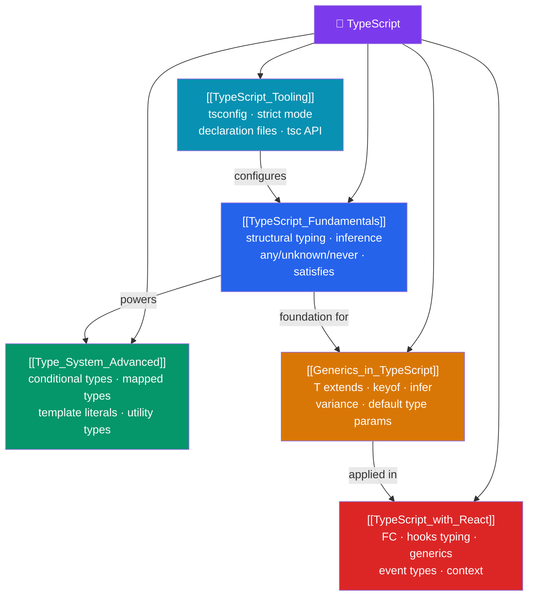

# 🔷 TypeScript — Map of Content

> [!abstract] What This Section Covers
> A structurally-typed superset of JavaScript that turns large codebases from "guess and check" into a refactorable, IDE-assisted system. TypeScript's type checker is a collaborator that catches bugs at compile time, enables confident refactoring, and serves as executable documentation. This section covers: the type system fundamentals, advanced types (conditional, mapped, template literal), generics with constraints and variance, TypeScript in React projects, and the tooling ecosystem (tsconfig, strict mode, declaration files).

## Concept Map

## Learning Path

1. [[TypeScript_Fundamentals]] — Structural typing, inference, the `any`/`unknown`/`never` trio, `interface` vs `type`, and the `satisfies` operator.
2. [[Type_System_Advanced]] — Conditional types, mapped types, template literal types, and the standard utility type catalog.
3. [[Generics_in_TypeScript]] — Generic functions/classes/interfaces, constraints, `keyof`/indexed access, variance, and `infer`.
4. [[TypeScript_with_React]] — Typing function components, hooks, events, context, and generics in React components.
5. [[TypeScript_Tooling]] — `tsconfig.json`, strict mode, declaration files (`.d.ts`), `tsc` watch mode, and project references.

## All Notes at a Glance

| Note | Difficulty | What You'll Learn |
|------|------------|-------------------|
| [[TypeScript_Fundamentals]] | Intermediate | Structural typing, union/intersection, literal types, `any`/`unknown`/`never`, `satisfies`, declaration merging |
| [[Type_System_Advanced]] | Advanced | Conditional types, distributive unions, mapped types, `+/-` modifiers, `as` remapping, template literals |
| [[Generics_in_TypeScript]] | Advanced | Generic syntax, `T extends`, `keyof`/indexed access, variance, `infer`, ReturnType/Awaited internals |
| [[TypeScript_with_React]] | Intermediate | `FC`/`ReactNode`, hook types, event types, typed context, discriminated unions for props |
| [[TypeScript_Tooling]] | Intermediate | tsconfig options, `strict`, `paths`, declaration files, monorepo project references |

## Key Questions This Section Answers

- What is structural typing, and how does it differ from nominal typing?
- When do you use `interface` vs `type` alias?
- What is the difference between `any`, `unknown`, and `never`?
- How do you write a generic function that constrains `T` to have a specific property?
- How does TypeScript's `infer` keyword work, and how is `ReturnType<T>` built?
- What is the `satisfies` operator and how is it different from a type annotation?
- How do you type `useState`, `useRef`, and `useReducer` in React?

## Related Sections

- [[_MOC_WebDev_Master|↑ Web Dev Master MOC]]
- [[_MOC_JavaScript_Core|← JavaScript Core]]
- [[_MOC_Angular|→ Angular]] (TypeScript-first framework)
- [[_MOC_React|→ React]]

#MOC #WebDevelopment #TypeScript
