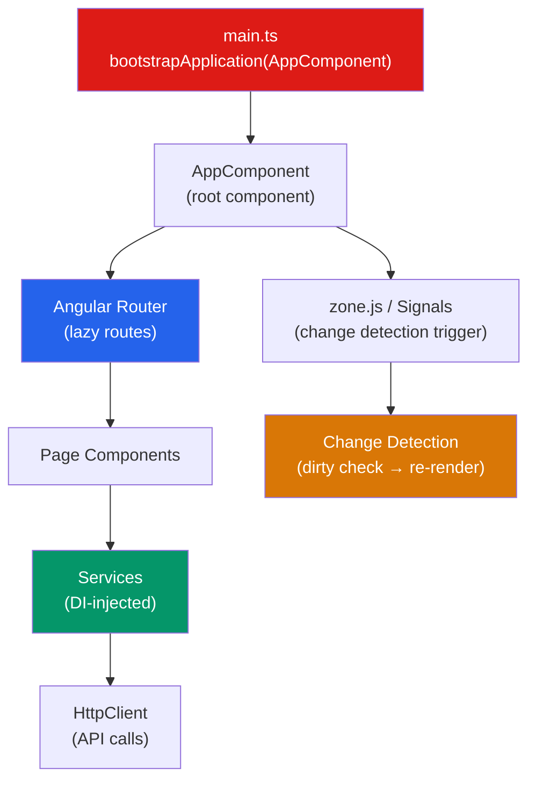

# 🅰️ Angular Architecture

> [!abstract] TL;DR
> Angular is a batteries-included, TypeScript-first framework where every piece — component model, DI system, router, reactive forms, HTTP client — is designed to work together. Modern Angular (v17+) defaults to **standalone components** (no NgModule boilerplate), **signals** for synchronous state, and **built-in control flow** (`@if`/`@for`/`@switch`). Change detection can run in zone.js (automatic) or `OnPush`/signal-based (explicit, performant). The application bootstraps from `main.ts` with `bootstrapApplication`.

## Intuition — analogy FIRST

Angular is like hiring a complete construction crew — architect, plumber, electrician, carpenter, inspector — all from the same company and trained to work together. React is like hiring independent contractors: great specialists, but you coordinate them yourself.

Angular's DI system is the crew's radio system — any worker can request a tool from the supply depot (the injector) without knowing exactly where it's stored. The router is the site foreman directing workers to the right floor. Forms are the blueprint compliance system ensuring measurements match specs. Everything is integrated and speaks the same language.

---

## How It Works



---

## Key Concepts / Details

### NgModule vs Standalone Components

**Before Angular 14:** Every component, pipe, and directive had to be declared in an `NgModule`. NgModules were the compilation unit for lazy loading and DI scope.

**Angular 17+ default:** Standalone components declare their own imports — no NgModule required:

```typescript
// OLD: NgModule-based (still works, not recommended for new code)
@NgModule({
  declarations: [AppComponent, UserCardComponent],
  imports: [CommonModule, RouterModule, HttpClientModule],
  bootstrap: [AppComponent]
})
export class AppModule {}

// NEW: Standalone (Angular 17+ default)
@Component({
  selector: 'app-user-card',
  standalone: true,
  imports: [CommonModule, RouterLink, DatePipe], // direct imports
  template: `...`
})
export class UserCardComponent {}

// Bootstrapping a standalone app
// main.ts
bootstrapApplication(AppComponent, {
  providers: [
    provideRouter(routes),
    provideHttpClient(withInterceptors([authInterceptor])),
    provideAnimations()
  ]
});
```

### Signals — Angular's Reactive Primitive

Signals (introduced in Angular 16, stable in 17) provide a fine-grained, synchronous reactivity model:

```typescript
import { signal, computed, effect } from '@angular/core';

// signal() — a writable reactive value
const count = signal(0);
count();         // read: 0
count.set(5);    // set to a new value
count.update(c => c + 1); // update based on current

// computed() — derived value, lazy and memoized
const double = computed(() => count() * 2);

// effect() — side effect that runs when dependencies change
effect(() => {
  console.log(`Count is now ${count()}`);
});

// In a component — signals automatically track for change detection
@Component({
  template: `<p>Count: {{ count() }}</p><p>Double: {{ double() }}</p>`
})
export class CounterComponent {
  count  = signal(0);
  double = computed(() => this.count() * 2);

  increment() { this.count.update(c => c + 1); }
}
```

### Change Detection Strategies

```typescript
// Default: zone.js — runs after any async event (setTimeout, HTTP, click)
@Component({ changeDetection: ChangeDetectionStrategy.Default })

// OnPush: only runs when:
// 1. An Input reference changes (not mutation)
// 2. An Observable subscribed with async pipe emits
// 3. An event originates within the component
// 4. markForCheck() is called
@Component({
  changeDetection: ChangeDetectionStrategy.OnPush
})

// Signal-based components: zone-less; only re-renders when a signal they read changes
// (experimental/evolving — Angular Ivy with signal components)
```

### Application Lifecycle

```typescript
@Component({
  selector: 'app-user',
  template: `<div>{{ user?.name }}</div>`
})
export class UserComponent implements OnInit, OnDestroy {
  user: User | null = null;
  private subscription?: Subscription;

  constructor(private userService: UserService) {}

  // 1. ngOnChanges — called before ngOnInit if component has @Input
  ngOnChanges(changes: SimpleChanges) {
    console.log('Input changed:', changes);
  }

  // 2. ngOnInit — after first ngOnChanges, component initialized
  ngOnInit() {
    this.subscription = this.userService.getUser()
      .subscribe(user => this.user = user);
  }

  // 3. ngAfterViewInit — after component's view and children initialized
  ngAfterViewInit() {
    // Access ViewChild here
  }

  // 4. ngOnDestroy — cleanup before component is removed
  ngOnDestroy() {
    this.subscription?.unsubscribe();
  }
}
```

### Angular vs React Architecture Comparison

| Aspect | Angular | React |
|--------|---------|-------|
| Type | Full framework (batteries included) | UI library (compose ecosystem) |
| Language | TypeScript-first (required) | JS or TypeScript |
| State | Signals, RxJS, NgRx | useState, Zustand, Redux |
| Routing | Built-in `@angular/router` | react-router (third-party) |
| Forms | Built-in reactive forms | Formik/React Hook Form |
| HTTP | Built-in `HttpClient` | fetch/axios (third-party) |
| Change Detection | Zone.js / OnPush / Signals | Virtual DOM diffing (Fiber) |
| Learning Curve | Steep (DI, decorators, RxJS) | Moderate (hooks, JSX) |
| Bundle Size (min) | ~60KB gzipped | ~5KB (React only) |

---

## Real-World Notes

- **Prefer standalone components in new Angular 17+ projects.** NgModules add boilerplate without adding value in most cases.
- **Use `OnPush` change detection** for all presentational (dumb) components — it dramatically reduces unnecessary re-renders in large trees.
- **Signals are the future of Angular state.** They work synchronously, integrate with templates, and work without zone.js for performant zoneless apps.
- **Zone.js can be removed** with `provideZoneChangeDetection({ eventCoalescing: true })` and `NgZone: 'noop'` — reduces bundle size by ~12KB and improves performance.

---

## Common Pitfalls

- **Mutating an `@Input` object** with `OnPush` — Angular won't detect the change because the reference hasn't changed. Emit a new object instead.
- **Memory leaks from unsubscribed Observables** — always unsubscribe in `ngOnDestroy`. Use the `async` pipe, `takeUntilDestroyed()`, or `DestroyRef` pattern.
- **Circular DI** — two services that depend on each other cause a circular injection error. Break the cycle with a third service or use `inject()` lazily.
- **Not using signals for synchronous UI state** — using RxJS `BehaviorSubject` for a counter is overkill; a `signal(0)` is simpler and more performant.

---

## Related Concepts

- [[_MOC_Angular|↑ Section MOC]]
- [[Components_and_Templates]] — How components are defined and how templates work
- [[Services_and_DI]] — The DI system that wires the app together
- [[RxJS_Observables]] — The async primitive Angular is built around

---

## Review Questions

1. What is the difference between a standalone component and an NgModule-based component?
2. Explain Angular's three change detection modes: Default (zone.js), OnPush, and signals.
3. When does `ngOnChanges` run? What does `SimpleChanges` contain?
4. What is the benefit of `OnPush` change detection, and what triggers a re-render in OnPush components?
5. How do signals in Angular differ from RxJS Observables? When do you use each?

---

## Sources

- Angular docs: Standalone components — https://angular.dev/guide/components/importing
- Angular docs: Signals — https://angular.dev/guide/signals
- Angular docs: Change detection — https://angular.dev/best-practices/skipping-subtrees

#web-development #angular #architecture #signals #change-detection
