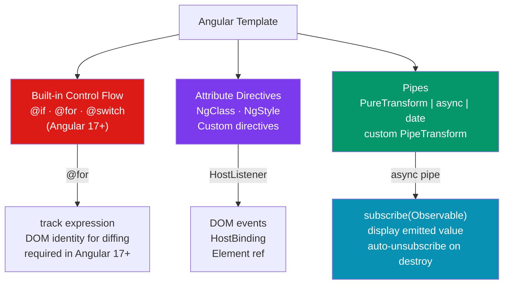

# 🔧 Angular Directives and Pipes

> [!abstract] TL;DR
> Angular directives extend HTML: **structural directives** (now built-in control flow `@if`/`@for`/`@switch` in v17+, or legacy `*ngIf`/`*ngFor`/`*ngSwitch`) add or remove DOM elements. **Attribute directives** change the appearance or behavior of an existing element (`NgClass`, `NgStyle`, custom). **Pipes** transform values in templates (`| date`, `| currency`, `| async`, `| json`); custom pipes implement `PipeTransform`. The **`async` pipe** is the critical bridge between observables and templates — it subscribes, displays the emitted value, and automatically unsubscribes on component destroy. In Angular 17+, the new `@if`/`@for` built-in control flow replaces `*ngIf`/`*ngFor` with better syntax, better type narrowing, and required `track` for list identity.

## Intuition — analogy FIRST

**Structural directives** are like a construction crew: they decide which rooms (DOM nodes) exist. `@if` builds or demolishes a room based on a condition. `@for` installs multiple copies of the same room model in a row.

**Attribute directives** are like interior decorators: they leave the rooms where they are but change how they look or behave. `NgClass` repaints walls; a custom `highlightOnHover` directive installs a motion sensor that changes the lighting.

**Pipes** are like a translator standing at the door: raw data goes in (`1720000000000`), formatted output comes out (`July 3, 2024`). They are stateless functions applied in templates, chained with `|`.

The **`async` pipe** is like a live news ticker feed: it knows how to connect to the broadcast (Observable), display the latest headline (current value), and disconnect cleanly when the TV is turned off (component destroy).

---

## How It Works



---

## Key Concepts / Details

### Built-in Control Flow (Angular 17+)

```html
<!-- @if — replaces *ngIf, with built-in type narrowing -->
@if (user) {
  <p>{{ user.name }}</p>  <!-- user is narrowed to non-null here -->
} @else if (loading) {
  <app-skeleton />
} @else {
  <p>No user found</p>
}

<!-- @for — replaces *ngFor, track is REQUIRED -->
@for (item of items; track item.id) {
  <app-item [item]="item" />
} @empty {
  <!-- renders when items is empty — no separate *ngIf needed -->
  <p>No items found</p>
}

<!-- Available loop variables -->
@for (item of items; track item.id; let i = $index, last = $last, first = $first, even = $even) {
  <div [class.last]="last" [class.even]="even">{{ i + 1 }}. {{ item.name }}</div>
}

<!-- @switch — replaces *ngSwitch -->
@switch (status) {
  @case ('active')   { <span class="badge-green">Active</span> }
  @case ('inactive') { <span class="badge-gray">Inactive</span> }
  @case ('pending')  { <span class="badge-yellow">Pending</span> }
  @default           { <span>Unknown</span> }
}
```

### Legacy Structural Directives (*ngIf, *ngFor)

```html
<!-- *ngIf — still works, but @if is preferred in Angular 17+ -->
<div *ngIf="user; else loading">
  <p>{{ user.name }}</p>
</div>
<ng-template #loading>
  <app-skeleton />
</ng-template>

<!-- *ngFor -->
<ul>
  <li *ngFor="let item of items; trackBy: trackById; let i = index; let last = last"
      [class.last-item]="last">
    {{ i + 1 }}. {{ item.name }}
  </li>
</ul>

<!-- trackBy function in component -->
trackById(index: number, item: Item): string {
  return item.id; // return unique identifier for DOM diffing
}

<!-- ng-container — structural directive host without a DOM element -->
<ng-container *ngIf="isAdmin">
  <button>Delete</button>
  <button>Edit</button>
</ng-container>
```

### Attribute Directives — NgClass and NgStyle

```html
<!-- NgClass — bind class names conditionally -->
<div [ngClass]="{
  'text-green-600': user.active,
  'text-red-600': !user.active,
  'font-bold': user.role === 'admin',
  'border': true
}">{{ user.name }}</div>

<!-- NgClass with array of classes -->
<button [ngClass]="['btn', variant === 'primary' ? 'btn-primary' : 'btn-secondary']">
  Click
</button>

<!-- NgStyle — bind inline styles -->
<div [ngStyle]="{
  'background-color': user.themeColor,
  'font-size': baseFontSize + 'px',
  'display': isVisible ? 'block' : 'none'
}">Content</div>
```

### Custom Attribute Directive

```typescript
import { Directive, ElementRef, HostListener, HostBinding, Input, inject } from '@angular/core';

@Directive({
  selector: '[appHighlight]',  // matches <div appHighlight>
  standalone: true,
})
export class HighlightDirective {
  // Input — configurable via template: <div appHighlight color="yellow">
  @Input('appHighlight') highlightColor = '#fef08a'; // default yellow

  private el = inject(ElementRef);

  @HostBinding('style.backgroundColor') bgColor = '';
  @HostBinding('style.transition') transition = 'background-color 200ms';

  @HostListener('mouseenter') onMouseEnter() {
    this.bgColor = this.highlightColor;
  }

  @HostListener('mouseleave') onMouseLeave() {
    this.bgColor = '';
  }
}

// Usage
// <p appHighlight>Highlights on hover</p>
// <p [appHighlight]="'#bfdbfe'">Custom blue highlight</p>
```

```typescript
// Modern signal-based directive approach
import { Directive, input, HostListener, HostBinding } from '@angular/core';

@Directive({ selector: '[appTooltip]', standalone: true })
export class TooltipDirective {
  appTooltip = input<string>('');  // signal input — replaces @Input()

  @HostBinding('attr.title') get title() { return this.appTooltip(); }
  @HostBinding('attr.aria-label') get ariaLabel() { return this.appTooltip(); }
}
```

### Built-in Pipes

```html
<!-- Date pipe -->
{{ user.createdAt | date }}                    <!-- Jul 3, 2024 -->
{{ user.createdAt | date:'shortTime' }}        <!-- 2:30 PM -->
{{ user.createdAt | date:'yyyy-MM-dd HH:mm' }} <!-- 2024-07-03 14:30 -->

<!-- Number and currency pipes -->
{{ price | currency:'USD':'symbol':'1.2-2' }}  <!-- $1,234.56 -->
{{ ratio | percent:'1.1-1' }}                  <!-- 73.4% -->
{{ bigNum | number:'1.0-0' }}                  <!-- 1,234,567 -->

<!-- String pipes -->
{{ 'hello world' | titlecase }}                <!-- Hello World -->
{{ 'hello world' | uppercase }}                <!-- HELLO WORLD -->
{{ longText | slice:0:100 }}                   <!-- first 100 chars -->

<!-- Object and debugging -->
{{ obj | json }}                               <!-- pretty-printed JSON -->
{{ arr | keyvalue }}                           <!-- [{key, value}] array -->

<!-- Async pipe — the most important pipe -->
{{ user$ | async }}                            <!-- subscribe + display -->

<!-- Async pipe with *ngIf for null safety -->
@if (user$ | async; as user) {
  <p>{{ user.name }}</p>
}

<!-- Multiple async pipes with ng-container -->
@if ({ user: user$ | async, posts: posts$ | async }; as data) {
  <p>{{ data.user?.name }}</p>
  <p>{{ data.posts?.length }} posts</p>
}
```

### Custom Pipes

```typescript
import { Pipe, PipeTransform } from '@angular/core';

// Pure pipe (default) — only re-runs when input reference changes
// Impure pipe (pure: false) — re-runs every change detection cycle (expensive!)
@Pipe({
  name: 'truncate',
  standalone: true,
  pure: true,  // default — only runs when input changes
})
export class TruncatePipe implements PipeTransform {
  transform(value: string, limit = 50, trail = '…'): string {
    if (!value) return '';
    return value.length > limit ? value.substring(0, limit) + trail : value;
  }
}

// Usage: {{ longText | truncate }}
//        {{ longText | truncate:100 }}
//        {{ longText | truncate:100:'...' }}

// Async custom pipe (useful for complex transformations)
@Pipe({ name: 'userAvatar', standalone: true })
export class UserAvatarPipe implements PipeTransform {
  private cdn = inject(CdnService);

  transform(userId: string): Observable<string> {
    return this.cdn.getAvatarUrl(userId);
  }
}
// Usage: {{ userId | userAvatar | async }}

// Pipe chaining — pipes compose left to right
{{ description | truncate:100 | uppercase }}
{{ price | currency:'EUR' | lowercase }}
```

---

## Trade-offs

| | Built-in Control Flow (@if/@for) | *ngIf / *ngFor | 
|---|---|---|
| Syntax | Template-native | Microsyntax on attributes |
| Type narrowing | Excellent (@if narrows type) | Requires `as user` |
| Empty state | `@empty` block built-in | Separate *ngIf needed |
| `track` | Required (explicit) | Optional `trackBy` function |
| Angular version | 17+ | All versions |
| Performance | Slightly better | Same (both use Ivy) |

---

## Real-World Notes

- **Always use `track` in `@for`** — Angular requires it (not optional). Use a unique identifier (`item.id`), never `$index` for lists that can reorder or have insertions/deletions.
- **`async` pipe over manual subscription** — manual subscriptions in components need `ngOnDestroy` cleanup. `async` pipe subscribes and unsubscribes automatically. Use it wherever possible.
- **Prefer built-in control flow over `*ngIf`/`*ngFor`** in Angular 17+ projects. The `@if` block provides better type narrowing (the `else` branch knows the variable is null/undefined).
- **Keep pipes pure** — impure pipes (`pure: false`) run on *every* change detection cycle, which can devastate performance. If you need impure behavior, convert to a method call or use signals.

---

## Common Pitfalls

- **`@for` without `track`** — Angular 17+ requires a `track` expression; missing it is a compile error. Unlike `trackBy` in `*ngFor`, there's no default fallback.
- **Multiple `async` pipe subscriptions to the same Observable** — each pipe creates a separate subscription, so `{{ obs$ | async }}{{ obs$ | async }}` triggers two HTTP requests. Use `@if (obs$ | async; as value)` to share one subscription.
- **Impure pipe in a large list** — an impure pipe in `@for` runs for every item on every change detection cycle. Profile before using `pure: false`.
- **`*ngIf` and `*ngFor` on the same element** — you can't apply two structural directives to one element. Use `<ng-container>` as a wrapper for the outer directive.

---

## Related Concepts

- [[_MOC_Angular|↑ Section MOC]]
- [[Components_and_Templates]] — Where control flow and pipes are used in templates
- [[RxJS_Observables]] — The streams that `async` pipe subscribes to
- [[Angular_Signals]] — `@if` with signals narrows types; signals in templates replace some `async` pipe patterns

---

## Review Questions

1. What are the three types of built-in control flow in Angular 17+, and what do they replace?
2. Why must `@for` have a `track` expression? What happens without it?
3. What does the `async` pipe do beyond just displaying the current Observable value?
4. When would you use `<ng-container>` vs a regular `<div>` with a structural directive?
5. What is the difference between a pure and impure pipe? When is `pure: false` justified?

---

## Sources

- Angular docs: Built-in control flow — https://angular.dev/guide/templates/control-flow
- Angular docs: Attribute directives — https://angular.dev/guide/directives/attribute-directives
- Angular docs: Pipes — https://angular.dev/guide/pipes

#web-development #angular #directives #pipes #ngif #ngfor #async-pipe
