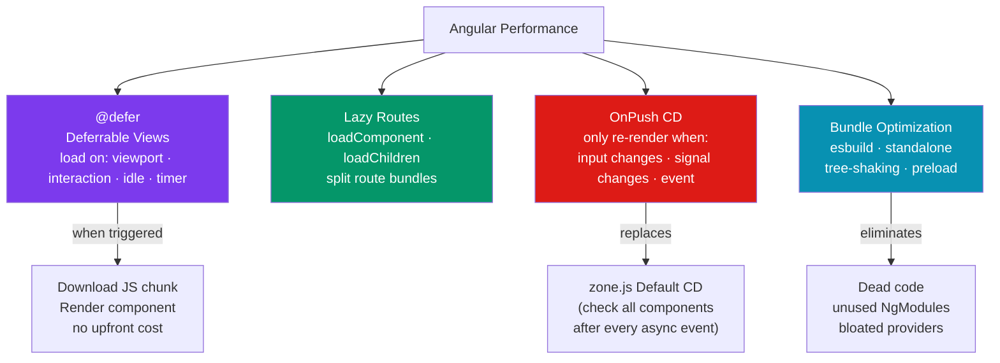

# ⚡ Angular Performance

> [!abstract] TL;DR
> Angular performance centers on four pillars: **`@defer`** (deferrable views — lazy-load component templates based on triggers: viewport, interaction, idle, timer), **lazy-loaded routes** (split bundles per route, load on navigation), **`OnPush` change detection** (only check a component subtree when inputs change, an event fires, or a signal changes), and **bundle optimization** (tree-shaking, standalone components eliminating NgModule overhead, `@angular/build` with esbuild). Signals-based change detection (Angular 18+ experimental zoneless) is the long-term path to near-zero unnecessary re-renders.

## Intuition — analogy FIRST

Angular performance strategies are like managing a large restaurant:

- **`@defer`** — only set a table when a guest is about to sit down (interaction trigger) or when you can see them approaching (viewport trigger). No upfront work for tables that stay empty.
- **Lazy-loaded routes** — each floor of the restaurant (route bundle) is only staffed and stocked when guests request that floor. You don't hire the banquet hall team on opening morning if no banquets are booked.
- **`OnPush` change detection** — instead of inspecting every table for dirty dishes after every event, you only check a table when a guest signals they've finished (input change or event) — far fewer inspections.
- **Bundle optimization** — removing ingredients from the pantry that are listed on the recipe card but never used in any dish (tree-shaking dead code). The pantry is smaller, the delivery truck holds more.

---

## How It Works



---

## Key Concepts / Details

### @defer — Deferrable Views (Angular 17+)

```html
<!-- @defer is the most powerful Angular performance feature since lazy routing -->

<!-- Basic defer — loads when browser is idle (default) -->
@defer {
  <app-heavy-chart [data]="chartData" />
}

<!-- with @loading and @placeholder states -->
@defer (on viewport) {
  <app-product-reviews [productId]="product.id" />
} @loading (minimum 200ms) {
  <!-- Shows while component chunk is downloading -->
  <app-skeleton height="300px" />
} @error {
  <!-- Shows if chunk fails to download -->
  <p>Reviews unavailable</p>
} @placeholder (minimum 500ms) {
  <!-- Shows before defer condition triggers -->
  <div class="reviews-placeholder">Reviews load on scroll</div>
}

<!-- Trigger options -->
@defer (on idle) { ... }                  <!-- requestIdleCallback -->
@defer (on viewport) { ... }              <!-- IntersectionObserver -->
@defer (on interaction) { ... }           <!-- click or focus -->
@defer (on hover) { ... }                 <!-- mouseenter or focus -->
@defer (on timer(3000)) { ... }           <!-- after 3 seconds -->
@defer (on immediate) { ... }             <!-- next microtask (eager) -->

<!-- Conditional defer — when an expression becomes truthy -->
@defer (when isLoggedIn && hasPermission) {
  <app-admin-panel />
}

<!-- Prefetch — download the chunk early, render later -->
@defer (on interaction; prefetch on idle) {
  <app-modal-content />  <!-- downloads on idle, renders on first interaction -->
}
```

### Lazy-Loaded Routes

```typescript
// routes.ts — lazy route configuration
import { Routes } from '@angular/router';

export const routes: Routes = [
  { path: '', loadComponent: () => import('./home/home.component').then(m => m.HomeComponent) },

  // Lazy-load a standalone component
  {
    path: 'dashboard',
    loadComponent: () => import('./dashboard/dashboard.component').then(m => m.DashboardComponent),
    canActivate: [authGuard],
  },

  // Lazy-load a feature module (child routes)
  {
    path: 'products',
    loadChildren: () => import('./products/products.routes').then(m => m.productRoutes),
  },

  // Preloading strategy — download bundles in background after initial load
];

// app.config.ts — configure preloading
import { PreloadAllModules, provideRouter, withPreloading, withViewTransitions } from '@angular/router';

provideRouter(
  routes,
  withPreloading(PreloadAllModules),    // preload all lazy bundles after first paint
  withViewTransitions(),                 // smooth page transition animations
)

// Custom preloading strategy — only preload routes with data attribute
@Injectable({ providedIn: 'root' })
export class SelectivePreloadStrategy implements PreloadingStrategy {
  preload(route: Route, load: () => Observable<unknown>): Observable<unknown> {
    return route.data?.['preload'] ? load() : EMPTY;
  }
}
// routes: { path: 'admin', data: { preload: true }, loadChildren: ... }
```

### OnPush Change Detection

```typescript
import { ChangeDetectionStrategy, ChangeDetectorRef, inject, Component } from '@angular/core';

// OnPush — Angular only runs change detection for this component when:
// 1. An @Input() reference changes (not mutation)
// 2. An event originates inside the component (click, keydown, etc.)
// 3. An async pipe emits a new value
// 4. A signal the template reads changes (Angular 17+)
// 5. markForCheck() is called manually
@Component({
  selector: 'app-user-card',
  changeDetection: ChangeDetectionStrategy.OnPush, // <-- key directive
  template: `
    <div>{{ user.name }}</div>
    <div>{{ user.email }}</div>
    <button (click)="refresh()">Refresh</button>
  `,
})
export class UserCardComponent {
  @Input() user!: User;  // must pass NEW object reference to trigger re-render

  private cdr = inject(ChangeDetectorRef);

  refresh() {
    // After external async operation, mark for check manually
    this.someAsyncService.getLatestUser().subscribe(user => {
      this.user = user;
      this.cdr.markForCheck(); // tell Angular this component needs checking
    });
  }
}

// WRONG: mutating an input object with OnPush
this.user.name = 'New Name'; // reference unchanged → NO re-render

// CORRECT: replace with new object
this.user = { ...this.user, name: 'New Name' }; // new reference → re-render

// Signal-based components — future of OnPush (Angular 18+)
@Component({
  changeDetection: ChangeDetectionStrategy.OnPush, // implied with signals
  template: `<div>{{ user().name }}</div>`,
})
export class UserCardComponent {
  user = input.required<User>();  // signal input — granular reactivity
}
```

### trackBy in @for (Minimizing DOM Operations)

```html
<!-- Without track — Angular re-creates all DOM nodes on any list change -->
@for (item of items; track item.id) {  <!-- REQUIRED and correct — stable ID -->
  <app-item [item]="item" />
}

<!-- $index as track — only correct for immutable lists with no reordering -->
@for (item of items; track $index) {
  <app-item [item]="item" />  <!-- WRONG for dynamic lists — causes DOM re-use bugs -->
}
```

### Bundle Optimization

```bash
# Angular 17+ uses esbuild by default (via @angular/build)
# Significantly faster builds than webpack; smaller output

ng build --configuration=production
# → bundle splitting: main, polyfills, lazy route chunks
# → tree-shaking: unused code eliminated
# → minification: terser
# → source maps: optional

# Analyze bundle size
ng build --stats-json
npx webpack-bundle-analyzer dist/my-app/browser/stats.json
```

```typescript
// Standalone components reduce bundle size — no NgModule wrapper
// Each standalone component only bundles what it imports:

@Component({
  standalone: true,
  imports: [RouterLink, DatePipe, AsyncPipe], // only these are included
  template: `...`,
})
export class UserCardComponent {}

// NgModule-based: importing CommonModule imports ALL 30+ directives/pipes
// Standalone: import only what you use (DatePipe, not all of CommonModule)

// Optimize pipe imports
// BAD: import CommonModule (includes AsyncPipe, DatePipe, CurrencyPipe, etc.)
imports: [CommonModule]
// GOOD: import only what the template uses
imports: [AsyncPipe, DatePipe]
```

### Zoneless Angular (Angular 18+ Experimental)

```typescript
// Experimental zoneless — removes zone.js (~12KB), pure signal-based CD
import { provideExperimentalZonelessChangeDetection } from '@angular/core';

bootstrapApplication(AppComponent, {
  providers: [
    provideExperimentalZonelessChangeDetection(), // replaces zone.js
  ],
});

// angular.json — remove zone.js from polyfills
// "polyfills": [] (remove "zone.js" entry)

// With zoneless: change detection ONLY runs when:
// 1. A signal in the template changes
// 2. markForCheck() is called
// 3. An async pipe emits
// No more "run CD after every setTimeout/fetch/click" overhead
```

---

## Trade-offs

| Strategy | Effort | Impact | Risk | When to Apply |
|----------|--------|--------|------|--------------|
| `@defer` | Low | High | Low | Heavy components below the fold |
| Lazy routes | Low | High | Low | Every non-initial route |
| `OnPush` | Medium | High | Medium | All presentational components |
| Signal inputs | Low | Medium | Low | Angular 17.1+ projects |
| Standalone components | Low | Medium | Low | All new Angular 17+ code |
| Zoneless | High | High | High | Experimental — Angular 18+ only |

---

## Real-World Notes

- **`@defer` is the biggest new performance primitive in Angular 17.** Viewport-triggered defer for off-screen content (charts, comments, product recommendations) can eliminate 30-50% of initial bundle weight.
- **Apply `OnPush` to all presentational ("dumb") components.** Smart/container components (that inject services, handle routing) can stay on Default CD. Presentational components (receive data via `@Input`, emit via `@Output`) should always be `OnPush`.
- **Lazy-load every route except the initial one.** The app shell (header, nav, root layout) can be eagerly loaded; every page-level component should be lazy. This is the single highest-ROI bundle optimization.
- **Signals + `OnPush` is the transition path.** Signal inputs (`input()`) and template signals automatically make components update only when their signals change — fine-grained reactivity without manual `markForCheck()`.

---

## Common Pitfalls

- **`OnPush` and direct object mutation** — mutating a property of an `@Input` object doesn't create a new reference, so `OnPush` doesn't see a change. Always create new objects/arrays.
- **`@defer` on components with `ngOnInit` side effects** — if the deferred component makes HTTP requests in `ngOnInit`, the network request is also deferred. Plan data-fetching strategy accordingly.
- **Lazy route not lazy** — `loadChildren` must return a dynamic `import()`. Static imports (`import { routes } from './feature.routes'` at the top of the file) defeat lazy loading because they pull the module into the parent bundle.
- **`track` with non-unique values** — using `track item.name` when names aren't unique causes Angular to confuse multiple items, leading to incorrect DOM updates. Always track by a unique identifier.

---

## Related Concepts

- [[_MOC_Angular|↑ Section MOC]]
- [[Angular_Architecture]] — OnPush and zone.js are core architectural decisions
- [[Angular_Signals]] — The signal model that enables fine-grained change detection
- [[Angular_SSR_and_SSG]] — Complementary rendering performance strategy

---

## Review Questions

1. What are the five trigger types for `@defer` and when would you use each?
2. Under `OnPush` change detection, list the four conditions that cause Angular to re-check a component.
3. Why does mutating an `@Input` object not trigger `OnPush` re-rendering?
4. How does standalone `imports: [DatePipe]` reduce bundle size compared to `imports: [CommonModule]`?
5. What does zoneless Angular eliminate, and what must you use instead to drive change detection?

---

## Sources

- Angular docs: Deferrable views — https://angular.dev/guide/defer
- Angular docs: Change detection — https://angular.dev/best-practices/skipping-subtrees
- Angular docs: Lazy loading — https://angular.dev/guide/ngmodules/lazy-loading
- Angular blog: esbuild and build performance — https://blog.angular.io/angular-v17

#web-development #angular #performance #defer #lazy-loading #onpush #change-detection #zoneless
