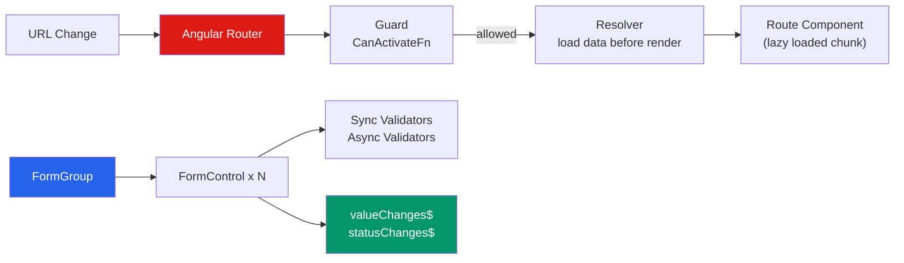

# 🗺️ Angular Routing and Forms

> [!abstract] TL;DR
> Angular Router enables SPA navigation with lazy loading, functional guards, nested routes, and preloading strategies. Reactive Forms provide a typed, programmatic model: `FormControl`/`FormGroup`/`FormArray` with sync and async validators and `valueChanges`/`statusChanges` Observable streams. NgRx implements Redux: single store, pure `(state, action) => newState` reducers, memoized selectors, and Effects for async orchestration. For simpler state, `@ngrx/signals` `signalStore` reduces boilerplate dramatically.

## Intuition — analogy FIRST

**Angular Router** is a GPS system. You define the map (routes), and when the user clicks a link, the GPS calculates the route (matches URL), lazy-loads the destination (loads the route's module), and checks access (guards before entering). Nested routes are like nested GPS sub-areas — the outer GPS handles the city, the inner handles the street.

**Reactive Forms** are like a typed contract form. You build the contract programmatically (`FormGroup`, `FormControl`), attach validation rules (validators), and listen to changes as an Observable stream — rather than polling the DOM for values.

**NgRx** is like a banking ledger. Every change to account balance must be logged as a transaction (action), the ledger rule (reducer) applies the transaction to produce the new balance (state), and auditors (devtools) can replay every transaction.

---

## How It Works



---

## Key Concepts / Details

### Route Configuration

```typescript
import { Routes } from '@angular/router';

export const routes: Routes = [
  // Eager loaded — always in initial bundle
  { path: '', component: HomeComponent },

  // Lazy loaded — separate chunk fetched on demand
  {
    path: 'dashboard',
    loadComponent: () => import('./dashboard/dashboard.component')
      .then(m => m.DashboardComponent),
    canActivate: [authGuard],
    resolve: { dashboardData: dashboardResolver }
  },

  // Nested/child routes
  {
    path: 'users',
    loadChildren: () => import('./users/users.routes')
      .then(r => r.USER_ROUTES),
    canActivate: [authGuard]
  },

  // Route with params
  { path: 'users/:id', component: UserDetailComponent },

  // Wildcard (404)
  { path: '**', component: NotFoundComponent }
];

// Register in bootstrapApplication
bootstrapApplication(AppComponent, {
  providers: [
    provideRouter(routes, withPreloading(PreloadAllModules))
  ]
});
```

### Functional Guards (Angular 15+)

```typescript
import { inject } from '@angular/core';
import { CanActivateFn, Router } from '@angular/router';

// Functional guard — concise, uses inject()
export const authGuard: CanActivateFn = (route, state) => {
  const authService = inject(AuthService);
  const router = inject(Router);

  if (authService.isAuthenticated()) {
    return true;
  }

  // Redirect to login with return URL
  return router.createUrlTree(['/login'], {
    queryParams: { returnUrl: state.url }
  });
};

// Functional resolver
export const dashboardResolver: ResolveFn<DashboardData> = (route, state) => {
  const dashService = inject(DashboardService);
  return dashService.getData(route.params['id']);
};
```

### Accessing Route Data

```typescript
import { ActivatedRoute, Router } from '@angular/router';

@Component({ ... })
export class UserDetailComponent {
  private route = inject(ActivatedRoute);
  private router = inject(Router);

  // Snapshot — current value (no updates)
  userId = this.route.snapshot.params['id'];

  // Observable — updates when route changes (same component, different param)
  userId$ = this.route.params.pipe(map(p => p['id']));

  // Resolved data
  dashboardData = this.route.snapshot.data['dashboardData'];

  // Navigate programmatically
  goToProfile() { this.router.navigate(['/users', this.userId, 'profile']); }
  goBack()      { this.router.navigate(['..'], { relativeTo: this.route }); }
}
```

### Reactive Forms

```typescript
import { FormBuilder, FormGroup, FormControl, FormArray, Validators } from '@angular/forms';

@Component({
  imports: [ReactiveFormsModule],
  template: `...`
})
export class UserFormComponent {
  private fb = inject(FormBuilder);

  // FormGroup — the root form object
  userForm: FormGroup = this.fb.group({
    name:    ['', [Validators.required, Validators.minLength(2)]],
    email:   ['', [Validators.required, Validators.email]],
    age:     [null, [Validators.min(18), Validators.max(120)]],
    address: this.fb.group({          // nested group
      street: ['', Validators.required],
      city:   ['']
    }),
    phones: this.fb.array([           // dynamic array
      this.fb.control('', Validators.pattern(/^\d{10}$/))
    ])
  });

  // Strongly typed (Angular 14+)
  typedForm = this.fb.group({
    name: this.fb.nonNullable.control(''),  // never null
    age:  this.fb.nonNullable.control(0)
  });

  get phones() { return this.userForm.get('phones') as FormArray; }

  addPhone() {
    this.phones.push(this.fb.control(''));
  }

  removePhone(i: number) {
    this.phones.removeAt(i);
  }

  onSubmit() {
    if (this.userForm.valid) {
      const value = this.userForm.value;
    }
  }
}
```

```html
<!-- Template binding -->
<form [formGroup]="userForm" (ngSubmit)="onSubmit()">
  <input formControlName="name">
  <div *ngIf="userForm.get('name')?.errors?.['required'] && userForm.get('name')?.touched">
    Name is required
  </div>

  <div formGroupName="address">
    <input formControlName="street">
    <input formControlName="city">
  </div>

  <div formArrayName="phones">
    <div *ngFor="let phone of phones.controls; let i = index">
      <input [formControlName]="i">
      <button type="button" (click)="removePhone(i)">Remove</button>
    </div>
  </div>

  <button type="submit" [disabled]="userForm.invalid">Submit</button>
</form>
```

### Async Validators

```typescript
import { AsyncValidatorFn, AbstractControl, ValidationErrors } from '@angular/forms';

export function uniqueEmailValidator(userService: UserService): AsyncValidatorFn {
  return (control: AbstractControl): Observable<ValidationErrors | null> => {
    return userService.checkEmailTaken(control.value).pipe(
      debounceTime(300),
      map(isTaken => isTaken ? { emailTaken: true } : null),
      catchError(() => of(null)) // don't block on API error
    );
  };
}

// Apply
email: ['', [Validators.email], [uniqueEmailValidator(inject(UserService))]]
//          ↑ sync validators   ↑ async validators (third arg)
```

### NgRx — Redux in Angular

```typescript
// 1. Actions — describe what happened
import { createAction, props } from '@ngrx/store';

export const loadUsers = createAction('[Users] Load Users');
export const loadUsersSuccess = createAction(
  '[Users] Load Users Success',
  props<{ users: User[] }>()
);
export const loadUsersFailure = createAction(
  '[Users] Load Users Failure',
  props<{ error: string }>()
);
export const selectUser = createAction(
  '[Users] Select User',
  props<{ userId: number }>()
);

// 2. Reducer — pure (state, action) => newState
import { createReducer, on } from '@ngrx/store';

interface UsersState { users: User[]; loading: boolean; error: string | null; }
const initialState: UsersState = { users: [], loading: false, error: null };

export const usersReducer = createReducer(
  initialState,
  on(loadUsers, state => ({ ...state, loading: true })),
  on(loadUsersSuccess, (state, { users }) => ({ ...state, loading: false, users })),
  on(loadUsersFailure, (state, { error }) => ({ ...state, loading: false, error }))
);

// 3. Selectors — memoized derived state
import { createFeatureSelector, createSelector } from '@ngrx/store';

const selectUsersState = createFeatureSelector<UsersState>('users');
export const selectAllUsers  = createSelector(selectUsersState, s => s.users);
export const selectLoading   = createSelector(selectUsersState, s => s.loading);
export const selectActiveUsers = createSelector(
  selectAllUsers,
  users => users.filter(u => u.isActive)
);

// 4. Effects — async side effects
import { Actions, createEffect, ofType } from '@ngrx/effects';

@Injectable()
export class UsersEffects {
  private actions$ = inject(Actions);
  private userService = inject(UserService);

  loadUsers$ = createEffect(() =>
    this.actions$.pipe(
      ofType(loadUsers),
      switchMap(() =>
        this.userService.getAll().pipe(
          map(users => loadUsersSuccess({ users })),
          catchError(err => of(loadUsersFailure({ error: err.message })))
        )
      )
    )
  );
}

// 5. Component usage
@Component({ ... })
export class UsersComponent {
  private store = inject(Store);

  users$   = this.store.select(selectAllUsers);
  loading$ = this.store.select(selectLoading);

  ngOnInit() { this.store.dispatch(loadUsers()); }
  onSelect(userId: number) { this.store.dispatch(selectUser({ userId })); }
}
```

### `@ngrx/signals` — Simpler Local State

```typescript
import { signalStore, withState, withComputed, withMethods, patchState } from '@ngrx/signals';

export const UsersStore = signalStore(
  { providedIn: 'root' },
  withState({ users: [] as User[], loading: false }),
  withComputed(({ users }) => ({
    activeUsers: computed(() => users().filter(u => u.isActive)),
    userCount: computed(() => users().length)
  })),
  withMethods((store, userService = inject(UserService)) => ({
    async loadUsers() {
      patchState(store, { loading: true });
      const users = await firstValueFrom(userService.getAll());
      patchState(store, { users, loading: false });
    }
  }))
);

// In component
@Component({ ... })
export class UsersComponent {
  store = inject(UsersStore);
  // store.users(), store.activeUsers(), store.userCount(), store.loadUsers()
}
```

---

## Real-World Notes

- **Prefer `loadComponent` over `loadChildren`** for single lazy-loaded components; `loadChildren` is still used for a complete sub-routing config.
- **Functional guards replaced class-based guards** in Angular 15. They're simpler, tree-shakeable, and work naturally with `inject()`.
- **Reactive Forms over Template-driven Forms** for complex scenarios — reactive forms are testable, composable, and observable.
- **Start with `signalStore`, escalate to NgRx** only for cross-cutting, auditable, or complex async orchestration needs.

---

## Common Pitfalls

- **Lazy-loaded route components not being standalone** — lazy-loaded components must be standalone or in a lazy-loaded NgModule.
- **`switchMap` in effects for POST/PUT requests** — if the user navigates away, the request is cancelled. Use `exhaustMap` or `mergeMap` for write operations.
- **Not resetting form after submit** — `this.form.reset()` resets values but also marks all controls as pristine and untouched.
- **Accessing route params via snapshot in a component reused across routes** — snapshot doesn't update; use `this.route.params` Observable.

---

## Related Concepts

- [[_MOC_Angular|↑ Section MOC]]
- [[RxJS_Observables]] — Router events, form streams, and NgRx actions are Observables
- [[Services_and_DI]] — Guards and resolvers use `inject()` from DI
- [[Components_and_Templates]] — Components rendered at route destinations

---

## Review Questions

1. What is the difference between `loadComponent` and `loadChildren` for lazy loading?
2. Write a functional `authGuard` that redirects to `/login` if `AuthService.isAuthenticated()` returns false.
3. Explain the NgRx data flow: action → reducer → store → selector → component → dispatch.
4. What is the difference between a `FormControl`, `FormGroup`, and `FormArray`?
5. When do you use `@ngrx/signals` `signalStore` vs the full NgRx `createEffect` + `createAction` pattern?

---

## Sources

- Angular docs: Router — https://angular.dev/guide/routing
- Angular docs: Reactive Forms — https://angular.dev/guide/forms/reactive-forms
- NgRx docs — https://ngrx.io/docs
- Angular docs: Guards — https://angular.dev/guide/routing/common-router-tasks#preventing-unauthorized-access

#web-development #angular #routing #reactive-forms #ngrx
