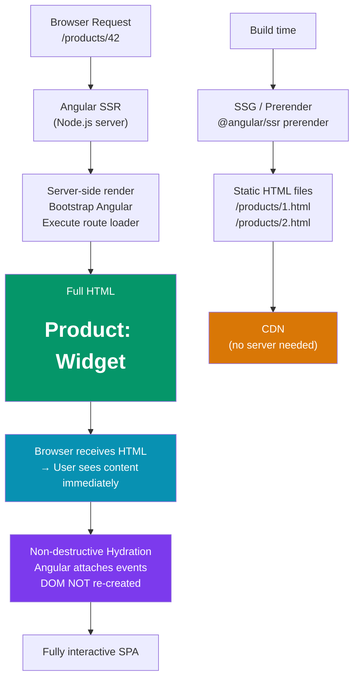

# 🖥️ Angular SSR and SSG

> [!abstract] TL;DR
> Angular SSR (Server-Side Rendering) uses **Angular Universal** — the server renders the full HTML on the first request, the browser receives populated HTML, and **hydration** attaches Angular event listeners to the existing DOM (no re-render from scratch). **SSG** (Static Site Generation) pre-renders pages at build time — no server needed, can be served from a CDN. Angular 17+ ships SSR by default via `@angular/ssr` with **non-destructive hydration** — the server HTML is kept intact and events are attached without destroying and re-creating DOM nodes. **Scully** is an Angular-specific SSG tool that uses route discovery to pre-render Angular apps.

## Intuition — analogy FIRST

Rendering strategies are like different ways to prepare a restaurant order:

- **CSR (Client-Side Rendering)** — you receive an empty plate and a recipe. The kitchen (browser JavaScript) cooks the meal in front of you. First bite takes a while.
- **SSR (Server-Side Rendering)** — the restaurant pre-cooks your meal on the server and brings it fully plated. You see food immediately. The waiter (hydration) then explains the menu and takes future orders.
- **SSG (Static Site Generation)** — the restaurant pre-cooks *all* possible meals before opening. When you order, your plate arrives instantly from the stockroom (CDN cache). No kitchen needed at runtime.
- **Hydration** — the critical step where your pre-cooked meal (server HTML) gets "connected" to the ordering system (Angular's event system). Without hydration, you'd have to throw away the pre-cooked meal and cook it again from scratch (old Angular Universal behavior).

---

## How It Works



---

## Key Concepts / Details

### Setting Up Angular SSR (Angular 17+)

```bash
# Create new project with SSR
ng new my-app --ssr

# Add SSR to an existing project
ng add @angular/ssr

# After adding, project structure gains:
# server.ts          — Express server entry point
# app.config.server.ts — Server-specific providers
```

```typescript
// app.config.ts — shared browser/server config
import { ApplicationConfig } from '@angular/core';
import { provideRouter, withComponentInputBinding } from '@angular/router';
import { provideClientHydration, withEventReplay } from '@angular/platform-browser';
import { provideHttpClient, withFetch } from '@angular/common/http';

export const appConfig: ApplicationConfig = {
  providers: [
    provideRouter(routes, withComponentInputBinding()),
    provideClientHydration(withEventReplay()), // enables non-destructive hydration
    provideHttpClient(withFetch()),             // use fetch API (works on server too)
  ],
};

// app.config.server.ts — server-only providers
import { mergeApplicationConfig } from '@angular/core';
import { provideServerRendering } from '@angular/platform-server';

export const serverConfig = mergeApplicationConfig(appConfig, {
  providers: [provideServerRendering()],
});

// server.ts — Express server
import { APP_BASE_HREF } from '@angular/common';
import { CommonEngine } from '@angular/ssr';
import express from 'express';
import { fileURLToPath } from 'node:url';
import { dirname, join, resolve } from 'node:path';
import bootstrap from './src/main.server';

export function app(): express.Express {
  const server = express();
  const distFolder = join(dirname(fileURLToPath(import.meta.url)), '../browser');
  const indexHtml = join(distFolder, 'index.html');
  const commonEngine = new CommonEngine();

  server.get('**', (req, res, next) => {
    commonEngine
      .render({
        bootstrap,
        documentFilePath: indexHtml,
        url: `${req.protocol}://${req.headers.host}${req.originalUrl}`,
        publicPath: distFolder,
        providers: [{ provide: APP_BASE_HREF, useValue: req.baseUrl }],
      })
      .then(html => res.send(html))
      .catch(err => next(err));
  });

  return server;
}
```

### Non-Destructive Hydration

```typescript
// Old Angular Universal (pre-v17) — destructive hydration
// Server renders HTML → client downloads JS → Angular bootstraps → destroys server HTML
// → re-renders everything → user sees flicker/flash

// Angular 17+ non-destructive hydration
// Server renders HTML → client downloads JS → Angular traverses existing DOM
// → attaches event listeners WITHOUT destroying DOM nodes
// → no flicker, no re-rendering, no layout shift

// provideClientHydration() enables this:
providers: [provideClientHydration()]

// withEventReplay() — captures events that fire before hydration completes
// Example: user clicks a button during the hydration window → event is replayed
providers: [provideClientHydration(withEventReplay())]

// Skip hydration for components that manage their own DOM
@Component({
  selector: 'app-map',
  template: '<div id="map"></div>',
})
export class MapComponent {
  // This component uses a third-party map library that manipulates DOM directly
  // Angular shouldn't try to hydrate/take ownership of its DOM
}
// Add to the component: @Component({ ..., host: { 'ngSkipHydration': 'true' } })
```

### SSG — Prerendering Routes

```typescript
// angular.json — configure prerendering
{
  "architect": {
    "prerender": {
      "builder": "@angular/build:prerender",
      "options": {
        "routes": [
          "/",
          "/about",
          "/blog",
          "/products"
        ]
      }
    }
  }
}

// For dynamic routes — provide routes list
// routes.txt (used by CLI prerenderer)
// /products/1
// /products/2
// /blog/hello-world
// /blog/angular-17-features

// OR: generate routes programmatically
// prerender-routes.ts
import { PrerenderFallback, RenderMode, ServerRoute } from '@angular/ssr';

export const serverRouteConfig: ServerRoute[] = [
  { path: '/about',    renderMode: RenderMode.Prerender },   // SSG
  { path: '/blog/:id', renderMode: RenderMode.Server },      // SSR (dynamic)
  { path: '/dashboard',renderMode: RenderMode.Client },      // CSR (auth-required)
];
```

### Platform Detection — Browser vs Server

```typescript
import { isPlatformBrowser, isPlatformServer } from '@angular/common';
import { PLATFORM_ID, inject } from '@angular/core';

@Component({ standalone: true, template: '' })
export class AnalyticsComponent implements OnInit {
  private platformId = inject(PLATFORM_ID);

  ngOnInit() {
    // Guard browser-only APIs
    if (isPlatformBrowser(this.platformId)) {
      // Safe to use: window, document, localStorage, navigator
      this.initGoogleAnalytics();
      window.scrollTo(0, 0);
    }

    if (isPlatformServer(this.platformId)) {
      // Server-only logic (e.g., cache headers, meta tags)
    }
  }
}

// Common SSR traps — these crash on the server:
// localStorage.getItem(...)  → ReferenceError: localStorage is not defined
// window.innerWidth           → ReferenceError: window is not defined
// document.getElementById()  → ReferenceError: document is not defined

// Fix with: inject(PLATFORM_ID) + isPlatformBrowser check
```

### Scully — Angular-Specific SSG

```bash
# Add Scully to existing Angular project
npx scully init

# Scully discovers routes from the Angular router and pre-renders each one
# Outputs: static HTML + JSON for each route
```

```typescript
// scully.my-app.config.ts
import { ScullyConfig } from '@scullyio/scully';

export const config: ScullyConfig = {
  projectRoot: './src',
  projectName: 'my-app',
  outDir: './dist/static',
  routes: {
    '/blog/:slug': {
      type: 'json',
      slug: {
        url: 'https://api.myblog.com/posts',
        property: 'slug',
      },
    },
    '/products/:id': {
      type: 'json',
      id: {
        url: 'https://api.myshop.com/products',
        property: 'id',
      },
    },
  },
};
```

---

## Trade-offs

| Strategy | First Paint | SEO | Server Required | Dynamic | Best For |
|----------|------------|-----|----------------|---------|---------|
| CSR | Slow (blank then render) | Poor | No | Yes | Auth-gated apps, dashboards |
| SSR | Fast (full HTML) | Excellent | Yes (Node.js) | Yes | E-commerce, news sites |
| SSG | Instant (CDN) | Excellent | No (CDN only) | No (rebuild for changes) | Blogs, docs, marketing |
| Hybrid (SSR+SSG) | Fast | Excellent | Yes | Mixed | Most production apps |

---

## Real-World Notes

- **Hydration is not optional for SSR apps.** Without `provideClientHydration()`, Angular destroys the server HTML and re-renders from scratch — defeating the purpose of SSR. The old behavior caused a visible flash.
- **`withFetch()` is required for SSR.** Angular's default `XmlHttpRequest`-based HTTP doesn't work in Node.js. `provideHttpClient(withFetch())` uses the Node.js `fetch` API.
- **Guard all browser-only APIs** — accessing `window`, `localStorage`, `document` directly causes "ReferenceError: window is not defined" on the server. Use `isPlatformBrowser()`.
- **Prerender static routes, SSR dynamic ones.** The hybrid approach: `/about`, `/pricing` → SSG (pre-built); `/products/:id` → SSR (fetches live inventory); `/dashboard` → CSR (auth-protected).

---

## Common Pitfalls

- **`localStorage`/`sessionStorage` in service constructors** — services are instantiated on the server where these don't exist. Guard with `isPlatformBrowser` or lazy-initialize.
- **Hydration mismatch** — if server HTML doesn't match what the client would render (e.g., using `new Date()` without timezone normalization), Angular logs a hydration mismatch warning and falls back to full re-render.
- **Third-party libraries that manipulate the DOM** — chart libraries, map libraries, and drag-drop libraries crash on the server. Wrap in `isPlatformBrowser` check or add `ngSkipHydration`.
- **Not setting `Transfer-Control-Allow-Origin` headers** — SSR-fetched API data isn't automatically cached. Use `TransferState` to transfer server-fetched data to the client, avoiding duplicate requests.

---

## Related Concepts

- [[_MOC_Angular|↑ Section MOC]]
- [[Angular_Performance]] — SSR and hydration are key performance optimization strategies
- [[Angular_Routing_Forms]] — Route configuration determines which routes are SSR vs SSG vs CSR
- [[Next_js]] — React's SSR/SSG equivalent for comparison

---

## Review Questions

1. What is the difference between "destructive" and "non-destructive" hydration in Angular?
2. Why must you guard `window`/`localStorage` access in SSR Angular apps?
3. When would you choose SSG over SSR for a specific route?
4. What does `withFetch()` in `provideHttpClient()` enable for SSR?
5. How does `withEventReplay()` improve the user experience during the hydration window?

---

## Sources

- Angular docs: Server-side rendering — https://angular.dev/guide/ssr
- Angular docs: Hydration — https://angular.dev/guide/hydration
- Scully docs: https://scully.io
- Angular blog: Angular v17 SSR improvements — https://blog.angular.io/introducing-angular-v17

#web-development #angular #ssr #ssg #hydration #angular-universal #scully
