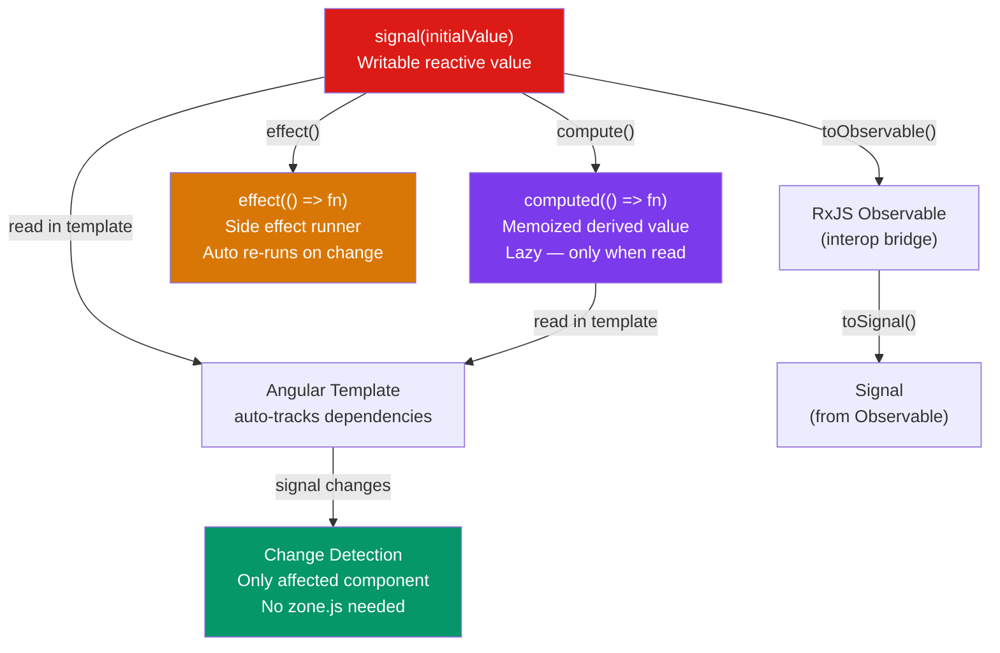

# ⚡ Angular Signals

> [!abstract] TL;DR
> Angular Signals (v16 developer preview, v17+ stable) are a synchronous, fine-grained reactivity primitive — a wrapper around a value that notifies consumers when it changes. `signal()` creates a writable reactive value. `computed()` creates a memoized derived value that recalculates lazily. `effect()` runs a side effect when any signal it reads changes. Signals integrate directly with Angular's template engine — reading a signal in a template sets up automatic re-render tracking without zone.js. They are the future of Angular state; the goal is a fully zoneless Angular.

## Intuition — analogy FIRST

Signals are like a **live scoreboard** connected to a central display:

- `signal(0)` — the scoreboard counter (writable value).
- `computed(() => score() * 2)` — a secondary display that automatically shows double the score. It updates only when the scoreboard changes, and only if someone is watching it (lazy evaluation).
- `effect(() => console.log(score()))` — a PA system that announces the score whenever it changes. It "subscribes" by simply reading the signal.

The scoreboard doesn't push updates on a schedule (like zone.js polling) — it notifies exactly the displays and PA systems that depend on it, the instant the value changes. That's fine-grained reactivity: no wasted computation.

The key contrast with **RxJS Observables**: signals are *synchronous* and *always have a current value* (like a variable). Observables are *asynchronous* and may never emit (like an event stream). You read a signal with `value()`; you subscribe to an observable and wait.

---

## How It Works



---

## Key Concepts / Details

### Core Signal API

```typescript
import { signal, computed, effect, untracked, Signal, WritableSignal } from '@angular/core';

// signal() — writable reactive value
const count: WritableSignal<number> = signal(0);

count();           // READ: returns current value (0)
count.set(5);      // SET: replace value entirely
count.update(c => c + 1); // UPDATE: compute new value from old
count.mutate(arr => arr.push(item)); // MUTATE: in-place mutation for arrays/objects

// computed() — derived, memoized, read-only
const double: Signal<number> = computed(() => count() * 2);
// - Lazy: only recalculates when read AND a dependency has changed
// - Memoized: if count() hasn't changed, returns cached value
// - Read-only: no .set() or .update() methods

console.log(double()); // 10 (count is 5)
count.set(10);
console.log(double()); // 20 — recalculated because count changed

// effect() — side effects, runs when dependencies change
const stopEffect = effect(() => {
  // Any signal READ inside here becomes a dependency
  console.log(`Count is ${count()}, double is ${double()}`);
  // Runs immediately on creation, then re-runs when count or double changes
});

// Cleanup — effect returns a function to stop it
// Or use DestroyRef in a component context (auto-cleanup)
stopEffect();

// untracked() — read a signal without tracking it as a dependency
effect(() => {
  const currentCount = count();  // tracked
  const userId = untracked(() => userIdSignal()); // NOT tracked — won't re-run when userId changes
  console.log(`User ${userId}: ${currentCount}`);
});
```

### Signals in Components

```typescript
import { Component, signal, computed, effect, input, output, model } from '@angular/core';

@Component({
  selector: 'app-counter',
  standalone: true,
  template: `
    <div>
      <p>Count: {{ count() }}</p>
      <p>Double: {{ double() }}</p>
      <p>Status: {{ status() }}</p>
      <button (click)="increment()">+</button>
      <button (click)="decrement()">-</button>
      <button (click)="reset()">Reset</button>
    </div>
  `,
})
export class CounterComponent {
  // Signal-based @Input — replaces @Input() decorator in Angular 17.1+
  initialValue = input<number>(0);       // required: input.required<number>()

  // Signal-based @Output (EventEmitter replacement)
  countChanged = output<number>();

  // model() — two-way bindable signal (combines input + output)
  count = model(0);  // parent: <app-counter [(count)]="parentCount" />

  // Derived signals
  double = computed(() => this.count() * 2);
  status = computed(() => {
    const c = this.count();
    if (c === 0) return 'zero';
    return c > 0 ? 'positive' : 'negative';
  });

  constructor() {
    // effect() in constructor — auto-cleaned up with component (DestroyRef)
    effect(() => {
      this.countChanged.emit(this.count()); // emit when count changes
    });
  }

  increment() { this.count.update(c => c + 1); }
  decrement() { this.count.update(c => c - 1); }
  reset()     { this.count.set(this.initialValue()); }
}
```

### Signal-Based Change Detection (Zoneless)

```typescript
// Traditional zone.js — zone patches every async API and runs CD after each
// With signals — only components that read a changed signal re-render

@Component({
  selector: 'app-parent',
  standalone: true,
  template: `
    <app-child [data]="expensiveData()" />  <!-- re-renders only when expensiveData changes -->
    <div>Static content — never re-renders</div>
  `,
})
export class ParentComponent {
  count = signal(0);
  expensiveData = computed(() => transformData(this.count()));
}

// Zoneless app — Angular 18+
// main.ts
bootstrapApplication(AppComponent, {
  providers: [
    provideZoneChangeDetection({ eventCoalescing: true }),
    // OR full zoneless (experimental Angular 18+):
    // provideExperimentalZonelessChangeDetection()
  ]
});
```

### RxJS Interop — toSignal() and toObservable()

```typescript
import { toSignal, toObservable } from '@angular/core/rxjs-interop';
import { HttpClient } from '@angular/common/http';
import { inject } from '@angular/core';

@Component({
  standalone: true,
  template: `
    @if (user()) {
      <p>{{ user()!.name }}</p>
    } @else {
      <p>Loading...</p>
    }
  `,
})
export class UserComponent {
  private http = inject(HttpClient);

  // Observable → Signal: the signal has the value when the Observable emits
  user = toSignal(
    this.http.get<User>('/api/user'),
    { initialValue: null }  // value before Observable emits
  );

  // Signal → Observable: useful for passing to operators
  searchTerm = signal('');
  private searchTerm$ = toObservable(this.searchTerm);

  results = toSignal(
    this.searchTerm$.pipe(
      debounceTime(300),
      switchMap(term => this.http.get<Result[]>(`/api/search?q=${term}`))
    ),
    { initialValue: [] as Result[] }
  );
}
```

---

## Trade-offs — Signals vs RxJS Observables

| | Signals | RxJS Observables |
|---|---------|-----------------|
| Synchronous | Always | Only when created with `of()` etc. |
| Current value | Always available | Not always (no emission yet) |
| Reactivity model | Pull (read to get) | Push (subscribe to receive) |
| Complexity | Low | High (operators, subscription mgmt) |
| Async streams | Limited (use interop) | First-class |
| Template integration | Native (no async pipe) | Needs `async` pipe |
| Memory leaks | Auto-cleanup in components | Must unsubscribe |
| Best for | Synchronous UI state | Async event streams, complex transforms |

---

## Real-World Notes

- **Signals are now the default for new component state.** Replace `BehaviorSubject<T>` used as component state with `signal<T>()` — cleaner, auto-cleaned, no subscription.
- **Use `toSignal()` to bridge HTTP/WebSocket observables.** Keep RxJS for async pipelines and operators; convert to signal for template consumption — you get the value directly without `async` pipe.
- **`effect()` is for side effects, not for synchronizing signals.** Don't use `effect` to update another signal based on a signal change — that creates a chain. Use `computed()` for derived state.
- **`input()` signals replace `@Input()`.** Signal inputs are fine-grained — only components that read a specific input re-render when that input changes. With `@Input()`, any input change could trigger re-render.

---

## Common Pitfalls

- **Writing to a signal inside `computed()`** — computed functions must be pure (read-only). Writing a signal inside computed causes a runtime error.
- **Reading a signal outside a reactive context** — calling `count()` in a non-signal, non-effect, non-template context just returns the value but doesn't track it — which is fine, but won't auto-update.
- **Circular computed dependencies** — `a = computed(() => b()); b = computed(() => a())` causes an infinite loop. Angular detects this and throws.
- **Forgetting that `effect()` runs immediately** — the first run happens during component initialization. Any signal reads establish initial dependencies. Don't assume the effect only runs on changes.

---

## Related Concepts

- [[_MOC_Angular|↑ Section MOC]]
- [[Angular_Architecture]] — Where signals fit in Angular's reactivity model
- [[RxJS_Observables]] — The async alternative that signals complement (not replace)
- [[Angular_State_Management]] — Signal Store as a state management pattern

---

## Review Questions

1. What is the difference between `signal.set()` and `signal.update()`? When do you use each?
2. How does `computed()` achieve lazy evaluation and memoization?
3. Why can't function components be Error Boundaries in React? (Trick question — this is Angular.) What is the Angular equivalent of a component error boundary?
4. What does `toSignal()` do and why is it better than using the `async` pipe in templates?
5. When would you use `untracked()` inside an `effect()`?

---

## Sources

- Angular docs: Signals — https://angular.dev/guide/signals
- Angular docs: Signal inputs — https://angular.dev/guide/components/inputs
- Angular blog: Angular v17 release — https://blog.angular.io/introducing-angular-v17

#web-development #angular #signals #reactivity #computed #effect
