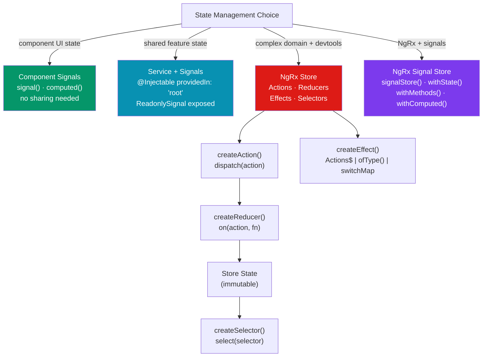

# 🏪 Angular State Management

> [!abstract] TL;DR
> Angular state management spans four tiers: **local signal state** (component signals for UI-only state), **service + signals** (shared singleton service holding signals — good for 80% of apps), **NgRx Store** (Redux-pattern for complex domain logic: `createStore`, `createReducer`, `createEffect`, `createSelector` — strict unidirectional flow, excellent devtools), and **NgRx Signal Store** (v17+ — NgRx primitives built on signals, no boilerplate, type-safe). NGXS offers a class-based alternative. The first decision is always: *what scope does this state have?*

## Intuition — analogy FIRST

Angular state management tiers are like different inventory systems for a warehouse:

- **Component signals** — sticky notes on a worker's desk. Personal, temporary, not shared.
- **Service + signals** — a shared clipboard in the break room. Everyone on the team can read and update it; simple, no ceremony.
- **NgRx Store** — a formal ERP system (SAP). Every stock change goes through a formal purchase order (action), is processed by the warehouse system (reducer), and is logged with a complete audit trail (Redux DevTools time-travel). Powerful for large teams; heavy for small ones.
- **NgRx Signal Store** — a lightweight ERP built on modern tablets instead of mainframes. Same structured workflows, but the UI updates reactively without polling.

---

## How It Works



---

## Key Concepts / Details

### Tier 1 — Service + Signals (80% of Apps)

```typescript
// cart.service.ts — shared state in an injectable service
import { Injectable, signal, computed } from '@angular/core';

export interface CartItem { id: string; name: string; price: number; qty: number; }

@Injectable({ providedIn: 'root' })
export class CartService {
  // Private writable signals — consumers can't mutate directly
  private _items = signal<CartItem[]>([]);

  // Public read-only signals — exposed for template consumption
  readonly items = this._items.asReadonly();
  readonly total = computed(() =>
    this._items().reduce((sum, item) => sum + item.price * item.qty, 0)
  );
  readonly count = computed(() =>
    this._items().reduce((sum, item) => sum + item.qty, 0)
  );

  addItem(item: CartItem) {
    this._items.update(items => {
      const existing = items.find(i => i.id === item.id);
      if (existing) {
        return items.map(i => i.id === item.id ? { ...i, qty: i.qty + 1 } : i);
      }
      return [...items, { ...item, qty: 1 }];
    });
  }

  removeItem(id: string) {
    this._items.update(items => items.filter(i => i.id !== id));
  }

  clear() { this._items.set([]); }
}

// Component usage — inject and read signals directly
@Component({
  template: `
    <span>{{ cartService.count() }} items — ${{ cartService.total() | number:'1.2-2' }}</span>
  `,
})
export class CartBadgeComponent {
  cartService = inject(CartService);
}
```

### NgRx Store — Redux Pattern

```typescript
// 1. Actions — plain event descriptors
import { createAction, props } from '@ngrx/store';

export const loadUsers     = createAction('[Users] Load Users');
export const loadUsersSuccess = createAction('[Users] Load Users Success', props<{ users: User[] }>());
export const loadUsersFailure = createAction('[Users] Load Users Failure', props<{ error: string }>());
export const addUser       = createAction('[Users] Add User', props<{ user: User }>());
export const deleteUser    = createAction('[Users] Delete User', props<{ id: string }>());

// 2. Reducer — pure function: (state, action) → new state
import { createReducer, on } from '@ngrx/store';

export interface UsersState {
  users: User[];
  loading: boolean;
  error: string | null;
}

const initialState: UsersState = { users: [], loading: false, error: null };

export const usersReducer = createReducer(
  initialState,
  on(loadUsers,        (state) => ({ ...state, loading: true, error: null })),
  on(loadUsersSuccess, (state, { users }) => ({ ...state, users, loading: false })),
  on(loadUsersFailure, (state, { error }) => ({ ...state, error, loading: false })),
  on(addUser,    (state, { user }) => ({ ...state, users: [...state.users, user] })),
  on(deleteUser, (state, { id }) => ({ ...state, users: state.users.filter(u => u.id !== id) })),
);

// 3. Selectors — memoized projections from state
import { createSelector, createFeatureSelector } from '@ngrx/store';

const selectUsersState = createFeatureSelector<UsersState>('users');

export const selectAllUsers   = createSelector(selectUsersState, s => s.users);
export const selectUsersCount = createSelector(selectAllUsers, users => users.length);
export const selectUsersLoading = createSelector(selectUsersState, s => s.loading);
export const selectActiveUsers  = createSelector(
  selectAllUsers,
  (users) => users.filter(u => u.active)
);

// 4. Effects — side effects (HTTP calls, etc.)
import { Injectable } from '@angular/core';
import { Actions, createEffect, ofType } from '@ngrx/effects';
import { catchError, map, switchMap, of } from 'rxjs';

@Injectable()
export class UsersEffects {
  loadUsers$ = createEffect(() =>
    this.actions$.pipe(
      ofType(loadUsers),                // filter to only loadUsers actions
      switchMap(() =>
        this.userService.getUsers().pipe(
          map(users => loadUsersSuccess({ users })),
          catchError(error => of(loadUsersFailure({ error: error.message })))
        )
      )
    )
  );

  constructor(
    private actions$: Actions,
    private userService: UserService
  ) {}
}
```

```typescript
// 5. NgRx Entity — normalized collection management
import { createEntityAdapter, EntityAdapter, EntityState } from '@ngrx/entity';

export interface UsersState extends EntityState<User> {
  loading: boolean;
  error: string | null;
}

const adapter: EntityAdapter<User> = createEntityAdapter<User>({
  selectId: (user: User) => user.id,
  sortComparer: (a, b) => a.name.localeCompare(b.name),
});

const initialState = adapter.getInitialState({ loading: false, error: null });

const usersReducer = createReducer(
  initialState,
  on(loadUsersSuccess, (state, { users }) => adapter.setAll(users, { ...state, loading: false })),
  on(addUser,    (state, { user }) => adapter.addOne(user, state)),
  on(deleteUser, (state, { id })   => adapter.removeOne(id, state)),
);

// Auto-generated selectors for entities
export const { selectAll, selectEntities, selectIds, selectTotal } = adapter.getSelectors(
  createFeatureSelector<UsersState>('users')
);

// 6. Component — dispatch and select
@Component({ template: `
  @for (user of users(); track user.id) {
    <div>{{ user.name }}</div>
  }
` })
export class UsersListComponent implements OnInit {
  private store = inject(Store);
  users = toSignal(this.store.select(selectAllUsers), { initialValue: [] });
  loading = toSignal(this.store.select(selectUsersLoading), { initialValue: false });

  ngOnInit() { this.store.dispatch(loadUsers()); }

  deleteUser(id: string) { this.store.dispatch(deleteUser({ id })); }
}
```

### NgRx Signal Store (v17+) — Modern Signals-Based NgRx

```typescript
import { signalStore, withState, withComputed, withMethods, patchState } from '@ngrx/signals';
import { withEntities } from '@ngrx/signals/entities';

// Define store with composable features
export const UsersStore = signalStore(
  { providedIn: 'root' },  // or scoped to a component/route
  withState({ loading: false, error: null as string | null }),
  withEntities<User>(),    // built-in entity management
  withComputed(({ entities }) => ({
    activeUsers: computed(() => entities().filter(u => u.active)),
    totalUsers: computed(() => entities().length),
  })),
  withMethods((store, userService = inject(UserService)) => ({
    async loadUsers() {
      patchState(store, { loading: true });
      try {
        const users = await firstValueFrom(userService.getUsers());
        patchState(store, setAllEntities(users), { loading: false });
      } catch (error: any) {
        patchState(store, { loading: false, error: error.message });
      }
    },
    addUser(user: User) { patchState(store, addEntity(user)); },
    removeUser(id: string) { patchState(store, removeEntity(id)); },
  }))
);

// Component — inject store, read signals directly
@Component({
  template: `
    @if (store.loading()) { <p>Loading...</p> }
    @for (user of store.entities(); track user.id) {
      <div>{{ user.name }}</div>
    }
  `,
})
export class UsersListComponent {
  store = inject(UsersStore);
  ngOnInit() { this.store.loadUsers(); }
}
```

---

## Trade-offs

| Approach | Boilerplate | Devtools | Type Safety | Best For |
|----------|------------|---------|------------|---------|
| Service + Signals | Low | None | Excellent | Most apps — shared UI state |
| NgRx Store | High | Excellent (time-travel) | Excellent | Complex domain, large teams |
| NgRx Signal Store | Low | Good | Excellent | NgRx patterns + signals DX |
| NGXS | Medium | Good | Good | Class-based NgRx alternative |
| Akita | Medium | Good | Good | Legacy projects |

---

## Real-World Notes

- **80% of Angular apps don't need NgRx.** Service + signals covers most use cases. Add NgRx when: multiple teams touch the same state, you need time-travel debugging, or domain logic is complex (many async effects).
- **NgRx Signal Store is the recommended path for new NgRx projects.** It retains the structured patterns (actions, reducers, selectors) but replaces RxJS heavy-lifting with signals.
- **`createEntityAdapter` is the must-use for collections.** Managing normalized collections manually (CRUD, sort, filter) is bug-prone; Entity handles it with tested adapters.
- **Selectors are the power of NgRx.** `createSelector()` memoizes projections — a selector only recomputes when its input selectors change, preventing unnecessary re-renders in large trees.

---

## Common Pitfalls

- **Dispatching actions in effects that trigger themselves** — an effect listening to `loadUsers` that, on error, dispatches `loadUsers` again creates an infinite loop. Use a distinct error action.
- **Selecting the whole state slice** — `store.select(state => state.users)` returns the entire users object; every time *anything* in `state.users` changes, the component re-renders. Select the minimum you need.
- **Side effects directly in reducers** — reducers must be pure. HTTP calls, logging, and `setTimeout` in reducers cause unpredictable behavior and break time-travel debugging.
- **Not using `patchState` in Signal Store** — mutating the store object directly bypasses reactivity tracking. Always use `patchState`.

---

## Related Concepts

- [[_MOC_Angular|↑ Section MOC]]
- [[Angular_Signals]] — The reactive primitive NgRx Signal Store is built on
- [[RxJS_Observables]] — NgRx Effects are built around the Actions$ observable
- [[Angular_Routing_Forms]] — Route-level store scoping and guards with NgRx

---

## Review Questions

1. What are the four pieces of NgRx Store (Actions, Reducers, Effects, Selectors) and what does each do?
2. Why is a selector's memoization important for performance in a component tree?
3. When would you choose Service + Signals over NgRx Store for a shared state problem?
4. How does `createEntityAdapter` normalize a collection and what operations does it provide?
5. What is the key architectural difference between NgRx Store and NgRx Signal Store?

---

## Sources

- NgRx docs: https://ngrx.io
- NgRx Signal Store: https://ngrx.io/guide/signals/signal-store
- NGXS docs: https://www.ngxs.io
- Angular docs: State management patterns — https://angular.dev/guide/di

#web-development #angular #state-management #ngrx #signal-store #ngxs
