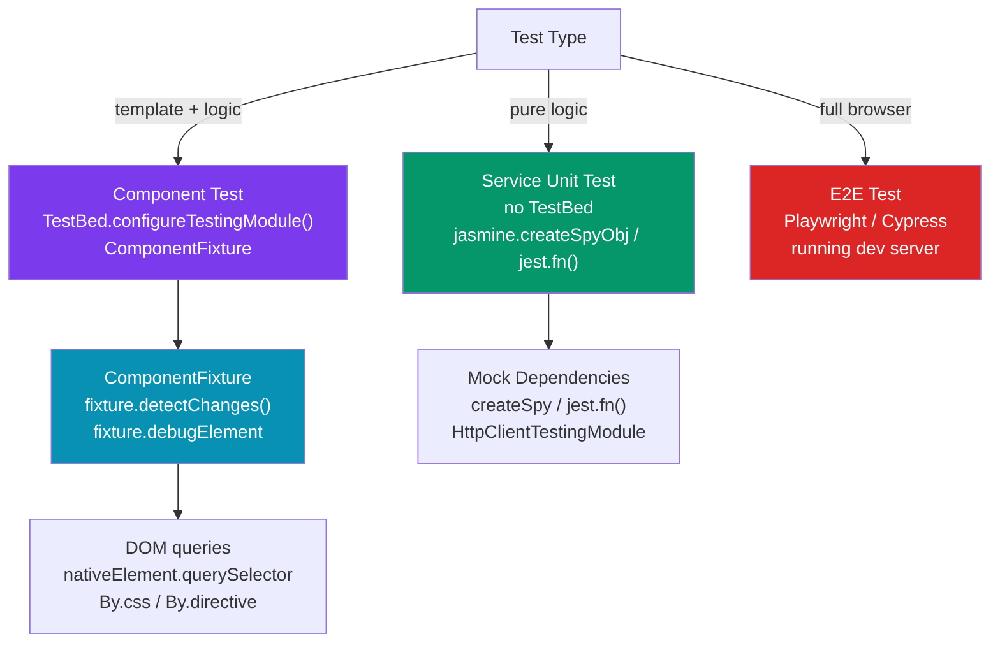

# 🧪 Angular Testing

> [!abstract] TL;DR
> Angular's testing stack is **TestBed** (Angular's test module that compiles components, wires DI, and creates a test host) plus a unit test runner — either **Karma/Jasmine** (legacy, browser-based, Angular CLI default until v18) or **Jest** (faster, Node-based, growing adoption). Tests split into: **service unit tests** (pure TypeScript, no TestBed needed — mock dependencies with `jasmine.createSpyObj`), **component tests** (TestBed compiles the component + template, query with `fixture.debugElement`), and **E2E tests** (Playwright or Cypress against the running app). Angular 18+ defaults to Jest as the recommended test runner.

## Intuition — analogy FIRST

Angular testing is like a staging environment for each part of your application:

- **Service tests without TestBed** — testing a recipe (the service logic) in a kitchen lab. You swap real ingredients for test ingredients (mock dependencies) and run the recipe in isolation.
- **Component tests with TestBed** — building a full mock storefront (the compiled component + template) and using a secret shopper (the test) to interact with it exactly as a customer would.
- **E2E tests** — opening the real store and testing everything end-to-end as an actual customer, on a real browser.

`TestBed` is Angular's "staging kitchen" — it compiles templates, wires DI providers, and gives you a live component instance to interact with, all without a real browser (or with a minimal jsdom).

---

## How It Works



---

## Key Concepts / Details

### Service Unit Tests — No TestBed

```typescript
// user.service.spec.ts — testing a service without TestBed overhead
import { UserService } from './user.service';
import { HttpClient } from '@angular/common/http';

describe('UserService', () => {
  let service: UserService;
  let httpSpy: jasmine.SpyObj<HttpClient>;

  beforeEach(() => {
    // Create a spy object — all methods return undefined by default
    httpSpy = jasmine.createSpyObj('HttpClient', ['get', 'post', 'put', 'delete']);
    service = new UserService(httpSpy); // inject manually — no DI needed
  });

  it('should fetch a user by id', (done) => {
    const mockUser: User = { id: '1', name: 'Alice', email: 'alice@example.com' };
    httpSpy.get.and.returnValue(of(mockUser)); // spy returns observable

    service.getUser('1').subscribe(user => {
      expect(user).toEqual(mockUser);
      expect(httpSpy.get).toHaveBeenCalledWith('/api/users/1');
      done();
    });
  });

  it('should handle error gracefully', (done) => {
    httpSpy.get.and.returnValue(throwError(() => new Error('404 Not Found')));

    service.getUser('999').subscribe({
      error: (err) => {
        expect(err.message).toContain('Not Found');
        done();
      }
    });
  });
});
```

### Component Tests with TestBed

```typescript
// user-card.component.spec.ts
import { ComponentFixture, TestBed, fakeAsync, tick } from '@angular/core/testing';
import { By } from '@angular/platform-browser';
import { UserCardComponent } from './user-card.component';
import { UserService } from './user.service';

describe('UserCardComponent', () => {
  let component: UserCardComponent;
  let fixture: ComponentFixture<UserCardComponent>;
  let userServiceSpy: jasmine.SpyObj<UserService>;

  beforeEach(async () => {
    userServiceSpy = jasmine.createSpyObj('UserService', ['getUser', 'deleteUser']);
    userServiceSpy.getUser.and.returnValue(of({ id: '1', name: 'Alice' }));

    await TestBed.configureTestingModule({
      imports: [UserCardComponent], // standalone component — import directly
      providers: [
        { provide: UserService, useValue: userServiceSpy }, // swap real service with spy
      ],
    }).compileComponents();

    fixture = TestBed.createComponent(UserCardComponent);
    component = fixture.componentInstance;
    component.userId = '1';             // set @Input
    fixture.detectChanges();            // trigger ngOnInit + initial render
  });

  it('should display the user name', () => {
    const heading = fixture.debugElement.query(By.css('h2'));
    expect(heading.nativeElement.textContent).toContain('Alice');
  });

  it('should call deleteUser and emit event on delete click', () => {
    userServiceSpy.deleteUser.and.returnValue(of(void 0));
    const deletedSpy = spyOn(component.userDeleted, 'emit');

    const deleteBtn = fixture.debugElement.query(By.css('[data-testid="delete-btn"]'));
    deleteBtn.nativeElement.click();
    fixture.detectChanges();

    expect(userServiceSpy.deleteUser).toHaveBeenCalledWith('1');
    expect(deletedSpy).toHaveBeenCalledWith('1');
  });

  it('should show loading skeleton initially', () => {
    // Override spy to not emit immediately
    userServiceSpy.getUser.and.returnValue(NEVER); // never emits
    fixture = TestBed.createComponent(UserCardComponent);
    component = fixture.componentInstance;
    component.userId = '1';
    fixture.detectChanges();

    expect(fixture.debugElement.query(By.css('[data-testid="skeleton"]'))).toBeTruthy();
  });
});
```

### Testing Async Code

```typescript
// fakeAsync + tick — control time in tests
it('should debounce search input', fakeAsync(() => {
  const input = fixture.debugElement.query(By.css('input[type="search"]'));
  input.nativeElement.value = 'angular';
  input.nativeElement.dispatchEvent(new Event('input'));

  // At t=0: search not yet fired (debounced)
  expect(userServiceSpy.search).not.toHaveBeenCalled();

  tick(300);  // advance virtual clock by 300ms
  fixture.detectChanges();

  expect(userServiceSpy.search).toHaveBeenCalledWith('angular');
}));

// waitForAsync — real async (HttpClient, router navigation)
it('should navigate to user detail on click', waitForAsync(() => {
  const router = TestBed.inject(Router);
  spyOn(router, 'navigate');

  fixture.debugElement.query(By.css('.user-link')).nativeElement.click();
  fixture.detectChanges();

  fixture.whenStable().then(() => {
    expect(router.navigate).toHaveBeenCalledWith(['/users', '1']);
  });
}));
```

### HttpClientTestingModule — HTTP Layer Testing

```typescript
import { HttpClientTestingModule, HttpTestingController } from '@angular/common/http/testing';

describe('UserService (with HttpClientTestingModule)', () => {
  let service: UserService;
  let httpMock: HttpTestingController;

  beforeEach(() => {
    TestBed.configureTestingModule({
      imports: [HttpClientTestingModule],
      providers: [UserService],
    });
    service = TestBed.inject(UserService);
    httpMock = TestBed.inject(HttpTestingController);
  });

  afterEach(() => httpMock.verify()); // assert no outstanding requests

  it('should GET /api/users/1', () => {
    const mockUser = { id: '1', name: 'Alice' };

    service.getUser('1').subscribe(user => {
      expect(user).toEqual(mockUser);
    });

    // Assert the request was made
    const req = httpMock.expectOne('/api/users/1');
    expect(req.request.method).toBe('GET');

    // Respond with mock data — triggers the subscribe callback
    req.flush(mockUser);
  });

  it('should handle 404 error', () => {
    service.getUser('999').subscribe({
      error: (err) => expect(err.status).toBe(404),
    });

    const req = httpMock.expectOne('/api/users/999');
    req.flush('Not found', { status: 404, statusText: 'Not Found' });
  });
});
```

### Jest Setup for Angular

```bash
# Replace Karma with Jest (Angular 18+ recommended)
ng add @angular-builders/jest
# OR using jest-preset-angular directly
npm install -D jest @types/jest jest-preset-angular
```

```js
// jest.config.js
module.exports = {
  preset: 'jest-preset-angular',
  setupFilesAfterEach: ['<rootDir>/setup-jest.ts'],
  testPathPattern: ['.*\\.spec\\.ts$'],
  transform: { '^.+\\.(ts|js|html)$': ['jest-preset-angular', { tsconfig: 'tsconfig.spec.json' }] },
};

// setup-jest.ts
import 'jest-preset-angular/setup-jest';
```

```typescript
// Jest syntax (Jasmine → Jest migration)
// jasmine.createSpyObj → jest.fn()
const userServiceMock = {
  getUser: jest.fn().mockReturnValue(of({ id: '1', name: 'Alice' })),
  deleteUser: jest.fn().mockReturnValue(of(void 0)),
};

// Assertions are identical (expect, toBe, toEqual, etc.)
// Main differences:
// jasmine.SpyObj<T> → jest.Mocked<T>
// spyOn(obj, 'method') → jest.spyOn(obj, 'method')
// jasmine.createSpy() → jest.fn()
```

### Playwright E2E for Angular

```typescript
// e2e/users.spec.ts
import { test, expect } from '@playwright/test';

test.describe('Users feature', () => {
  test.beforeEach(async ({ page }) => {
    // Log in before each test
    await page.goto('/login');
    await page.fill('[data-testid="email"]', 'admin@example.com');
    await page.fill('[data-testid="password"]', 'password123');
    await page.click('button[type="submit"]');
    await expect(page).toHaveURL('/dashboard');
  });

  test('should display user list', async ({ page }) => {
    await page.goto('/users');
    await expect(page.getByRole('heading', { name: 'Users' })).toBeVisible();
    await expect(page.getByRole('listitem')).toHaveCount(10);
  });

  test('should navigate to user detail', async ({ page }) => {
    await page.goto('/users');
    await page.getByText('Alice Johnson').click();
    await expect(page).toHaveURL(/\/users\/\d+/);
    await expect(page.getByRole('heading', { name: 'Alice Johnson' })).toBeVisible();
  });
});
```

---

## Trade-offs

| Tool | Speed | Browser | Angular DI | Best For |
|------|-------|---------|-----------|---------|
| Karma + Jasmine | Slow | Real browser | Full TestBed | Legacy projects |
| Jest | Fast (Node) | jsdom | Full TestBed | New projects (Angular 18+) |
| Vitest | Fast (Node) | jsdom | Partial | Experimental Angular support |
| Playwright | Slow | Real browser | None | E2E critical flows |
| Cypress | Slow | Real browser | None | E2E with interactive GUI |

---

## Real-World Notes

- **Prefer Jest over Karma for new Angular projects.** Jest is 3-5x faster (Node-based, no browser launch), supports parallel execution, and has better TypeScript support.
- **Don't over-use TestBed.** For services with pure logic, instantiate them manually with mocked dependencies — 10x faster than spinning up a TestBed module.
- **Mock at the service boundary, not the HTTP boundary** for component tests. Spy on the service method rather than the HTTP layer — simpler and tests the component's contract with the service, not HTTP.
- **`fixture.detectChanges()` is manual** — Angular's TestBed doesn't automatically run change detection. Call it after every state change, or set `autoDetectChanges: true` in `TestBed.configureTestingModule`.

---

## Common Pitfalls

- **Forgetting `compileComponents()`** — required when components have external template files (`templateUrl`). Without it, TestBed can't compile the template and tests silently fail.
- **Not calling `fixture.detectChanges()` after changes** — component methods that update state won't reflect in the DOM until change detection runs.
- **Using `EMPTY` vs `NEVER` vs `of()`** — `EMPTY` completes immediately (no value), `NEVER` never completes, `of(value)` emits synchronously. Confusing them causes tests that pass vacuously.
- **`fakeAsync` with real async** — `fakeAsync` can't control real Promises (only microtasks). If your component uses `async/await` with real async operations, use `waitForAsync` instead.

---

## Related Concepts

- [[_MOC_Angular|↑ Section MOC]]
- [[Services_and_DI]] — DI is what TestBed's `providers` array configures
- [[Angular_Signals]] — Signal-based components require `fixture.detectChanges()` after signal updates
- [[RxJS_Observables]] — `fakeAsync`/`tick` work with Observable timing

---

## Review Questions

1. What does `TestBed.configureTestingModule()` do, and when do you need it vs instantiating a class directly?
2. What is the difference between `fakeAsync` + `tick()` and `waitForAsync` + `fixture.whenStable()`?
3. When would you use `HttpClientTestingModule` over spying on the service directly?
4. Why must you call `fixture.detectChanges()` manually in Angular component tests?
5. What does `httpMock.verify()` assert at the end of each test?

---

## Sources

- Angular docs: Testing — https://angular.dev/guide/testing
- Angular Testing Library: https://github.com/testing-library/angular-testing-library
- Jest preset for Angular: https://github.com/thymikee/jest-preset-angular
- Playwright docs: https://playwright.dev

#web-development #angular #testing #testbed #karma #jest #playwright
