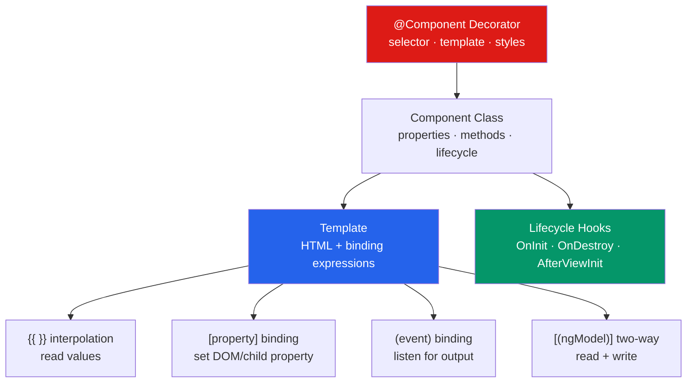

# 🧩 Angular Components and Templates

> [!abstract] TL;DR
> An Angular component is a TypeScript class decorated with `@Component` that pairs a view (template) with logic. Modern Angular templates use built-in control flow (`@if`/`@for`/`@switch`), signal inputs (`input()`), and model inputs for two-way binding. Structural directives (`*ngIf`, `*ngFor`) are the legacy syntax. Lifecycle hooks (`ngOnInit`, `ngOnDestroy`) manage initialization and cleanup. `viewChild()` and `contentChild()` provide typed access to child elements.

## Intuition — analogy FIRST

An Angular component is like a custom vending machine. The `@Component` decorator is the machine's specification card — it describes what it looks like (template), what it's called (selector), and how it presents itself. The TypeScript class is the machine's internal mechanism — its logic and state.

Template binding is the display panel: `{{ }}` shows the current state, `[property]` feeds data in, `(event)` listens for button presses, and `[(ngModel)]` is a two-way dial that both displays and accepts input simultaneously.

---

## How It Works



---

## Key Concepts / Details

### `@Component` Decorator

```typescript
import { Component, OnInit, inject } from '@angular/core';
import { CommonModule } from '@angular/common';
import { RouterLink } from '@angular/router';
import { UserService } from './user.service';

@Component({
  selector: 'app-user-list',    // CSS selector for this component's host element
  standalone: true,             // Angular 17+: no NgModule needed
  imports: [CommonModule, RouterLink], // dependencies
  templateUrl: './user-list.component.html',
  styleUrl: './user-list.component.scss',
  // OR inline:
  template: `<div>{{ title }}</div>`,
  styles: [`h1 { color: red; }`],
  // Change detection strategy
  changeDetection: ChangeDetectionStrategy.OnPush
})
export class UserListComponent implements OnInit {
  title = 'User List';
  private userService = inject(UserService);

  ngOnInit() { ... }
}
```

### Template Binding Syntax

```html
<!-- Interpolation: renders value as string -->
<h1>{{ user.name }}</h1>
<p>{{ formatDate(user.createdAt) }}</p>

<!-- Property binding: set a DOM property or @Input -->

<app-card [title]="user.name" [data]="user"></app-card>

<!-- Attribute binding: set HTML attribute (not DOM property) -->
<button [attr.aria-label]="'Delete ' + user.name">Delete</button>
<td [attr.colspan]="columnSpan">...</td>

<!-- Class and style bindings -->
<div [class.active]="isActive">...</div>
<div [class]="{ active: isActive, disabled: !isEnabled }">...</div>
<div [style.color]="textColor">...</div>
<div [style]="{ color: 'red', fontSize: '16px' }">...</div>

<!-- Event binding: listen to DOM or component events -->
<button (click)="onDelete($event)">Delete</button>
<input (input)="onSearch($event)" (keydown.enter)="onSubmit()">

<!-- Two-way binding: [(ngModel)] -->
<input [(ngModel)]="searchTerm"> <!-- requires FormsModule -->
<!-- Equivalent to: -->
<input [value]="searchTerm" (input)="searchTerm = $event.target.value">
```

### Built-in Control Flow (Angular 17+)

```html
<!-- @if — replaces *ngIf -->
@if (user) {
  <div>{{ user.name }}</div>
} @else if (isLoading) {
  <app-spinner />
} @else {
  <p>No user found</p>
}

<!-- @for — replaces *ngFor -->
@for (item of items; track item.id) {
  <li>{{ item.name }}</li>
} @empty {
  <li>No items</li>
}
<!-- track is required — uses item identity for efficient diffing -->
<!-- Available: $index, $first, $last, $even, $odd, $count -->

@for (item of items; track item.id; let i = $index; let last = $last) {
  <tr [class.last-row]="last">
    <td>{{ i + 1 }}</td>
    <td>{{ item.name }}</td>
  </tr>
}

<!-- @switch — replaces [ngSwitch] -->
@switch (status) {
  @case ('pending')  { <app-spinner /> }
  @case ('success')  { <app-data [data]="result" /> }
  @case ('error')    { <app-error [message]="errorMsg" /> }
  @default           { <span>Unknown status</span> }
}

<!-- @defer — deferred loading -->
@defer (on viewport) {
  <app-heavy-chart [data]="chartData" />
} @placeholder {
  <div>Loading chart...</div>
} @loading {
  <app-spinner />
}
```

### Inputs and Outputs

```typescript
import { Component, input, output, model } from '@angular/core';

@Component({...})
export class ProductCardComponent {
  // Signal input (Angular 17+) — returns a Signal<T>
  product = input.required<Product>();   // required
  currency = input<string>('USD');       // with default

  // Legacy @Input decorator (still works)
  // @Input() product!: Product;

  // Output — EventEmitter
  addToCart = output<Product>();

  // Model input (two-way binding)
  quantity = model<number>(1);

  onAddToCart() {
    this.addToCart.emit(this.product());
  }

  increment() {
    this.quantity.update(q => q + 1);
  }
}
```

```html
<!-- Parent template -->
<app-product-card
  [product]="selectedProduct"
  [currency]="'EUR'"
  [(quantity)]="cartQuantity"
  (addToCart)="handleAddToCart($event)"
/>
```

### ViewChild and ContentChild

```typescript
import { Component, viewChild, ElementRef, AfterViewInit } from '@angular/core';

@Component({
  template: `
    <input #searchInput type="search" />
    <app-chart #chart />
  `
})
export class SearchComponent implements AfterViewInit {
  // Signal-based (Angular 17+)
  searchInput = viewChild<ElementRef<HTMLInputElement>>('searchInput');
  chart = viewChild(ChartComponent);

  ngAfterViewInit() {
    this.searchInput()?.nativeElement.focus();
    this.chart()?.refresh();
  }
}
```

### Pipes — Template Transformations

```html
<!-- Built-in pipes -->
{{ price | currency:'EUR':'symbol':'1.2-2' }}
{{ date | date:'yyyy-MM-dd' }}
{{ longText | slice:0:100 | titlecase }}
{{ items | json }}
{{ obs$ | async }}   <!-- subscribes and unsubscribes automatically -->

<!-- Custom pipe -->
<!-- amount | discount:15 -->
```

```typescript
@Pipe({ name: 'discount', standalone: true, pure: true })
export class DiscountPipe implements PipeTransform {
  transform(price: number, discountPercent: number): number {
    return price * (1 - discountPercent / 100);
  }
}
```

### Host Element Bindings

```typescript
@Component({
  selector: 'app-badge',
  template: `<ng-content />`,
  host: {
    'class': 'badge',
    '[class.badge--active]': 'isActive',
    '[attr.role]': '"status"',
    '(click)': 'onClick()'
  }
})
export class BadgeComponent {
  @HostBinding('class.badge--primary') isPrimary = true;
  @HostListener('mouseenter') onHover() { ... }
}
```

---

## Real-World Notes

- **`@for` with `track` is required in Angular 17+.** The track expression determines DOM identity — use a unique ID (`track item.id`), not `$index` for lists that can reorder.
- **`async` pipe is the preferred way to display Observables** — it subscribes when the component initializes and unsubscribes when it destroys, preventing memory leaks.
- **Signal inputs are now preferred** over `@Input()` — they participate in the signal change detection graph and work without zone.js.
- **Avoid direct DOM manipulation** (`ElementRef.nativeElement`) except for third-party library integration. Use Angular template bindings instead.

---

## Common Pitfalls

- **Forgetting `track` in `@for`** — Angular 17 will warn; Angular 18 may make it mandatory. Without it, the entire list re-renders on any change.
- **Using `*ngIf` inside a component that uses `@if`** — mixing legacy structural directives and new control flow in the same template works but is inconsistent. Migrate fully.
- **Not using `OnPush` with signal inputs** — signals automatically track dependencies for OnPush; using Default CD on a signal-input component wastes work.
- **Memory leaks from manual subscriptions** — if you subscribe to an Observable in `ngOnInit` without using `async` pipe or `takeUntilDestroyed`, you'll leak on navigation away.

---

## Related Concepts

- [[_MOC_Angular|↑ Section MOC]]
- [[Angular_Architecture]] — The architectural context for components
- [[Services_and_DI]] — Services injected into component constructors
- [[RxJS_Observables]] — Observable data consumed in templates via `async` pipe

---

## Review Questions

1. What is the difference between `[property]` and `(event)` binding? How do they combine in `[(ngModel)]`?
2. Write a `@for` loop with proper `track` for a list of `{ id: number; name: string }` objects.
3. What is the difference between `viewChild()` (signal) and the legacy `@ViewChild()` decorator?
4. How does the `async` pipe prevent memory leaks compared to a manual subscription?
5. When do you use `@defer` and what triggers are available?

---

## Sources

- Angular docs: Components — https://angular.dev/guide/components
- Angular docs: Template syntax — https://angular.dev/guide/templates
- Angular docs: Built-in control flow — https://angular.dev/guide/templates/control-flow

#web-development #angular #components #templates #control-flow
