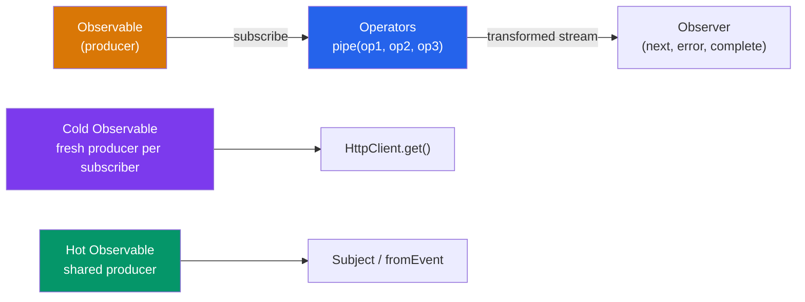

# 🌊 RxJS and Observables

> [!abstract] TL;DR
> RxJS `Observable<T>` is a **lazy, pull-based** stream — nothing runs until someone subscribes; the producer starts fresh per subscriber (cold/unicast). **Hot** observables (Subjects, DOM events) have a shared producer. The four critical flattening operators each solve a different race condition: `switchMap` (cancel & restart — typeahead), `mergeMap` (parallel — concurrent writes), `concatMap` (queue serial — ordered writes), `exhaustMap` (ignore new — prevent double-submit). Always unsubscribe: use the `async` pipe, `takeUntilDestroyed()`, or `firstValueFrom`/`lastValueFrom` for one-shot Promises.

## Intuition — analogy FIRST

An Observable is a TV channel subscription contract. A cold observable is like a DVD: each subscriber gets their own copy playing from the beginning. A hot observable is like a live TV broadcast: all subscribers watch the same stream from the moment they tune in.

The flattening operators are how you handle a "channel that broadcasts new channel numbers" (an observable of observables):
- **switchMap**: Change the channel immediately when a new number arrives — cancel what you were watching.
- **mergeMap**: Tune to all channels simultaneously — watch everything in parallel.
- **concatMap**: Queue the channels — finish one before starting the next.
- **exhaustMap**: Ignore new channel requests while you're still watching the current one.

---

## How It Works



---

## Key Concepts / Details

### Observable Basics

```typescript
import { Observable, of, from, fromEvent, interval, EMPTY, NEVER } from 'rxjs';

// Creating Observables
const of$ = of(1, 2, 3);                     // synchronously emits 1, 2, 3 then completes
const from$ = from([1, 2, 3]);               // same but from an iterable
const interval$ = interval(1000);             // emits 0, 1, 2... every second (never completes)
const click$ = fromEvent(button, 'click');    // DOM event stream (never completes)

// Custom Observable — complete control
const obs$ = new Observable<number>(subscriber => {
  subscriber.next(1);
  subscriber.next(2);
  setTimeout(() => {
    subscriber.next(3);
    subscriber.complete();
  }, 1000);

  // Return cleanup function (runs on unsubscribe/complete)
  return () => clearAllTimers();
});

// Subscribing
const sub = obs$.subscribe({
  next: value => console.log(value),
  error: err => console.error(err),
  complete: () => console.log('Done!')
});

// Unsubscribing (critical for Observables that never complete)
sub.unsubscribe();
```

### The Pipe Operators

```typescript
import { map, filter, tap, take, takeUntil, debounceTime, distinctUntilChanged,
         catchError, retry, shareReplay, combineLatest, withLatestFrom } from 'rxjs/operators';

const search$ = searchInput$.pipe(
  debounceTime(300),             // wait 300ms after last keystroke
  distinctUntilChanged(),         // skip if value unchanged
  filter(term => term.length > 2), // skip short queries
  map(term => term.toLowerCase()), // transform
  tap(term => console.log('Searching:', term)), // side-effect (no transform)
);
```

### The Four Flattening Operators

These operators handle an Observable that emits Observables (e.g., each search term triggers an HTTP request):

```typescript
// switchMap — CANCEL previous, subscribe to new (typeahead, route params)
const results$ = searchTerm$.pipe(
  switchMap(term => this.api.search(term)) // previous request cancelled when new term arrives
);
// Use when: only the LATEST matters (search, route data)

// mergeMap — PARALLEL subscriptions (concurrent, unordered)
const saved$ = items$.pipe(
  mergeMap(item => this.api.save(item)) // all items saved concurrently
);
// Use when: ORDER doesn't matter, PARALLELISM desired (parallel writes)

// concatMap — QUEUE: finish current before starting next (ordered, sequential)
const ordered$ = commands$.pipe(
  concatMap(cmd => this.api.execute(cmd)) // sequential: wait for each to complete
);
// Use when: ORDER matters (ordered mutations, animations in sequence)

// exhaustMap — IGNORE new while current is active (prevent double-submit)
const submit$ = submitClick$.pipe(
  exhaustMap(() => this.api.submitForm(formValue)) // ignores clicks during active request
);
// Use when: prevent duplicate submissions (form submit, login button)
```

| Operator | Behavior | Use Case |
|----------|----------|----------|
| `switchMap` | Cancels previous | Typeahead search, route params |
| `mergeMap` | Parallel (all active) | Concurrent writes, parallel requests |
| `concatMap` | Sequential queue | Ordered operations, animations |
| `exhaustMap` | Ignore while busy | Form submit, login, prevent double-click |

### Error Handling and Retry

```typescript
const data$ = this.http.get('/api/data').pipe(
  retry({ count: 3, delay: 1000 }), // retry up to 3 times with 1s delay

  catchError(err => {
    console.error(err);
    return of([]); // return fallback value — stream continues
    // return EMPTY;  // complete without value
    // return throwError(() => err); // re-throw — upstream must handle
  })
);

// Exponential backoff
const withBackoff$ = this.http.get('/api/data').pipe(
  retry({
    count: 5,
    delay: (error, retryCount) => timer(Math.pow(2, retryCount) * 1000)
  })
);
```

### Subject Variants

```typescript
import { Subject, BehaviorSubject, ReplaySubject, AsyncSubject } from 'rxjs';

// Subject — basic multicast; no initial value; late subscribers miss past values
const subject = new Subject<string>();
subject.next('a');         // emits to current subscribers only
subject.next('b');

// BehaviorSubject — remembers LATEST value; new subscribers get it immediately
const behavior = new BehaviorSubject<string>('initial');
behavior.value;            // 'initial' — synchronous read
behavior.next('updated');
// New subscriber immediately receives 'updated'

// ReplaySubject — replays last N values to new subscribers
const replay = new ReplaySubject<number>(3); // buffer last 3
replay.next(1); replay.next(2); replay.next(3); replay.next(4);
replay.subscribe(v => console.log(v)); // logs 2, 3, 4

// AsyncSubject — emits ONLY the last value, and only on complete
const async = new AsyncSubject<string>();
async.next('a'); async.next('b'); async.next('c');
async.complete(); // only 'c' is emitted to subscribers
```

### Multicasting with `share` and `shareReplay`

```typescript
// Problem: without sharing, each subscriber creates a new HTTP request
const users$ = this.http.get<User[]>('/api/users');
users$.subscribe(u => renderList(u));
users$.subscribe(u => renderCount(u)); // SECOND request!

// share() — share subscription (but late subscribers miss past values)
const shared$ = users$.pipe(share());

// shareReplay — share AND replay last N emissions to late subscribers
const cached$ = this.http.get<User[]>('/api/users').pipe(
  shareReplay({ bufferSize: 1, refCount: true })
  // bufferSize: 1 — replay the latest value
  // refCount: true — unsubscribe from source when no subscribers (memory safe)
);

// Now multiple subscribers share ONE request
cached$.subscribe(u => renderList(u));
cached$.subscribe(u => renderCount(u)); // reuses cached value
```

### Signals Interop (Angular 17+)

```typescript
import { toSignal, toObservable } from '@angular/core/rxjs-interop';
import { inject } from '@angular/core';

@Component({ ... })
export class UserListComponent {
  private userService = inject(UserService);

  // Observable → Signal (auto-subscribes, auto-unsubscribes with component)
  users = toSignal(this.userService.getUsers(), { initialValue: [] });

  // Signal → Observable (when you need operators on a signal)
  private searchSignal = signal('');
  search$ = toObservable(this.searchSignal).pipe(
    debounceTime(300),
    switchMap(term => this.userService.search(term))
  );
  results = toSignal(this.search$, { initialValue: [] });
}
```

### Converting Observables to Promises

```typescript
import { firstValueFrom, lastValueFrom } from 'rxjs';

// firstValueFrom — resolves with the first emitted value, then unsubscribes
const firstUser = await firstValueFrom(users$);

// lastValueFrom — resolves with the last value after completion
const allLogs = await lastValueFrom(logs$);

// Use in async/await contexts (server-side, tests, one-shot operations)
async function loadUser(id: number) {
  return await firstValueFrom(this.userService.getUser(id));
}
```

---

## Real-World Notes

- **The single most impactful rule**: always choose the right flattening operator. Wrong choice = race conditions (`switchMap` when you needed `concatMap`) or blocked UI (`exhaustMap` when you needed `mergeMap`).
- **`async` pipe is the Angular-idiomatic way** to subscribe to Observables in templates. It handles subscribe and unsubscribe automatically.
- **`BehaviorSubject` in services** is the simplest state management pattern for shared synchronous state before reaching for NgRx.
- **`toSignal()` bridges RxJS and signals** — use it when you have an Observable from an HTTP call but want to read it synchronously in a template.

---

## Common Pitfalls

- **Not unsubscribing from infinite Observables** (`interval`, `fromEvent`, `Subject`) causes memory leaks. Always use `async` pipe, `takeUntilDestroyed`, or manual `unsubscribe`.
- **Using `mergeMap` for sequential operations** — results arrive out of order. Use `concatMap` when order matters.
- **Creating a new `BehaviorSubject` subscription in every component** — subscribe once in a service, expose as an Observable, and use `async` pipe.
- **`shareReplay` without `refCount: true`** — without it, the source is never unsubscribed even when all subscribers leave, causing stale data on re-entry.

---

## Related Concepts

- [[_MOC_Angular|↑ Section MOC]]
- [[Angular_Architecture]] — Angular signals that complement RxJS
- [[Services_and_DI]] — Services that expose Observable APIs
- [[Angular_Routing_Forms]] — Router events and form value streams

---

## Review Questions

1. What is the difference between a cold and a hot Observable? Give an example of each.
2. Explain `switchMap`, `mergeMap`, `concatMap`, and `exhaustMap`. Give a real-world use case for each.
3. What is the difference between `Subject`, `BehaviorSubject`, and `ReplaySubject`?
4. Why does `shareReplay({ bufferSize: 1, refCount: true })` include `refCount: true`?
5. How do `toSignal()` and `toObservable()` bridge the Signals and RxJS worlds?

---

## Sources

- RxJS docs — https://rxjs.dev/
- Angular docs: RxJS — https://angular.dev/guide/rxjs
- Decoding RxJS: https://blog.angular.io/
- Learn RxJS: https://www.learnrxjs.io/

#web-development #angular #rxjs #observables #flatMap-operators
