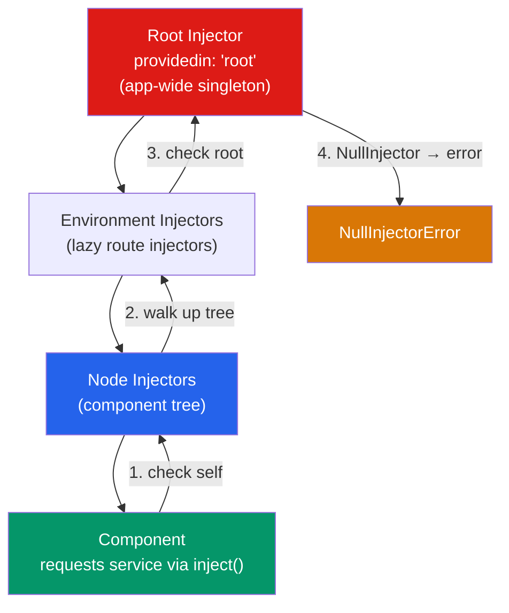

# 🔌 Angular Services and Dependency Injection

> [!abstract] TL;DR
> Angular's Dependency Injection (DI) system is a hierarchical injector tree that provides services to components, directives, and other services. `providedIn: 'root'` creates a singleton at the application level (tree-shakeable). The `inject()` function is the modern way to request dependencies (works outside constructors, in functional guards/interceptors). `InjectionToken` is used for non-class dependencies. Multi-providers allow multiple values for a single token. Understand the four provider types: `useClass`, `useValue`, `useFactory`, `useExisting`.

## Intuition — analogy FIRST

Angular's DI system is like a hospital's medical supply system. When a doctor (component) needs a specific drug (service), they don't go to the pharmacy themselves — they request it from the nursing station (injector). The nursing station checks if it has the drug in stock (registered provider). If not, it requests it from the floor pharmacy; if still unavailable, it goes to the central hospital pharmacy (root injector).

Each floor (module/component subtree) can have its own specialized supply that overrides the central supply for that area. A children's ward can have pediatric dosages (child injector override) even though the main pharmacy has adult dosages (root).

---

## How It Works



---

## Key Concepts / Details

### Creating a Service

```typescript
import { Injectable, inject } from '@angular/core';
import { HttpClient } from '@angular/common/http';
import { Observable } from 'rxjs';

@Injectable({
  providedIn: 'root' // registered in root injector — app-wide singleton
})
export class UserService {
  private http = inject(HttpClient); // modern inject() function

  getUsers(): Observable<User[]> {
    return this.http.get<User[]>('/api/users');
  }

  getUserById(id: number): Observable<User> {
    return this.http.get<User>(`/api/users/${id}`);
  }
}
```

### Injecting Dependencies — Two Patterns

```typescript
// Pattern 1: Constructor injection (traditional)
@Component({ ... })
export class UserListComponent {
  constructor(
    private userService: UserService,
    private router: Router,
    private store: Store<AppState>
  ) {}
}

// Pattern 2: inject() function (modern — preferred in Angular 17+)
@Component({ ... })
export class UserListComponent {
  private userService = inject(UserService);
  private router = inject(Router);

  // inject() works in:
  // - component/directive/pipe constructors (implied)
  // - class field initializers
  // - factory functions (functional guards, interceptors)
  // NOT inside methods or ngOnInit
}
```

### The Hierarchical Injector — Scoping Providers

```typescript
// Root scope — one instance for the entire app (default)
@Injectable({ providedIn: 'root' })
export class GlobalService {}

// Component scope — new instance per component and its children
@Component({
  providers: [ComponentScopedService] // not providedIn, provided here
})
export class FeatureComponent {}

// Platform scope (for server-side rendering)
@Injectable({ providedIn: 'platform' })
export class PlatformService {}

// Any scope — manual NgModule (legacy)
@NgModule({
  providers: [ModuleScopedService]
})
export class FeatureModule {}
```

### The Four Provider Types

```typescript
// 1. useClass — provide a class (default behavior)
providers: [{ provide: UserService, useClass: MockUserService }]
// Or shorthand: providers: [UserService]

// 2. useValue — provide a static value
providers: [{ provide: API_BASE_URL, useValue: 'https://api.example.com' }]

// 3. useFactory — provide a value computed at runtime
providers: [{
  provide: LogService,
  useFactory: (config: ConfigService, http: HttpClient) => {
    return config.isProduction
      ? new ProductionLogService(http)
      : new DevLogService();
  },
  deps: [ConfigService, HttpClient] // factory dependencies
}]

// 4. useExisting — alias one token to another
providers: [{ provide: OldService, useExisting: NewService }]
```

### `InjectionToken` — Non-Class Dependencies

```typescript
import { InjectionToken, inject } from '@angular/core';

// Define a typed token
export const API_BASE_URL = new InjectionToken<string>('API_BASE_URL');
export const APP_CONFIG   = new InjectionToken<AppConfig>('APP_CONFIG');
export const HTTP_INTERCEPTORS = new InjectionToken<HttpInterceptor[]>('HttpInterceptors');

// Provide it
bootstrapApplication(AppComponent, {
  providers: [
    { provide: API_BASE_URL, useValue: environment.apiUrl },
    { provide: APP_CONFIG, useFactory: () => loadConfig(), deps: [] }
  ]
});

// Inject it
@Injectable({ providedIn: 'root' })
export class ApiService {
  private baseUrl = inject(API_BASE_URL);

  get(path: string) {
    return fetch(`${this.baseUrl}${path}`);
  }
}
```

### Multi-Providers — Multiple Values for One Token

```typescript
// Define a multi-provider token
export const VALIDATORS_TOKEN = new InjectionToken<Validator[]>('Validators');

// Provide multiple values — each provider ADDS to the array
providers: [
  { provide: VALIDATORS_TOKEN, useClass: EmailValidator, multi: true },
  { provide: VALIDATORS_TOKEN, useClass: PhoneValidator, multi: true },
  { provide: VALIDATORS_TOKEN, useClass: RequiredValidator, multi: true }
]

// Inject the array
const validators = inject(VALIDATORS_TOKEN); // [EmailValidator, PhoneValidator, RequiredValidator]
```

### HTTP Interceptors (Functional — Angular 15+)

```typescript
import { HttpInterceptorFn } from '@angular/common/http';
import { inject } from '@angular/core';

// Functional interceptor — no class, uses inject()
export const authInterceptor: HttpInterceptorFn = (req, next) => {
  const authService = inject(AuthService);
  const token = authService.getToken();

  if (token) {
    const authReq = req.clone({
      headers: req.headers.set('Authorization', `Bearer ${token}`)
    });
    return next(authReq);
  }

  return next(req);
};

// Register in bootstrapApplication
bootstrapApplication(AppComponent, {
  providers: [
    provideHttpClient(withInterceptors([authInterceptor, loggingInterceptor]))
  ]
});
```

### `DestroyRef` — Managing Cleanup

```typescript
import { inject, DestroyRef } from '@angular/core';
import { takeUntilDestroyed } from '@angular/core/rxjs-interop';

@Component({ ... })
export class UserComponent {
  private destroyRef = inject(DestroyRef);
  private userService = inject(UserService);

  // takeUntilDestroyed — auto-unsubscribes when component destroys
  users$ = this.userService.getUsers().pipe(
    takeUntilDestroyed(this.destroyRef)
  );

  // Manual cleanup callback
  constructor() {
    this.destroyRef.onDestroy(() => {
      cleanup();
    });
  }
}
```

---

## Real-World Notes

- **`providedIn: 'root'` services are tree-shaken** — if no component injects a `providedIn: 'root'` service, it's excluded from the bundle. This is why it's preferred over `NgModule.providers`.
- **`inject()` function works in class field initializers** — this is the cleanest modern pattern: `private service = inject(MyService);` runs in the constructor context.
- **Functional guards use `inject()`** — Angular 15+ functional guards/interceptors can use `inject()` to access services without class instantiation.
- **Override root providers in testing** — `TestBed.configureTestingModule({ providers: [{ provide: UserService, useClass: MockUserService }] })` overrides root providers for tests.

---

## Common Pitfalls

- **Calling `inject()` outside an injection context** (inside a method, setTimeout callback) — throws `NG0203: inject() must be called from an injection context`. Capture the service in a field initializer or constructor.
- **Circular dependencies** — ServiceA injects ServiceB which injects ServiceA. Angular detects this and throws. Break with a shared service or lazy injection.
- **Component-scoped services not being destroyed** — a service in `@Component.providers` is created and destroyed with the component, which is usually what you want but can surprise you if you expect persistence.
- **Forgetting `multi: true`** on multi-providers — without it, each provider registration overwrites the previous one for that token.

---

## Related Concepts

- [[_MOC_Angular|↑ Section MOC]]
- [[Angular_Architecture]] — The injector tree in context of the app architecture
- [[Components_and_Templates]] — Components that consume injected services
- [[Angular_Routing_Forms]] — Functional guards and resolvers that use `inject()`

---

## Review Questions

1. What is the difference between `providedIn: 'root'` and providing a service in `@Component.providers`?
2. What are the four provider types (`useClass`, `useValue`, `useFactory`, `useExisting`)? Give a use case for each.
3. When would you use an `InjectionToken` instead of a class as a provider token?
4. How does `takeUntilDestroyed(destroyRef)` prevent memory leaks in Angular components?
5. What is the lookup order when Angular resolves an injection: component tree, environment injectors, root?

---

## Sources

- Angular docs: Dependency Injection — https://angular.dev/guide/di
- Angular docs: DI in action — https://angular.dev/guide/di/di-in-action
- Angular docs: Hierarchical injectors — https://angular.dev/guide/di/hierarchical-dependency-injection

#web-development #angular #dependency-injection #services #providers
