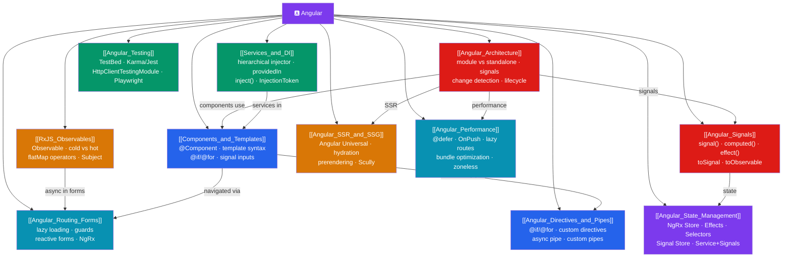

# 🅰️ Angular — Map of Content

> [!abstract] What This Section Covers
> Google's complete, opinionated, TypeScript-first framework — component model, hierarchical DI, router, reactive forms, and HTTP client all in the box. Modern Angular (v17+) features standalone components (no NgModule), signal-based reactivity, built-in control flow (`@if`/`@for`/`@switch`), and functional guards alongside the classic decorator patterns. This section covers architecture, components/templates, dependency injection/services, RxJS observables, and routing/forms.

## Concept Map

## Learning Path

1. [[Angular_Architecture]] — Module vs standalone, the component tree, change detection, signals, and zone.js.
2. [[Components_and_Templates]] — `@Component`, template syntax, built-in control flow, lifecycle hooks, and signal inputs.
3. [[Angular_Directives_and_Pipes]] — `@if`/`@for`/`@switch`, attribute directives, custom directives, built-in and custom pipes, `async` pipe.
4. [[Services_and_DI]] — The hierarchical injector, `providedIn: 'root'`, `inject()`, `InjectionToken`, and provider types.
5. [[RxJS_Observables]] — Cold vs hot observables, the four flattening operators, Subject variants, and Signals interop.
6. [[Angular_Signals]] — `signal()`, `computed()`, `effect()`, `toSignal()`/`toObservable()`, signal inputs, model().
7. [[Angular_Routing_Forms]] — Route config, lazy loading, functional guards, reactive forms, and NgRx state management.
8. [[Angular_State_Management]] — NgRx Store (Actions/Reducers/Effects/Selectors), NgRx Signal Store, Service+Signals.
9. [[Angular_Testing]] — TestBed, Karma/Jest, component testing, service testing, HttpClientTestingModule, Playwright E2E.
10. [[Angular_SSR_and_SSG]] — Angular Universal, non-destructive hydration, prerendering, Scully, platform detection.
11. [[Angular_Performance]] — `@defer` deferrable views, `OnPush` change detection, lazy routes, bundle optimization, zoneless.

## All Notes at a Glance

| Note | Difficulty | What You'll Learn |
|------|------------|-------------------|
| [[Angular_Architecture]] | Intermediate | Standalone components, signals, change detection strategy, zone.js, lifecycle |
| [[Components_and_Templates]] | Intermediate | @Component, @if/@for, signal inputs, output, viewChild, host elements |
| [[Angular_Directives_and_Pipes]] | Intermediate | @if/@for/@switch, attribute directives, custom directives, async pipe, pure vs impure pipes |
| [[Services_and_DI]] | Intermediate | Injector tree, providers, useClass/useValue/useFactory, inject() |
| [[RxJS_Observables]] | Advanced | Observable, switchMap/mergeMap/concatMap/exhaustMap, Subject, toSignal |
| [[Angular_Signals]] | Intermediate | signal/computed/effect, signal inputs, model(), toSignal/toObservable, zoneless |
| [[Angular_Routing_Forms]] | Advanced | Lazy routes, functional guards, typed forms, FormArray, NgRx store/effects |
| [[Angular_State_Management]] | Advanced | NgRx Actions/Reducers/Effects/Selectors, Entity adapter, NgRx Signal Store |
| [[Angular_Testing]] | Intermediate | TestBed, Karma vs Jest, fakeAsync, HttpClientTestingModule, Playwright E2E |
| [[Angular_SSR_and_SSG]] | Advanced | Angular Universal, non-destructive hydration, SSG prerender, Scully, platform guards |
| [[Angular_Performance]] | Advanced | @defer triggers, OnPush CD, lazy routes, esbuild, standalone tree-shaking, zoneless |

## Key Questions This Section Answers

- What is the difference between NgModule-based and standalone components in Angular 17+?
- When do you use signals vs RxJS Observables in Angular?
- How does the Angular DI hierarchical injector tree work?
- Which flattening operator (switchMap/mergeMap/concatMap/exhaustMap) do you use for which use case?
- How do you implement lazy-loaded routes with functional guards?
- What is the difference between `FormControl`, `FormGroup`, and `FormArray`?
- What are the five `@defer` trigger types and when do you use each?
- How does non-destructive hydration differ from the old Angular Universal behavior?
- What are the four NgRx building blocks and what does each do?

## Related Sections

- [[_MOC_WebDev_Master|↑ Web Dev Master MOC]]
- [[_MOC_TypeScript|← TypeScript]] (Angular is TypeScript-first)
- [[_MOC_React|→ React]] (alternative UI framework)

#MOC #WebDevelopment #Angular
