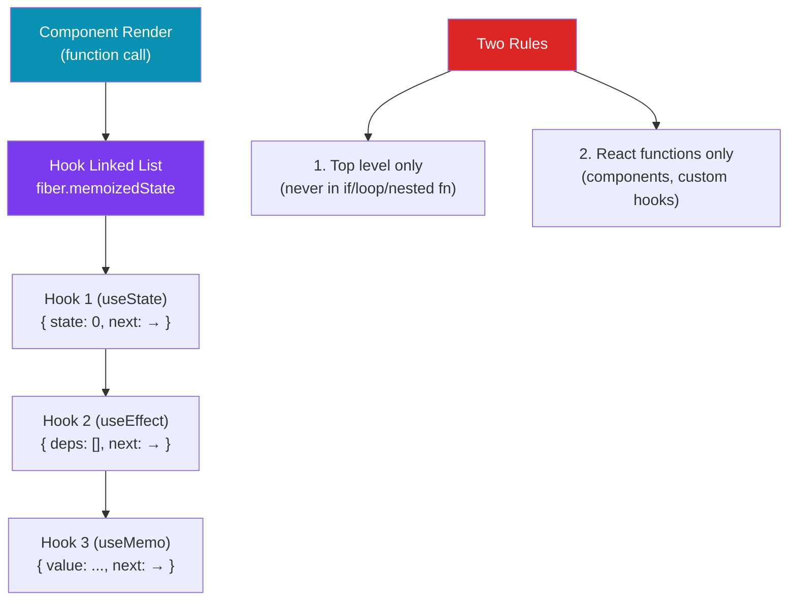

# 🪝 Hooks in React

> [!abstract] TL;DR
> Hooks are functions that let function components "hook into" React state and lifecycle. The two rules: **call only at the top level** (never inside ifs/loops), **call only from React functions** — because hooks are a positional linked list on `fiber.memoizedState` and call order is sacred. `useEffect` runs after paint with cleanup-then-rerun semantics; `useLayoutEffect` runs synchronously before paint. `useMemo` caches a value; `useCallback` caches a function. Both exist for referential identity — measure before memoizing.

## Intuition — analogy FIRST

Hooks are like a hotel housekeeping checklist. Each time a guest (render) occupies room 5 (component), housekeeping (React) reads the checklist in order: item 1 (first hook), item 2 (second hook), item 3 (third hook). The list is ordered and indexed — item 1's data always goes to item 1's slot. If you skip item 1 on alternate days, the slots shift and data is assigned to the wrong items, causing chaos.

This is exactly why you can't call hooks conditionally — the index (position in the list) must be stable across renders. React uses position, not name, to identify each hook.

---

## How It Works



---

## Key Concepts / Details

### `useState` — Component State

```jsx
import { useState } from 'react';

function Counter() {
  // Returns [currentValue, setterFunction]
  const [count, setCount] = useState(0);

  // Functional update — safe when new state depends on previous
  const increment = () => setCount(c => c + 1);

  // Lazy initialization — runs only on first render (expensive setup)
  const [data, setData] = useState(() => parseExpensiveData(rawData));

  // Object state — always spread to avoid losing properties
  const [user, setUser] = useState({ name: '', age: 0 });
  const updateName = name => setUser(prev => ({ ...prev, name }));

  return <button onClick={increment}>{count}</button>;
}
```

### `useReducer` — Complex State Transitions

```jsx
import { useReducer } from 'react';

// Prefer useReducer when:
// - State is an object with related fields
// - Next state depends on multiple previous values
// - Update logic is complex

type Action =
  | { type: 'increment' }
  | { type: 'decrement' }
  | { type: 'reset'; payload: number };

function reducer(state: number, action: Action): number {
  switch (action.type) {
    case 'increment': return state + 1;
    case 'decrement': return state - 1;
    case 'reset':     return action.payload;
    default:          return state;
  }
}

function Counter() {
  const [count, dispatch] = useReducer(reducer, 0);

  return (
    <>
      <p>{count}</p>
      <button onClick={() => dispatch({ type: 'increment' })}>+</button>
      <button onClick={() => dispatch({ type: 'reset', payload: 0 })}>Reset</button>
    </>
  );
}
```

### `useEffect` — Side Effects

```jsx
import { useEffect } from 'react';

function UserProfile({ userId }) {
  const [user, setUser] = useState(null);

  useEffect(() => {
    // Effect runs AFTER render, AFTER paint

    let cancelled = false; // cleanup flag for async effects

    async function fetchUser() {
      const data = await getUserById(userId);
      if (!cancelled) setUser(data);
    }

    fetchUser();

    // Cleanup: runs before next effect AND when component unmounts
    return () => { cancelled = true; };

  }, [userId]); // dependency array: effect re-runs when userId changes
  // [] — run once after mount only
  // [userId] — re-run when userId changes
  // no array — run after EVERY render (usually wrong)

  return user ? <div>{user.name}</div> : <Spinner />;
}
```

### `useEffect` vs `useLayoutEffect`

```jsx
// useEffect — after paint (async, doesn't block browser)
// Use for: data fetching, subscriptions, analytics, DOM reads that don't affect layout

// useLayoutEffect — synchronously after DOM mutations, before paint
// Use for: DOM measurements, scroll positions, tooltip positioning
// Runs at the same phase as class componentDidMount/componentDidUpdate

function Tooltip({ text, anchorRef }) {
  const tooltipRef = useRef(null);
  const [position, setPosition] = useState({ top: 0, left: 0 });

  useLayoutEffect(() => {
    // Measure DOM BEFORE the browser paints — no flash
    const anchor = anchorRef.current?.getBoundingClientRect();
    const tooltip = tooltipRef.current?.getBoundingClientRect();
    if (anchor && tooltip) {
      setPosition({
        top: anchor.bottom + 8,
        left: anchor.left - tooltip.width / 2
      });
    }
  }, [text]);

  return <div ref={tooltipRef} style={position}>{text}</div>;
}
```

### `useRef` — Mutable Box, No Re-render

```jsx
import { useRef } from 'react';

function StopWatch() {
  const [elapsed, setElapsed] = useState(0);
  const intervalRef = useRef<number | null>(null); // mutable, not reactive

  const start = () => {
    intervalRef.current = setInterval(() => {
      setElapsed(e => e + 1);
    }, 1000);
  };

  const stop = () => {
    clearInterval(intervalRef.current!);
    intervalRef.current = null;
  };

  // DOM ref — access the actual DOM node
  const inputRef = useRef<HTMLInputElement>(null);
  const focus = () => inputRef.current?.focus();

  return (
    <>
      <input ref={inputRef} />
      <button onClick={focus}>Focus</button>
    </>
  );
}
```

### `useMemo` and `useCallback` — Referential Identity

Both exist for referential stability — not raw speed. React uses `Object.is` for comparisons:

```jsx
import { useMemo, useCallback } from 'react';

function ProductList({ products, category, onSelect }) {
  // useMemo — cache a computed VALUE
  // Without useMemo: new array reference every render → child re-renders even if data unchanged
  const filtered = useMemo(
    () => products.filter(p => p.category === category),
    [products, category] // recompute only when these change
  );

  // useCallback — cache a FUNCTION (equivalent to useMemo(() => fn, deps))
  // Without useCallback: new function reference every render → child re-renders
  const handleSelect = useCallback(
    (product) => {
      onSelect(product.id);
    },
    [onSelect] // depends on onSelect reference
  );

  return <List items={filtered} onSelect={handleSelect} />;
}

// useMemo/useCallback ONLY help when the consumer does referential equality checks:
// - React.memo wrapping the child component
// - useEffect with the value/function in its dependency array
// - Custom hooks that compare previous and current values

// DON'T memoize everything — it adds memory overhead and comparison cost
```

### Custom Hooks — Reusable Logic

Custom hooks extract stateful logic into reusable functions. They must start with `use`:

```jsx
// Custom hook for fetching data
function useFetch<T>(url: string) {
  const [data, setData] = useState<T | null>(null);
  const [loading, setLoading] = useState(true);
  const [error, setError] = useState<Error | null>(null);

  useEffect(() => {
    let cancelled = false;
    setLoading(true);

    fetch(url)
      .then(res => res.json())
      .then(json => { if (!cancelled) { setData(json); setLoading(false); } })
      .catch(err  => { if (!cancelled) { setError(err); setLoading(false); } });

    return () => { cancelled = true; };
  }, [url]);

  return { data, loading, error };
}

// Usage
function UserProfile({ id }) {
  const { data: user, loading, error } = useFetch<User>(`/api/users/${id}`);
  if (loading) return <Spinner />;
  if (error) return <Error message={error.message} />;
  return <div>{user?.name}</div>;
}
```

### Concurrent Hooks (React 18+)

```jsx
import { useTransition, useDeferredValue, useSyncExternalStore, useId } from 'react';

// useTransition — mark state updates as non-urgent (keep UI responsive)
function SearchPage() {
  const [query, setQuery] = useState('');
  const [isPending, startTransition] = useTransition();

  const handleChange = (e) => {
    setQuery(e.target.value); // urgent — update input immediately

    startTransition(() => {
      setResults(search(e.target.value)); // non-urgent — may be interrupted
    });
  };

  return (
    <>
      <input value={query} onChange={handleChange} />
      {isPending && <Spinner />}
      <SearchResults results={results} />
    </>
  );
}

// useDeferredValue — defer rendering of a slow component
function SearchResults({ query }) {
  const deferredQuery = useDeferredValue(query); // uses stale value while computing
  const results = computeExpensiveResults(deferredQuery);
  return <ResultsList results={results} />;
}

// useId — stable ID for accessibility (avoids hydration mismatches in SSR)
function FormField() {
  const id = useId();
  return (
    <>
      <label htmlFor={id}>Name</label>
      <input id={id} />
    </>
  );
}
```

---

## Real-World Notes

- **The ESLint `exhaustive-deps` rule is your friend.** It catches missing dependencies in `useEffect`/`useMemo`/`useCallback`. Follow it; fight it by restructuring, not disabling.
- **`useEffect` dependency on an object/function** — functions and objects are new references every render. Wrap in `useCallback`/`useMemo` or pass primitives.
- **`useRef` for previous values** — `const prevCount = useRef(count); useEffect(() => { prevCount.current = count; });` — gives you `count` from the previous render.
- **`useSyncExternalStore` for external stores** — the correct way to subscribe to Zustand, Redux, or any external store without tearing in concurrent mode.

---

## Common Pitfalls

- **Missing dependencies in `useEffect`** — stale closure bug: the effect captures an old value and never updates. Always include all values read in the effect.
- **Putting functions in `useEffect` deps without `useCallback`** — the function is recreated every render, causing the effect to re-run every render.
- **Using `useLayoutEffect` when `useEffect` would do** — `useLayoutEffect` blocks paint, delaying the visual update. Only use it when you need measurements before paint.
- **Empty `[]` deps but the effect reads props** — the effect will always see the initial prop value (stale closure). Add the prop to deps.
- **Calling hooks conditionally** — causes the positional list to shift, leading to wrong state being read or "Rendered more hooks than previous render" error.

---

## Related Concepts

- [[_MOC_React|↑ Section MOC]]
- [[React_Fundamentals]] — The Fiber reconciler that makes hooks work
- [[State_Management_Redux]] — Context, external stores, and React Query complement hooks
- [[React_Performance]] — `useMemo`/`useCallback`/`useTransition` for performance

---

## Review Questions

1. Why can't you call hooks inside an `if` statement? What is the positional linked list?
2. What is the difference between `useEffect(() => ..., [])` and `useEffect(() => ...)`? When does each run?
3. Explain `useLayoutEffect`. Give a scenario where `useEffect` would cause a visual flash but `useLayoutEffect` wouldn't.
4. When does `useMemo` actually help performance? Give a case where it adds overhead without benefit.
5. What is `useTransition` and how does it keep the UI responsive during expensive updates?

---

## Sources

- React docs: Hooks reference — https://react.dev/reference/react
- React docs: Rules of Hooks — https://react.dev/reference/rules/rules-of-hooks
- React docs: Synchronizing with Effects — https://react.dev/learn/synchronizing-with-effects
- Dan Abramov: A Complete Guide to useEffect — https://overreacted.io/a-complete-guide-to-useeffect/

#web-development #react #hooks #useState #useEffect #useMemo
