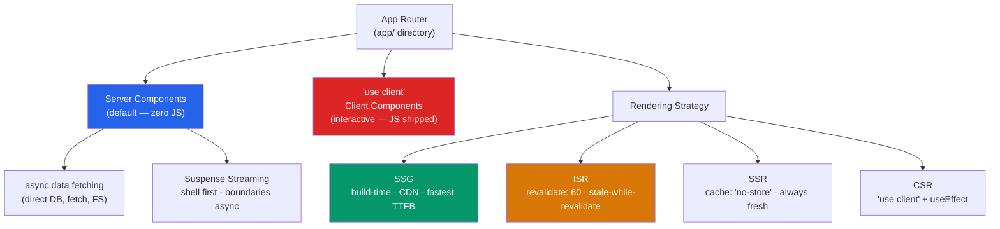

# 🔺 Next.js

> [!abstract] TL;DR
> Next.js is the full-stack React framework. The **App Router** (Next.js 13+) uses React Server Components (RSC) by default — they run on the server, fetch data in `async` components, and ship **zero client JavaScript**. `'use client'` marks the boundary where components become interactive client-side islands. The four rendering strategies: **SSG** (build-time, CDN), **ISR** (incremental static regeneration), **SSR** (per-request), **CSR** (client-only). Suspense streaming flushes the shell first, then boundaries as they resolve.

## Intuition — analogy FIRST

Next.js is like a smart restaurant with two kitchens: a cold kitchen (server) and a hot kitchen (client browser).

**Server Components** are the cold kitchen — all prep work happens before service: database queries, file reads, secret-key access. The result is fully assembled HTML — no kitchen equipment (JavaScript) ships to the customer's table. **Client Components** are the hot kitchen at the customer's table — interactive, reactive, but the customer needs the equipment (JS) to run it.

**Suspense streaming** is like sending the bread basket immediately (the HTML shell), then delivering courses as they're ready (streaming boundaries). You don't wait for the soup to finish before giving the customer their drink.

---

## How It Works



---

## Key Concepts / Details

### App Router — File System Routing

```
app/
├── layout.tsx          ← root layout (persistent across navigations)
├── page.tsx            ← home page (/)
├── loading.tsx         ← Suspense fallback for this segment
├── error.tsx           ← Error boundary for this segment
├── not-found.tsx       ← 404 for this segment
├── dashboard/
│   ├── layout.tsx      ← dashboard layout (nested)
│   ├── page.tsx        ← /dashboard
│   └── analytics/
│       └── page.tsx    ← /dashboard/analytics
├── users/
│   └── [id]/           ← dynamic segment
│       └── page.tsx    ← /users/123
└── api/
    └── users/
        └── route.ts    ← API route handler (GET, POST, etc.)
```

### Server Components — Zero Client JS

```tsx
// app/users/page.tsx — Server Component by default
// This entire component runs on the server — no JS shipped to client

import { db } from '@/lib/db';

// async component — await directly
export default async function UsersPage() {
  const users = await db.users.findMany({
    orderBy: { createdAt: 'desc' }
  });

  return (
    <div>
      <h1>Users ({users.length})</h1>
      <ul>
        {users.map(user => (
          <li key={user.id}>
            {user.name} — <span>{user.email}</span>
          </li>
        ))}
      </ul>
    </div>
  );
}
// No useState, no useEffect, no event handlers — just data + JSX
// Result: HTML with ZERO JavaScript bundle overhead
```

### Client Components — `'use client'`

```tsx
// 'use client' marks this file as a client component boundary
'use client';

import { useState } from 'react';

// This component and its children are client-side
// JavaScript IS shipped to the browser
export function LikeButton({ initialLikes }: { initialLikes: number }) {
  const [likes, setLikes] = useState(initialLikes);
  const [liked, setLiked] = useState(false);

  const handleLike = async () => {
    const next = !liked;
    setLiked(next);
    setLikes(l => next ? l + 1 : l - 1);
    await toggleLike(); // server action or API call
  };

  return (
    <button onClick={handleLike}>
      {liked ? '❤️' : '🤍'} {likes}
    </button>
  );
}
```

**Keep `'use client'` as low in the tree as possible.** A server component can import a client component, but not vice versa.

### Server Actions — Forms Without API Routes

```tsx
// app/create-post/page.tsx
'use server'; // marks functions in this file as server actions

async function createPost(formData: FormData) {
  const title   = formData.get('title') as string;
  const content = formData.get('content') as string;

  await db.posts.create({ data: { title, content } });
  revalidatePath('/posts'); // invalidate cached data
  redirect('/posts');
}

// In a Server Component
export default function CreatePostPage() {
  return (
    <form action={createPost}> {/* server action as form action */}
      <input name="title" required />
      <textarea name="content" required />
      <button type="submit">Create Post</button>
    </form>
  );
}
```

### Rendering Strategies

```tsx
// 1. SSG — Static Site Generation (default if no dynamic data)
export default async function BlogPost({ params }) {
  const post = await getPost(params.slug);
  return <Article post={post} />;
}

// Generate static paths at build time
export async function generateStaticParams() {
  const posts = await getPosts();
  return posts.map(post => ({ slug: post.slug }));
}

// 2. ISR — Incremental Static Regeneration
async function getPost(slug: string) {
  const res = await fetch(`https://api/posts/${slug}`, {
    next: { revalidate: 60 } // regenerate every 60 seconds
  });
  return res.json();
}

// 3. SSR — Server-Side Rendering (fresh every request)
async function getData() {
  const res = await fetch('/api/data', {
    cache: 'no-store' // disable cache → SSR
  });
  return res.json();
}

// 4. CSR — Client-Side Rendering
'use client';
function ClientPage() {
  const { data } = useQuery({ queryKey: ['data'], queryFn: fetchData });
  return <div>{data?.title}</div>;
}
```

| Strategy | When rendered | JS shipped | TTFB | Freshness |
|----------|--------------|-----------|------|-----------|
| **SSG** | Build time | No | Fastest (CDN) | Stale until rebuild |
| **ISR** | Build + background | No | Fast (CDN) | Configurable revalidation |
| **SSR** | Per request | No | Moderate | Always fresh |
| **CSR** | Browser | Yes | Variable | Client-controlled |

### Layouts and Metadata

```tsx
// app/layout.tsx — root layout
import type { Metadata } from 'next';

export const metadata: Metadata = {
  title: 'My App',
  description: 'My awesome app',
  openGraph: {
    title: 'My App',
    images: ['/og-image.png']
  }
};

export default function RootLayout({ children }: { children: React.ReactNode }) {
  return (
    <html lang="en">
      <body>
        <Header />
        <main>{children}</main>
        <Footer />
      </body>
    </html>
  );
}

// Dynamic metadata in page
export async function generateMetadata({ params }) {
  const post = await getPost(params.slug);
  return { title: post.title, description: post.excerpt };
}
```

### Suspense Streaming

```tsx
// app/dashboard/page.tsx
import { Suspense } from 'react';

export default function DashboardPage() {
  return (
    <>
      {/* Shell renders immediately */}
      <DashboardHeader />

      {/* These boundaries stream independently */}
      <Suspense fallback={<MetricsSkeleton />}>
        <MetricsPanel />  {/* async server component */}
      </Suspense>

      <Suspense fallback={<ChartSkeleton />}>
        <RevenueChart />  {/* streams after MetricsPanel or parallel */}
      </Suspense>
    </>
  );
}

// With parallel data fetching
async function MetricsPanel() {
  const [users, revenue, orders] = await Promise.all([
    getUserCount(),
    getRevenue(),
    getOrderCount()
  ]);

  return <Metrics users={users} revenue={revenue} orders={orders} />;
}
```

### Edge Middleware

```typescript
// middleware.ts — runs at the edge before every request
import { NextResponse } from 'next/server';
import type { NextRequest } from 'next/server';

export function middleware(request: NextRequest) {
  const token = request.cookies.get('auth-token')?.value;

  // Protect dashboard routes
  if (request.nextUrl.pathname.startsWith('/dashboard')) {
    if (!token) {
      return NextResponse.redirect(new URL('/login', request.url));
    }
  }

  return NextResponse.next();
}

// Apply only to specific paths
export const config = {
  matcher: ['/dashboard/:path*', '/admin/:path*']
};
```

---

## Real-World Notes

- **Server Components ship zero JavaScript** — a page with only server components has the same interactivity cost as plain HTML. This is the biggest LCP/TTI improvement over pure CSR.
- **`'use client'` is a boundary, not a file-level property** — client components imported by server components work fine. The boundary means "below this point, client JS runs."
- **Server Actions eliminate the need for API routes** for form submissions — progressive enhancement means they work even without JavaScript.
- **ISR with `revalidate: 0` is SSR.** The value is in seconds: `revalidate: 60` = at most 1 minute stale.

---

## Common Pitfalls

- **Importing server-only code in client components** — database clients, filesystem access, secret environment variables will fail or leak. Use `server-only` package to get a build error if this happens.
- **Passing non-serializable props from server to client** — functions, class instances, and Dates (without serialization) cannot cross the RSC boundary. Use primitives and JSON-serializable values.
- **Forgetting `loading.tsx`** — without it, navigation to a slow RSC route blocks navigation. Add a loading skeleton for all slow routes.
- **Over-using `'use client'`** — marking a parent as a client component forces all its children to be client components too. Push `'use client'` down to the leaf interactive elements.
- **Waterfall data fetching in RSC** — sequential awaits inside RSC are fine, but independent fetches should be parallelized with `Promise.all`.

---

## Related Concepts

- [[_MOC_React|↑ Section MOC]]
- [[React_Fundamentals]] — JSX and component model that RSC extends
- [[React_Performance]] — RSC/SSG/SSR improve Web Vitals at the framework level
- [[State_Management_Redux]] — Client state lives in client components; React Query integrates well

---

## Review Questions

1. What is the key difference between a React Server Component and a Client Component (`'use client'`)?
2. Explain the four rendering strategies (SSG, ISR, SSR, CSR) and when you'd choose each.
3. How does Suspense streaming improve page load experience? What is the "shell"?
4. What can't you do in a Server Component? List four things.
5. How do Next.js Edge Middleware differ from API Routes for auth gating?

---

## Sources

- Next.js docs: App Router — https://nextjs.org/docs/app
- Next.js docs: Rendering — https://nextjs.org/docs/app/building-your-application/rendering
- Next.js docs: Server Actions — https://nextjs.org/docs/app/building-your-application/data-fetching/server-actions-and-mutations
- Next.js docs: Streaming — https://nextjs.org/docs/app/building-your-application/routing/loading-ui-and-streaming

#web-development #react #nextjs #server-components #rendering-strategies
