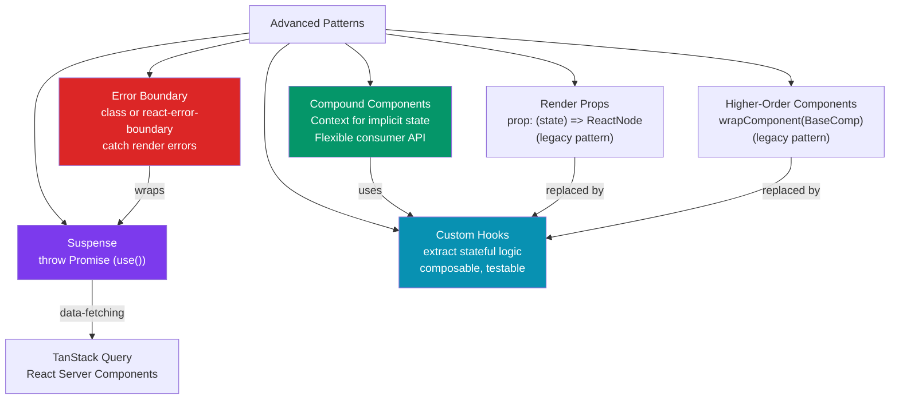

# 🏗️ React Advanced Patterns

> [!abstract] TL;DR
> Advanced React patterns solve component composition and reuse problems. **Suspense** lets components declare loading states declaratively — the nearest `<Suspense>` boundary catches a thrown Promise (via `use()`) and shows a fallback. **Error Boundaries** catch render errors in the subtree (class components only, or `react-error-boundary` library). **Compound components** (like `<Select>` + `<Select.Option>`) share implicit state via Context, giving consumers a clean API. **Render props** and **HOCs** are legacy power patterns, largely superseded by custom hooks. **Custom hooks** are the modern pattern for extracting and sharing stateful logic without changing the component tree.

## Intuition — analogy FIRST

Think of these patterns as different ways to share tools in a workshop:

- **Custom hooks** — a shared toolbox that multiple workers can borrow. Each worker gets their own copy of the tool (independent state), but the same procedures.
- **Compound components** — a car kit sold as separate pieces (door, engine, wheels) that are designed to work together. The kit has internal specs each part relies on (Context), but the consumer just assembles them.
- **Render props** — hiring a contractor who brings their own scaffolding. You specify *what* to build (the render function), they provide the mechanism.
- **HOCs** — a factory that takes a plain widget and adds features (authentication check, logging) — the output is an enhanced version of the original.
- **Suspense** — a "be right back" note on a door. While data loads, React shows the fallback note; when data arrives, it swaps in the real content.

---

## How It Works



---

## Key Concepts / Details

### Suspense — Declarative Loading States

```tsx
import { Suspense, use } from 'react'; // use() is React 19+
import { Await } from 'react-router-dom'; // or use react-router's Await

// Modern: use() hook (React 19+) — unwraps a Promise, throws if pending
async function fetchUser(id: string): Promise<User> {
  const res = await fetch(`/api/users/${id}`);
  return res.json();
}

function UserProfile({ userId }: { userId: string }) {
  // use() suspends the component while the Promise is pending
  const user = use(userPromise); // Promise passed as prop or from cache
  return <h1>{user.name}</h1>;
}

// Parent wraps in Suspense — fallback renders while any child suspends
function App() {
  const userPromise = fetchUser('42');
  return (
    <Suspense fallback={<UserSkeleton />}>
      <UserProfile userPromise={userPromise} />
    </Suspense>
  );
}

// TanStack Query + Suspense (useSuspenseQuery)
import { useSuspenseQuery } from '@tanstack/react-query';

function UserCard({ userId }: { userId: string }) {
  // Never returns loading state — suspends instead
  const { data: user } = useSuspenseQuery({
    queryKey: ['user', userId],
    queryFn: () => fetchUser(userId),
  });
  return <div>{user.name}</div>; // data is always defined here
}

// Nested Suspense boundaries — each boundary catches its own subtree
function Dashboard() {
  return (
    <div>
      <Suspense fallback={<Skeleton />}>
        <UserCard userId="1" />
      </Suspense>
      <Suspense fallback={<Skeleton />}>
        <RecentActivity userId="1" />  {/* loads independently */}
      </Suspense>
    </div>
  );
}
```

### Error Boundaries

```tsx
// react-error-boundary library — functional wrapper around class ErrorBoundary
import { ErrorBoundary, useErrorBoundary } from 'react-error-boundary';

function ErrorFallback({ error, resetErrorBoundary }: FallbackProps) {
  return (
    <div role="alert" className="error-card">
      <h2>Something went wrong</h2>
      <pre>{error.message}</pre>
      <button onClick={resetErrorBoundary}>Try again</button>
    </div>
  );
}

function App() {
  return (
    // onReset re-runs when "Try again" is clicked
    <ErrorBoundary
      FallbackComponent={ErrorFallback}
      onReset={() => { /* clear any state that caused the error */ }}
      onError={(error, info) => logErrorToService(error, info.componentStack)}
    >
      <Suspense fallback={<Skeleton />}>
        <FeatureComponent />
      </Suspense>
    </ErrorBoundary>
  );
}

// Trigger an error boundary programmatically (e.g., from an async error)
function DataComponent() {
  const { showBoundary } = useErrorBoundary();

  useEffect(() => {
    fetchData().catch(showBoundary); // rethrows into error boundary
  }, []);
}
```

### Compound Components — Flexible Composition

```tsx
import { createContext, useContext, useState } from 'react';

// 1. Create context for shared state
interface SelectContext {
  value: string;
  onChange: (value: string) => void;
  open: boolean;
  setOpen: (open: boolean) => void;
}
const SelectCtx = createContext<SelectContext | null>(null);

function useSelectContext() {
  const ctx = useContext(SelectCtx);
  if (!ctx) throw new Error('Must be used inside <Select>');
  return ctx;
}

// 2. Root component owns and provides state
function Select({ children, defaultValue = '' }: { children: React.ReactNode; defaultValue?: string }) {
  const [value, setValue] = useState(defaultValue);
  const [open, setOpen] = useState(false);
  return (
    <SelectCtx.Provider value={{ value, onChange: setValue, open, setOpen }}>
      <div className="select-root">{children}</div>
    </SelectCtx.Provider>
  );
}

// 3. Sub-components consume context implicitly
Select.Trigger = function Trigger({ children }: { children: React.ReactNode }) {
  const { value, open, setOpen } = useSelectContext();
  return (
    <button onClick={() => setOpen(!open)}>
      {value || children}
    </button>
  );
};

Select.Option = function Option({ value, children }: { value: string; children: React.ReactNode }) {
  const ctx = useSelectContext();
  return (
    <div onClick={() => { ctx.onChange(value); ctx.setOpen(false); }}
         className={ctx.value === value ? 'selected' : ''}>
      {children}
    </div>
  );
};

// Consumer API — clean, no prop drilling
function LanguagePicker() {
  return (
    <Select defaultValue="en">
      <Select.Trigger>Choose language</Select.Trigger>
      <Select.Option value="en">English</Select.Option>
      <Select.Option value="es">Spanish</Select.Option>
      <Select.Option value="fr">French</Select.Option>
    </Select>
  );
}
```

### Custom Hooks — The Modern Reuse Pattern

```tsx
// Extract any stateful logic into a hook — reuse across components
function useLocalStorage<T>(key: string, initialValue: T) {
  const [storedValue, setStoredValue] = useState<T>(() => {
    try {
      const item = window.localStorage.getItem(key);
      return item ? JSON.parse(item) : initialValue;
    } catch {
      return initialValue;
    }
  });

  const setValue = useCallback((value: T | ((prev: T) => T)) => {
    try {
      const valueToStore = value instanceof Function ? value(storedValue) : value;
      setStoredValue(valueToStore);
      window.localStorage.setItem(key, JSON.stringify(valueToStore));
    } catch (error) {
      console.error(error);
    }
  }, [key, storedValue]);

  return [storedValue, setValue] as const;
}

// useDebounce — delay a value update
function useDebounce<T>(value: T, delay: number): T {
  const [debouncedValue, setDebouncedValue] = useState(value);
  useEffect(() => {
    const timer = setTimeout(() => setDebouncedValue(value), delay);
    return () => clearTimeout(timer);
  }, [value, delay]);
  return debouncedValue;
}

// Composing hooks — combine multiple hooks into a domain hook
function useUserSearch() {
  const [query, setQuery] = useState('');
  const debouncedQuery = useDebounce(query, 300);

  const { data: results, isLoading } = useQuery({
    queryKey: ['users', 'search', debouncedQuery],
    queryFn: () => searchUsers(debouncedQuery),
    enabled: debouncedQuery.length > 1,
  });

  return { query, setQuery, results, isLoading };
}
```

### Portals — Render Outside the Component Tree

```tsx
import { createPortal } from 'react-dom';
import { useEffect, useRef } from 'react';

function Modal({ children, onClose }: { children: React.ReactNode; onClose: () => void }) {
  // Trap focus within modal
  const modalRef = useRef<HTMLDivElement>(null);

  useEffect(() => {
    modalRef.current?.focus();
    const handleKeyDown = (e: KeyboardEvent) => {
      if (e.key === 'Escape') onClose();
    };
    document.addEventListener('keydown', handleKeyDown);
    return () => document.removeEventListener('keydown', handleKeyDown);
  }, [onClose]);

  return createPortal(
    <div className="modal-overlay" role="dialog" aria-modal="true">
      <div className="modal-content" ref={modalRef} tabIndex={-1}>
        <button className="modal-close" onClick={onClose} aria-label="Close">×</button>
        {children}
      </div>
    </div>,
    document.getElementById('portal-root')! // separate DOM node — avoids z-index issues
  );
}
```

---

## Trade-offs

| Pattern | When to Use | Replaced By | Notes |
|---------|------------|------------|-------|
| Custom hooks | Always — extracting stateful logic | N/A (current best practice) | Testable independently |
| Compound components | Component libraries, complex UI primitives | N/A | Clean consumer API via Context |
| Suspense | Async data + React 18+ | Loading state in component | Requires error boundary |
| Error boundaries | Catch render errors, API errors | react-error-boundary wraps class API | Can't catch async errors |
| Render props | Sharing render logic | Custom hooks | Still valid in some library APIs |
| HOCs | Cross-cutting concerns (auth, logging) | Custom hooks | Still used in class-component codebases |

---

## Real-World Notes

- **Suspense + Error Boundary always go together.** A suspending component that errors without an Error Boundary above it crashes the app. Wrap `<Suspense>` inside `<ErrorBoundary>`.
- **Compound components scale better than prop-based alternatives.** A `<Select options={[...]} />` becomes a rigid API; `<Select><Select.Option>` is infinitely flexible.
- **Custom hooks are just functions** — they don't create component instances. They share *logic*, not *state*. Each component using the hook gets its own independent state.
- **Portals for modals, tooltips, and dropdowns** — rendering inside a deeply nested component causes z-index and overflow clipping issues. Portals escape the DOM hierarchy while keeping React event bubbling intact.

---

## Common Pitfalls

- **Error boundaries don't catch async errors** — `useEffect(() => { throw new Error() })` is an async error. Use `useErrorBoundary().showBoundary(error)` to forward it into the boundary.
- **Compound component context without a guard** — accessing context outside the root component returns `null`. Always throw a descriptive error in the `useXxxContext` hook.
- **Overusing HOCs** — wrapping components in multiple HOCs (`withAuth(withLogging(withTheme(Component)))`) creates confusing "wrapper hell" with hard-to-debug display names. Prefer hooks.
- **Suspense fallback that causes layout shift** — if the fallback dimensions differ from the loaded content, the page jumps. Use skeleton loaders that match the loaded content dimensions.

---

## Related Concepts

- [[_MOC_React|↑ Section MOC]]
- [[React_Fundamentals]] — Portals and Error Boundaries covered briefly here
- [[Hooks_in_React]] — The hooks that power custom hooks patterns
- [[React_Data_Fetching]] — Suspense integration with TanStack Query

---

## Review Questions

1. What must a component do to "suspend"? How does React know to show the Suspense fallback?
2. Why can't a function component be an Error Boundary? What is the `react-error-boundary` solution?
3. How do compound components use Context to avoid prop drilling? Sketch the `<Select>` example.
4. What is the key difference between a custom hook sharing logic vs a component sharing UI?
5. When would you still use a render prop pattern instead of a custom hook?

---

## Sources

- React docs: Suspense — https://react.dev/reference/react/Suspense
- React docs: Error Boundaries — https://react.dev/reference/react/Component#catching-rendering-errors-with-an-error-boundary
- react-error-boundary: https://github.com/bvaughn/react-error-boundary
- Kent C. Dodds: Compound Components — https://kentcdodds.com/blog/compound-components-with-react-hooks

#web-development #react #patterns #suspense #error-boundary #compound-components #custom-hooks
