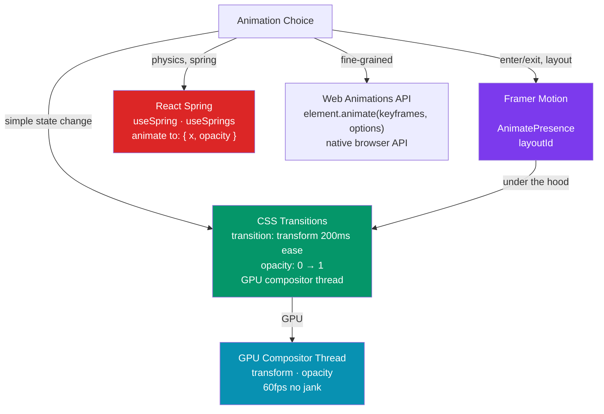

# 🎬 React Animation

> [!abstract] TL;DR
> React animation lives at three layers: **CSS transitions/animations** (zero-JS, GPU-accelerated `transform` + `opacity` — always the first choice), **Framer Motion** (declarative, gesture-aware, layout animations, animate-presence for exit animations — the dominant library in 2024–2026), and **React Spring** (physics-based, spring interpolation, great for complex multi-step sequences). The golden rule: animate `transform` and `opacity` only — these properties never trigger layout recalculation, staying on the GPU compositor thread. `height`/`width`/`top`/`left` animations trigger layout and repaint every frame.

## Intuition — analogy FIRST

Animations in a browser are like moving props on a stage:

- **CSS transitions** — the stage crew moves props between preset positions. You just flip a switch (change a class or CSS variable) and they handle the smooth movement automatically.
- **Framer Motion** — a smart stage director who remembers where every prop was, knows how to animate between layouts, and handles exit choreography gracefully (the prop gracefully exits stage-left instead of vanishing).
- **React Spring** — a physics simulator. Props don't just move at a fixed speed — they spring, bounce, and settle realistically, as if connected by actual springs.
- **`transform` vs `layout`** — moving a prop by carrying it (transform: translate) vs rebuilding the entire stage (layout). Rebuilding the stage between every frame freezes the audience.

---

## How It Works



---

## Key Concepts / Details

### CSS Transitions — Always the First Choice

```css
/* Transition properties that stay on GPU: transform, opacity, filter */
/* GOOD — compositor-only, 60fps guaranteed */
.card {
  transform: translateY(0) scale(1);
  opacity: 1;
  transition: transform 200ms ease-out, opacity 200ms ease-out;
}

.card:hover {
  transform: translateY(-4px) scale(1.02);
  opacity: 0.95;
}

/* BAD — triggers layout recalculation every frame */
.card-bad {
  top: 0;
  width: 100px;
  height: 200px;
  transition: height 200ms; /* forces layout recalc at 60fps = jank */
}

/* Animating height: use max-height trick or clip-path */
.accordion-content {
  max-height: 0;
  overflow: hidden;
  transition: max-height 300ms ease-out;
}
.accordion-content.open {
  max-height: 500px; /* set to a value larger than content */
}
```

```tsx
// React + CSS transitions — toggle class based on state
function Toast({ message, visible }: { message: string; visible: boolean }) {
  return (
    <div className={cn(
      'fixed bottom-4 right-4 rounded-lg bg-gray-900 text-white px-4 py-2',
      'transition-all duration-300 ease-out',
      visible ? 'translate-y-0 opacity-100' : 'translate-y-4 opacity-0 pointer-events-none'
    )}>
      {message}
    </div>
  );
}
```

### Framer Motion — Declarative Animations

```tsx
import { motion, AnimatePresence, useMotionValue, useTransform } from 'framer-motion';

// Basic animate — from initial to animate on mount
function FadeIn({ children }: { children: React.ReactNode }) {
  return (
    <motion.div
      initial={{ opacity: 0, y: 20 }}      // starting state
      animate={{ opacity: 1, y: 0 }}       // target state
      exit={{ opacity: 0, y: -20 }}        // exit state (requires AnimatePresence)
      transition={{ duration: 0.3, ease: 'easeOut' }}
    >
      {children}
    </motion.div>
  );
}

// AnimatePresence — enables exit animations when components unmount
function Notification({ notifications }: { notifications: Notification[] }) {
  return (
    <AnimatePresence mode="popLayout">  {/* popLayout: remaining items re-layout smoothly */}
      {notifications.map(notif => (
        <motion.div
          key={notif.id}
          layout                          // animate layout changes automatically
          initial={{ opacity: 0, x: 100 }}
          animate={{ opacity: 1, x: 0 }}
          exit={{ opacity: 0, x: 100 }}
          transition={{ type: 'spring', stiffness: 400, damping: 30 }}
        >
          {notif.message}
        </motion.div>
      ))}
    </AnimatePresence>
  );
}

// layoutId — shared layout animation between different components
function ImageGallery({ images }: { images: Image[] }) {
  const [selected, setSelected] = useState<Image | null>(null);

  return (
    <>
      <div className="grid grid-cols-3 gap-2">
        {images.map(image => (
          <motion.img
            key={image.id}
            layoutId={`image-${image.id}`}  // same ID on both thumbnail and modal
            src={image.thumb}
            onClick={() => setSelected(image)}
            className="cursor-pointer rounded"
          />
        ))}
      </div>

      <AnimatePresence>
        {selected && (
          <motion.div className="fixed inset-0 bg-black/80 flex items-center justify-center"
            onClick={() => setSelected(null)}>
            <motion.img
              layoutId={`image-${selected.id}`}  // Framer animates between positions
              src={selected.full}
              className="max-w-2xl rounded-lg"
            />
          </motion.div>
        )}
      </AnimatePresence>
    </>
  );
}

// Gesture animations — drag, hover, tap
function DraggableCard() {
  return (
    <motion.div
      drag
      dragConstraints={{ left: -100, right: 100, top: -100, bottom: 100 }}
      whileHover={{ scale: 1.05, boxShadow: '0 8px 24px rgba(0,0,0,0.2)' }}
      whileTap={{ scale: 0.97 }}
      whileDrag={{ scale: 1.1, rotate: 5 }}
      className="cursor-grab rounded-xl bg-white p-6 shadow"
    >
      Drag me
    </motion.div>
  );
}
```

### React Spring — Physics-Based Animation

```tsx
import { useSpring, useTrail, animated } from '@react-spring/web';

// useSpring — single value or object of values
function SpringButton() {
  const [clicked, setClicked] = useState(false);

  const style = useSpring({
    transform: clicked ? 'scale(0.95)' : 'scale(1)',
    backgroundColor: clicked ? '#1d4ed8' : '#2563eb',
    config: { tension: 400, friction: 20 }, // spring physics
  });

  return (
    <animated.button
      style={style}
      onClick={() => { setClicked(true); setTimeout(() => setClicked(false), 150); }}
    >
      Click me
    </animated.button>
  );
}

// useTrail — staggered animations for lists
function AnimatedList({ items }: { items: string[] }) {
  const [open, setOpen] = useState(false);

  const trail = useTrail(items.length, {
    opacity: open ? 1 : 0,
    y: open ? 0 : 20,
    config: { tension: 280, friction: 60 },
  });

  return (
    <div>
      <button onClick={() => setOpen(o => !o)}>Toggle</button>
      {trail.map((style, i) => (
        <animated.div key={i} style={style}>{items[i]}</animated.div>
      ))}
    </div>
  );
}
```

### Animation Best Practices

```tsx
// 1. Respect prefers-reduced-motion — accessibility requirement
import { useReducedMotion } from 'framer-motion';

function AnimatedHero() {
  const shouldReduceMotion = useReducedMotion();

  return (
    <motion.h1
      initial={{ opacity: 0, y: shouldReduceMotion ? 0 : 40 }}
      animate={{ opacity: 1, y: 0 }}
      transition={{ duration: shouldReduceMotion ? 0 : 0.6 }}
    >
      Welcome
    </motion.h1>
  );
}

// CSS equivalent
// @media (prefers-reduced-motion: reduce) {
//   * { animation-duration: 0.01ms !important; transition-duration: 0.01ms !important; }
// }

// 2. Lazy-load Framer Motion — it's 50KB gzipped
const MotionComponent = lazy(() =>
  import('./AnimatedComponent').then(m => ({ default: m.AnimatedComponent }))
);

// 3. will-change hint for GPU promotion (use sparingly)
// <div style={{ willChange: 'transform' }}> — promotes to compositor layer
// Overuse causes GPU memory pressure; only add when you know an animation is coming
```

---

## Trade-offs

| Approach | Bundle Cost | GPU-safe | Gesture | Exit Anim | Complexity |
|----------|------------|---------|---------|----------|-----------|
| CSS transitions | 0KB | Yes | No | No | Low |
| CSS @keyframes | 0KB | Yes | No | No | Low |
| Framer Motion | ~50KB | Yes | Yes | Yes | Medium |
| React Spring | ~25KB | Yes | Partial | No (use AnimatePresence equiv) | Medium |
| Web Animations API | 0KB | Yes | No | Manual | High |
| GSAP | ~60KB | Yes | Yes | Yes | High |

---

## Real-World Notes

- **CSS transitions for micro-interactions; Framer Motion for orchestrated sequences.** Hover, focus, and active states → CSS. Modal enter/exit, list reorder, shared element transitions → Framer Motion.
- **`AnimatePresence` is the killer feature of Framer Motion.** React unmounts components immediately; without `AnimatePresence` you can't animate something that's leaving the DOM.
- **`layoutId` for shared element transitions** (e.g., thumbnail → full image, list item → detail page) creates impressive UX with minimal code — far easier than manual FLIP animations.
- **Spring physics feel more natural than tween easing.** Human objects have mass and momentum; a card that springs into place with gentle overshoot feels more real than one that decelerates with `ease-out`.
- **Always honor `prefers-reduced-motion`.** Vestibular disorders affect ~35% of adults over 40; animated content can cause physical discomfort. Framer Motion's `useReducedMotion()` makes this trivial.

---

## Common Pitfalls

- **Animating `height` or `width`** — these trigger layout recalc every frame. Use `max-height` trick, `clip-path`, or Framer Motion's `layout` prop (which uses FLIP) instead.
- **Forgetting `AnimatePresence` for exit animations** — defining `exit` on a `motion.div` without wrapping in `AnimatePresence` has no effect; the component unmounts immediately.
- **`layoutId` collision** — two different components with the same `layoutId` active simultaneously causes Framer Motion to try to animate one element to two places. Ensure IDs are unique to active elements.
- **Framer Motion in every component** — 50KB is fine for an app; not fine for a design system component library consumed by many apps. Use CSS for library components.

---

## Related Concepts

- [[_MOC_React|↑ Section MOC]]
- [[React_Styling]] — CSS transitions, Tailwind transition utilities
- [[React_Performance]] — `will-change`, paint layers, and animation jank
- [[React_Advanced_Patterns]] — Portals for modal animations

---

## Review Questions

1. Why should animations use `transform` and `opacity` instead of `top`/`width`/`height`? What browser thread handles each?
2. What does `AnimatePresence` do that React alone cannot? Why is it needed for exit animations?
3. How does Framer Motion's `layoutId` create a shared-element transition? What FLIP technique does it use internally?
4. What does `prefers-reduced-motion` protect against, and how do you respect it in Framer Motion?
5. When would you choose React Spring over Framer Motion?

---

## Sources

- Framer Motion docs: https://www.framer.com/motion
- React Spring docs: https://www.react-spring.dev
- CSS Triggers (layout/paint/composite table): https://csstriggers.com
- Josh Comeau: Animation guide — https://www.joshwcomeau.com/animation/a-friendly-introduction-to-spring-physics

#web-development #react #animation #framer-motion #react-spring #css-transitions
