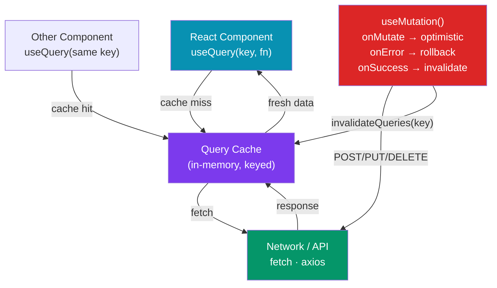

# 🔄 React Data Fetching

> [!abstract] TL;DR
> React has no built-in data-fetching primitive. The modern answer is **TanStack Query** (formerly React Query): a server-state library that gives every fetched resource a cache key, automatically refetches on window focus and reconnect, deduplicates concurrent requests, and exposes `isLoading`/`isError`/`data` with zero boilerplate. **SWR** is the lighter Vercel alternative with the same stale-while-revalidate caching model. Plain `fetch`/`axios` inside `useEffect` is the escape hatch — correct but verbose. Optimistic updates (`useMutation` + `onMutate`) apply changes immediately and roll back on error.

## Intuition — analogy FIRST

Think of TanStack Query as a smart library card system:

- Every API endpoint is a **book** with a unique Dewey Decimal number (query key like `['users', 42]`).
- The library has a **cache room** (query cache). If someone already checked out the book recently, you get the cached copy instantly while the library silently fetches a fresh copy from the publisher.
- **Stale-while-revalidate**: you read the old book immediately (no blank screen), and when the fresh edition arrives, it replaces it seamlessly.
- **Query deduplication**: if 10 components request the same book simultaneously, only one trip to the publisher happens — all 10 get the same result.

Without TanStack Query, every `useEffect` fetch is like an unstaffed library: every visitor walks to the publisher themselves, waits in line alone, and gets their own copy — no sharing, no cache, no system.

---

## How It Works



---

## Key Concepts / Details

### TanStack Query — Setup and Basic Query

```tsx
// main.tsx — wrap app in QueryClientProvider
import { QueryClient, QueryClientProvider } from '@tanstack/react-query';
import { ReactQueryDevtools } from '@tanstack/react-query-devtools';

const queryClient = new QueryClient({
  defaultOptions: {
    queries: {
      staleTime: 5 * 60 * 1000,  // data is fresh for 5 min (no refetch)
      gcTime: 10 * 60 * 1000,    // garbage collect after 10 min unused
      retry: 2,                   // retry failed requests twice
    },
  },
});

function App() {
  return (
    <QueryClientProvider client={queryClient}>
      <Router />
      <ReactQueryDevtools initialIsOpen={false} />
    </QueryClientProvider>
  );
}
```

```tsx
// useQuery — read data
import { useQuery } from '@tanstack/react-query';
import axios from 'axios';

async function fetchUser(id: string): Promise<User> {
  const { data } = await axios.get(`/api/users/${id}`);
  return data;
}

function UserProfile({ userId }: { userId: string }) {
  const {
    data: user,
    isLoading,
    isError,
    error,
    isFetching,          // true even on background refetch
    refetch,
  } = useQuery({
    queryKey: ['user', userId],  // cache key — must be unique + stable
    queryFn: () => fetchUser(userId),
    enabled: !!userId,           // only run when userId is defined
    staleTime: 60_000,           // override default for this query
  });

  if (isLoading) return <Skeleton />;
  if (isError)   return <ErrorMessage error={error} />;

  return (
    <div>
      <h1>{user.name}</h1>
      {isFetching && <Spinner size="sm" />}  {/* background refresh indicator */}
    </div>
  );
}
```

### useMutation — Mutations with Optimistic Updates

```tsx
import { useMutation, useQueryClient } from '@tanstack/react-query';

async function updateUser(payload: { id: string; name: string }): Promise<User> {
  const { data } = await axios.put(`/api/users/${payload.id}`, payload);
  return data;
}

function EditUserForm({ user }: { user: User }) {
  const queryClient = useQueryClient();

  const mutation = useMutation({
    mutationFn: updateUser,

    // Optimistic update — apply change immediately before server confirms
    onMutate: async (newUser) => {
      await queryClient.cancelQueries({ queryKey: ['user', newUser.id] });
      const previousUser = queryClient.getQueryData<User>(['user', newUser.id]);

      // Optimistically update cache
      queryClient.setQueryData(['user', newUser.id], (old: User) => ({
        ...old, ...newUser,
      }));

      return { previousUser }; // context passed to onError
    },

    // Rollback on error
    onError: (_err, newUser, context) => {
      queryClient.setQueryData(['user', newUser.id], context?.previousUser);
    },

    // Sync cache with server after success or error
    onSettled: (_data, _err, newUser) => {
      queryClient.invalidateQueries({ queryKey: ['user', newUser.id] });
    },
  });

  function handleSubmit(e: React.FormEvent<HTMLFormElement>) {
    e.preventDefault();
    const name = new FormData(e.currentTarget).get('name') as string;
    mutation.mutate({ id: user.id, name });
  }

  return (
    <form onSubmit={handleSubmit}>
      <input name="name" defaultValue={user.name} />
      <button disabled={mutation.isPending}>
        {mutation.isPending ? 'Saving…' : 'Save'}
      </button>
      {mutation.isError && <p>{mutation.error.message}</p>}
    </form>
  );
}
```

### Pagination and Infinite Queries

```tsx
import { useInfiniteQuery } from '@tanstack/react-query';

function PostFeed() {
  const {
    data,
    fetchNextPage,
    hasNextPage,
    isFetchingNextPage,
  } = useInfiniteQuery({
    queryKey: ['posts'],
    queryFn: ({ pageParam }) => fetchPosts({ cursor: pageParam, limit: 20 }),
    initialPageParam: undefined as string | undefined,
    getNextPageParam: (lastPage) => lastPage.nextCursor, // undefined stops pagination
  });

  const posts = data?.pages.flatMap(page => page.items) ?? [];

  return (
    <div>
      {posts.map(post => <PostCard key={post.id} post={post} />)}
      <button
        onClick={() => fetchNextPage()}
        disabled={!hasNextPage || isFetchingNextPage}
      >
        {isFetchingNextPage ? 'Loading…' : hasNextPage ? 'Load more' : 'End'}
      </button>
    </div>
  );
}
```

### SWR — Lightweight Alternative

```tsx
import useSWR from 'swr';
import useSWRMutation from 'swr/mutation';

// Global fetcher
const fetcher = (url: string) => fetch(url).then(r => r.json());

function UserCard({ userId }: { userId: string }) {
  const { data, error, isLoading, mutate } = useSWR<User>(
    `/api/users/${userId}`,
    fetcher,
    {
      revalidateOnFocus: true,
      refreshInterval: 30_000,  // poll every 30s
      dedupingInterval: 2000,
    }
  );

  if (isLoading) return <Skeleton />;
  if (error) return <p>Error: {error.message}</p>;

  return (
    <div>
      <h1>{data.name}</h1>
      <button onClick={() => mutate()}>Refresh</button>  {/* manual revalidate */}
    </div>
  );
}
```

### Plain fetch + useEffect Pattern (Escape Hatch)

```tsx
import { useState, useEffect, useRef } from 'react';

function useFetch<T>(url: string) {
  const [data, setData] = useState<T | null>(null);
  const [loading, setLoading] = useState(true);
  const [error, setError] = useState<Error | null>(null);
  const abortRef = useRef<AbortController>();

  useEffect(() => {
    abortRef.current?.abort();  // cancel previous request on re-run
    const controller = new AbortController();
    abortRef.current = controller;

    setLoading(true);
    setError(null);

    fetch(url, { signal: controller.signal })
      .then(r => { if (!r.ok) throw new Error(r.statusText); return r.json(); })
      .then(setData)
      .catch(err => { if (err.name !== 'AbortError') setError(err); })
      .finally(() => setLoading(false));

    return () => controller.abort(); // cleanup on unmount
  }, [url]);

  return { data, loading, error };
}

// Usage
function PostList() {
  const { data, loading, error } = useFetch<Post[]>('/api/posts');
  // ... render logic
}
```

---

## Trade-offs

| Approach | Caching | Deduplication | Devtools | Bundle | Best For |
|----------|---------|--------------|---------|--------|---------|
| TanStack Query | Excellent | Yes | Yes | ~13KB | Most apps — server state |
| SWR | Good | Yes | Limited | ~5KB | Simple apps, Next.js projects |
| RTK Query | Good | Yes | Redux DevTools | ~40KB total | Apps already using Redux |
| Apollo Client | GraphQL-only | Yes | Yes | ~45KB | GraphQL APIs |
| useEffect + fetch | None | No | No | 0KB | Simple one-off fetches |
| Axios standalone | None | No | No | ~13KB | Non-React HTTP calls |

---

## Real-World Notes

- **TanStack Query is the industry standard** for server-state in React SPAs. Choose it unless you have a compelling reason not to.
- **Query keys are the foundation.** Design them as arrays that encode dependencies: `['users', userId]`, `['posts', { page, filter }]`. Changing any element triggers a refetch.
- **`staleTime` is the most important tuning knob.** Set it too low → excess network requests. Too high → stale UI. 0 = always refetch on mount; Infinity = never (manual invalidation only).
- **In Next.js App Router, server components fetch directly** — TanStack Query is for client components that need reactivity, refetching, and mutation coordination.
- **`invalidateQueries` after mutation** is the simplest cache sync strategy. Optimistic updates are more complex but deliver instant perceived performance.

---

## Common Pitfalls

- **Non-stable query keys** — putting an object literal `{ filter }` directly in the key array causes a new object reference every render, triggering infinite refetches. Serialize with primitives or use `queryKey: ['posts', filter]` where `filter` is a string.
- **Fetching inside `useEffect` without an abort controller** — on fast navigation the request completes after unmount and calls `setState` on an unmounted component (race condition).
- **`enabled: false` on a query that depends on user input** — forgetting `enabled: !!searchTerm` fires a request with `undefined` in the URL.
- **Not handling `error` state** — a component with no error UI leaves users staring at a perpetual loading spinner when the network fails.

---

## Related Concepts

- [[_MOC_React|↑ Section MOC]]
- [[State_Management_Alternatives]] — When server state (TanStack Query) replaces global stores
- [[React_Advanced_Patterns]] — Suspense integration with data fetching
- [[Next_js]] — Server Components fetch data differently (async/await in component)

---

## Review Questions

1. What is the difference between `isLoading` and `isFetching` in TanStack Query?
2. How does query key design affect refetching behavior? What happens if the key contains a non-primitive object?
3. Describe the three stages of an optimistic update: `onMutate`, `onError`, `onSettled`.
4. What is the `staleTime` option and how does it differ from `gcTime`?
5. Why is `useEffect` + `fetch` without an abort controller a race condition?

---

## Sources

- TanStack Query docs: https://tanstack.com/query
- SWR docs: https://swr.vercel.app
- TkDodo: Practical React Query series — https://tkdodo.eu/blog/practical-react-query

#web-development #react #data-fetching #tanstack-query #swr #optimistic-updates
